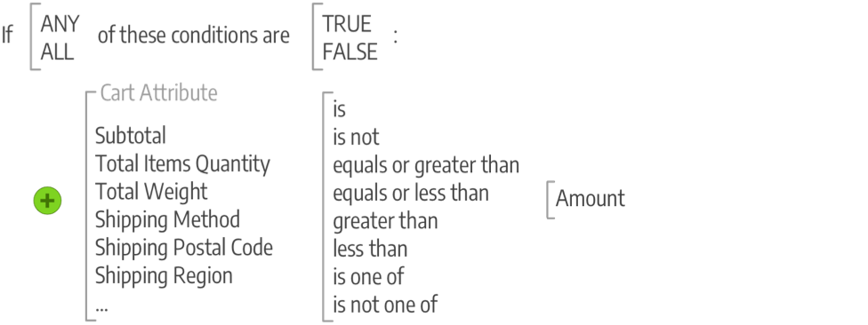

# Introduktion till Commerce marknadsföring och reklam

Målinrikta kampanjer och skapa möjligheter för kundengagemang och omvandla kunderna till köpare. Hantera kundrelationerna genom att stödja efterinköpsaktiviteter och erbjuda specialrabatter till återkommande kunder. Lär dig de bästa metoderna och teknikerna som stöder dina SEO-initiativ.

## Merchandising

_Merchandising_ är en term som används i detaljhandeln för att beskriva konsten och vetenskapen inom planutveckling och presentation av produkter. Du kanske tänker på den [kategoribaserade navigeringen](../catalog/navigation-top.md) som butikens golvplan och den dynamiska presentationen av produkter som villkor som du kan tillämpa på produktlistan i butiken. Ni kan också implementera program som ökar försäljningen:

- [Visual Merchandiser](visual-merchandiser.md) - En uppsättning avancerade verktyg som gör att du kan placera produkter och använda villkor som bestämmer vilka produkter som visas i kategorilistan.

- [Presentregister](gift-registries.md) - Ge dina kunder möjlighet att skapa presentregister för särskilda tillfällen och bjuda in vänner och familj att köpa presenter från presentregistret.

- [Belöningar och lojalitet](rewards-loyalty.md) - Använd ett poängsystem för att implementera unika program som driver kundengagemang och främjar kundlojalitet. Ni kan fördela poäng för ett stort antal transaktioner- och kundaktiviteter och styra poängtilldelningen, balansen och utgångsdatumet.

- [Privat försäljning och händelser](events-private-sales.md) - Använd din befintliga kundbas för att generera buzzz och nya leads, eller för att avlasta överskottslager genom privat försäljning och andra kataloghändelser.

>[!TIP]
>
>Om du vill veta mer om Product Recommendations och hur de kan ge dig de insikter och den kontroll du behöver för att skapa den bästa upplevelsen för dina köpare kan du läsa [Recommendations användarhandbok för produkten](https://experienceleague.adobe.com/docs/commerce-merchant-services/product-recommendations/guide-overview.html).

## Erbjudanden

I Adobe Commerce använder du kampanjfunktionerna för att skapa produktrelationer och använda prisregler för att utlösa rabatter baserat på olika villkor. Du kan använda prisregler för att erbjuda kundincitament, som:

- Skicka en kupong till dina bästa kunder för rabatt på en viss produkt
- Erbjud fri frakt för inköp över ett visst belopp
- Schemalägg en kampanj för en viss tidsperiod

En regel är en samling villkor (en eller flera) som tillämpar prisändringar på produkter när en eller flera av dem uppfylls. Varje regel kan ha flera villkor som gäller när alla eller några (en eller flera, men inte alla) -satser är true eller false.

### Villkor

Villkor är satser som förfinar listan över produkter och situationer för tillämpning av regeln. Attributen och alternativen för villkor skiljer sig åt mellan de olika typerna av tillgängliga regler. När åtgärden är klar slutförs den, till exempel rabatter, köp-en-get-one (BOGO) och andra alternativ. Reglerna kan vara så enkla eller komplicerade som behövs för att passa era affärsbehov, säsongsrabatter och -kampanjer samt årliga möjligheter. Du kan till exempel lägga till ytterligare några alternativ för helgerna och samtidigt få fri frakt året runt när kundvagnen har en hög delsumma.

>[!NOTE]
>
>Om du vill definiera ett villkor baserat på ett specifikt produktattribut måste **[!UICONTROL Use for Promo Rule Conditions]** anges till `Yes` för attributet i [StoreFront-egenskaperna](../catalog/attribute-product-create.md).

### Prisregler

För [katalogprisregler](price-rules-catalog.md) skapar du villkor baserade på [attributuppsättningar](../catalog/attribute-sets.md) i din katalog, jämförelsefunktioner och valda attribut. Du skapar villkor som meningar genom att välja några satser. Du kan t.ex. skapa två prisregler för att tillämpa rabatter för barnkläder och kläder för män/kvinnor baserat på kategori.

{width="500"}

[Villkor för kundprisregel](price-rules-cart.md) kan baseras på vilken kategori som helst som är underordnad butikens [rot](../catalog/category-root.md). Prisreglerna fastställs i förväg och träder i kraft när de nödvändiga villkoren är uppfyllda. Dessa regler använder attribut, inklusive produktattributkombinationer som att matcha en SKU i kundvagnen med produktattribut. Dessa regler kan även använda villkor för produkturval, villkorskombinationer för komplicerade regler och kundvagnsattribut som delsumma.

{width="500"}

## Kommunikation och SEO

Mastering av [sökmotoroptimering (SEO)](seo-overview.md) är avgörande för att ta in potentiella köpare. Lär dig mer om optimering och finjustering av innehåll och presentation av din webbplats för att förbättra det sätt på vilket sidor indexeras av sökmotorer.

En av uppgifterna du bör utföra innan du lanserar din butik är att granska e-postmallarna som används för all kommunikation som skickas från din butik för att se till att de speglar ditt varumärke. Men ni bör ta detta ett steg längre genom att utveckla annan kommunikation som marknadsför ert varumärke och era produkter till befintliga kunder. Du kan anpassa innehållet med variabler och märkordstaggar.

>[!NOTE]
>
>Adobe Commerce och Magento Open Source, version 2.4.0 till 2.4.3, innehåller det programtillägg som utvecklats av digitalförsäljare och som används för integrering med Adobe Digital Engagement Cloud. Från och med version 2.4.4 är det här tillägget inte längre paketerat med kärnversionen och måste installeras och uppdateras från Commerce Marketplace. Marketplace ger också tillgång till aktuell dokumentation från tilläggsutvecklaren.
>  
>Om du har det paketerade tillägget aktiverat och konfigurerat måste du uppdatera filen Composer.json som en del av uppgraderingsprocessen för 2.4.4 och hantera tilläggsuppdateringar vidare. Mer information finns i [Uppgraderingsmoduler](https://experienceleague.adobe.com/docs/commerce-operations/upgrade-guide/modules/upgrade.html) i _Uppgraderingshandboken_.

- [Nyhetsbrev](newsletters.md) - Skapa nyhetsbrev, hantera din lista över prenumeranter, utveckla innehåll och skicka trafik till din butik.

- [RSS-flöden](social-rss.md#rss-feeds) - Använd RSS-flöden för att publicera din produktinformation på shoppingaggregeringswebbplatser och till och med inkludera dem i dina nyhetsbrev. Kunder kan prenumerera på dina RSS-flöden för att lära sig mer om nya produkter och kampanjer.

- [Sociala nätverk](social-rss.md#social-networks) - Integrera din butik med dina sociala nätverk genom att installera ett Marketplace-tillägg eller lägga till ett plugin-program på dina innehållssidor.

## Google marknadsföringsverktyg

Din butikskonfiguration är integrerad med följande Google-verktyg för att optimera ditt innehåll, analysera trafiken och koppla din katalog till shoppingaggregatorer och marknadsplatser.

>[!NOTE]
>
>Från och med version 2.4.5 uppdateras integreringen av Google-tjänster så att den stöder användningen av GTag-API:erna. GTag är en enhetlig mekanism för integrering med Google-funktioner för webbsidor och har stöd för de senaste funktionerna och möjligheterna att spåra och hantera innehåll via Google Services. Mer information finns i [Google Analytics utvecklardokumentationen](https://developers.google.com/analytics/devguides/collection/gtagjs).

- [Google Analytics](google-analytics.md) - Använd Google Universal Analytics för att definiera ytterligare anpassade dimensioner och mätvärden för spårning, med stöd för interaktion offline och i mobilappar samt tillgång till pågående uppdateringar.

- [Google Content Experiments](google-content-experiments.md) - Konfigurera ett A/B-test av produkter, kategorier eller innehållssidor med Google Analytics Content

- [Google Tag Manager](google-tag-manager.md) -  (endast Adobe Commerce) Använd Google Tag Manager för att hantera många taggar som hör till marknadsföringskampanjhändelser.

- [Google AdWords](google-adwords.md) - Skapa en Google AdWords-kampanj och spåra konverteringar för din butik.
