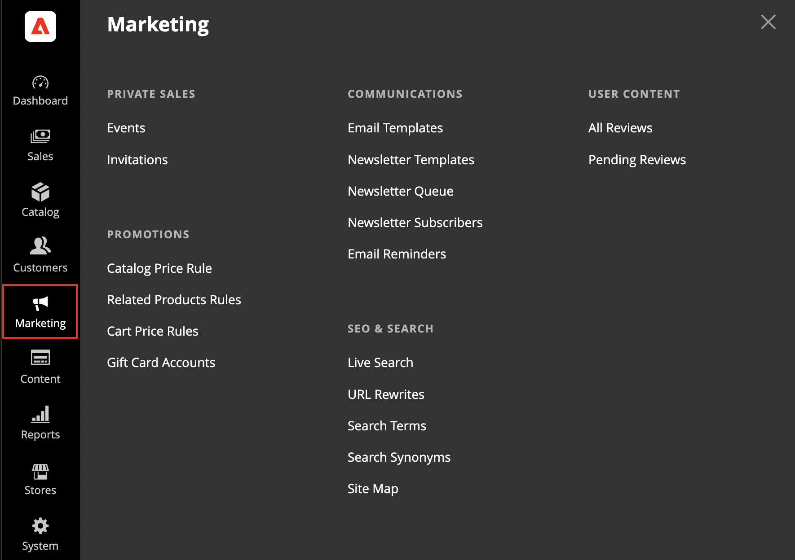

# [!UICONTROL Marketing]-menyn

Menyn [!UICONTROL Marketing] innehåller åtkomstverktyg för att hantera kampanjer, kommunikation, SEO och användargenererat innehåll.

{width="600" zoomable="yes"}

## Visa menyn [!UICONTROL Marketing]

Klicka på **[!UICONTROL Marketing]** på sidofältet _Admin_.

## Huvudavsnitt

### [!UICONTROL Promotions]

Skapa prisregler för [katalog](price-rules-catalog.md) och [kundvagn](price-rules-cart.md) som utlöser rabatter baserat på olika villkor. Konfigurera [kampanjer](introduction.md#promotions) som aktiveras när de obligatoriska villkoren uppfylls.

 (endast Adobe Commerce) Skapa [relaterade produktregler](product-related-rules.md) och hantera [presentkortskonton](../stores-purchase/product-gift-card-accounts.md).

### [!UICONTROL Private Sales]

{{ee-feature}}

Privat försäljning och andra katalogevent är ett bra sätt att använda er befintliga kundbas för att generera buskningar och nya leads med exklusiv åtkomst enbart för medlemmar, eller genom inbjudan.

### [!UICONTROL Channels]

Öka intäkterna genom att öka försäljningen till fler webbutiker med [Amazon Marketplace-integrering](https://experienceleague.adobe.com/docs/commerce-channels/amazon/overview.html). Undermenyn Kanaler visas bara när Amazon Sales Channel har konfigurerats.

>[!TIP]
>
>Channel Manager hjälper handlare att öka försäljningen, nå nya kunder, effektivisera säljverksamheten och spara tid genom att integrera en produktkatalog för Adobe Commerce eller Magento Open Source med Walmart Marketplace. Mer information om installation, introduktion, konfiguration och hantering av Channel Manager finns i [_Channel Manager-handboken_](https://experienceleague.adobe.com/docs/commerce-channels/channel-manager/intro-to-channel-manager/overview.html).

### [!UICONTROL Communications]

Anpassa alla meddelanden som skickas från din butik. Skapa [nyhetsbrev](newsletters.md) och publicera [RSS](social-rss.md#rss-feeds)-flöden.

 (endast Adobe Commerce) Konfigurera regler som skickar [e-postpåminnelser](email-reminder-rules.md) till kunder när villkoren uppfylls.

### [!UICONTROL SEO & Search]

Analysera [söktermer](../catalog/search-terms.md) och [synonymer](../catalog/search-terms.md#search-synonyms) så att kunderna kan hitta produkter i butiken, hantera [metadata](meta-data.md) och skapa en [webbplatskarta](sitemap-xml.md). Använd [omdirigeringar](url-rewrite.md) för att hantera URL-ändringar och undvika brutna länkar.

### [!UICONTROL User Content]

Inkludera användargenererade [produktrecensioner](product-reviews.md) för att skapa en känsla av gemenskap och öka försäljningen.
