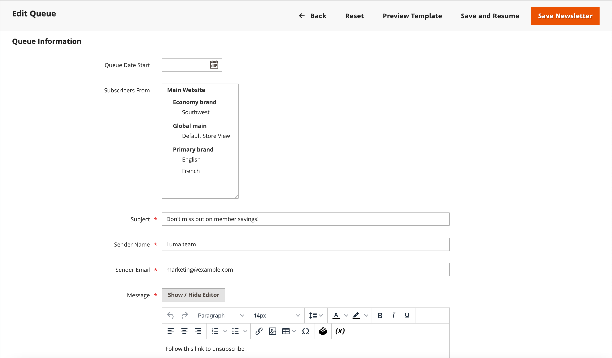

# Köer för nyhetsbrev

För att hantera inläsningen på servern skickas nyhetsbrev med många prenumeranter i en kö med flera grupper. Du kan kontrollera nyhetsbrevskön regelbundet för att kontrollera status och se hur många som har bearbetats. Eventuella problem som uppstår under överföringen visas i _nyhetsbrevets problemrapport_.

## Skicka ett nyhetsbrev

1. Gå till **[!UICONTROL Marketing]** > _[!UICONTROL Communications]_>**[!UICONTROL Newsletter Template]**&#x200B;på menyn_ Admin _.

1. I rutnätet söker du efter den [nyhetsbrevmall](newsletter-template.md) som ska skickas och anger **[!UICONTROL Action]**-kolumnen till `Queue Newsletter`.

1. För **[!UICONTROL Queue Date Start]** väljer du det datum då överföringen ska börja i kalendern ().

1. För **[!UICONTROL Subscribers From]** väljer du varje butiksvy som ska inkluderas i e-postsändningen.

1. Fyll i e-postrubrikinformationen:

   - Ange en kort beskrivning av nyhetsbrevet för raden **[!UICONTROL Subject]** i e-posthuvudet.

   - Ange **[!UICONTROL Sender Name]**.

   - Ange avsändarens e-postadress för **[!UICONTROL Sender Email]**.

     Avsändarens standardnamn och e-postadress anges i konfigurationen.

     {width="600" zoomable="yes"}

1. Om tillämpligt, skriv en anteckning i rutan **[!UICONTROL Message]** ovanför instruktionerna för att avbryta prenumerationen.

   >[!NOTE]
   >
   >Ta inte bort instruktionerna, som krävs enligt lag i många jurisdiktioner.

1. Om du vill använda anpassade format i ett nyhetsbrev lägger du till dem i fältet **[!UICONTROL Newsletter Styles]**.

1. Klicka på **[!UICONTROL Save and Resume]** när du är klar.

   Nyhetsbrevet visas i kön och väntar på att bearbetas.

## Kontrollera om det finns problem

Gå till **[!UICONTROL Reports]** > _[!UICONTROL Marketing]_>**[!UICONTROL Newsletter Problem Reports]**&#x200B;på menyn_ Admin _.

## Knappfält

| Knapp | Beskrivning |
|--- |--- |
| **[!UICONTROL Back]** | Återgår till sidan för nyhetsbrevmallar utan att spara ändringarna. |
| **[!UICONTROL Reset]** | Återställer alla osparade ändringar i köinformationsformuläret till deras tidigare värden. |
| **[!UICONTROL Preview Template]** | Öppnar en förhandsgranskningssida på en separat flik. |
| **[!UICONTROL Save and Resume]** | Sparar alla gjorda ändringar. Placerar nyhetsbrevet i kö. |
| **[!UICONTROL Save Newsletter]** | Sparar alla gjorda ändringar. Placerar nyhetsbrevet i kö. |

{style="table-layout:auto"}

## Kolumner

| Kolumn | Beskrivning |
|--- |--- |
| [!UICONTROL ID] | En unik numerisk identifierare som tilldelas varje nyhetsbrevmall. |
| [!UICONTROL Queue Start] | Det datum då nyhetsbrevet skickades ut. |
| [!UICONTROL Queue End] | Det datum då nyhetsbrevet slutade skickas. |
| [!UICONTROL Subject] | Ämne för nyhetsbrevmall. |
| [!UICONTROL Status] | Anger status för nyhetsbrevets utskick. Möjliga värden: `Sent`, `Canceled`, `Not Sent`, `Sending` eller `Paused`. |
| [!UICONTROL Processed] | Anger hur många nyhetsbrev som skickades. |
| [!UICONTROL Recipients] | Anger hur många nyhetsbrev prenumeranterna har fått. |
| [!UICONTROL Actions] | **[!UICONTROL Preview]**: öppnar ett separat fönster för att förhandsgranska mallen. |

{style="table-layout:auto"}
