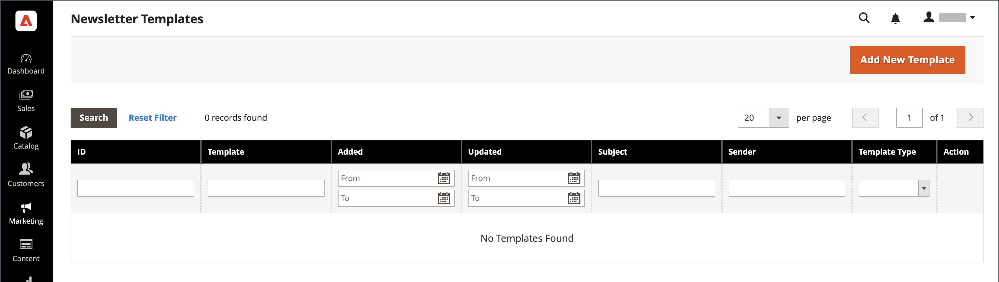

# Mallar för nyhetsbrev

Du kan skapa så många nyhetsbrevmallar du behöver för olika syften. Du kan skicka en veckas produktuppdatering, ett månatligt nyhetsbrev eller ett årsnyhetsbrev. Nyhetsbrevsmallar kan förberedas med HTML eller som oformaterad text. Till skillnad från HTML innehåller nyhetsbrev med vanlig text inga bilder, formaterad text eller formaterade länkar. I rutnätet anger kolumnen Malltyp om en mall är HTML eller text.

{width="700" zoomable="yes"}

## Skapa en mall för nyhetsbrev

1. Gå till sidlisten Admin **[!UICONTROL Marketing]** > _[!UICONTROL Communications]_>**[!UICONTROL Newsletter Template]**.

1. Klicka på om du vill lägga till en mall **[!UICONTROL Add New Template]**.

1. Slutför mallinställningarna:

   - För **[!UICONTROL Template Name]**, anger namnet på den interna referensen.

   - För **[!UICONTROL Template Subject]**, beskriver syftet med nyhetsbrevet.

   - För **[!UICONTROL Sender Name]** anger du namnet på den person som ska visas som avsändare av nyhetsbrevet.

   - För **[!UICONTROL Sender Email]** anger du e-postadressen till avsändaren av nyhetsbrevet.

   {width="600" zoomable="yes"}

   - För **[!UICONTROL Template Content]**, klicka **[!UICONTROL Show / Hide Editor]** för att visa WYSIWYG-redigeraren och uppdatera innehållet efter behov.

     Mer information finns på [Använda redigeraren](../content-design/editor.md).

     >[!NOTE]
     >
     >Ta inte bort länken för att avbryta prenumerationen längst ned i mallinnehållet. I vissa jurisdiktioner krävs länken enligt lag.

   - För **[!UICONTROL Template Styles]** anger du de CSS-deklarationer som behövs för att formatera innehållet.

1. Klicka **[!UICONTROL Preview Template]** för att se hur den ser ut och göra de ändringar som behövs.

1. När du är klar klickar du på **[!UICONTROL Save Template]**.

   När du har sparat en mall **[!UICONTROL Save As]** visas nästa gång du redigerar mallen. Den kan användas för att spara varianter av mallen utan att originalet skrivs över.

## Konvertera mallen till vanlig text

1. Klicka på längst upp på sidan **[!UICONTROL Convert to Plain Text]** och klicka **[!UICONTROL OK]** när du uppmanas till det.

1. Om du vill förhandsgranska mallens rena textversion klickar du på **[!UICONTROL Preview Template]**.

   Förhandsgranskningen öppnas på en ny flik i webbläsaren.

1. Spara den oformaterade textversionen genom att klicka **[!UICONTROL Save Template]**.

## Återställ HTML

1. Klicka på längst upp på sidan **[!UICONTROL Return HTML Version]**.  

1. Om du vill förhandsgranska mallens HTML-version klickar du på **[!UICONTROL Preview Template]**.

   Förhandsgranskningen öppnas på en ny flik i webbläsaren.

1. Spara HTML-versionen genom att klicka på **[!UICONTROL Save Template]**.

## Ta bort en mall för nyhetsbrev

1. På _Administratör_ sidebar, gå till **[!UICONTROL Marketing]** > _[!UICONTROL Communications]_>**[!UICONTROL Newsletter Template]**.

1. Leta reda på nyhetsbrevmallen som ska tas bort och öppna den i redigeringsläge.

1. Klicka på menyraden **[!UICONTROL Delete Template]** -knappen.

1. Bekräfta åtgärden genom att klicka **[!UICONTROL OK]**.

## Stödrasterkolumner

| Kolumn | Beskrivning |
|--- |--- |
| [!UICONTROL ID] | En unik numerisk identifierare som tilldelas varje nyhetsbrevmall |
| [!UICONTROL Template] | Namnet på mallentiteten |
| [!UICONTROL Added] | Det datum då mallentiteten skapades |
| [!UICONTROL Updated] | Det datum då mallentiteten senast uppdaterades |
| [!UICONTROL Subject] | Ämne för nyhetsbrevmall |
| [!UICONTROL Sender] | Kontaktinformation till avsändaren |
| [!UICONTROL Template Type] | Malltypen: `html` eller `text` |
| [!UICONTROL Actions] | **[!UICONTROL Preview]**: öppnar ett separat fönster för att förhandsgranska mallen  **[!UICONTROL Queue Newsletter]**: placerar nyhetsbrevmallen i den sändande kön. |

{style="table-layout:auto"}
