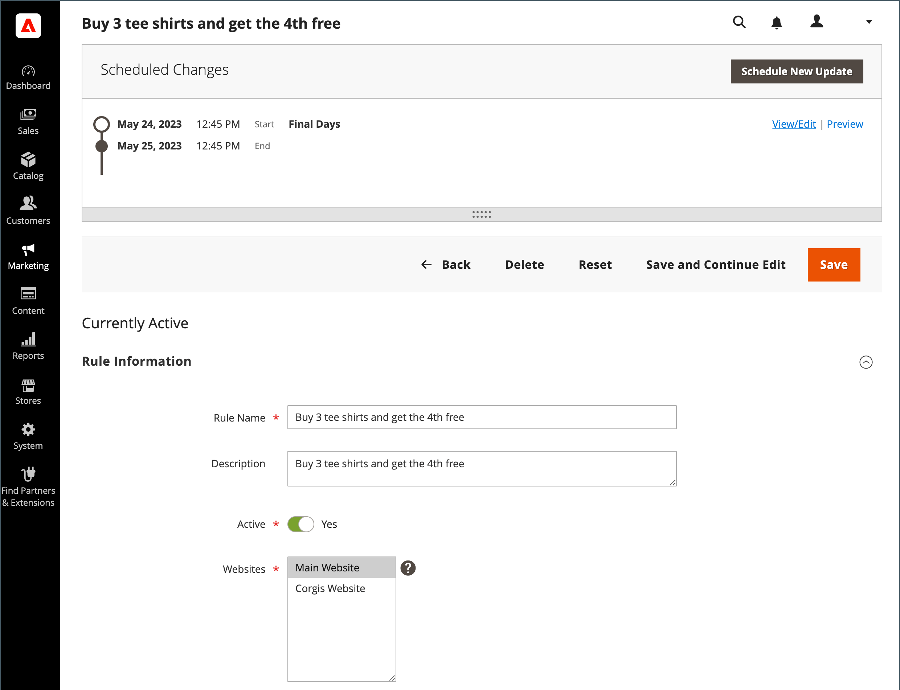

# Schemalagda ändringar för kundvagnsprisregler

{{ee-feature}}

Kundprisregler kan tillämpas enligt schema som en del av en kampanj och grupperas tillsammans med andra innehållsändringar. Du kan skapa en kampanj baserat på schemalagda ändringar av en prisregel eller tillämpa ändringarna på en befintlig kampanj.

{width="700" zoomable="yes"}

>[!NOTE]
>
>Alla schemalagda uppdateringar tillämpas i följd. Det innebär att en enhet bara kan ha en schemalagd uppdatering vid ett tillfälle. Alla schemalagda uppdateringar tillämpas på alla butiksvyer inom tidsramen. Därför kan en enhet inte ha olika schemalagda uppdateringar för olika butiksvyer samtidigt. Alla värden för entitetsattribut i alla butiksvyer, som inte påverkas av den aktuella schemalagda uppdateringen, hämtas från standardvärdena och inte från den tidigare schemalagda uppdateringen.

Om flera prisregler körs i samma kampanj, _[!UICONTROL Priority]_prisregelns inställning avgör vilken regel som har företräde. Mer information finns på [Innehållsmellanlagring](../content-design/content-staging.md).

Tänk på följande viktiga saker:

- Om en kampanj som innehåller en prisregel skapas från början utan ett slutdatum, kan kampanjen inte redigeras så att den innehåller ett slutdatum. Vi rekommenderar att du antingen lägger till ett slutdatum när du skapar kampanjen eller skapar en dubblettversion av den befintliga kampanjen och lägger till slutdatumet i dubbletten efter behov.
- När du använder en schemalagd uppdatering för att aktivera en kundvagnsprisregel med ett slutdatum måste du ange regeln som Inledande inaktiverad. Regler som redan är aktiva uppfyller inte slutdatumet.
- Kuponger är inte anslutna till kundprisregler. En schemalagd uppdatering ger inte åtkomst till _[!UICONTROL Coupon]_,_[!UICONTROL Coupon Code]_, _[!UICONTROL Uses per Coupon]_och_[!UICONTROL Uses per Customer]_ fälten på _[!UICONTROL Rule Information]_-fliken. Alla inställningar från_[!UICONTROL Manage Coupon Codes]_ -fliken är inte tillgänglig.

>[!IMPORTANT]
>
>Campaign **[!UICONTROL Start Date]** och **[!UICONTROL End Date]** måste definieras med hjälp av **_standard_** Administratörens tidszon, som konverteras från varje webbplats lokala tidszon. Tänk dig ett exempel där du har flera webbplatser i olika tidszoner, men du vill påbörja en kampanj baserat på en tidszon i USA. I det här fallet måste du schemalägga en separat uppdatering för varje lokal tidszon och ange **[!UICONTROL Start Date]** och **[!UICONTROL End Date]** konverteras från den lokala webbplatsens tidszon till administratörens standardtidszon.
