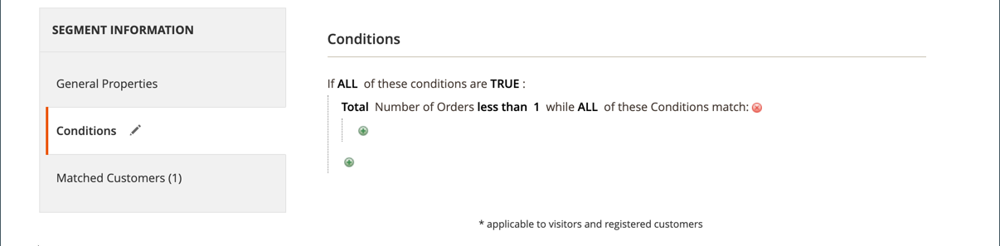
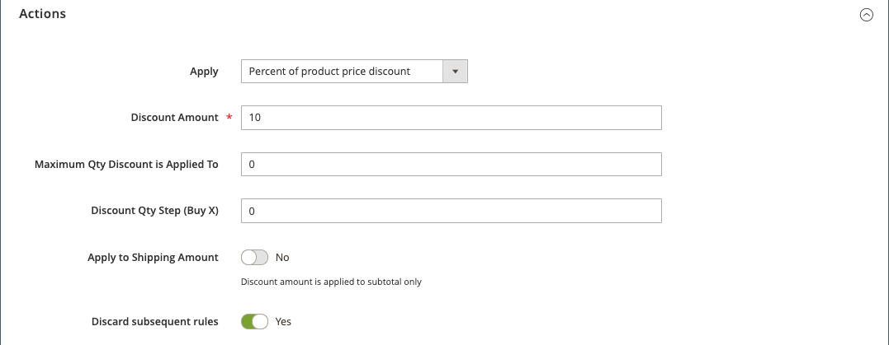

# Exempel på kundprisregel - rabatt vid första köpet

{{ee-feature}}

Kundprisregler kan användas för att automatiskt ge kunderna rabatt vid första köpet, utan att någon kupong behövs.

Om du vill erbjuda en rabatt som riktar sig till förstagångsanvändare kan du:

- Skapa ett kundsegment som definieras som _köpare utan order_ och sedan
- Skapa en kundprisregel för det nya kundsegmentet.

>[!NOTE]
>
>Kontrollera att funktionen Kundsegment är aktiverad. Se [Skapa ett kundsegment](../customers/customer-segment-create.md).

## Steg 1. Skapa ett kundsegment

1. På _Administratör_ sidebar, gå till **[!UICONTROL Customers]** > **[!UICONTROL Segments]**.

1. Klicka på i det övre högra hörnet **[!UICONTROL Add Segment]**.

1. Definiera **[!UICONTROL General Properties]**.

   - Ange en **[!UICONTROL Segment Name]** för att identifiera kundsegmentet (exempel: _Första gången kunderna_).

   - För **[!UICONTROL Assigned to Website]** väljer du den webbplats där kundsegmentet kan användas.

   - För **[!UICONTROL Status]**, markera `Active`.

   - För **[!UICONTROL Apply to]**, markera `Visitors and Registered Customers`.

   - När du är klar klickar du på **[!UICONTROL Save and Continue Edit]**.

     Ytterligare alternativ blir tillgängliga på panelen till vänster.

   {width="600" zoomable="yes"}

1. Definiera **[!UICONTROL Conditions]**.

   I det här exemplet riktar villkoret sig till kunder för vilka _Totalt antal order är mindre än 1_ är Sant.

   - Välj **[!UICONTROL Conditions]**.

     Standardvillkoret börjar med &quot;Om ALLA dessa villkor är TRUE:&quot;

   - Klicka _Lägg till_ () och markera `Number of Orders`.

   - Klicka på **[!UICONTROL is]** och välj `less than`.

   - Klicka **...** och ange `1` i fältet.

   - Klicka på den gröna bockmarkeringen (  ) för att spara villkorsinställningen.

   {width="600" zoomable="yes"}

1. Klicka på **[!UICONTROL Save]**.

Kundsegmentet skapas och visas i _[!UICONTROL Customer Segments]_rutnät.

>[!TIP]
>
>Anteckna segment-ID:t. Du använder det här ID-numret för att skapa kundvagnsprisregeln.

## Steg 2. Skapa kundvagnsprisregel

1. På _Administratör_ sidebar, gå till **[!UICONTROL Marketing]** > _[!UICONTROL Promotions]_>**[!UICONTROL Cart Price Rule]**.

1. Klicka på i det övre högra hörnet **[!UICONTROL Add New Rule]**.

   The **[!UICONTROL Rule Information]** -avsnittet visas som standard, med utökningsbara avsnitt för **[!UICONTROL Conditions]** och **[!UICONTROL Conditions]**.

1. Definiera **[!UICONTROL Rule Information]**.

   - Slutför **[!UICONTROL Rule Name]** och **[!UICONTROL Description]** fält. Dessa fält är endast till för intern referens.

   - För **[!UICONTROL Websites]** väljer du webbplatsen där regeln ska vara tillgänglig.

   - För **[!UICONTROL Customer Groups]** väljer du den kundgrupp som regeln gäller för.

     Om du vill markera flera grupper håller du ned Ctrl (PC) eller Kommando (Mac) och klickar på varje alternativ.

     >[!NOTE]
     >
     >Alternativen i den här listan beror på vilka kundgrupper som har skapats och hanterats i **[!UICONTROL Customers]** > **[!UICONTROL Customer Groups]**.

   - För **[!UICONTROL Coupon]**, markera `No Coupon`.

   - För **[!UICONTROL Uses per Customer]**, ange `1`.

   - För **[!UICONTROL Priority]**, ange ett nummer för att fastställa den här regelns prioritet i förhållande till andra regler.

     >[!NOTE]
     >
     >Inställningen Prioritet är viktig när samma katalogprodukt uppfyller villkoren för mer än en prisregel. Regeln med inställningen Högsta prioritet blir aktiv för kunden. Högsta prioritet är 1. I det här exemplet anger du `1` innebär att den här regeln tillämpas före andra prisregler. Det här värdet används av **[!UICONTROL Discard Subsequent Rules]** i **[!UICONTROL Action]** -avsnitt.

   - När du är klar klickar du på **[!UICONTROL Save and Continue Edit]**.

     Ytterligare alternativ blir tillgängliga på panelen till vänster.

   {width="600" zoomable="yes"}

1. Definiera **[!UICONTROL Conditions]**.

   - Rulla ned och expandera  den **[!UICONTROL Conditions]** -avsnitt.

     Standardregeln börjar med &quot;Om ALLA dessa villkor är TRUE:&quot;.

   - Klicka _Lägg till_ () och markera `Customer Segment`.

     Kvalificerarfältet är som standard `matches`.

   - Klicka **...** och ange segmentets ID för det kundsegment som du vill ha som mål.

     I det här exemplet är segment-ID för det nya segmentet som skapas i steg 1 `2`.

     >[!NOTE]
     >
     >Om du inte känner till segmentets ID klickar du på väljarikonen (  ) för att visa kundsegmentslistan. Du kan ange ID:t i fältet manuellt eller markera kryssrutan för det segment som ska fyllas i automatiskt.

   - Klicka på den gröna bockmarkeringen (  ) för att spara villkorsinställningen.

   - När du är klar klickar du på **[!UICONTROL Save and Continue Edit]**.

     Regelraden gäller alla kunder som matchar kundsegment-ID 2.

   {width="400"}

1. Rulla ned och expandera den **[!UICONTROL Conditions]** och definiera regelns åtgärder.

   I det här avsnittet definierar du vilken typ av rabatt och värde/belopp du vill tillämpa för förstagångsanvändare. I det här exemplet definieras 10 % rabatt för alla kunder som uppfyller det definierade villkoret. Mer information om andra tillgängliga alternativ finns i [Skapa en kundprisregel](price-rules-cart-create.md).

   - För **[!UICONTROL Apply]** väljer du Procent av produktprisrabatt.

   - För **[!UICONTROL Discount Amount]**, ange `10`.

   - Om du bara vill tillämpa den här prisregeln på produktbelopp anger du **[!UICONTROL Apply to Shipping Amount]** till `No`.

   - Om du inte vill att flera prisregler ska tillämpas på samma produkt anger du **[!UICONTROL Discard Subsequent Rules]** till `Yes`.

   - När du är klar klickar du på **[!UICONTROL Save]**.

   {width="600" zoomable="yes"}

Den nya regeln är vanligtvis tillgänglig inom en timme. Testa regeln för att kontrollera att den fungerar som du definierade den.

## Steg 3: Spara och testa regeln

{{new-price-rule}}

1. När regeln är klar klickar du på **[!UICONTROL Save Rule]**.

1. Testa regeln för att kontrollera att den fungerar som den ska.
