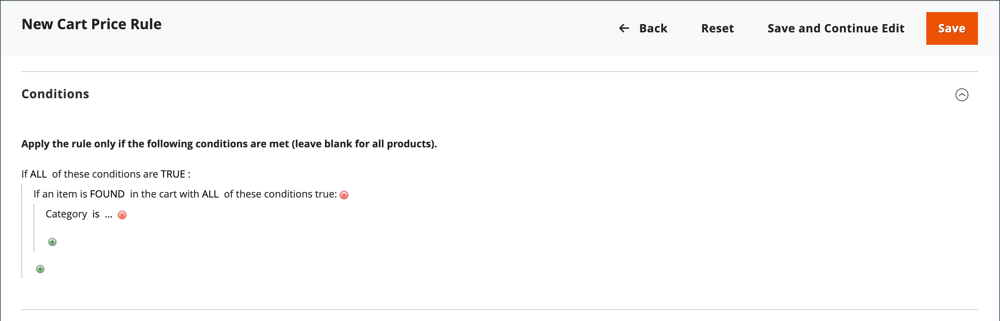

# Exempel på kundprisregel - rabatt med minimiköp

Kundprisregler kan användas för att erbjuda en procentuell rabatt som baseras på ett minimiproduktpris i kundvagnen. I följande exempel tillämpas en rabatt på 10 % på alla produkter i hela varukorgen när minst en produkt med ett pris över 30,00 USD från en angiven kategori läggs till i kundvagnen. Rabattformatet är följande:

X % rabatt på hela kundvagnen när minst en produkt kommer från Y-kategorin och priset är över SEK.

## Steg 1. Skapa en kundvagnsregel

Följ de grundläggande [instruktionerna](price-rules-cart.md) för att skapa en kundvagnsregel.

## Steg 2. Definiera villkoren

1. Bläddra nedåt och utöka  i avsnittet **[!UICONTROL Conditions]**.

1. Klicka på _Lägg till_ () och välj **[!UICONTROL Product Attribute Combination]**.

   {width="500" zoomable="yes"}

1. Klicka på _Lägg till_ () i början av nästa rad och välj **[!UICONTROL Category]** i listan under **[!UICONTROL Product Attribute]**.

   - Klicka på länken (**..**) _mer_ om du vill visa ytterligare alternativ.

     {width="600" zoomable="yes"}

   - Klicka på ikonen _Väljare_ () för att visa de tillgängliga kategorierna. Markera kryssrutan för varje kategori som du vill ta med i kategoriträdet. Klicka på bockikonen för att godkänna kategorivalen.

     {width="600" zoomable="yes"}

1. Klicka på _Lägg till_ () i början av nästa rad och gör följande:

   - Välj **[!UICONTROL Price in cart]** i listan under **[!UICONTROL Cart Item Attribute]**.

     {width="500"}

   - Klicka på **är** och välj `equals or greater than`.

   - Klicka på **..** och ange beloppet som priset i kundvagnen måste vara för att uppfylla villkoret. Ange till exempel `30`.

     {width="500"}

1. Klicka på **[!UICONTROL Save and Continue Edit]**.

## Steg 3. Definiera åtgärderna

1. Expandera  i avsnittet **[!UICONTROL Actions]** och gör följande:

   {width="600" zoomable="yes"}

   - Ange **[!UICONTROL Apply]** till `Percent of product price discount`.

   - Ange **[!UICONTROL Discount Amount]**. Ange till exempel `10` som 10 % rabatt.

   - Ange **[!UICONTROL Discard subsequent rules]** till `Yes` om du vill förhindra att fler kampanjer tillämpas på köpet.

1. Klicka på **[!UICONTROL Save and Continue Edit]** och fyll i regeln efter behov.

## Steg 4. Fyll i etiketterna

Fyll i [Steg 4](price-rules-cart.md) i instruktionerna för kundprisregeln för att ange etiketter som visas vid utcheckningen.

## Steg 5: Spara och testa regeln

{{new-price-rule}}

1. När regeln är klar klickar du på **[!UICONTROL Save Rule]**.

1. Testa regeln för att kontrollera att den fungerar som den ska.
