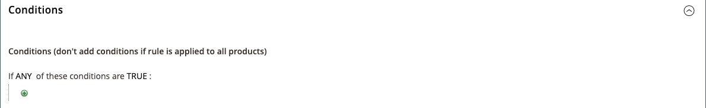

# Katalogprisregel med flera SKU:er

En enda katalogprisregel kan tillämpas på flera SKU:er, vilket gör det möjligt att skapa olika kampanjer baserade på en produkt, ett varumärke eller en kategori. När du skapar den här regeln vill du ange villkor som matchar de valda SKU:erna. När du skapar en regel kan du enkelt bläddra bland och välja SKU:er från stödrastret.

## Steg 1. Verifiera butiksegenskaper för produktattributet

Innan du börjar kontrollerar du att [StoreFront Properties](../catalog/attribute-product-create.md#step-4-describe-the-storefront-properties) för attributet `sku` är inställda på `Use in Promo Rules`.

1. Gå till **[!UICONTROL Stores]** > _[!UICONTROL Attributes]_>**[!UICONTROL Product]**&#x200B;på sidofältet_ Admin _.

1. I sökfiltret högst upp i kolumnen _[!UICONTROL Attribute Code]_&#x200B;anger du `sku` och klickar på&#x200B;**[!UICONTROL Search]**.

1. Klicka för att öppna attributet `sku` i redigeringsläge.

1. Klicka på **[!UICONTROL Storefront Properties]** i den vänstra panelen och kontrollera att **[!UICONTROL Use for Promo Rule Conditions]** är inställt på `Yes`.

1. Om du har ändrat värdet för egenskapen klickar du på **[!UICONTROL Save Attribute]**.

## Steg 2. Tillämpa en prisregel på flera SKU:er

1. Gå till **[!UICONTROL Marketing]** > _[!UICONTROL Promotions]_>**[!UICONTROL Catalog Price Rules]**&#x200B;på sidofältet_ Admin _.

1. Gör något av följande:

   - Följ instruktionerna för att skapa en [katalogprisregel](price-rules-catalog.md).
   - Öppna en befintlig katalogprisregel.

1. Expandera  i avsnittet **[!UICONTROL Conditions]** och gör följande:

   - På den första raden ställer du in den första parametern på `ANY`.

     {width="600" zoomable="yes"}

   - Klicka på _Lägg till_ () i början av nästa rad och klicka på `SKU` i listan under **[!UICONTROL Product Attribute]**.

     {width="600" zoomable="yes"}

   - Jämförelsen innehåller alternativ. `select is one of` om du vill hitta minst en från en lista med SKU:er. Om du vill hitta en grupp SKU:er som alla måste hittas för att kunna användas väljer du `is`. Vi rekommenderar att du väljer `is one of`.

     {width="600" zoomable="yes"}

   - Slutför villkoret genom att klicka på länken för mer (**..**) och klicka på ikonen _Väljare_ () för att visa en lista över tillgängliga produkter.

     {width="600" zoomable="yes"}

   - Bläddra, filtrera eller sök efter de SKU:er som du vill lägga till. Markera kryssrutan för varje produkt som ska inkluderas i listan.

   - Klicka på **[!UICONTROL Save and Apply]** om du vill lägga till SKU:er i villkoret.

     {width="600" zoomable="yes"}

1. Slutför regeln, inklusive alla [åtgärder](price-rules-catalog.md) som ska vidtas när villkoren uppfylls.

1. När regeln är klar klickar du på **[!UICONTROL Save]**.

{{new-price-rule}}
