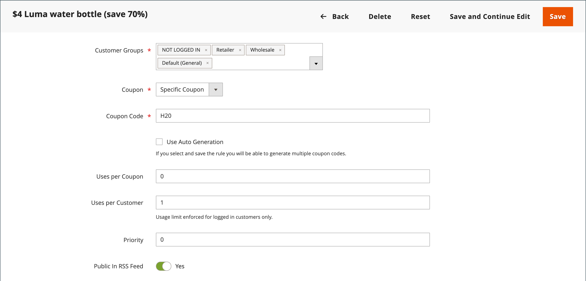
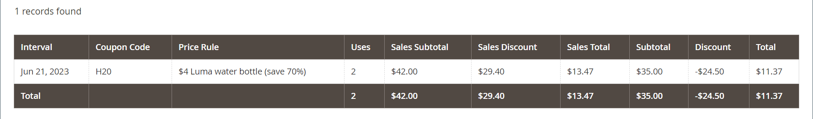

# Kupongkoder

Kupongkoder används med [kundprisregler](price-rules-cart.md) för att tillämpa en rabatt när en uppsättning villkor är uppfyllda. En kupongkod kan till exempel skapas för en viss kundgrupp eller för alla som gör ett köp över ett visst belopp. För att tillämpa kupongen på ett inköp kan kunden ange kupongkoden i kundvagnen eller eventuellt i kassaregistret för ditt inköp _tegelsten och murbruk_ butik. Här är några sätt att använda kuponger i din butik:

- E-postkuponger till kunder
- Skapa tryckta kuponger
- Skapa butikskuponger för mobilanvändare

Kupongkoder kan skickas via e-post eller inkluderas i nyhetsbrev, kataloger och annonser. Listan med kupongkoder kan exporteras och skickas till ett tryckeri. Ni kan också skapa butikskuponger med en snabb svarskod som kunderna kan skanna med sina smarttelefoner. QR-koden kan länka till en sida på webbplatsen med mer information om kampanjen.

## Konfigurera kupongkoder

Längden på och formatet för automatiskt genererade kupongkoder styrs av konfigurationen. Tecknen kan anges till alla siffror, alla bokstäver eller en kombination. Du kan infoga ett bindestreck med angivna intervall för att göra det enkelt att läsa, och lägga till ett prefix och suffix för att associera koden med en viss kampanj eller ett visst initiativ.

1. På _Administratör_ sidebar, gå till **[!UICONTROL Stores]** > _[!UICONTROL Settings]_>**[!UICONTROL Configuration]**.

1. Expandera på den vänstra panelen **[!UICONTROL Customers]** och välja **[!UICONTROL Promotions]**.

   {width="600" zoomable="yes"}

1. Expandera avsnittet **[!UICONTROL Auto Generated Specific Coupon Codes]**.

   {width="600" zoomable="yes"}

1. Ange **[!UICONTROL Code Length]**, inklusive prefix, suffix och avgränsare.

1. Ange **[!UICONTROL Code Format]** till något av följande:

   - `Alphanumeric`
   - `Alphabetical`
   - `Numeric`

1. För **[!UICONTROL Code Prefix]** anger du det värde som du vill ska visas i början av alla kupongkoder.

1. För **[!UICONTROL Code Suffix]** anger du det värde som du vill ska visas i slutet av alla kupongkoder.

1. För **[!UICONTROL Dash Every X Characters]** anger du antalet tecken mellan varje tankstreck.

   Kupongkoder med olika streckmönster anses vara olika koder, även om siffrorna är desamma.

1. När du är klar klickar du på **[!UICONTROL Save Config]**.

## Skapa kuponger

>[!NOTE]
>
>Använd `bin/magento cron:run` för att verifiera att cron körs. Se [Kör cron från kommandoraden](https://experienceleague.adobe.com/docs/commerce-operations/configuration-guide/cli/configure-cron-jobs.html#run-cron-from-the-command-line) i _Konfigurationshandbok_ för mer information.

### Metod 1: Skapa en specifik kupong

1. Följ instruktionerna för att skapa en [kundprisregel](price-rules-cart.md).

1. I **[!UICONTROL Rule Information]** avsnitt, ange **[!UICONTROL Coupon]** till `Specific Coupon`.

1. Ange en **[!UICONTROL Coupon Code]** som ska användas i kampanjen.

   Kodformatet (numeriskt, alfanumeriskt eller alfabetiskt) bestäms av [konfiguration](#configure-coupon-codes).

1. Så här begränsar du antalet gånger kupongen kan användas:

   - Ange antalet **[!UICONTROL Uses per Coupon]**.
   - Ange antalet **[!UICONTROL Uses per Customer]**.

   Lämna dessa fält tomma för obegränsad användning.

   {width="600" zoomable="yes"}

   >[!NOTE]
   >
   >Om flera kunder samtidigt använder samma kupong är det möjligt att den angivna gränsen kan överskridas på grund av försenad kupongbearbetning.

1. Så här gör du för att kupongen ska vara giltig under en tidsperiod:

   -  (endast Magento Open Source) Fyll i **Från** och **Till** datum. Klicka på knappen **Kalender** () bredvid varje fält. Om du låter datumintervallet vara tomt upphör regeln inte att gälla.

   -  (Endast Adobe Commerce) Gör något av följande:

     **Alternativ 1:** Schemalägg en ny uppdatering

      - Klicka **[!UICONTROL Schedule New Update]** i det övre högra hörnet på sidan.

        {width="600" zoomable="yes"}

      - Ange **[!UICONTROL Update Name]** och **[!UICONTROL Description]**.

      - Välj **Startdatum** och **[!UICONTROL End Date]** från kalendern (  ). Om du låter datumintervallet vara tomt upphör regeln inte att gälla.

      - När du är klar klickar du på **[!UICONTROL Save]**.

        {width="600" zoomable="yes"}

     **Alternativ 2:** Tilldela till en befintlig uppdatering:

      - Välj **[!UICONTROL Assign to Another Update]**.

      - Sök efter uppdateringen i listan och klicka på **[!UICONTROL Select]**.

1. Slutför [kundprisregel](price-rules-cart.md) efter behov.

### Metod 2: Generera en grupp kuponger

Genereringen av rabattkuponger är en asynkron åtgärd som körs i bakgrunden så att du kan fortsätta arbeta i administratören utan att vänta på att åtgärden ska slutföras. Ett meddelande visas när uppgiften är slutförd.

1. Följ instruktionerna för att skapa en [kundprisregel](price-rules-cart.md).

1. Under **[!UICONTROL Coupon Code]** väljer du **[!UICONTROL Use Auto Generation]** kryssrutan.

1. Ange antalet gånger varje kund får använda kupongen **[!UICONTROL Uses per Customer]**.

   {width="600" zoomable="yes"}

   >[!NOTE]
   >
   >Om flera kunder samtidigt använder samma kupong är det möjligt att den angivna gränsen kan överskridas på grund av försenad kupongbearbetning.

1. Rulla ned och expandera  den **[!UICONTROL Manage Coupon Codes]** och gör följande:

   {width="600" zoomable="yes"}

   - För **[!UICONTROL Coupons Qty]** anger du antalet kuponger som du vill generera.

   - Ange **[!UICONTROL Code Length]**, exklusive prefix, suffix eller avgränsare.

   - Ange **[!UICONTROL Code Format]** till något av följande:

      - `Alphanumeric`
      - `Alphabetical`
      - `Numeric`

   - (Valfritt) Ange en **[!UICONTROL Code Prefix]** som ska läggas till i början av koden.

   - (Valfritt) Ange en **[!UICONTROL Code Suffix]** som ska läggas till i slutet av koden.

   - (valfritt) för **[!UICONTROL Dash Every X Characters]** anger du antalet tecken mellan varje tankstreck. Om koden till exempel är 12 tecken lång och det finns ett streck var fjärde tecken ser den ut som `xxxx-xxxx-xxxx`. Med streck blir det enklare att läsa och ange koder.

1. När du är klar klickar du på **[!UICONTROL Generate]**.

   Systemet visas `Message is added to queue, wait to get your coupons soon`.

   När cron-jobbet är klart visas listan med genererade koder.

   | Fält | Beskrivning |
   |-------------|-------------|
   | [!UICONTROL Coupon Code] | En unik kupongkod som har skapats och kan användas för att ta emot särskilda villkor. |
   | [!UICONTROL Created] | Datumet då kupongkoden skapades. |
   | [!UICONTROL Used] | Anger om kupongen användes. |
   | [!UICONTROL Times Used] | Anger hur många gånger kupongkoden användes. |

   {style="table-layout:auto"}

Du kan exportera kupongkoder till en CSV- eller Excel XML-fil genom att välja filformatet och klicka på **[!UICONTROL Export]**.

Om du vill ta bort kupongkoder väljer du en eller flera koder i listan. Välj `Delete` från **[!UICONTROL Actions]**  väljaren och klicka sedan på **[!UICONTROL Submit]**.

>[!NOTE]
>
>Även om det går att konfigurera flera kupongkoder i Commerce kan kunden bara använda en kupongkod i kundvagnen. Om du vill tillåta att mer än en kupongkod används samtidigt i kundvagnen kan du använda ett motsvarande tillägg från [Commerce Marketplace](https://marketplace.magento.com/).

## Kupongrapport

The _Kuponger_ rapportera aggregerade data från varje kupong som används under ett visst datumintervall. Eftersom kuponger används från kundvagnen innehåller rapporten data från alla inlösta kuponger, oavsett [orderstatus](../stores-purchase/order-status.md). Därför kan rapporten innehålla både beräknade och faktiska summor. Rapporten kan filtreras efter en viss butiksvy, tidsperiod, orderstatus och kundprisregel.

I följande exempel användes kupongkoden&quot;H20&quot; av två kunder. En av beställningarna faktureras, men den andra är fortfarande _väntande_. Kolumnerna Prognoserad förs.delsumma, Försäljningsrabatt och Försäljningssumma visar aggregerade belopp från båda orderna, men endast den faktiska fakturerade ordern visas i kolumnerna Delsumma, Rabatt och Totalt. Varje rad i rapporten representerar en kupongkampanj.

{width="600" zoomable="yes"}

### Kör rapporten

1. På _Administratör_ sidebar, gå till **[!UICONTROL Reports]** > _[!UICONTROL Sales]_>**[!UICONTROL Coupons]**.

1. Om du har flera butiksvyer anger du **[!DNL Store View]** i det övre vänstra hörnet för att fastställa rapportens omfattning.

1. Så här uppdaterar du försäljningen [statistik](../getting-started/sales-reports.md#refresh-statistics) för dagen klickar du på _Senast uppdaterad_ längst upp på arbetsytan.

   Klicka sedan på **[!UICONTROL Coupons]** kryssruta och klicka **[!UICONTROL Refresh]**.

   {width="600" zoomable="yes"}

1. Så här filtrerar du data:

   {width="600" zoomable="yes"}

   - Ange **[!UICONTROL Date Used]** till något av följande:

      - `Order Created`
      - `Order Updated`

     The _Ordern har uppdaterats_ rapporten skapas i realtid och kräver ingen uppdatering.

   - Ange den tidsperiod som rapporten ska omfatta **[!UICONTROL Period]** till något av följande:

      - `Day`
      - `Month`
      - `Year`

   - Ange rapportens datumintervall genom att ange **Från** och **Till** datum i formatet M/D/YY.

   - Skriva ut en rapport för en viss [orderstatus](../stores-purchase/order-status.md), ange **[!UICONTROL Order Status]** till `Specified` och välj orderstatus i listan.

   - Om du vill utesluta rader utan data från rapporten anger du **[!UICONTROL Empty Rows]** till `No`.

   - Gör något av följande om du vill definiera kupongaktivitet som ingår i rapporten:

      - Om du vill inkludera all kupongaktivitet från alla prisregler anger du **[!UICONTROL Cart Price Rule]** till `Any`.
      - Om du bara vill inkludera aktiviteter som är relaterade till en viss prisregel anger du **[!UICONTROL Cart Price Rule]** till `Specified` och välj kundvagnsprisregeln i listan.

1. När rapporten är klar klickar du på **[!UICONTROL Show Report]**.

   Rapporten visas längst ned på sidan.

### Filteralternativ

| Fält | Beskrivning |
|--- |--- |
| [!UICONTROL Date Used] | Identifierar datumfältet som används som grund för rapporten. Alternativ: **[!UICONTROL Order Created]**: Genererar rapporten baserat på det datum då ordern lades av kunden. Klicka på länken i meddelandet för att uppdatera statistiken för att se till att de senaste data finns med. **[!UICONTROL Order Updated]**: Skapar rapporten baserat på det datum då beställningarna senast uppdaterades. Den här rapporten använder realtidsdata och behöver inte uppdateras. |
| [!UICONTROL Period] | Bestämmer vilken typ av datumintervall som används för rapporten. Alternativ: `Day` / `Month` / `Year` |
| [!UICONTROL From] | Anger det första datumet i intervallet med orderdata som ingår i rapporten. |
| [!UICONTROL To] | Anger det sista datumet i intervallet med orderdata som ingår i rapporten. |
| [!UICONTROL Order Status] | Filtrerar rapporten efter orderstatus. Rapporten kan genereras för alla order eller kan begränsas till en viss orderstatus. Alternativ:  **[!UICONTROL Any]**: Inkluderar alla order oavsett status. **[!UICONTROL Specified]**: Inkluderar endast order med den angivna statusen. Annullerade order ingår inte i rapporten. |
| [!UICONTROL Empty Rows] | Avgör om rapporten innehåller rader med tomma data som kan hämtas. Alternativ: `Yes` / `No` |
| [!UICONTROL Cart Price Rules] | Avgör vilka kupongkampanjer som ingår i rapporten. Alternativ: **[!UICONTROL Any]**: Inkluderar orderinformation för alla kupongkampanjer som användes under det angivna datumintervallet. **[!UICONTROL Specified]**: Inkluderar endast orderinformation för den valda kupongkampanjen under det angivna datumintervallet. |

{style="table-layout:auto"}

### Rapportkolumner

| Kolumn | Beskrivning |
|--- |--- |
| [!UICONTROL Interval] | Anger datumintervallet för kuponganvändning som ska inkluderas i rapporten. Intervallet kan vara en viss dag, månad eller år eller ett visst datumintervall. Intervalldatumet formateras som i följande exempel, enligt det värde som anges i **[!UICONTROL Period]** inställning: `Day`: 6/21/19 `Month`: 6/2019 `Year`: 2019 |
| [!UICONTROL Coupon Code] | Rabattkoden som kunderna anger i kundvagnen för att få rabatten. |
| [!UICONTROL Price Rule] | Namnet på prisregeln som är associerad med kupongen. |
| [!UICONTROL Uses] | Antalet gånger som kupongen har använts under det datumintervall som har angetts för rapporten. |
| [!UICONTROL Sales Subtotal] | Prognostiserad delsumma från alla order som placerats med kupongen.  Delsumman för försäljning representerar aggregerad delsumma från alla kvalificerande order och inkluderar `Pending` försäljningsorder som ännu inte har fakturerats. |
| [!UICONTROL Sales Discount] | Det planerade rabattbeloppet från alla order som placerats med kupongen.  Rabatten representerar det aggregerade rabattbeloppet från alla kvalificerande order och inkluderar `Pending` försäljningsorder som ännu inte har fakturerats. |
| [!UICONTROL Sales Total] | Prognosen Summa av alla order som placerats med kupongen. Försäljningssumman inkluderar frakt- och expeditionsavgifter minus rabattbeloppet.  Försäljningssumman representerar det aggregerade totalbeloppet från alla kvalificerande order och inkluderar `Pending` försäljningsorder som ännu inte har fakturerats. Värdet inkluderar delsumman plus frakt och hantering minus rabatt plus moms.   Beräknat av: `((Subtotal + Shipping & Handling) - Discount) + Tax` |
| [!UICONTROL Subtotal] | Den aggregerade delsumman från alla fakturerade order som använde kupongen. |
| [!UICONTROL Discount] | Den aggregerade rabatten från alla fakturerade order som använde kupongen. |
| [!UICONTROL Total] | Den aggregerade ordersumman från alla fakturerade order som använde kupongen. |

{style="table-layout:auto"}
