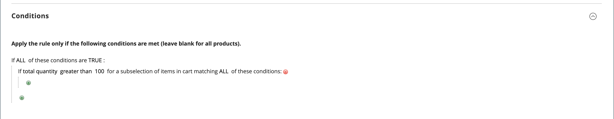

# Skapa en kundvagnsprisregel

Utför följande steg för att lägga till en regel, beskriva villkoren och definiera åtgärderna. Fyll också i etiketterna och testa regeln. Prisregelvillkoren kan baseras på kundvagn eller [produktattribut](../catalog/product-attributes.md) eller [Real-Time CDP-målgrupper](#use-real-time-cdp-audiences-to-set-a-condition), men inte på [anpassningsbara alternativ](../catalog/settings-advanced-custom-options.md).

## Steg 1: Lägg till en regel

1. Gå till **[!UICONTROL Marketing]** > _[!UICONTROL Promotions]_>**[!UICONTROL Cart Price Rules]**&#x200B;på sidofältet_ Admin _.

1. Klicka på **[!UICONTROL Add New Rule]** och gör följande:

   - Fyll i **[!UICONTROL Rule Name]** och **[!UICONTROL Description]** under _[!UICONTROL Rule Information]_.

   - Om du inte vill att regeln ska börja gälla omedelbart anger du **[!UICONTROL Active]** till `No`.

   {width="600" zoomable="yes"}

1. Så här upprättar du regelns [omfång](../getting-started/websites-stores-views.md#scope-settings):

   - Välj **[!UICONTROL Websites]** där kampanjen ska vara tillgänglig.

   - Välj den **[!UICONTROL Customer Groups]** som kampanjen gäller för.

     Om du vill att kampanjen endast ska vara tillgänglig för registrerade kunder ska **_du inte_** välja alternativet `NOT LOGGED IN`.

1. Ange regeln som ska användas med eller utan en [kupong](price-rules-cart-coupon.md) enligt följande:

   - Om du vill att kundvagnsregeln ska användas utan att använda en kupongkod anger du **[!UICONTROL Coupon]** till `No Coupon` och hoppar till steg 5.

   - Om du vill associera en kupong med en prisregel anger du **[!UICONTROL Coupon]** till `Specific Coupon` och gör följande:

      - Ange en **[!UICONTROL Coupon Code]**-fritext som kunden måste ange för att få rabatten.

      - Ange en gräns för hur många gånger kupongen får användas genom att fylla i följande alternativ:

     | Alternativ | Beskrivning |
     |------|-----------|
     | `Uses per Coupon` | Avgör hur många gånger kupongkoden kan användas. Om det inte finns någon gräns lämnar du fältet tomt. |
     | `Uses per Customer` | Avgör hur många gånger kundprisregeln kan användas av samma registrerade kund som tillhör någon av de valda kundgrupperna. Inställningen gäller inte gästkunder som är medlemmar i kundgruppen NOT LOGGED IN, eller kunder som handlar utan att logga in på sina konton. Om det inte finns någon gräns lämnar du fältet tomt. |

     {style="table-layout:auto"}

     Mer information finns i [Kupongkoder](price-rules-cart-coupon.md).

     {width="600" zoomable="yes"}

   -  (endast Magento Open Source) Använd _kalendern_ () för att välja datumintervallet **[!UICONTROL From]** och **[!UICONTROL To]** för erbjudandet.

1. Ange ett tal för att definiera **[!UICONTROL Priority]** för den här prisregeln i relation till åtgärdsinställningarna för andra prisregler som är aktiva samtidigt.

   När flera kundvagnsregler eller kuponger gäller för samma produkt, tillämpas regeln med den högsta prioriteten (lägsta antal) först. Regler med samma prioritet kombineras inte. De tillämpas separat baserat på regel-ID. Om du vill styra i vilken ordning rabatterna ska tillämpas tilldelar du unika prioriteringar och bör använda [Ignorera efterföljande prisregler](#step-3-define-the-actions) i steget Åtgärder för att förhindra att rabatterna staplas.

1. Om du vill tillämpa regeln på publicerade [RSS-flöden](social-rss.md#rss-feeds) anger du **Offentlig i RSS-feed** till `Yes`.

1. Klicka på **[!UICONTROL Save and Continue Edit]**.

   -  (endast Magento Open Source) När regeln har sparats visas namnet på kundvagnsprisregeln överst på sidan.

   -  (endast Adobe Commerce) När regeln har sparats visas namnet på kundvagnsprisregeln och rutan [Schemalagda ändringar](price-rule-cart-scheduled-changes.md) överst på sidan.

     {width="600" zoomable="yes"}

## Steg 2: Beskriv villkoren

>[!NOTE]
>
>Om du använder målgrupper från Real-Time CDP går du vidare till [det här avsnittet](#use-real-time-cdp-audiences-to-set-a-condition).

I det här steget beskrivs de villkor som måste uppfyllas för att en beställning ska vara berättigad till en befordran. Villkoren påverkar kundprisreglerna på följande sätt:

- Kundprisregeln tillämpas på **_varje_** produkt i kundvagnen när uppsättningen villkor på fliken _[!UICONTROL Conditions]_&#x200B;uppfylls. Om du vill begränsa antalet produkter som påverkas av kundvagnsprisregeln lägger du till villkor på fliken&#x200B;_[!UICONTROL Actions]_ för att begränsa antalet produkter som påverkas av kundvagnsprisregeln.

- Om minst ett villkorsproduktattribut har ett tomt värde, tillämpas inte kundvagnsprisregeln på produkten.

1. Välj **[!UICONTROL Conditions]** i den vänstra panelen.

   {width="600" zoomable="yes"}

   Det första villkoret visas som standard och lägen:

   `If **ALL** of these conditions are **TRUE**:`

   Programsatsen har två feta länkar som du kan klicka på för att visa urvalet av alternativ för den delen av programsatsen. Du kan skapa olika villkor genom att ändra kombinationen av dessa värden. Gör något av följande:

   - Klicka på **[!UICONTROL ALL]** och välj `ALL` eller `ANY`.
   - Klicka på **[!UICONTROL TRUE]** och välj `TRUE` eller `FALSE`.
   - Låt villkoret vara oförändrat om du vill tillämpa regeln på alla produkter.

1. Klicka på _Lägg till_ () i början av nästa rad och välj ett alternativ för villkoret, t.ex. kundvagnsattribut, delval av produkt eller kombination.

   I det här exemplet slutför du nästa del av villkoret enligt följande:

   - Välj `Products Subselection` när du uppmanas till **[!UICONTROL Choose the condition to add]**.

     {width="600" zoomable="yes"}

   - Klicka på **[!UICONTROL total quantity]** i villkorssatsen och välj `total quantity` eller `total amount`.

   >[!IMPORTANT]
   >
   >[!UICONTROL Total amount] är en radsumma, så moms inkluderas inte i `total amount` för villkoret för kundvagnsprisregel [!UICONTROL Products Subselection]. Använd villkoret [!UICONTROL Subtotal (Incl. Tax)] för att inkludera skatter.

   - Klicka på **[!UICONTROL is]** i villkorssatsen och välj `greater than`.

1. När nästa del av villkoret visas klickar du på elementen i satsen så att du kan se var varje länk med variabelvärden finns.

1. Klicka på länken &quot;mer&quot; (..) och ange `100`.

   Det här villkoret kräver att den totala kvantiteten i vagnen är `101` eller större.

   {width="600" zoomable="yes"}

1. Klicka på **Lägg till** () i början av nästa rad och lägg sedan till ett villkor som baseras på **kategori**.

   {width="600" zoomable="yes"}

1. Klicka på länken _more_ (**..**) i nästa del av villkoret för att visa inmatningsfältet och öppna sedan _Väljaren_ () för att visa kategoriträdet.

1. Markera kryssrutan för den kategori som du vill använda som villkor för prisregeln och klicka på ikonen  för att godkänna kategorivalen.

   Villkoret kan baseras på vilken kategori som helst som är underordnad arkivets [rotkategori ](../catalog/category-root.md).

   {width="600" zoomable="yes"}

1. Om du vill lägga till fler villkor klickar du på _Lägg till_ () och definierar ett annat villkor.

   Du kan upprepa processen så många gånger som behövs för att beskriva villkoren som måste uppfyllas för prisregeln. Här är några exempel:

   **Exempel 1:** Regional prisregel

   Om du vill skapa en regional prisregel använder du något av följande kundvagnsattribut:

   - `Shipping Postcode`
   - `Shipping Region`
   - `Shipping State/Province`
   - `Shipping Country`

   **Exempel 2:** Summor i kundvagn

   Om du vill basera villkoret på kundvagnssummor använder du något av följande kundvagnsattribut:

   - `Subtotal`
   - `Total Items Quantity`
   - `Total Weight`

>[!NOTE]
>
>Om det finns flera parallella kampanjer tillämpas villkoret _Delsumma_ på _bas_-kundvagnsdelsumman **_före_** eventuella rabatter.

>[!IMPORTANT]
>
>**För inköpsorder endast**: När en kundprisregel har ställts in baserat på en eller flera specifika betalningsmetoder, tillämpas rabatten på summan när en inköpsorder skapas. När inköpsordern har skapats tillämpas rabatten på summan om betalningsmetoden ändras till en som inte omfattas av kundvagnsprisregeln.

### Lägg till ett produktattribut i kundprisreglerna

1. Gå till **[!UICONTROL Stores]** > _[!UICONTROL Attributes]_>**[!UICONTROL Product]**&#x200B;och öppna produktattributet.

1. Välj **[!UICONTROL Storefront Properties]** i den vänstra panelen.

1. Ange **[!UICONTROL Use for Promo Rule Conditions]** till `Yes`.

1. Klicka på **[!UICONTROL Save Attribute]**.

1. Gå till **[!UICONTROL Marketing]** > **[!UICONTROL Cart Price Rules]** och öppna den kundvagnsprisregel som krävs.

1. Expandera  i avsnittet **[!UICONTROL Condition]** och välj **[!UICONTROL Product attribute combination]**.

1. Ange något av följande värden för det här villkoret:

   - Klicka på **[!UICONTROL FOUND]** och välj `FOUND` eller `NOT FOUND`.

   - Klicka på **[!UICONTROL ALL]** och välj `ALL` eller `ANY`.

1. Klicka på ikonen _Lägg till_ () och välj den **[!UICONTROL Product Attribute]** som du har ställt in för kampanjregelvillkor.

1. Klicka på **[!UICONTROL Save]**.

>[!NOTE]
>
>När du använder villkoret `is not one of` med produktattributet _SKU_ och den konfigurerbara produkten måste både den överordnade och den underordnade produktens SKU:er väljas. För att undvika att lista alla underordnade SKU:er i regeln kan du använda villkoret `does not contain` med vanliga SKU-delar för en konfigurerbar produkt och dess underordnade produkter.

### Använd Real-Time CDP målgrupper för att ställa in ett villkor

Du kan ange ett villkor för en kundprisregel baserat på en Real-Time CDP [målgrupp](../customers/audience-activation.md).

1. Expandera **[!UICONTROL Conditions]**, klicka på plusikonen (+) och välj **[!UICONTROL Real-Time CDP Audience]** i listan.

   {width="300"}

1. Markera ikonen _Mer_ (**..**), klicka på **[!UICONTROL Open Chooser]** och visa alla tillgängliga Real-Time CDP-målgrupper.

   {width="600" zoomable="yes"}

1. Välj den Real-Time CDP-målgrupp som du vill använda för kundvagnsprisregeln.

   | Alternativ | Beskrivning |
   |------|-----------|
   | `ID` | En intern identifierare för målgruppen som används i administratören |
   | `Real-Time CDP Audience ID` | Unik identifierare för målgruppen när den skapades i Experience Platform |
   | `Name` | Målgruppens namn, till exempel `Orders over $50` |
   | `Description` | Beskrivning av målgruppen, till exempel `People who placed an order over $50 in the last month.`. |
   | `Source` | Anger varifrån målgruppen kom, till exempel `Experience Platform`. |
   | `Website` | Anger vilken webbplats du har länkat till datastream som innehåller målgrupperna. Du skapar den här länken när du ansluter din Commerce-instans till Experience Platform via tillägget [[!DNL Data Connection]](https://experienceleague.adobe.com/docs/commerce/data-connection/fundamentals/connect-data.html). |

   {style="table-layout:auto"}

I nästa steg definierar du vilken åtgärd som ska utföras när villkoret är uppfyllt.

## Steg 3: Definiera åtgärderna

Kundvagnsprisregelåtgärderna beskriver hur priserna uppdateras när villkoren uppfylls.

1. Bläddra ned till **[!UICONTROL Actions]** och expandera avsnittet .

   {width="600" zoomable="yes"}

1. Ange **[!UICONTROL Apply]** till ett av följande rabattalternativ:

   | Alternativ | Beskrivning |
   |------|-----------|
   | `Percent of product price discount` | Rabattartikel genom att subtrahera en procentandel från det ursprungliga priset. Rabatten gäller för varje kvalificerande artikel i kundvagnen. Ange till exempel `10` i [!UICONTROL Discount Amount] för ett uppdaterat pris som är 10 % mindre än det ursprungliga priset. |
   | `Fixed amount discount` | Rabattartikel genom att subtrahera ett fast belopp från det ursprungliga priset för varje kvalificerande artikel i kundvagnen. Ange till exempel `10` i [!UICONTROL Discount Amount] för ett uppdaterat pris som är 10 USD mindre än det ursprungliga priset. |
   | Fast beloppsrabatt för hela kundvagn | Rabatterar hela kundvagnen genom att subtrahera ett fast belopp från kundvagnssumman. Exempel: Ange 10 i [!UICONTROL Discount Amount] om du vill subtrahera $10 från kundvagnssumman. Som standard gäller rabatten endast delsumman i kundvagnen. Använd alternativet _[!UICONTROL Apply to Shipping Amount]_&#x200B;om du vill tillämpa rabatten på delsumman och skicka separat. |
   | `Buy X get Y free` | Definierar en kvantitet X som kunden måste köpa för att få kvantiteten Y **av samma produkt/variation** utan kostnad. ([!UICONTROL Discount Amount] är Y.) En total kvantitet på X+Y av samma artikel måste finnas i/läggas till i kundvagnen för att rabatten ska tillämpas. |

   {style="table-layout:auto"}

   - Om du vill tillämpa fasta beloppsrabatter konsekvent på webbplatser med olika valutor (utan att konvertera från den globala basvalutan) ställer du in alternativet **[!UICONTROL Catalog Price Scope]** på `Website` och definierar en basvaluta för varje webbplats.

   - Ange **[!UICONTROL Discount Amount]** som ett tal, utan symboler. Beroende på vilket rabattalternativ du väljer kan talet 10 t.ex. visa en procentsats, ett fast belopp eller en kvantitet artiklar.

   - För en _Köp X och få Y-rabatt_ anger du kvantiteten i fältet **[!UICONTROL Discount Qty Step (Buy X)]** för en enskild produkt/SKU/radartikel som kunden måste köpa för att få rabatten på Y-kvantiteten. Både X och Y avser kvantiteter av samma SKU, och den specifika kvantiteten (variationer av en konfigurerbar produkt räknas separat) av artikeln måste läggas till i varukorgen manuellt.

   - I fältet **[!UICONTROL Maximum Qty Discount is Applied To]** anger du den maximala kvantitet av samma produkt som kan vara berättigad till rabatt i samma inköp.

   - Ange **[!UICONTROL Apply to Shipping Amount]** () enligt följande:

     | Alternativ | Beskrivning |
     |------|-----------|
     | `Yes` | Tillämpar rabattbeloppet separat på delsumman och leveransbeloppen. |
     | `No` | Tillämpar endast rabattbeloppet på delsumman. |

     {style="table-layout:auto"}

   - Om du vill avbryta bearbetningen av andra regler när den här regeln har tillämpats anger du **[!UICONTROL Discard Subsequent Rules]** () till `Yes`. Den här inställningen förhindrar att flera rabatter används för samma produkt.

     | Alternativ | Beskrivning |
     |------|-----------|
     | `Yes` | Förhindrar att andra prissättningsregler som kan gälla för en produkt tillämpas. När flera prisregler gäller för samma produkt, tillämpas endast prisregeln med den högsta definierade prioriteten (i ett regelfält [!UICONTROL Priority]) för kvalificeringsprodukten. Detta förhindrar att flera prissättningsregler kan staplas och ger oönskade ytterligare rabatter. |
     | `No` | Tillåter att flera prisregler gäller för samma produkt. Detta kan resultera i en hög rabattnivå och ge flera rabatter på ert listpris. |

     {style="table-layout:auto"}

     >[!IMPORTANT]
     >
     >Om du vill ignorera efterföljande regler måste de definierade prioriteter som anges i fältet Prioritet i varje regel användas i en prisregel, och flera regler ska inte ha samma prioritet definierad. Se **[!UICONTROL Priority]** i steget _Lägg till en ny regel_.

1. Om du vill definiera de **_exakta_** produkterna i kundvagnen som påverkas av kundvagnsprisregeln lägger du till de **_ytterligare_** villkoren som krävs för åtgärden.

   Om du vill avgöra om fri frakt ska användas på order som uppfyller villkoren anger du **[!UICONTROL Free Shipping]** till något av följande:

   | Alternativ | Beskrivning |
   |------|-----------|
   | `No` | Fraktfritt är inte tillgängligt. |
   | `For matching items only` | Fri frakt är endast tillgängligt för artiklar som matchar villkoren i regeln. |
   | `For shipment with matching items` | Fri frakt är tillgängligt för alla leveranser som innehåller matchande artiklar. Leveransmetoden [Free Shipping](../stores-purchase/shipping-free.md) måste vara aktiverad för att det här alternativet ska kunna användas. |

   {style="table-layout:auto"}

1.  (endast Adobe Commerce) För **[!UICONTROL Add Rewards Points]** anger du det fasta antalet poäng som kunden får **_en gång_** per order när kundens kundvagnsprisregel används.

   Om belöningspunkter inte är aktiverade lämnar du det här fältet tomt.

1. Klicka på **[!UICONTROL Save and Continue Edit]** när du är klar.

## Steg 4: Fyll i etiketterna

Etiketten visas i orderns summeringsavsnitt för att identifiera rabatten. Etikettexten omges av parenteser, efter ordet `Discount`. Du kan ange en standardetikett för alla butiksvyer eller ange olika etiketter för varje vy.

{width="600"}

1. Bläddra ned till **[!UICONTROL Labels]** och expandera avsnittet .

1. Ange den text som du vill använda som **[!UICONTROL Default Rule Label for All Store Views]**.

   {width="600" zoomable="yes"}

1. Om din butik innehåller flera vyer, eller flera webbplatser med flera vyer, anger du lämplig etikettext för varje.

   Om t.ex. varje butiksvy är på ett annat språk anger du översättningen av etiketten för varje vy.

   {width="600" zoomable="yes"}

## Steg 5: Lägg till relaterade dynamiska block (valfritt)

{{ee-feature}}

[Dynamiska block](../content-design/dynamic-blocks.md) som är associerade med regeln visas i butiken när villkoren uppfylls.

1. Expandera  i avsnittet **[!UICONTROL Related Dynamic Blocks]**.

1. Använd [sökfiltren](../getting-started/admin-workspace.md) för att hitta de block som du vill associera med regeln.

1. Markera kryssrutan i den första kolumnen för att koppla blocket till regeln.

   Mer information finns i [Dynamiska block i Prisregler](../content-design/dynamic-blocks-price-rules.md).

## Steg 6: Spara och testa regeln

1. Klicka på **[!UICONTROL Save Rule]** när du är klar.

1. Testa regeln för att kontrollera att den fungerar som den ska.

   Prisreglerna bearbetas automatiskt med andra systemregler varje kväll. När du skapar en prisregel måste du ge den tillräckligt med tid för att komma in i systemet. Testa även regeln för att se till att den fungerar som den ska. I takt med att nya regler läggs till beräknar Commerce om priserna och prioriteterna utifrån detta.

## Demo av kundprisregel

I den här videon får du lära dig att skapa kundvagnsprisregler:

>[!VIDEO](https://video.tv.adobe.com/v/343835?quality=12&learn=on)

## Fältbeskrivningar

### [!UICONTROL Rule Information]

| Fält | Beskrivning |
|--- |--- |
| [!UICONTROL Rule Name] | (Obligatoriskt) Namnet på regeln används som intern referens. |
| [!UICONTROL Description] | En beskrivning av regeln ska innehålla regelns syfte och förklara hur den används. |
| [!UICONTROL Active] | (Obligatoriskt) Anger om regeln är aktiv i butiken. Alternativ: `Yes` / `No` |
| [!UICONTROL Websites] | (Obligatoriskt) Identifierar de webbplatser där regeln kan användas. |
| [!UICONTROL Customer Groups] | (Obligatoriskt) Identifierar de kundgrupper som regeln gäller. |
| [!UICONTROL Coupon] | (Obligatoriskt) Anger om en kupong är associerad med regeln. Alternativ:  **[!UICONTROL No Coupon]**- Ingen kupong är associerad med regeln. **[!UICONTROL Specific Coupon]** - En specifik kupong är associerad med regeln.  **[!UICONTROL Coupon Code]**- Ange den kupongkod som kunden måste ange för att kunna utnyttja erbjudandet. **[!UICONTROL Use Auto Generation]** - Markera kryssrutan för att automatiskt generera flera kupongkoder som kan användas med kampanjen.  **[!UICONTROL Auto]**- Visar avsnittet _[!UICONTROL Manage Coupon Codes]_&#x200B;för att definiera formatet på kupongkoderna som ska genereras. |
| [!UICONTROL Uses per Coupon] | Avgör hur många gånger kupongkoden kan användas. Om det inte finns någon gräns lämnar du fältet tomt. |
| [!UICONTROL Uses per Customer] | Avgör hur många gånger kundprisregeln kan användas av samma registrerade kund som tillhör en vald kundgrupp. Gäller inte gästkunder som är medlemmar i kundgruppen NOT LOGGED IN, eller kunder som handlar utan att logga in på sina konton. Utan begränsning lämnas tomt. |
| [!UICONTROL Priority] | Ett tal som anger den här regelns prioritet i förhållande till andra. Prioriteringarna från högsta till lägsta är `0,1,2,3...` |
| [!UICONTROL Public in RSS Feed] | Avgör om kampanjen ingår i butikens offentliga RSS-feed. Alternativ:  `Yes` / `No` |
| [!UICONTROL From] |  (endast Magento Open Source) Första datum som kupongen kan användas. |
| [!UICONTROL To] |  (endast Magento Open Source) Senaste datum som kupongen kan användas. |

{style="table-layout:auto"}

### [!UICONTROL Conditions]

Anger villkoren som måste uppfyllas innan kundprisregeln aktiveras. Om inget anges gäller regeln alla produkter i vagnen. Villkoren kan baseras på vilken kombination av kundvagn och produktattribut som helst. Det går dock inte att referera till [anpassningsbara alternativ](../catalog/settings-advanced-custom-options.md) i kundprisregelvillkoren.

| Fält | Beskrivning |
|--- |--- |
| [!UICONTROL **Cart Item-attribut**] |  |
| [!UICONTROL Price in cart] | Produktpris. Regeln gäller om produktpriset i kundvagnen är uppfyllt. |
| [!UICONTROL Quantity in cart] | Produktkvantitet. Regeln gäller om produktkvantiteten i varukorgen är uppfylld. |
| [!UICONTROL Row total in cart] | Produktradsumma. Regeln gäller om produktradsumman i kundvagnsvillkoret är uppfyllt. |
| [!UICONTROL **Produktattribut**] |  |
| [!UICONTROL Attribute Set] | Produktattributuppsättning. Regeln gäller om produkten uppfyller villkoren för produktattribut. |
| [!UICONTROL Category/Other attribute] | Produktkategori/annat attribut. Regeln gäller om antingen själva produkten eller underordnade produkter uppfyller villkoren för kategori/annat attribut. Attributet måste ha [!UICONTROL Use for Promo Rule Conditions] inställt på `Yes`. |
| [!UICONTROL Category/Other attribute (Children Only)] | Underordnad produktkategori/annat attribut. Regeln gäller om endast de underordnade produkterna uppfyller villkoren för kategori/annat attribut (produkten själv är inte markerad här). Attributet måste ha [!UICONTROL Use for Promo Rule Conditions] till `Yes`. |
| [!UICONTROL Category/Other attribute (Parent Only)] | Överordnad produktkategori/annat attribut. Regeln gäller om bara själva produkten uppfyller villkoren för kategori/annat attribut (underordnade produkter kontrolleras inte här). Attributet måste ha [!UICONTROL Use for Promo Rule Conditions] inställt på `Yes`. |
| [!UICONTROL **Cart Attribute**] |  |
| [!UICONTROL Subtotal (Excl. Tax)] | Delsumma (exklusive moms). Regeln gäller om kundvagnen uppfyller villkoret för delsumma (exklusive moms). |
| [!UICONTROL Subtotal (Incl. Tax)] | Delsumma (inkl. moms). Regeln gäller om kundvagnen uppfyller villkoret för delsumma (inklusive moms). |
| [!UICONTROL Subtotal] | Delsumma för kundvagn. Regeln gäller om kundvagnen uppfyller ett delvillkor. Kryssrutan inkluderar eller exkluderar moms enligt aktuella skatteinställningar. |
| [!UICONTROL Total Items Quantity] | Total kvantitet av alla produkter i kundvagnen. Regeln gäller om kundvagnen uppfyller villkoren för total artikelkvantitet. |
| [!UICONTROL Total Weight] | Total vikt för alla produkter i kundvagnen. Regeln gäller om kundvagnen uppfyller villkoret för total vikt. |
| [!UICONTROL Payment Method] | Betalningsmetod vald vid utcheckning. Regeln gäller om villkoret för betalningsmetoden är uppfyllt. |
| [!UICONTROL Shipping Method] | Leveransmetod vald vid utcheckning. Regeln gäller om leveransmetodvillkoret är uppfyllt. |
| [!UICONTROL Shipping Postcode] | Postnummer för leveransadress. Regeln gäller om leveransadressen uppfyller postnummervillkoret. |
| [!UICONTROL Shipping Region] | Leveransadress. Regeln gäller om leveransadressen uppfyller villkoren för regionen. |
| [!UICONTROL Shipping State/Province] | Leveransadress, region. Regeln gäller om leveransadressen uppfyller villkoren för delstat/provins. |
| [!UICONTROL Shipping Country] | Leveransadress land. Regeln gäller om leveransadressen uppfyller landsvillkoret. |
| [!UICONTROL Customer Segment] | Regeln gäller om en registrerad kund eller gästkund uppfyller kundsegmentvillkoret. |

### [!UICONTROL Actions]

| Fält | Beskrivning |
|--- |--- |
| [!UICONTROL Apply] | Bestämmer vilken typ av beräkning som ska tillämpas på inköpet. Alternativ:  **[!UICONTROL Percent of product price discount]**- Rabattartikel genom att subtrahera en procentandel från det ursprungliga priset. Ange till exempel `10` i _[!UICONTROL Discount Amount]_&#x200B;för ett uppdaterat pris som är 10 % mindre än det ursprungliga priset. **[!UICONTROL Fixed amount discount]**- Rabattartikel genom att subtrahera ett fast belopp från det ursprungliga priset för varje kvalificerande artikel i kundvagnen. Ange till exempel `10` i&#x200B;_[!UICONTROL Discount Amount]_ för ett uppdaterat pris som är 10 USD mindre än det ursprungliga priset.  **[!UICONTROL Fixed amount discount for whole cart]**- Rabatterar hela kundvagnen genom att subtrahera ett fast belopp från kundvagnens delsumma. Ange till exempel `10` i _[!UICONTROL Discount Amount]_&#x200B;om du vill subtrahera $10 från kundvagnens delsumma. Som standard gäller rabatten endast delsumman i kundvagnen. Om du vill tillämpa rabatten på delsumman och skicka separat läser du_Tillämpa på leveransbelopp _. **[!UICONTROL Buy X Get Y Free (discount amount is Y)]**- Definierar en kvantitet som kunden måste köpa för att få en kvantitet kostnadsfritt. (_[!UICONTROL Discount Amount]_ är Y.) |
| [!UICONTROL Discount Amount] | (Obligatoriskt) Erbjudandet om rabatt. |
| [!UICONTROL Maximum Qty Discount is Applied To] | Anger det maximala antalet produkter som rabatten kan tillämpas på i samma inköp. |
| [!UICONTROL Discount Qty Step (Buy X)] | Anger antalet produkter som representeras av `X` i en `Buy X Get Y Free`-kampanj. Definierar även hur många produkter som måste läggas till i varukorgen tillsammans i grupper för att `Fixed amount discount`- och `Percent of product price discount`-kampanjer ska kunna användas. |
| [!UICONTROL Apply to Shipping Amount] | Avgör om rabatten tillämpas separat på delsumman och leveransbeloppen. I annat fall tillämpas den bara på delsumman. Alternativ: `Yes` / `No` |
| [!UICONTROL Discard Subsequent Rules] | Avgör om regler med lägre prioritet (1 är den högsta prioriteten) kan tillämpas på produkten när den här kundprisregeln är en matchning. Aktivera det här alternativet om du vill förhindra att flera rabatter används för samma produkt. Alternativ: `Yes` / `No` |
| [!UICONTROL Free Shipping] | Avgör om fri frakt ingår i kampanjen och, i så fall, för vilka artiklar. Alternativ:  **[!UICONTROL No]**- Ingen fri frakt är tillgänglig för den aktuella regeln. **[!UICONTROL For matching items only]** - Fri frakt är endast tillgänglig för specifika artiklar i vagnen som matchar regeln.  **[!UICONTROL For shipment with matching items]**- Kostnadsfri frakt är tillgänglig för alla artiklar i vagnen. Leveransmetoden [Free Shipping](../stores-purchase/shipping-free.md) måste vara aktiverad för att det här alternativet ska kunna användas. |
| [!UICONTROL Add Reward Points] |  (endast Adobe Commerce) Anger antalet [belöningspoäng](rewards-loyalty.md) som kunden får när prisregeln tillämpas. |

{style="table-layout:auto"}

### [!UICONTROL Labels]

| Fält | Beskrivning |
|--- |--- |
| [!UICONTROL Default Rule Label for All Store Views] | En standardetikett som identifierar rabatten och kan användas för alla butiksvyer. |
| [!UICONTROL Store View Specific Labels] | Om tillämpligt, anger en annan etikett för att identifiera rabatten för varje butiksvy. |

{style="table-layout:auto"}

### [!UICONTROL Related Dynamic Blocks]

{{ee-feature}}

Identifierar alla [dynamiska block](../content-design/dynamic-blocks.md) som är associerade med regeln.
