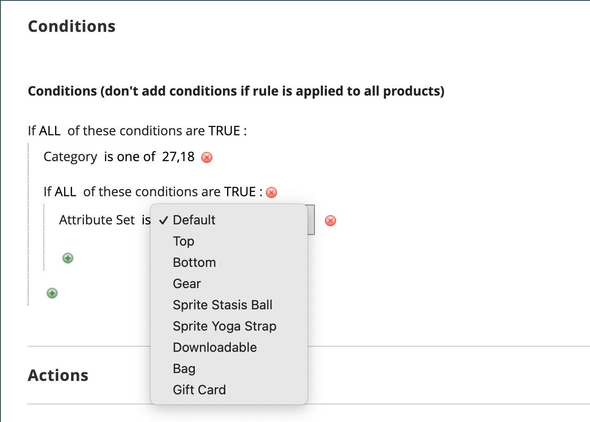

# Skapa en katalogprisregel

Följ dessa anvisningar för att tillämpa en rabatt på vissa produkter när en uppsättning villkor uppfylls. Rabatterna för katalogprisregel börjar gälla innan produkten läggs i kundvagnen.

## Steg 1: Lägg till en regel

1. På _Administratör_ sidebar, gå till **[!UICONTROL Marketing]** > _[!UICONTROL Promotions]_>**[!UICONTROL Catalog Price Rule]**.

1. Klicka på i det övre högra hörnet **[!UICONTROL Add New Rule]**.

   The _[!UICONTROL Rule Information]_-avsnittet innehåller expanderbara avsnitt för **[!UICONTROL Conditions]**och **[!UICONTROL Actions]**.

   {width="700" zoomable="yes"}

1. Slutför **[!UICONTROL Rule Name]** och **[!UICONTROL Description]** fält.

   Dessa fält är endast till för intern referens.

1. Ange **[!UICONTROL Status]** av prisregeln efter behov.

   Som standard är statusen `Inactive`.

   >[!NOTE]
   >
   >När regeln har skapats kan dess status uppdateras genom att statusen ändras till `Active` eller `Inactive` efter behov.

1. Välj **[!UICONTROL Websites]** där regeln ska vara tillgänglig.

1. Välj **[!UICONTROL Customer Groups]** som denna regel gäller för.

   Om du vill välja flera grupper håller du ned Ctrl (PC) eller Kommando (Mac) och klickar på varje alternativ.

   >[!NOTE]
   >
   >Alternativen i den här listan beror på vilka kundgrupper som har skapats och hanterats i _Kunder_ > _Kundgrupper_.

1.  (Endast Magento Open Source) Ange **[!UICONTROL From]** och **[!UICONTROL To]** datum för att avgöra när prisregeln gäller.

   Du kan ange datum eller använda **[!UICONTROL Calendar]** () för att välja datum. Om du lämnar datumen tomma aktiveras regeln när prisregeln sparas.

1. Ange ett nummer för att fastställa **[!UICONTROL Priority]** av denna regel i förhållande till andra regler.

   >[!NOTE]
   >
   >The _[!UICONTROL Priority]_inställning är viktig när samma katalogprodukt uppfyller villkoren som angetts för mer än en prisregel. Regeln med högsta prioritet (1 är högsta) blir aktiv för produkten.

## Steg 2: Definiera villkoren

De flesta tillgängliga villkor baseras på befintliga attributvärden. Om du vill tillämpa regeln på alla produkter lämnar du villkoren tomma.

>[!NOTE]
>
>Om minst ett villkorligt produktattribut har ett tomt värde används inte katalogprisregeln för produkten.

>[!NOTE]
>
>Använda en `Category` produktattributvillkor till alla [paket](../catalog/product-create-bundle.md) eller [grupperad](../catalog/product-create-grouped.md) produkten måste alla underordnade produkter tilldelas till samma kategori för att regeln ska gälla korrekt. Annars kan du använda en [Kundprisregel](price-rules-cart-create.md) i stället.

1. Rulla ned och expandera  den **[!UICONTROL Conditions]** -avsnitt.

   Det första villkoret visas som standard och lägen:

   `If **ALL** of these conditions are **TRUE**:`

   {width="400"}

   Programsatsen har två feta länkar som du kan klicka på för att visa urvalet av alternativ för den delen av programsatsen. Du kan skapa olika villkor genom att ändra kombinationen av dessa värden.

1. Ändra programsatsen på något av följande sätt:

   - Klicka **[!UICONTROL ALL]** och markera `ALL` eller `ANY`.
   - Klicka **[!UICONTROL TRUE]** och markera `TRUE` eller `FALSE`.
   - Låt villkoret vara oförändrat om du vill tillämpa regeln på alla produkter.

   Du kan skapa olika villkor genom att ändra kombinationen av dessa värden. I det här exemplet används standardvillkoret.

1. Klicka på _Lägg till_ () i början av nästa rad och välj ett alternativ för villkoret, till exempel ett produktattribut eller en kombination.

1. I listan under **[!UICONTROL Product Attribute]** väljer du det attribut som du vill använda som grund för villkoret.

   I det här exemplet är villkoret `Attribute Set`.

   {width="400"}

   >[!NOTE]
   >
   >För att ett attribut ska visas i listan måste det konfigureras för användning i kampanjregelvillkor. Mer information finns på [Produktattribut](../catalog/product-attributes.md).

   >[!NOTE]
   >
   >När du använder `is not one of` villkor med _SKU_ produktattribut och konfigurerbar produkt, både den överordnade och den underordnade produktens SKU måste väljas. Om du vill undvika att lista alla underordnade SKU:er i regeln kan du använda kommandot `does not contain` villkor med vanliga SKU-delar av en konfigurerbar produkt och dess underordnade produkter.

   Det markerade villkoret visas i programsatsen, följt av ytterligare två feta länkar. Alternativen varierar beroende på vilket villkorsattribut du väljer. Det står nu:

   `If **ALL** of these conditions are **TRUE**:  Attribute Set **is** …`

1. Klicka **[!UICONTROL is]** och välj den jämförelseoperator som beskriver villkoret som ska uppfyllas.

   Dessa alternativ kan innehålla ett alternativ för olika jämförelser. I det här exemplet är alternativen `is` och `is not`.

1. Välj eller ange värden för villkoret.

   Beroende på villkoret kan du välja produkter från ett rutnät eller en lista, ange ett numeriskt värde och så vidare.

   {width="400"}

   Det markerade objektet visas i satsen för att slutföra villkoret.

   `If **ALL** of these conditions are **TRUE**:   Attribute Set **is Default**`

1. Klicka på knappen _Lägg till_ () och väljer något av följande:

   - `Conditions Combination`
   - `Product Attribute`

   Upprepa processen tills alla önskade villkor är klara.

   Om du någon gång vill ta bort en del av villkorssatsen klickar du på knappen **[!UICONTROL Delete]** ( ikonen i slutet av raden.

## Steg 3: Definiera åtgärderna

1. Expandera den **[!UICONTROL Actions]** och gör följande:

   {width="600" zoomable="yes"}

1. Under **[!UICONTROL Pricing Structure Rules]**, ange **[!UICONTROL Apply]** till något av följande:

   - `Apply as percentage of original` - Rabattartikel genom att subtrahera en procentandel av normalpriset. Exempel: Ange 10 i Rabattbelopp för ett slutgiltigt pris som markeras med 10 % nedåt från det normala priset.
   - `Apply as fixed amount` - Rabattartikel genom att subtrahera ett fast belopp från det normala priset. Exempel: Ange 10 i Rabattbelopp för ett slutligt pris som är 10 USD mindre än det vanliga priset.
   - `Adjust final price to this percentage` - Justerar slutpriset med en procentandel av det normala priset. Ange t.ex. 25 i Rabattbelopp för ett slutpris som markeras med 75 % nedåt från normalpriset.
   - `Adjust final price to discount value` - Anger slutpriset till ett fast, diskonterat belopp. Exempel: Ange 20 i Rabattbelopp för det slutliga priset 20,00 USD.

   >[!NOTE]
   >
   >_Ordinarie pris_ avser basproduktpriset utan några avancerade priser (special/tier/group) eller kampanjrabatter. _Slutpris_ avser det rabatterade pris som visas i kundvagnen.  The **_final_** produktpriset beräknas som **_minimum_** relevant pris, med följande formel:  `Final Price=Min(Regular(Base) Price, Group(Tier) Price, Special Price, Catalog Price Rule) + Sum(Min Price per each required custom option)`

   >[!NOTE]
   >
   >**_Fast pris_** de anpassningsbara alternativen är _not_ påverkas av reglerna för grupppris, pris, specialpris eller katalogpris.

1. Ange **[!UICONTROL Discount Amount]**.

1. Om du vill avbryta bearbetningen av andra regler när den här regeln har tillämpats anger du **[!UICONTROL Discard Subsequent Rules]** till `Yes`.

   >[!NOTE]
   >
   >Anger det här till `Yes` är en säkerhetsåtgärd för att förhindra att systemet tillämpar flera rabatter (regler) på samma produkt.

## Steg 4: Lägg till relaterade dynamiska block

{{ee-feature}}

[Dynamiska block](../content-design/dynamic-blocks.md) som är kopplade till en katalogprisregel visas i butiken när villkoren är uppfyllda. Detta är ett valfritt steg.

1. Expandera den **[!UICONTROL Related Dynamic Blocks]** -avsnitt.

1. Använd [sökfilter](../getting-started/admin-workspace.md) för att hitta de dynamiska block som du vill koppla till regeln.

1. Markera kryssrutan i den första kolumnen om du vill koppla det dynamiska blocket till regeln.

   {width="600" zoomable="yes"}

1. Klicka på **[!UICONTROL Save and Continue Edit]**.

## Steg 5: Schemalägg regeln

{{ee-feature}}

>[!NOTE]
>
>Du måste lägga till en schemalagd uppdatering för att aktivera regeln. Mer information finns på [Schemalagda ändringar](price-rule-catalog-scheduled-changes.md).

1. I _Schemalagda ändringar_ ruta, klicka **[!UICONTROL Schedule New Update]** överst i kartongen).

   Om regeln har en befintlig schemalagd uppdatering kan du klicka på **[!UICONTROL View/Edit]** till höger om den angivna ändringen.

   Du kan antingen redigera den befintliga uppdateringen eller tilldela katalogprisregeln till en annan kampanj. The **Redigera befintlig uppdatering** är markerat som standard.

1. Om du vill schemalägga regeln anger du **[!UICONTROL Start Date]** och **[!UICONTROL End Date]** att prisregeln ska vara aktiv.

   Du kan antingen ange datum eller välja datum från _Kalender_ ().

   {width="600" zoomable="yes"}

1. Klicka på **[!UICONTROL Save]**.

1. I _Regelinformation_ -avsnittet, ange **[!UICONTROL Status]** till `active`.

## Steg 6: Spara och testa regeln

1. När du är klar sparar du regeln.

   -  (Endast Magento Open Source) Klicka på **[!UICONTROL Save and Apply]**.

   -  (Endast Adobe Commerce) Klicka på **[!UICONTROL Save]**.

     På sidan Regelinformation visas en uppdaterad tidslinje i Regelns schemalagda ändringar.

     {width="600" zoomable="yes"}

1. Uppdatera egenskaper för en regel:

   -  (Endast Adobe Commerce) Klicka på **[!UICONTROL Edit]** för att visa _[!UICONTROL Rule Information]_sida.

   -  (Endast Magento Open Source) Klicka på linjen i listan för att visa _[!UICONTROL Rule Information]_sida.

1. Testa regeln för att kontrollera att den fungerar som den ska.

   Prisreglerna bearbetas automatiskt med andra systemregler varje kväll. När du skapar en prisregel bör du ge den tillräckligt med tid för att komma in i systemet innan du testar regeln för att se till att den fungerar som den ska. I takt med att nya regler läggs till beräknar Commerce om priserna och prioriteringarna i enlighet därmed.

## Film om katalogprisregel

I den här videon får du lära dig mer om hur du skapar katalogprisregler:

>[!VIDEO](https://video.tv.adobe.com/v/343834?quality=12)

## Fältbeskrivningar

### [!UICONTROL Rule Information]

| Fält | Beskrivning |
|-----|-----------|
| [!UICONTROL Rule name] | (Obligatoriskt) Namnet på regeln används som intern referens. |
| [!UICONTROL Description] | En beskrivning av regeln ska innehålla regelns syfte och förklara hur den används. |
| [!UICONTROL Websites] | (Obligatoriskt) Identifierar de webbplatser där regeln kan användas. |
| [!UICONTROL Customer Groups] | (Obligatoriskt) Identifierar de kundgrupper som regeln gäller. |
| [!UICONTROL Priority] | Ett tal som anger den här regelns prioritet i förhållande till andra. Högsta prioritet är nummer 1. |
| [!UICONTROL Status] |  (Endast Magento Open Source) Anger om regeln är aktiv i butiken. Alternativ: `Yes` / `No` |
| [!UICONTROL From] |  (Endast Magento Open Source) Anger den första dagen som prisregeln gäller. Om den lämnas tom träder prisregeln i kraft när den sparas. |
| [!UICONTROL To] |  (Endast Magento Open Source) Anger den sista dagen som prisregeln gäller. Om inget anges fortsätter prisregeln oavbrutet. |

{style="table-layout:auto"}

### [!UICONTROL Conditions]

Anger villkoren som måste uppfyllas innan katalogprisregeln verkställs. Om inget anges gäller regeln alla produkter.

### [!UICONTROL Actions]

| Fält | Beskrivning |
|-----|-----------|
| [!UICONTROL Apply] | Bestämmer vilken typ av beräkning som ska tillämpas på inköpet. Alternativ:  **[!UICONTROL Apply as percentage of original]**- Rabattartikel genom att subtrahera en procentandel av normalpriset. **[!UICONTROL Apply as fixed amount]** - Rabattartikel genom att subtrahera ett fast belopp från det normala priset.  **[!UICONTROL Adjust final price to this percentage]**- Justerar slutpriset med en procentandel av det normala priset. **[!UICONTROL Adjust final price to discount value]** - Anger slutpriset till ett fast, diskonterat belopp.   **_Obs!_**Ordinarie pris avser basproduktpriset utan några avancerade priser (special/tier/group) eller kampanjrabatter. Slutpris avser det rabatterade pris som visas i kundvagnen.  The**_final _**produktpriset beräknas som**_minimum _**relevant pris, med följande formel:  `Final Price=Min(Regular(Base) Price, Group(Tier) Price, Special Price, Catalog Price Rule) + Sum(Min Price per each required custom option)` |
| [!UICONTROL Discount Amount] | (Obligatoriskt) Erbjudandet om rabatt. |
| [!UICONTROL Discard Subsequent Rules] | Avgör om ytterligare regler kan tillämpas på det här köpet. Om du vill förhindra att flera rabatter tillämpas på samma inköp väljer du `Yes`. Alternativ: `Yes` / `No` |

{style="table-layout:auto"}

### [!UICONTROL Related Dynamic Blocks]

{{ee-feature}}

Identifierar alla [dynamiska block](../content-design/dynamic-blocks.md) som är kopplade till regeln.
