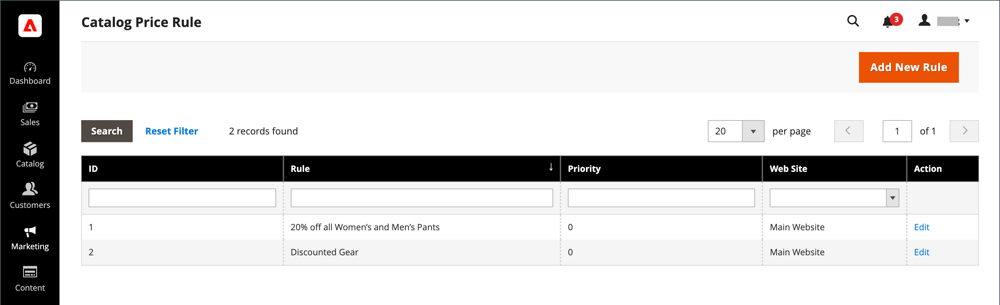

# Katalogprisregler

Katalogprisregler kan användas för att erbjuda produkter till köpare till rabatterat pris, baserat på en uppsättning definierade villkor. Katalogprisreglerna använder inte [kupongkoder](price-rules-cart-coupon.md) eftersom de aktiveras innan en produkt placeras i kundvagnen.

Du kan till exempel definiera och ange villkoren för en prisregel som när den är uppfylld automatiskt visar produkter med ett särskilt eller kampanjpris. Definierade regelegenskaper kan omfatta kundgrupper, produktkategorier, ett rabattbelopp eller en procentandel, produktfärg, produktstorlek eller så gott som alla produktattribut som finns i din butik. Du kan ange start- och slutdatum för en prisregel som automatiskt startar och stoppar en kampanj på de datum som du definierar i regeln. Egenskaperna för en sparad regel kan uppdateras eller ändras efter behov.

-  (endast Adobe Commerce) Du kan även länka en definierad regel till ett [dynamiskt block](../content-design/dynamic-blocks.md) för att hjälpa till att marknadsföra händelsen eller produkten i din butik.

-  (endast Magento Open Source) För återkommande kampanjer kan du manuellt ange statusen _Aktiv_ eller _Inaktiv_ för en sparad regel varje gång du vill köra kampanjen.

## Få tillgång till prisregler för kataloger

1. Gå till **[!UICONTROL Marketing]** > _[!UICONTROL Promotions]_>**[!UICONTROL Catalog Price Rules]**på sidofältet_ Admin _.

   {width="700" zoomable="yes"}

1. Uppdatera egenskaper för en regel:

   -  (endast Adobe Commerce) Klicka på **[!UICONTROL Edit]** för att visa sidan _Regelinformation_.

   -  (endast Magento Open Source) Klicka på regeln i listan för att visa sidan Regelinformation.

   Här kan du ändra inställningarna för regeln (ungefär som när [en regel ](price-rules-catalog-create.md) skapas).

## Filteralternativ

| Fält | Beskrivning |
|--- |--- |
| [!UICONTROL ID] | Ange text för att filtrera listan efter ett visst regel-ID-nummer. |
| [!UICONTROL Rule] | Ange text för att filtrera listan baserat på det regelnamn som definierades när regeln skapades. |
| [!UICONTROL Priority] |  (endast Adobe Commerce) Ange text i det här fältet för att filtrera listan baserat på den prioritet som har definierats för en regel. |
| [!UICONTROL Web Site] |  (endast Adobe Commerce) Använd det här alternativet om du vill filtrera listan baserat på webbplatser som definierats för en regel. |
| [!UICONTROL Action] |  (endast Adobe Commerce) Klicka på **[!UICONTROL Edit]** för att visa regelinformationen och uppdatera regelinställningarna (ungefär som att skapa en regel). |
| [!UICONTROL Start] |  (endast Magento Open Source) Använd de dynamiska kalenderfälten (Till: och Från:) för att filtrera listan baserat på regelns startdatum som det definierades när regeln skapades. |
| [!UICONTROL End] |  (endast Magento Open Source) Använd de dynamiska kalenderfälten (Till: och Från:) för att filtrera listan baserat på slutdatumet för regeln som den definierades när regeln skapades. |
| [!UICONTROL Status] |  (endast Magento Open Source) Använd det här alternativet om du vill filtrera listan baserat på regelstatus (`Active` eller `Inactive`). |

{style="table-layout:auto"}
