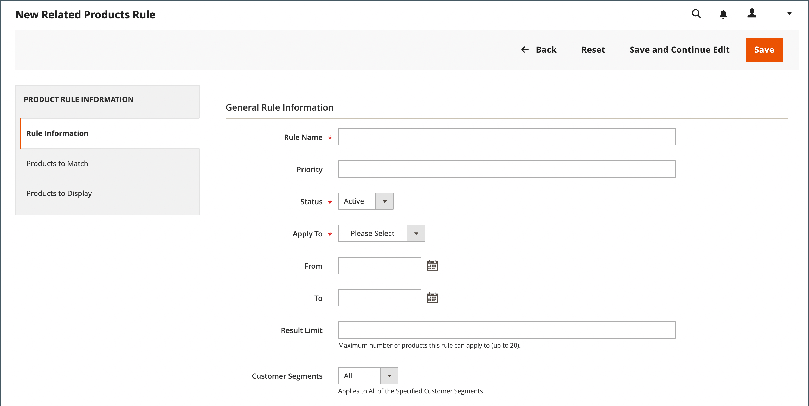
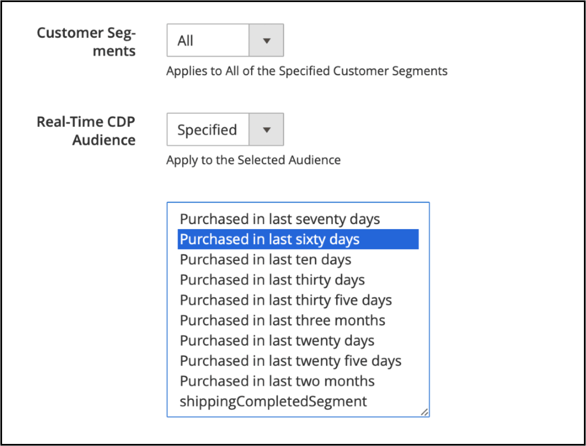

# Skapa en relaterad produktregel

{{ee-feature}}

Processen med att skapa en relaterad produktregel liknar att ställa in en prisregel. Först definierar du villkoren som ska matcha och sedan de produkter som du vill visa. Det kan när som helst finnas flera aktiva regler som kan aktiveras för att visa relaterade produkter, merförsäljning och korsförsäljning. Prioriteten för varje regel avgör i vilken ordning produktblocket visas på sidan.

>[!NOTE]
>
>För att ett attribut ska kunna användas i en målregel måste egenskapen [_[!UICONTROL Use for Promo Rule Conditions]_](../catalog/product-attributes.md) anges till `Yes`.

>[!NOTE]
>
>Omfattningsvärdet `All Store Views` används alltid för både [!UICONTROL Products to Match]- och [!UICONTROL Products to Display]-villkor för alla produktattribut. Detta gäller också när produktattributen har olika värden för olika butiksvyer och webbplatser.

## Skapa en relaterad produktregel

1. Gå till **[!UICONTROL Marketing]** > _[!UICONTROL Promotions]_>**[!UICONTROL Related Product Rules]**på sidofältet_ Admin _.

1. Klicka på **[!UICONTROL Add Rule]** i det övre högra hörnet.

   {width="600" zoomable="yes"}

1. Slutför **[!UICONTROL Rule Information]** enligt följande:

   - Ange en **[!UICONTROL Rule Name]** som identifierar regeln när du arbetar i administratören.

   - För **[!UICONTROL Priority]** anger du ett tal som avgör i vilken ordning resultaten visas på sidan när resultat från andra regler har samma plats som mål. Numret `1` har högsta prioritet.

   - Om du vill aktivera regeln anger du **[!UICONTROL Status]** till `Active`.

   - Ange **[!UICONTROL Apply To]** till något av följande:

      - `Related Products`
      - `Up-sells`
      - `Cross-sells`

   - Om regeln ska vara aktiv under ett visst tidsintervall anger du datumen **[!UICONTROL From]** och **[!UICONTROL To]**.

   - För **[!UICONTROL Result Limit]** anger du antalet poster som ska visas i resultatlistan. Det högsta antalet är 20.

   - Om regeln gäller för ett specifikt [kundsegment](../customers/customer-segments.md) anger du **[!UICONTROL Customer Segments]** till `Specified` och väljer kundsegmentet i listan.

   - Om regeln gäller för en viss [Real-Time CDP-målgrupp](../customers/audience-activation.md) anger du **[!UICONTROL Real-Time CDP Audience]** till `Specified` och väljer målgruppen för Real-Time CDP i listan. Den här funktionen är i betaversion. Om du vill gå med i betaprogrammet skickar du en begäran till [dataconnection@adobe.com](mailto:dataconnection@adobe.com).

     {width="500"}

1. Välj **[!UICONTROL Products to Match]** i den vänstra panelen och skapa villkoren på samma sätt som du gör för en [katalogprisregel](price-rules-catalog.md).

   {width="500"}

1. I den vänstra panelen väljer du **[!UICONTROL Products to Display]** och skapar resultatvillkoren på samma sätt som du gör för en [katalogprisregel](price-rules-catalog.md).

   {width="500"}

   Slutför villkoret för att beskriva de produkter som du vill inkludera i de visade resultaten.

1. Klicka på **[!UICONTROL Save]** när du är klar.

## Ta bort en relaterad produktregel

1. Gå till **[!UICONTROL Marketing]** > _[!UICONTROL Promotions]_>**[!UICONTROL Related Product Rules]**på sidofältet_ Admin _.

1. Hitta den relaterade produktregel som du vill ta bort.

1. Klicka på regeln för att öppna informationssidan.

1. Klicka på **[!UICONTROL Delete]** i det övre högra hörnet.

1. Bekräfta åtgärden genom att klicka på **[!UICONTROL OK]**.

## Demo av relaterade produktregler

I den här videon får du lära dig mer om hur du skapar relaterade produktregler:

>[!VIDEO](https://video.tv.adobe.com/v/343837?quality=12&learn=on)

## Fältbeskrivningar

| Fält | Beskrivning |
|--- |--- |
| [!UICONTROL Rule Name] | Ett namn som identifierar regeln för internt bruk. |
| [!UICONTROL Priority] | Anger i vilken ordning resultatet av regeln visas när det visas med andra resultatuppsättningar som har samma plats på sidan. Värdet kan anges till vilket heltal som helst, med den högsta prioriteten 1. Om det till exempel finns flera regler för merförsäljning som gäller, visas den som har högst prioritet framför de andra. Sorteringsordningen för produkterna i varje resultatuppsättning är slumpmässig. Eventuell merförsäljning, korsförsäljning och relaterade produkter som konfigurerats manuellt visas alltid på sidan före eventuella regelbaserade produktkampanjer. |
| [!UICONTROL Status] | Kontrollerar regelns aktiva status. Alternativ: `Active` / `Inactive` |
| [!UICONTROL Apply To] | Identifierar den typ av produktrelation som är associerad med regeln. Alternativ: `Related Products` / `Up-sells` / `Cross-sells` |
| [!UICONTROL From Date] | Om regeln är aktiv under ett tidsintervall avgör den här inställningen det första datum då regeln är aktiv. |
| [!UICONTROL To Date] | Om regeln är aktiv under ett tidsintervall avgör den här inställningen vilket datum regeln är aktiv. |
| [!UICONTROL Result Limit] | Anger antalet produkter som visas i resultatet på en gång. Det högsta antalet är 20. Om fler matchande resultat hittas roterar produkterna genom blocket varje gång sidan uppdateras. |
| [!UICONTROL Customer Segments] | Identifierar de kundsegment som regeln gäller för. Alternativ: `All` / `Specified` |

{style="table-layout:auto"}
