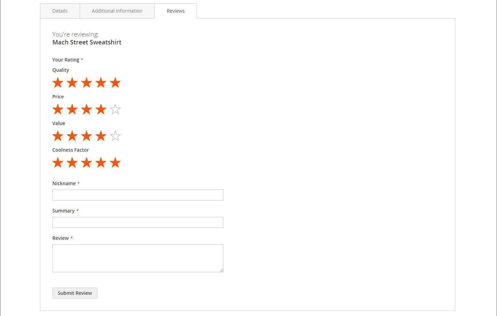

# Produktrecensioner

Produktrecensioner bidrar till att skapa en känsla av gemenskap och anses vara mer trovärdiga än vad annonsbudgeten kan köpa. Vissa sökmotorer ger sajter med produktrecensioner en högre rankning än de utan. För dem som hittar din webbplats genom att söka efter en viss produkt är en produktrecension i stort sett landningssidan i din butik. Med produktrecensioner kan man hitta en butik, hålla sig engagerad och ofta leda till försäljning.

Commerce har en inbyggd funktion för produktgranskning som du kan hantera från administratören. Du kan också använda ett tillägg från [Commerce Marketplace](../getting-started/commerce-marketplace.md) om du vill använda ett värdbaserat granskningshanteringssystem.

>[!NOTE]
>
>Adobe Commerce och Magento Open Source version 2.4.0 till 2.4.3 innehåller tillägget som utvecklats av Yotpo-leverantörer. Från och med version 2.4.4 är det här tillägget inte längre bundet till kärnversionen och måste installeras och uppdateras från Commerce Marketplace. Marketplace ger också tillgång till aktuell dokumentation från tilläggsutvecklaren.
>&#x200B;>  
>&#x200B;>Om du har det paketerade tillägget aktiverat och konfigurerat måste du uppdatera filen Composer.json som en del av uppgraderingsprocessen för 2.4.4 och hantera tilläggsuppdateringar vidare. Mer information finns i [Uppgraderingsmoduler](https://experienceleague.adobe.com/docs/commerce-operations/upgrade-guide/modules/upgrade.html?lang=sv-SE) i _Uppgraderingshandboken_.

## Produktrecensioner i butiken

När den inbyggda produktgranskningsfunktionen är aktiverad kan kunderna skriva recensioner för alla produkter i katalogen. Du kan skriva recensioner på produktsidan genom att klicka på:

- **Lägg till din recension** för produkter med befintliga recensioner.

- **Var först med att granska den här produkten** för produkter som inte har några recensioner.

På fliken [!UICONTROL Reviews] visas alla aktuella granskningar och det formulär som användes för att skicka in en granskning.

Din konfiguration avgör om kunderna måste öppna ett konto i din butik innan de skriver produktrecensioner eller om de kan skicka recensioner som gäster. Att kräva att granskarna öppnar ett konto förhindrar att anonyma dokument skickas in och förbättrar granskningskvaliteten.

{width="700" zoomable="yes"}

Antalet stjärnor anger att produkten är nöjd. Besökarna kan klicka på länken för att läsa granskningarna och skriva sina egna. Som ett incitament kan kunderna få belöningspoäng för att lämna in en recension. När en granskning skickas skickas den till administratören för moderering. När granskningen har godkänts publiceras den i din butik.

{width="700" zoomable="yes"}

### [!UICONTROL My Product Reviews]

Avsnittet _[!UICONTROL My Product Reviews]_&#x200B;på kundkontouppsättningen visar alla recensioner som kunden har skickat in och som godkänts för publicering. Varje granskningssammanfattning innehåller det datum då granskningen skickades, länkar till produktsidan och granskningsinformation.

{width="700" zoomable="yes"}

1. I sidofältet för deras konto väljer kunden **[!UICONTROL My Product Reviews]**.

1. Klicka på **[!UICONTROL See Details]** om du vill visa den fullständiga granskningen.

   {width="700" zoomable="yes"}

## Aktivera funktioner för produktgranskning

Funktionen Commerce produktrecensioner är aktiverad som standard.

>[!NOTE]
>
>Om du vill ange dessa fält som `No` och inaktivera Commerce produktgranskningar måste du avmarkera kryssrutorna **Använd systemvärde**.

1. Gå till **[!UICONTROL Stores]** > _[!UICONTROL Settings]_>**[!UICONTROL Configuration]**&#x200B;på sidofältet_ Admin _.

1. Expandera **[!UICONTROL Catalog]** i den vänstra panelen och markera **[!UICONTROL Catalog]** under.

1. Expandera  i avsnittet **[!UICONTROL Product Reviews]**.

   {width="600" zoomable="yes"}

1. Ange **[!UICONTROL Enabled]** till `Yes`.

   Det här är standardinställningen som möjliggör produktgranskningar.

1. Ange **[!UICONTROL Allow Guests to Write Reviews]** till `Yes`.

   Det här är standardinställningen som avgör om kunderna måste öppna ett konto i din butik för att kunna skriva produktrecensioner.

1. Klicka på **[!UICONTROL Save Config]** när du är klar.

## Skapa egna klassificeringar

Med Commerce produktrecensioner kan man ge betyg när man skickar in en produktrecension. Standardklassificeringarna är kvalitet, pris och värde. Förutom dessa kan du lägga till egna klassificeringar. De femstjärniga klassificeringar som visas på katalogsidor genereras för varje produkt.

{width="700" zoomable="yes"}

1. Gå till **[!UICONTROL Stores]** > _[!UICONTROL Attributes]_>**[!UICONTROL Rating]**&#x200B;på sidofältet_ Admin _.

1. Klicka på **[!UICONTROL Add New Rating]** i det övre högra hörnet.

   {width="700" zoomable="yes"}

1. I avsnittet _[!UICONTROL Rating Title]_&#x200B;anger du **[!UICONTROL Default Value]**&#x200B;för den nya klassificeringen.

   Ange även översättningen för varje butiksvy, om tillämpligt.

   {width="600" zoomable="yes"}

1. I avsnittet _Värderingssynlighet_ anger du **[!UICONTROL Visibility In]** till butiksvyn där klassificeringen ska användas.

   Om du vill välja flera butiksvyer håller du ned Ctrl-tangenten (PC) eller Kommando-tangenten (Mac) och klickar på varje objekt.

   >[!NOTE]
   >
   >Klassificeringar visas inte om de inte tilldelats en butiksvy.

1. För **[!UICONTROL Sort Order]** anger du ett nummer som avgör ordningen för den här klassificeringen när den listas tillsammans med andra.

1. Om du vill visa din klassificering i butiken markerar du kryssrutan **[!UICONTROL Is Active]**.

   {width="600" zoomable="yes"}

1. Klicka på **[!UICONTROL Save Rating]** när du är klar.

   Den genomsnittliga klassificeringen för alla recensioner visas för varje produkt på produktstödrastersidan för katalogen.

   {width="700" zoomable="yes"}
