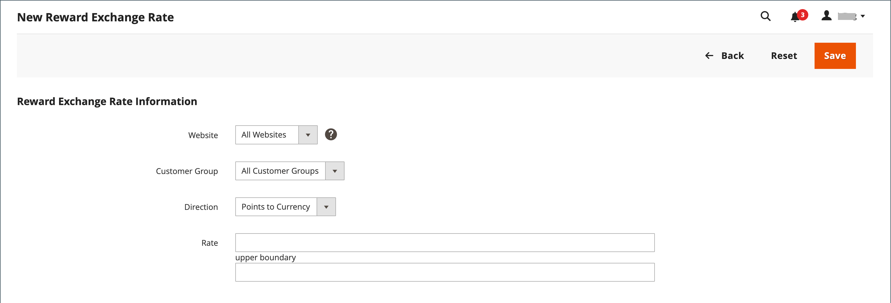

# Belöningsbaserade växelkurser

{{ee-feature}}

Belöningsbaserade valutakurser bestämmer antalet poäng som intjänas baserat på orderbeloppet och värdet av de intjänade poängen. Olika valutakurser kan tillämpas på olika webbplatser och olika kundgrupper. Om flera valutakurser från olika webbplatser och kundgrupper gäller för samma kund gäller följande prioriteringsregler:

## Valutakursprioritet

**1**: Gäller för en viss webbplats och en viss kundgrupp.

**2**: Gäller alla webbplatser och en viss kundgrupp.

**3**: Gäller en specifik webbplats och alla kundgrupper.

**4**: Gäller alla webbplatser och alla kundgrupper.

När du konverterar valuta till punkter kan antalet punkter inte delas upp. Valutaresten avrundas nedåt. Om till exempel $2.00 konverteras till tio poäng, genereras poäng i grupper om $2.00. Därför skulle en beställning på 7,00 USD ge 30 poäng och de återstående 1,00 USD avrundas nedåt. Orderns penningbelopp definieras som det belopp som handlaren erhåller eller totalsumman minus frakt, moms, rabatter, butikskrediter och presentkort. Poängen intjänas så fort det inte finns några icke fakturerade artiklar i ordern (alla artiklar är antingen betalda eller annullerade). Om en Admin-användare inte vill att kunderna ska kunna få belöningspoäng för annullerade order, kan dessa poäng dras av manuellt från sidan Hantera kunder.

## Ställ in valutakurser

{width="700" zoomable="yes"}

1. Gå till **[!UICONTROL Stores]** > _[!UICONTROL Other Settings]_>**[!UICONTROL Reward Exchange Rates]**på sidofältet_ Admin _.

1. Klicka på **[!UICONTROL Add New Rate]** i det övre högra hörnet.

1. Gör följande i avsnittet **[!UICONTROL Reward Exchange Rate Information]**:

   {width="600" zoomable="yes"}

   - Ange **[!UICONTROL Website]** för webbplatserna där belöningens valutakurs gäller.

   - Ange **[!UICONTROL Customer Group]** för de grupper där belöningens valutakurs gäller.

   - Ange **[!UICONTROL Direction]** till något av följande:

      - `Points to Currency`
      - `Currency to Points`

   För båda riktningsinställningarna representeras beloppet i webbplatsens basvaluta.

1. Ange **[!UICONTROL Rate]**-värdena enligt inställningen för _[!UICONTROL Direction]_.

   | Riktning | Kursinställningar |
   |---------|-------------|
   | [!UICONTROL Points to Currency] | I det första _[!UICONTROL Rate]_-fältet anger du antalet punkter. I det andra_[!UICONTROL Rate]_-fältet anger du det monetära värdet för poängen. |
   | [!UICONTROL Currency to Points] | Ange det monetära värdet i det första fältet _[!UICONTROL Rate]_. I det andra fältet_[!UICONTROL Rate]_ anger du antalet punkter som representeras av det monetära värdet. |

   När du konverterar punkter till valuta kan antalet punkter inte delas. Om tio punkter till exempel konverteras till $2.00 måste poäng lösas in i grupper om tio. Därför skulle 25 poäng återbetalas för 4,00 USD, med 5 poäng kvar i kundens saldo.

   Vi rekommenderar att du konfigurerar en konvertering för både `Points to Currency` och `Currency to Points`.

1. Klicka på **[!UICONTROL Save]** när du är klar.

## Ta bort en belöningsvalutakurs

1. Gå till **[!UICONTROL Stores]** > _[!UICONTROL Other Settings]_>**[!UICONTROL Reward Exchange Rates]**på sidofältet_ Admin _.

1. Hitta den belöningsvalutakurs som ska tas bort och öppna den i redigeringsläge.

1. Klicka på **[!UICONTROL Delete]** på menyraden.

1. Bekräfta åtgärden genom att klicka på **[!UICONTROL OK]**.

## Fältbeskrivningar

| Fält | Beskrivning |
|--- |--- |
| [!UICONTROL Website] | Webbplatserna där belöningspriserna gäller. |
| [!UICONTROL Customer Group] | Kundgrupperna som belöningssatserna gäller för. |
| [!UICONTROL Direction] | Avgör vilken typ av transaktion valutakursen definierar. Alternativ:  **[!UICONTROL Points to Currency]**- Definierar antalet poäng som kan användas som kredit i förhållande till orderbeloppet. I det första _[!UICONTROL Rate]_-fältet anger du antalet punkter. I det andra_[!UICONTROL Rate]_-fältet anger du det monetära värdet för poängen. **[!UICONTROL Currency to Points]** - Definierar beloppet för en order som kan få kundpoäng. Ange det monetära värdet i det första fältet _[!UICONTROL Rate]_. I det andra fältet_[!UICONTROL Rate]_ anger du antalet punkter som representeras av det monetära värdet. |
