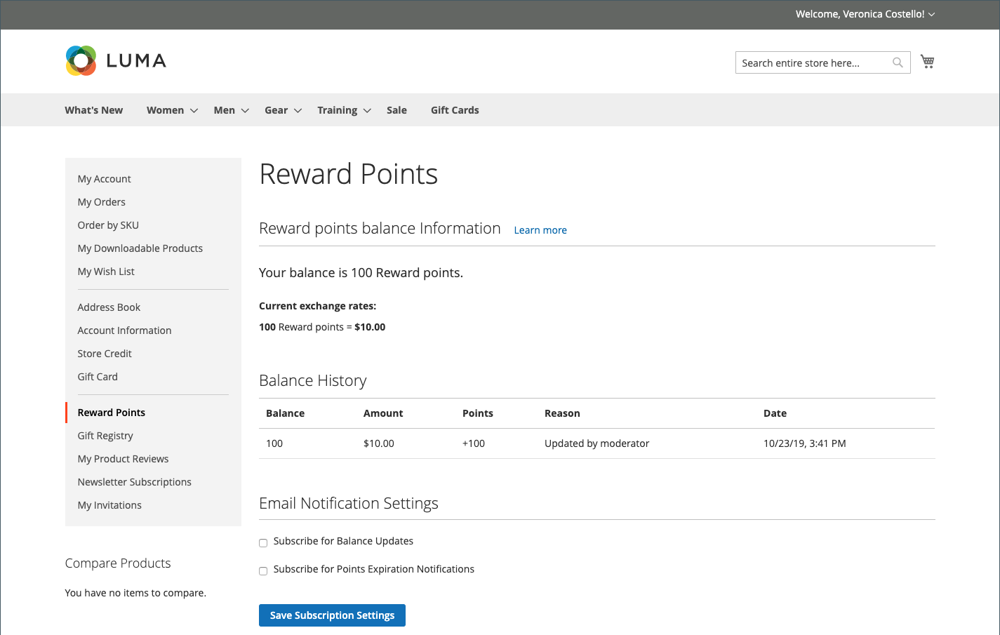
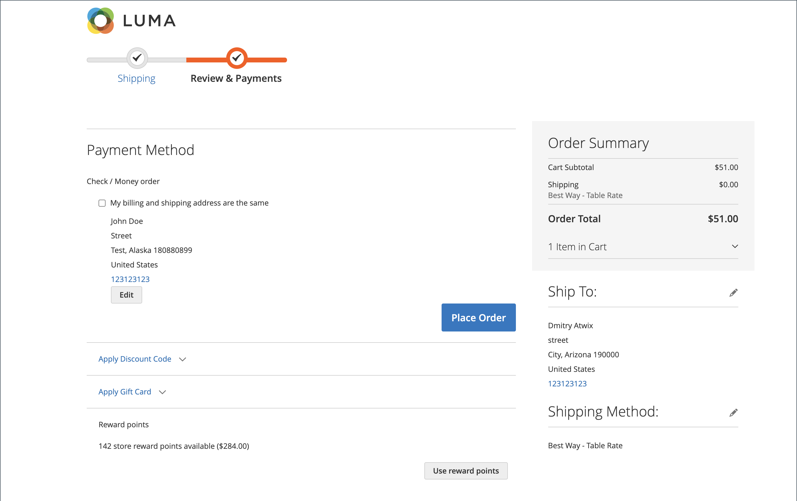

# Bakåtriktad butiksupplevelse

{{ee-feature}}

Avsnittet [Belöningspoäng](rewards-loyalty.md) i kundkontot visar att den aktuella saldot för belöningspoäng som kunden tjänat in och en historik över deras belöningspoängsaldo.

{width="700" zoomable="yes"}

## Lös in belöningspoängen under utcheckningen

Om [Belöningsväxelkursen](reward-exchange-rates.md) med riktningen `Points to Currency` är konfigurerad kan kunderna använda belöningspunkter under utcheckningen.

1. När kunden har lagt till alla nödvändiga produkter i kundvagnen går han/hon till kassan.

1. Anger all leveransinformation som krävs och navigerar till steget _Granska och betala_.

1. I avsnittet _[!UICONTROL Reward points]_kontrollerar antalet tillgängliga poäng och deras valutavärde.

1. Klicka på **[!UICONTROL Use reward points]**.

{width="700" zoomable="yes"}

Rabatten på tillgängliga poäng tillämpas på delsumman.

>[!NOTE]
>
>Om det tillgängliga saldot är större än totalsumman för ordern krävs ingen annan betalningsmetod.
