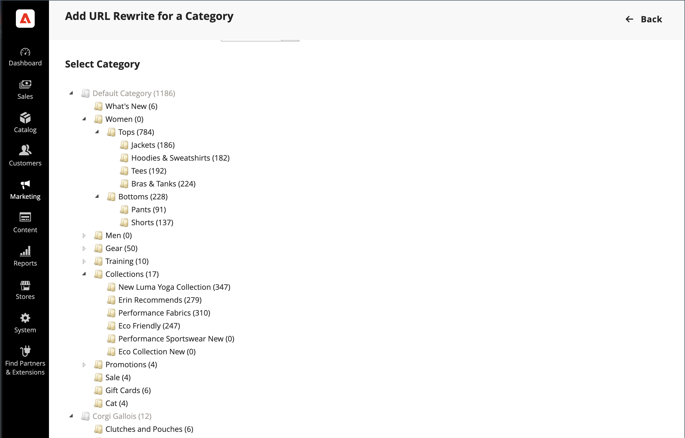

# Återskrivningar av kategori-URL

Om en kategori tas bort från katalogen kan du använda en kategoriomskrivning för att omdirigera länkar till URL:en för en annan kategori i din butik. Tänk i termer av _target_ / _original request_ eller _redirect to_ / _redirect from_. Även om användare fortfarande kan navigera till den förra sidan från sökmotorer eller inaktuella länkar, leder omdirigeringen till att din butik växlar till det nya målet.

Om [automatiska omdirigeringar](url-redirect-product-automatic.md) är aktiverade för din butik behöver du inte skapa en omskrivning när en [URL-nyckel](../catalog/catalog-urls.md) i kategorin ändras.

{{url-rewrite-skip}}

## Steg 1. Planera omskrivningen

Om du vill undvika misstag skriver du ned _omdirigeringen till_-sökvägen och _omdirigeringen från_-sökvägen och inkluderar URL-nyckeln och suffixet (om tillämpligt).

Om du är osäker öppnar du varje kategorisida i butiken och kopierar sökvägen från webbläsarens adressfält.

**Exempel:**

Omdirigera till: `gear/backpacks-and-bags.html`

Omdirigera från: `gear/bags.html`

## Steg 2. Skapa omskrivning

{{url-rewrite-params}}

1. Gå till **[!UICONTROL Marketing]** > _[!UICONTROL SEO & Search]_>**[!UICONTROL URL Rewrites]**på sidofältet_ Admin _.

1. Innan du fortsätter gör du följande för att verifiera att sökvägen till begäran är tillgänglig:

   - I sökfiltret högst upp i kolumnen **[!UICONTROL Request Path]** anger du URL-nyckeln för den kategori som ska omdirigeras och klickar på **[!UICONTROL Search]**.

   - Om det finns flera omdirigeringsposter för sidan, söker du efter den som matchar rätt butiksvy och öppnar omdirigeringsposten i redigeringsläge.

   - Klicka på **[!UICONTROL Delete]** i det övre högra hörnet. Klicka på **[!UICONTROL OK]** när du uppmanas att bekräfta.

1. När du kommer tillbaka till sidan _[!UICONTROL URL Rewrites]_klickar du på&#x200B;**[!UICONTROL Add URL Rewrite]**.

1. Ange **[!UICONTROL Create URL Rewrite]** till `For category` och välj målkategorin i trädet som är målet för omdirigeringen.

   {width="700" zoomable="yes"}

1. Gör följande i avsnittet _URL-omskrivning_:

   - Om du har flera arkiv väljer du **[!UICONTROL Store]** där omskrivningen gäller.

   - För **[!UICONTROL Request Path]** anger du URL-nyckeln för den kategori som kunden begär. Det här är kategorin _omdirigering från_.

     >[!NOTE]
     >
     >Sökvägen till begäran måste vara unik för det angivna arkivet. Om det redan finns en omdirigering som använder samma sökväg visas ett fel när du försöker spara omdirigeringen. Den tidigare omdirigeringen måste tas bort innan du kan skapa en.

   - Ange **[!UICONTROL Redirect]** till något av följande:

      - `Temporary (302)`
      - `Permanent (301)`

   - Ange en kort beskrivning av omskrivningen som referens.

   {width="700" zoomable="yes"}

1. Läs följande innan du sparar omdirigeringen:

   - Länken i det övre vänstra hörnet visar namnet på målkategorin.
   - Sökvägen till begäran innehåller sökvägen för den ursprungliga kategorin _omdirigering från_.

1. Klicka på knappen **[!UICONTROL Save]** när du är klar.

   Den nya kategoriomskrivningen visas högst upp i rutnätet för URL-omskrivning.

## Steg 3. Testa resultatet

1. Gå till butikens hemsida.

1. Gör något av följande:

   - Navigera till den ursprungliga _omdirigeringskategorin_.
   - I webbläsarens adressfält anger du sökvägen till den ursprungliga kategorin _omdirigera från_ omedelbart efter butikens URL och trycker på **[!UICONTROL Enter]**.

   Den nya målkategorin visas i stället för den ursprungliga kategoriförfrågan.

## Fältbeskrivningar

| Fält | Beskrivning |
|--- |--- |
| [!UICONTROL Create URL Rewrite] | Anger typ av omskrivning. Det går inte att ändra typen efter att omskrivningen har skapats. Alternativ: `Custom` / `For category` / `For product` / `For CMS page` |
| [!UICONTROL Request Path] | Kategorin som ska omdirigeras. Beroende på din konfiguration kan sökvägen till begäran innehålla suffixet .html eller .htm samt den överordnade kategorin. Sökvägen till begäran måste vara unik och kan inte användas av en annan omdirigering. Om du får ett felmeddelande om att sökvägen till begäran finns tar du bort den befintliga omdirigeringen och försöker igen. |
| [!UICONTROL Target Path] | Den interna sökväg som används av systemet för att peka mot omdirigeringens mål. Målbanan är nedtonad och kan inte redigeras. |
| [!UICONTROL Redirect] | Anger typen av omdirigering. Alternativ:  **[!UICONTROL No]**- Ingen omdirigering har angetts. Många åtgärder skapar omdirigeringsbegäranden av den här typen. Varje gång du lägger till produkter i en kategori skapas till exempel en omdirigering av typen `No` för varje butiksvy. **[!UICONTROL Temporary (302)]** - Anger för sökmotorer att omskrivningen är för en begränsad tid. Sökmotorer behåller vanligtvis inte sidrankningsinformation för temporära omskrivningar.  **[!UICONTROL Permanent (301)]**- Anger för sökmotorer att omskrivningen är permanent. Sökmotorer behåller vanligtvis sidrankningsinformation för permanent omskrivning. |
| [!UICONTROL Description] | Beskriver syftet med omskrivningen för intern referens. |

{style="table-layout:auto"}
