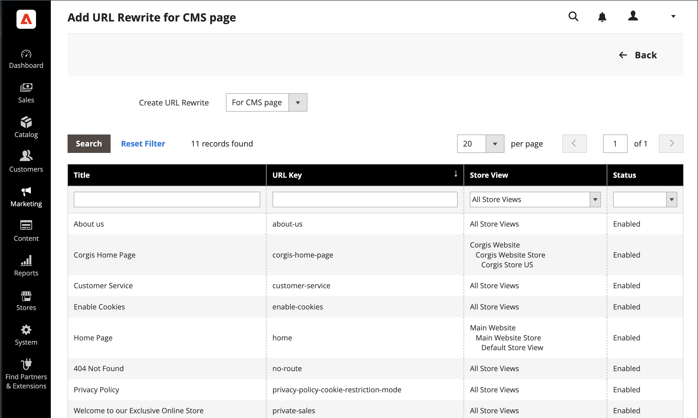

# URL för innehållssida skrivs om

Innan du börjar ser du till att du förstår exakt vad omdirigeringen ska åstadkomma. Tänk i termer av _target_ / _source_ eller _omdirigera till_ / _omdirigera från_. Även om användare fortfarande kan navigera till den förra sidan från sökmotorer eller inaktuella länkar, leder omdirigeringen till att din butik växlar till det nya målet.

{width="700" zoomable="yes"}

## Steg 1. Planera omskrivningen

Du undviker misstag genom att skriva ned URL-nyckeln för sidan _Omdirigera till_ och _omdirigera från sidan_.

Om du är osäker kan du öppna varje sida i din butik och kopiera sökvägen från webbläsarens adressfält.

### CMS-sidsökväg

Omdirigera till: `new-page`

Omdirigera från: `old-page`

## Steg 2. Skapa omskrivning

{{url-rewrite-params}}

1. Gå till **[!UICONTROL Marketing]** > _[!UICONTROL SEO & Search]_>**[!UICONTROL URL Rewrites]**på sidofältet_ Admin _.

1. Innan du fortsätter gör du följande för att kontrollera att sökvägen till begäran är tillgänglig.

   - I sökfiltret högst upp i kolumnen **[!UICONTROL Request Path]** anger du URL-nyckeln för sidan som ska omdirigeras och klickar på **[!UICONTROL Search]**.

   - Om det finns flera omdirigeringsposter för sidan, söker du efter den som matchar rätt butiksvy och öppnar den i redigeringsläge.

   - Klicka på **[!UICONTROL Delete]** i det övre högra hörnet. Klicka på **[!UICONTROL OK]** när du uppmanas att bekräfta.

1. När du kommer tillbaka till sidan URL-omskrivning klickar du på **[!UICONTROL Add URL Rewrite]**.

1. Ange **[!UICONTROL Create URL Rewrite]** till `for CMS page`.

1. Hitta den nya målsidan i rutnätet och öppna den i redigeringsläge.

   {width="700" zoomable="yes"}

1. Gör följande under URL-omskrivningsinformation:

   - Om du har flera butiksvyer väljer du **[!UICONTROL Store]** där omskrivningen gäller.

   - För **[!UICONTROL Request Path]** anger du URL-nyckeln för originalsidan som kunden begär. Det här är sidan för _omdirigering från_.

     >[!NOTE]
     >
     >Sökvägen till begäran måste vara unik för det angivna arkivet. Om det redan finns en omdirigering som använder samma sökväg för begäran visas ett fel när du försöker spara omdirigeringen. Den tidigare omdirigeringen måste tas bort innan du kan skapa en.

   - Ange **[!UICONTROL Redirect]** till något av följande:

      - `Temporary (302)`
      - `Permanent (301)`

   - Ange en kort beskrivning av omskrivningen som referens.

   {width="600" zoomable="yes"}

1. Läs följande innan du sparar omdirigeringen:

   - Länken i det övre vänstra hörnet visar namnet på målsidan.
   - Sökvägen till begäran innehåller sökvägen för den ursprungliga _omdirigeringen från_-sidan.

1. Klicka på **[!UICONTROL Save]** när du är klar.

   Den nya omskrivningen visas i rutnätet högst upp i listan.

## Steg 3. Testa resultatet

1. Gå till butikens hemsida.

1. Gör något av följande:

   - Navigera till den ursprungliga _omdirigeringen från_-sidan.
   - I webbläsarens adressfält anger du namnet på den ursprungliga _omdirigeringssidan_ omedelbart efter butikens URL och trycker på **Retur**.

   Den nya målsidan visas i stället för den ursprungliga sidförfrågan.

## Fältbeskrivningar

| Fält | Beskrivning |
|--- |--- |
| [!UICONTROL Create URL Rewrite] | Anger typ av omskrivning. Det går inte att ändra typen efter att omskrivningen har skapats. Alternativ: `Custom` / `For category` / `For product` / `For CMS page` |
| [!UICONTROL Request Path] | CMS-sidan som ska omdirigeras. Sökvägen till begäran måste vara unik och kan inte användas av en annan omdirigering. Om du får ett felmeddelande om att sökvägen till begäran finns tar du bort den befintliga omdirigeringen och försöker igen. |
| [!UICONTROL Target Path] | Den interna sökväg som används av systemet för att peka mot målet. Målbanan är nedtonad och kan inte redigeras. |
| [!UICONTROL Redirect] | Anger typen av omdirigering. Alternativ:  **[!UICONTROL No]**- Ingen omdirigering har angetts. **[!UICONTROL Temporary (302)]** - Anger för sökmotorer att omskrivningen är för en begränsad tid. Sökmotorer behåller vanligtvis inte sidrankningsinformation för temporära omskrivningar.  **[!UICONTROL Permanent (301)]**- Anger för sökmotorer att omskrivningen är permanent. Sökmotorer behåller vanligtvis sidrankningsinformation för permanent omskrivning. |
| [!UICONTROL Description] | Beskriver syftet med omskrivningen för intern referens. |

{style="table-layout:auto"}
