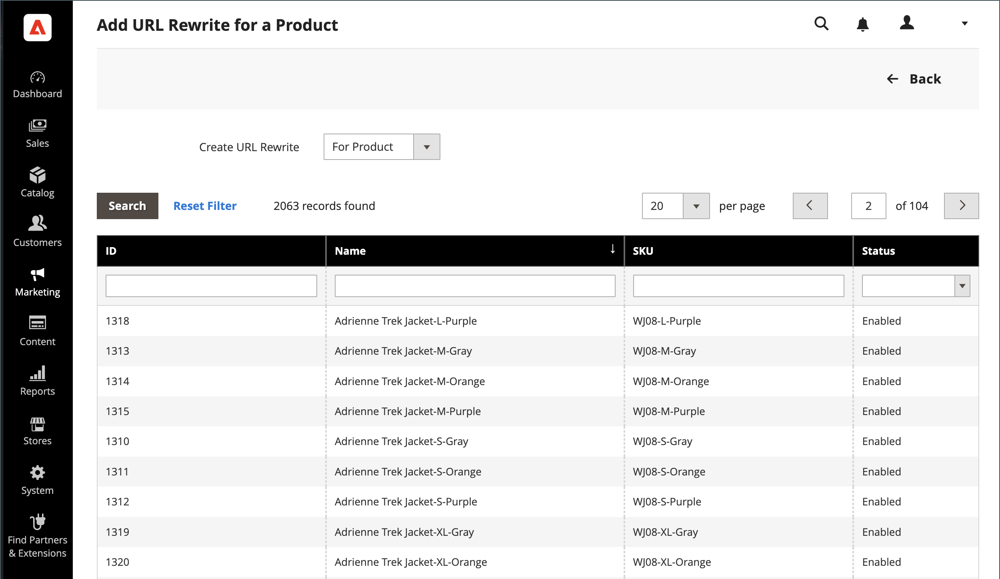

# Återskrivningar av produkt-URL

Innan du börjar måste du se till att du förstår exakt vad omdirigeringen ska åstadkomma. Tänk i termer av _target_ / _original request_ eller _redirect to_ / _redirect from_. Även om användare fortfarande kan navigera till den förra sidan från sökmotorer eller inaktuella länkar, leder omdirigeringen till att din butik växlar till det nya målet.

Om [automatiska omdirigeringar](url-redirect-product-automatic.md) har aktiverats för din butik behöver du inte skapa en omskrivning när en [URL-nyckel](../catalog/catalog-urls.md) för produkten ändras.

{{url-rewrite-skip}}

## Steg 1. Planera omskrivningen

Om du vill undvika misstag skriver du ned _omdirigeringen till_-sökvägen och _omdirigeringen från_-sökvägen och inkluderar URL-nyckeln och suffixet (om tillämpligt).

Om du är osäker öppnar du varje produktsida i din butik och kopierar sökvägen från webbläsarens adressfält. När du skapar en produktomdirigering kan du antingen inkludera eller exkludera sökvägen för [kategorin ](../catalog/catalog-urls.md). I det här exemplet skapar vi en produktomdirigering utan en kategorisökväg.

### Produkt med kategorisökväg

Omdirigera till: `gear/bags/impulse-duffle.html`

Omdirigera från: `gear/bags/overnight-duffle.html`

### Produkt utan kategorisökväg

Omdirigera till: `impulse-duffle.html`

Omdirigera från: `overnight-duffle.html`

## Steg 2. Skapa omskrivning

{{url-rewrite-params}}

1. Gå till **[!UICONTROL Marketing]** > _[!UICONTROL SEO & Search]_>**[!UICONTROL URL Rewrites]**på sidofältet_ Admin _.

1. Innan du fortsätter gör du följande för att kontrollera att sökvägen till begäran är tillgänglig.

   - I sökfiltret högst upp i kolumnen **[!UICONTROL Request Path]** anger du URL-nyckeln för sidan som ska omdirigeras och klickar på **[!UICONTROL Search]**.

   - Om det finns flera omdirigeringsposter för sidan, söker du efter den som matchar rätt butiksvy och öppnar den i redigeringsläge.

   - Klicka på **[!UICONTROL Delete]** i det övre högra hörnet. Klicka på **[!UICONTROL OK]** när du uppmanas att bekräfta.

1. Klicka på **Lägg till URL-omskrivning** i det övre högra hörnet på sidan URL-omskrivning.

1. Ange **[!UICONTROL Create URL Rewrite]** till `For product`.

1. Leta reda på produkten som är målet (målet) för omdirigeringen i rutnätet och klicka på raden.

   {width="700" zoomable="yes"}

1. Klicka **[!UICONTROL Skip Category Selection]** nedanför kategoriträdet.

   I det här exemplet innehåller omdirigeringen ingen kategori.

   {width="600" zoomable="yes"}

   På sidan Lägg till URL-omskrivning för en produkt visas en länk till målet i det övre vänstra hörnet och i fältet Målsökväg visas systemversionen av sökvägen, som inte kan ändras. Till att börja med visas målsökvägen även i fältet Omdirigeringssökväg.

   - Om du har flera butiksvyer anger du **[!UICONTROL Store]** till den vy där omskrivningen gäller. I annat fall skapas en omskrivning för varje vy.

   - Ersätt standardvärdet för **[!UICONTROL Request Path]** genom att ange URL-nyckeln och suffixet (om tillämpligt) för den ursprungliga produktförfrågan. Detta är den _omdirigering från_-produkt som du identifierade i planeringssteget.

     >[!NOTE]
     >
     >Sökvägen till begäran måste vara unik för det angivna arkivet. Om det redan finns en omdirigering som använder samma sökväg visas ett fel när du försöker spara omdirigeringen. Den tidigare omdirigeringen måste tas bort innan du kan skapa en.

   - Ange **[!UICONTROL Redirect Type]** till något av följande:

      - `Temporary (302)`
      - `Permanent (301)`

   - Ange en kort **[!UICONTROL Description]** av omskrivningen för din egen referens.

   {width="600" zoomable="yes"}

1. Läs följande innan du sparar omdirigeringen:

   - Länken i det övre vänstra hörnet visar namnet på målprodukten.
   - Sökvägen till begäran innehåller sökvägen för den ursprungliga _omdirigeringen från_-produkten.

1. Klicka på **[!UICONTROL Save]** när du är klar.

   Den nya produktomskrivningen visas nu högst upp i rutnätet för URL-omskrivning.

## Steg 3. Testa resultatet

1. Gå till butikens hemsida.

1. Gör något av följande:

   - Navigera till den ursprungliga sidan för _omdirigering från_-produktbegäran.
   - I webbläsarens adressfält anger du sökvägen till den ursprungliga _omdirigeringen från_-produkten direkt efter butikens URL och trycker på **Retur**.

   Den nya målprodukten visas i stället för den ursprungliga produktförfrågan.

## Fältbeskrivningar

| Fält | Beskrivning |
|--- |--- |
| [!UICONTROL Create URL Rewrite] | Anger typ av omskrivning. Det går inte att ändra typen efter att omskrivningen har skapats. Alternativ: `Custom` / `For category` / `For product` / `For CMS page` |
| [!UICONTROL Request Path] | Produkten som ska omdirigeras. Beroende på din konfiguration kan sökvägen till begäran innehålla suffixet `.html` eller `.htm` samt kategorin. Sökvägen till begäran måste vara unik och kan inte användas av en annan omdirigering. Om du får ett felmeddelande om att sökvägen till begäran finns tar du bort den befintliga omdirigeringen och försöker igen. |
| [!UICONTROL Target Path] | Den interna sökväg som används av systemet för att peka mot omdirigeringens mål. Målbanan är nedtonad och kan inte redigeras. |
| [!UICONTROL Redirect] | Anger typen av omdirigering. Alternativ:  **[!UICONTROL No]**- Ingen omdirigering har angetts. Många åtgärder skapar omdirigeringsbegäranden av den här typen. Varje gång du lägger till produkter i en kategori skapas till exempel en omdirigering av typen `No` för varje butiksvy. **[!UICONTROL Temporary (302)]** - Anger för sökmotorer att omskrivningen är för en begränsad tid. Sökmotorer behåller vanligtvis inte sidrankningsinformation för temporära omskrivningar.  **[!UICONTROL Permanent (301)]**- Anger för sökmotorer att omskrivningen är permanent. Sökmotorer behåller vanligtvis sidrankningsinformation för permanent omskrivning. |
| [!UICONTROL Description] | Beskriver syftet med omskrivningen för intern referens. |

{style="table-layout:auto"}

## Flera URL-omskrivningar

Du kan snabbt uppdatera URL-omskrivningar för flera eller alla produkter samtidigt genom att följa de här stegen.

1. Gå till **[!UICONTROL Catalog]** > **[!UICONTROL Products]** på sidofältet _Admin_.

1. Markera alla produkter som du vill uppdatera URL-omskrivningar för.

1. Under _[!UICONTROL Actions]_väljer du **[!UICONTROL Update attributes]**om du vill uppdatera flera eller alla återskrivningar.

1. Klicka på fliken **[!UICONTROL Websites]** under _[!UICONTROL PRODUCTS INFORMATION]_.

1. I avsnittet _[!UICONTROL Add Product To Websites]_väljer du alla webbplatser som du vill återställa URL-skrivningar för.

1. Klicka på **[!UICONTROL Save]** när du är klar att uppdatera.

>[!NOTE]
>
>Alla valda produkter läses till de valda webbplatserna och URL-omskrivningar genereras om.

{width="600" zoomable="yes"}
