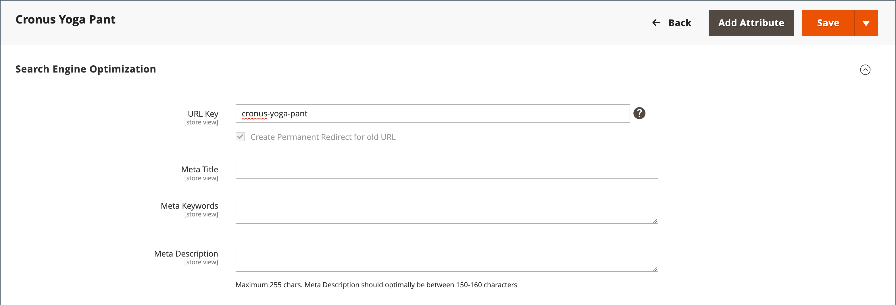

# URL-omskrivningar

>[!TIP]
>
>Information om Adobe Commerce as a Cloud Service finns i [SEO-riktlinjerna](https://experienceleague.adobe.com/developer/commerce/storefront/setup/seo/indexing/) i dokumentationen för Commerce Storefront

Med verktyget för URL-omskrivning kan du ändra alla URL-adresser som är kopplade till en produkt, kategori eller CMS-sida. När du skapar en URL-omskrivning skapar Commerce automatiskt en permanent omdirigering (301) så att alla länkar som pekar på den gamla URL:en omdirigeras till den nya adressen.

>[!NOTE]
>
>Om du vill uppdatera URL-omskrivningar för flera eller alla produkter samtidigt läser du [Flera URL-omskrivningar](url-rewrite-product.md#multiple-url-rewrites).

>[!BEGINSHADEBOX &quot;Återskriver och omdirigerar&quot;]

Termerna _rewrite_ och _redirect_ används ofta omväxlande, men de är olika åtgärder:

* **URL-omskrivning** - En process på serversidan som internt mappar en URL till en annan utan att ändra vad som visas i webbläsarens adressfält. När en besökare begär en URL-adress bearbetar servern den som en annan URL-adress bakom scenen, men webbläsaren fortsätter att visa den ursprungliga URL-adressen.

* **URL-omdirigering** - Skickar ett HTTP-svar till webbläsaren och instruerar den att navigera till en annan URL. Webbläsarens adressfält uppdateras och visar den nya URL:en. Omdirigeringar kan vara tillfälliga (302) eller permanenta (301).

>[!ENDSHADEBOX]

## Så här fungerar omskrivningsverktyget

I Adobe Commerce skapar URL-omskrivningsverktyget permanenta omdirigeringar (301) som standard för att bevara SEO-värdet när du ändrar URL-nyckeln för en produkt, kategori eller sida. Detta beteende säkerställer att befintliga länkar fortsätter att fungera och att sökmotorrangordningarna upprätthålls.

Som standard är [automatiska URL-omdirigeringar](url-redirect-product-automatic.md) aktiverade för din butik och kryssrutan **Skapa permanent omdirigering för gammal URL** markeras under URL-nyckelfältet för varje produkt.

{{url-rewrite-skip}}

{width="600" zoomable="yes"}

{{url-rewrite-params}}

## Demo om återskrivningar av URL

Titta på följande video om du vill veta mer om hur du hanterar URL-omskrivningar:

>[!VIDEO](https://video.tv.adobe.com/v/343751?quality=12&learn=on)

## Skapa URL-omskrivningar

Använd URL-omskrivningsverktyget för att skapa produkt- och kategoriomdirigeringar och anpassade omdirigeringar för alla sidor i din butik. När konfigurationen för omskrivning av URL används omdirigeras alla befintliga länkar som pekar på den tidigare URL:en till den nya adressen.

Du kan skapa URL-omskrivningar till:

* Lägg till nyckelord med högt värde för att förbättra det sätt på vilket produkten indexeras av sökmotorer.

* Lägg till ytterligare URL:er för en tillfällig säsongsändring eller permanent ändring.

* Lägg till en giltig sökväg för en sida, inklusive CMS innehållssidor. Du kan till exempel skapa en URL för att skapa en mer användar- eller SEO-vänlig URL på ett system som alltid refererar produkter och kategorier efter deras interna ID.

Den URL-omskrivning du skapar kan dirigera om befintliga kategorier eller anpassade sidor utan att ändra webbplatsens struktur, vilket gör det enkelt att skapa minnesvärda URL:er för marknadsföringskampanjer.

{width="700" zoomable="yes"}

Commerce erbjuder följande typer av URL-omskrivning:

* [Återskrivningar av produkter](url-rewrite-product.md)
* [Kategoriåterskrivningar](url-rewrite-category.md)
* [CMS Page Rewrites](url-rewrite-cms-page.md)
* [Anpassade omskrivningar](url-rewrite-custom.md)

### Användningsexempel

URL-omskrivningar används ofta i följande scenarier:

#### Ändra en intern system-URL till en SEO-vänlig URL

Commerce använder ID-baserade URL:er internt, men du kan skapa SEO-vänliga URL:er för kunder:

**System-URL (intern):**

    http://www.example.com/catalog/category/id/6

**Kundriktad URL:**

    http://www.example.com/peripherals/keyboard.html

#### Produktomprofilering eller URL-optimering

När du byter namn på en produkt eller vill förbättra dess URL för SEO skapar du en omdirigering för att behålla befintliga länkar:

**Ursprunglig URL:**

    http://www.example.com/peripherals/keyboard.html

**Ny optimerad URL:**

    http://www.example.com/ergonomic-keyboard.html

Med verktyget för omskrivning skapas automatiskt en 301-omdirigering från den gamla URL:en till den nya, så att kunder och sökmotorer omdirigeras till rätt sida.

#### Kampanjlandningssidor

Skapa tillfälliga eller permanenta anpassade URL:er för marknadsföringskampanjer:

**Marknadsförings-URL:er:**

    http://www.example.com/all-on-sale.html
    http://www.example.com/save-now/spring-sale

## Ytterligare konfiguration för URL-hantering

I följande avsnitt beskrivs hur du konfigurerar omskrivningar och kanoniska URL:er för Commerce.

### Konfigurera omskrivningar av webbservrar

>[!NOTE]
>
>I det här avsnittet beskrivs URL-omskrivning på webbservernivå, vilket skiljer sig från funktionen för verktyget URL-omskrivning. Webbservern skriver om hanterar teknisk URL-formatering (som att ta bort `index.php`), medan URL-omskrivningsverktyget hanterar omdirigeringar för innehållsändringar.

Att aktivera omskrivning av webbserver är en del av den initiala Commerce-installationen och är vanligtvis konfigurerat under installationen. När det här alternativet är aktiverat tar webbservern (Apache eller Nginx) automatiskt bort filnamnet `index.php` från URL:er, vilket skapar renare och mer SEO-vänliga adresser.
I följande exempel visas hur URL:er visas med och utan aktiverad omskrivning av webbservrar:

**URL utan omskrivning av webbserver**

    http://www.yourdomain.com/magento/index.php/storeview/url-identifier

**URL med omskrivning av webbserver**

    http://www.yourdomain.com/magento/storeview/url-identifier

#### Aktivera eller inaktivera omskrivning av webbserver:

1. Gå till _>_ > **[!UICONTROL Stores]** på sidofältet _[!UICONTROL Settings]_Admin **[!UICONTROL Configuration]**.

1. Välj **[!UICONTROL General]** i den vänstra panelen där **[!UICONTROL Web]** är expanderat.

1. Expandera  i avsnittet **[!UICONTROL Search Engine Optimization]**.

   {width="600" zoomable="yes"}

1. Ange **[!UICONTROL Use Web Server Rewrites]** som din inställning.

1. Klicka på **[!UICONTROL Save Config]** när du är klar.

### Ange kanoniska URL:er

För SEO-syften bör var och en av dina webbsidor bara ha en, tydlig URL-adress.

Om du har en sida som kan nås av flera URL-adresser, eller olika sidor med liknande innehåll, ser Google dem som dubblettversioner av samma sida. Google väljer en URL som kanonisk version och crawlar den, och alla andra URL:er betraktas som dubblerade URL:er och crawlas mindre ofta.

Om du inte uttryckligen talar om för Google vilken URL som är kanonisk, kan det vara ett val för dig, eller också kan båda ha samma vikt. Detta kan leda till oönskat beteende och riskerar en ineffektiv crawlningsbudget och låg distribuerad bakåtspårning.

Beroende på hur du konfigurerar webbplatsen kan det finnas flera versioner av webbplatsen i indexet, till exempel:

    https://www.example.com
    https://www.example.com/
    http://www.example.com
    https://example.com
    https://www.example.com/index.html

Mer information om hur du anger en kanonisk sida finns i [Google Search Central-dokumentationen](https://developers.google.com/search/docs/crawling-indexing/consolidate-duplicate-urls).
