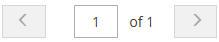

# Visual Merchandiser

{{ee-feature}}

The _Visual Merchandiser_ är en uppsättning avancerade verktyg som gör att du kan positionera produkter och använda villkor som bestämmer vilka produkter som visas i kategorilistan. Resultatet kan vara ett dynamiskt urval produkter som justeras efter ändringar i katalogen. Du kan arbeta i _visuellt läge_, som visar varje produkt som en platta i ett rutnät, eller att arbeta från en lista med produkter i kategorin. Samma verktyg är tillgängliga i varje läge och du kan använda knapparna i det övre högra hörnet för att växla mellan olika typer av visning.

{width="600" zoomable="yes"}

## Öppna Visual Merchandiser

1. På _Administratör_ sidebar, gå till **[!UICONTROL Catalog]** > **[!UICONTROL Categories]**.

1. Gå igenom kategoriträdet och klicka på den kategori som du vill redigera.

1. Rulla ned och expandera  den **[!UICONTROL Products in Category]** -avsnitt.

1. Klicka på _Visa som rutor_ (  ) för att visa produkterna som ett rutnät.

1. När du är klar klickar du på **[!UICONTROL Save Category]**.

## Ändra en produkts position

1. Använd [sorteringsordning](../catalog/navigation-product-listings.md) för att visa den produkt du vill flytta.

   - **Metod 1: Dra och släpp**

     Ta tag i _Dra_ () i det övre högra hörnet av produktrutan och släpp produkten på rätt plats. Antalet produkter justeras för att återspegla den nya positionen.

   - **Metod 2: Ange positionsvärde**

     I _Position_ styrenhet () på produktrutan anger du numret där du vill att produkten ska visas. Retur `0` om du vill placera produkten högst upp i listan.

1. När du är klar klickar du på **[!UICONTROL Save Category]**.

>[!NOTE]
>
>I en ren installation reserverar Adobe Commerce kategori-ID:t `2` för rotkatalogen för standardarkivet. Visual Merchandiser kan bara använda kategorier med ID-nummer `3` eller större.

## Arbetsytekontroller

| Kontroll | Beskrivning |
|--- |--- |
|  | Visa som lista |
|  | Visa som rutor |
|  | Matcha enligt regel - nej |
|  | Matcha enligt regel - ja |
|  | Dra |
|  | Position |
|  | Ta bort från kategori |
|  | Visa per sida |
|  | Gå till nästa/föregående |

{style="table-layout:auto"}
