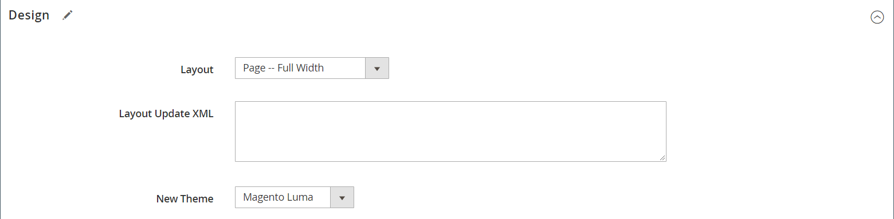
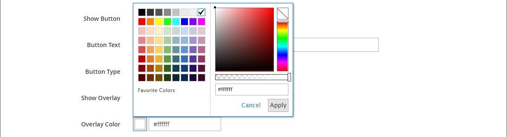
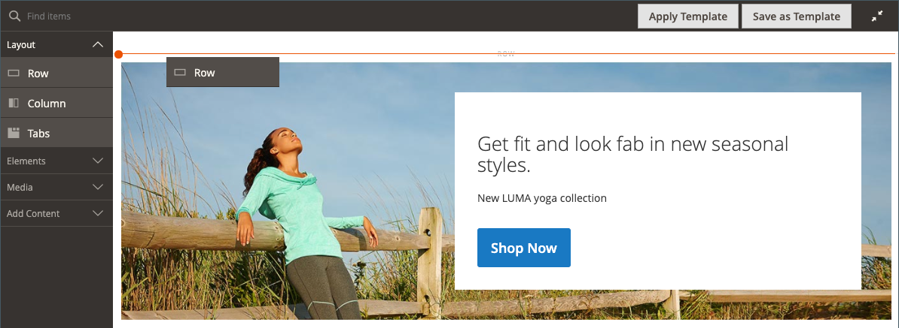
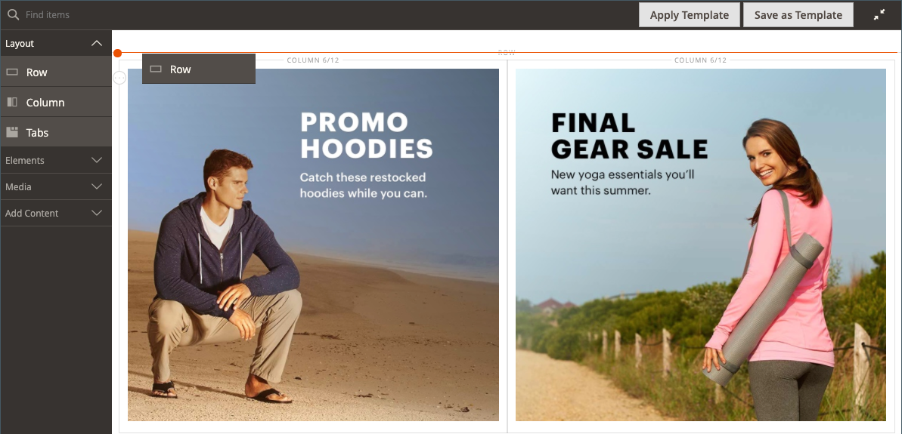
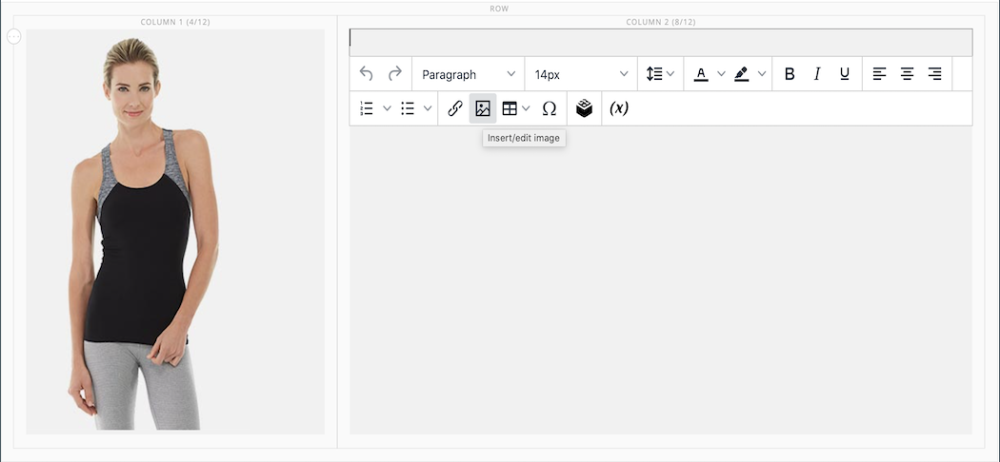
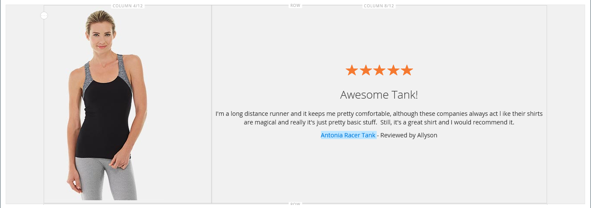

# [!DNL Page Builder] Genomgång del 1: enkel sida

Följ den här tredelade övningen för att bekanta dig med [!DNL Page Builder] genom att skapa en enkel sida som visar hur enkelt det är att skapa innehållsrika sidor i din egen design.

{width="700" zoomable="yes"}

>[!NOTE]
>
>Dessa genomgångar uppdateras för att återspegla de senaste ändringarna av [!DNL Page Builder] i version 2.4.1. Om du använder en tidigare version av Adobe Commerce använder du [!DNL Page Builder] genomgångsövningar som ingår i [[!DNL Commerce] 2.3 Användarhandbok](https://docs.magento.com/user-guide/v2.3/cms/page-builder-learn.html).

## Innan du börjar

Innan du påbörjar den här övningen rekommenderas att du ökar [Löptid för administratörssession](../systems/security-admin.md) för att förhindra att sessionen tajmar ut medan du arbetar.

Verifiera de nödvändiga konfigurationsinställningarna för innehållshantering:

- WYSIWYG-redigeraren är aktiverad i [WYSIWYG-alternativ](../content-design/editor.md#configure-the-editor) konfiguration.

- [!DNL Page Builder] är aktiverat i [Avancerade innehållsverktyg](setup.md) konfiguration.

### Ladda ned genomgången av bildresurser

1. Ladda ned [`simple-page-assets`](./assets/simple-page-assets.zip) och spara filen på din lokala dator.

1. Navigera till den hämtade filen och extrahera de zippade filerna.

   Högerklicka och välj **[!UICONTROL Extract All]** filer. Välj sedan målmappen och klicka på **[!UICONTROL Extract]**.

   I ett Mac-system kan du bara dubbelklicka på zip-filen och flytta de extraherade filerna till målmappen.

   Mappen innehåller följande bildfiler:

   ![[!DNL Page Builder] genomgång av filer - enkelt sidelement](./assets/pb-tutorial-simple-page-assets.png){width="500"}

Följ de tre delarna av genomgången i ordning.

## Del 1: Helutfall av rad med banderoll

I den här delen av Simple Page skapar du en sida med en rad och en banderoll med helt utfall. Raden har olika bakgrundsbilder för datorer och mobila enheter.

![[!DNL Page Builder] hel utfallsrad med banderoll](./assets/pb-tutorial1-full-bleed-with-banner.png){width="700" zoomable="yes"}

### Steg 1: Skapa en sida

1. På _Administratör_ sidebar, gå till **[!UICONTROL Content]** > _[!UICONTROL Elements]_>**[!UICONTROL Pages]**.

1. Klicka på i det övre högra hörnet **[!UICONTROL Add New Page]** och gör följande:

   - Om du vill förhindra att sidan publiceras i din butik anger du **[!UICONTROL Enable Page]** till `No`.

   - För **[!UICONTROL Page Title]**, ange `Simple Page`.

   {width="600" zoomable="yes"}

1. Expandera  den **[!UICONTROL Design]** -avsnitt.

   Observera att **[!UICONTROL Layout]** är inställd på `Page -- Full Width` som standard. Förutom de fem standarderna [layout](../content-design/page-layout.md) alternativ, [!DNL Page Builder] lägger till helbreddslayouter för sidor, kategorier och produkter.

1. Om exempeldata är tillgängliga anger du **[!UICONTROL New Theme]** till `Magento Luma`. Annars kan du välja ett annat tillgängligt tema eller lämna det tomt om du vill använda standardtemat.

   The _[!UICONTROL New Theme]_kan användas för att åsidosätta standardtemat och för att tillämpa ett annat tema på sidan.

   >[!NOTE]
   >
   >Layouten Full Width kan bara användas med en kompatibel [tema](../content-design/themes.md).

   {width="600" zoomable="yes"}

1. Klicka på i det övre högra hörnet **[!UICONTROL Save]**.

   När sidan sparas, namnet _Enkel sida_ visas i det övre vänstra hörnet på sidan.

### Steg 2: Formatera raden

1. Expandera  den **[!UICONTROL Content]** -avsnitt.

   Den här åtgärden visar [!DNL Page Builder] förhandsgranska med en tom rad.

   >[!NOTE]
   >
   >The [Innehållsrubrik](workspace.md) fältet är valfritt. Som standard är den formaterad som rubriknivå 1 (H1) enligt temat. För denna övning ska _Innehållsrubrik_ lämnas tom.

   {width="600" zoomable="yes"}

1. Klicka **[!UICONTROL Edit with Page Builder]** eller inuti förhandsvisningsområdet.

   I den utökade [!DNL Page Builder] [arbetsyta](workspace.md)innehåller panelen till vänster de innehållsverktyg du kan använda för att skapa innehåll på scenen.

1. Håll pekaren över den tomma raden för att visa verktygslådan.

   Varje innehållsbehållare har en verktygslåda med liknande alternativ.

   ![[!DNL Page Builder] rad, verktygslåda](./assets/pb-layout-page-add-content-row-tools.png){width="600" zoomable="yes"}

1. I verktygslådan Rad väljer du _Inställningar_ ({width="20"} -ikon.

1. Under _[!UICONTROL Appearance]_, välja **Fullt utfall**.

   Inställningen för fullständigt utfall utökar den vänstra och högra kanten av innehållsområdet för raden och bakgrunden till hela sidbredden.

   {width="600" zoomable="yes"}

1. Bläddra nedåt till _[!UICONTROL Advanced]_och ange alla **[!UICONTROL Margins and Padding]**inställningar till `0`.

   Med den här inställningen utökas radens hela bredd.

   {width="600" zoomable="yes"}

1. Spara inställningarna och gå tillbaka till [!DNL Page Builder] arbetsyta, bläddra uppåt till sidans överkant och klicka på **[!UICONTROL Save]** längst upp till höger.

### Steg 3: Lägg till en banderoll

>[!NOTE]
>
>[!DNL Page Builder] har en ny innehållstyp som heter _Banderoll_, som visas i det här steget. Vad som tidigare var _Banderoll_ på menyn Innehåll är nu ett _Dynamiskt block_.

1. I [!DNL Page Builder] panel, expandera **[!UICONTROL Media]** och dra en **Banderoll** platshållare till scenen.

   {width="600" zoomable="yes"}
1. Håll pekaren över banderollbehållaren för att visa verktygslådan.

   >[!NOTE]
   >
   >Scenen har nu två innehållsbehållare, var och en med en separat verktygslåda. Eftersom banderollen är kapslad i raden måste du se till att du arbetar i rätt verktygslåda.

   Förutom verktygslådan finns det _Överför bild_ och _Välj från galleri_ -knappar inkluderas så att du snabbt kan ändra banderollen direkt från scenen.

   {width="600" zoomable="yes"}

1. I verktygslådan Banner väljer du _Inställningar_ ( {width="20"} ).

1. Under _[!UICONTROL Appearance]_, välja **[!UICONTROL Collage Right]**.

   Inställningen Collage Right (collage till höger) placerar innehållet på banderollens högra sida.

   {width="600" zoomable="yes"}

1. Bläddra nedåt till _[!UICONTROL Background]_och ange bakgrundsbilden för banderollen:

   - För **[!UICONTROL Background Image]**, klicka **Överför**.

     {width="600" zoomable="yes"}

     Navigera till katalogen där du sparade de extraherade enkla sidelementen och välj `wide-banner-background.jpg` -fil.

     Bilden överförs och en miniatyrbild av den överförda bilden visas. Filnamn, bildstorlek och filstorlek anges nedan.

     {width="600" zoomable="yes"}

   - För **[!UICONTROL Background Mobile Image]**, klicka **Överför**.

     I samma katalog väljer du `wide-banner-background-mobile.jpg` -fil.

     Den mobila bakgrundsbilden används för mobila enheter och även när en webbläsarfönsterstorlek ändras till bredden på en mobil enhet.

     {width="600" zoomable="yes"}

   - Bläddra tillbaka till sidans överkant och klicka **[!UICONTROL Save]** för att spara inställningarna och gå tillbaka till [!DNL Page Builder] arbetsyta.

     Bakgrunden visas på scenen och radens hela bredd utökas.

     {width="600" zoomable="yes"}

   Lägg märke till platshållartexten som visas på radens högra sida. Textens position återspeglar _Sortera åt höger_ inställning för utseende.

1. Klicka på platshållartexten och skriv följande meddelande på två rader:

   `Get fit and look fab in new seasonal styles.`

   `New LUMA yoga collection`

   Redigeringsverktygsfältet visas ovanför textrutan. Du kan skriva och formatera text direkt från scenen eller genom att välja _Inställningar_ i banderollverktygslådan.

   {width="600" zoomable="yes"}

1. Använd formatering på texten:

   - Markera den första textraden. Gå sedan till redigeringsverktygsfältet under **Format**, välja `Heading 2`.

     {width="600" zoomable="yes"}

   - Markera den andra textraden. Gå sedan till redigeringsverktygsfältet under **Format**, välja `Paragraph`.

   Formatinställningarna använder formaten från formatmallen som är kopplad till det aktuella temat.

   {width="600" zoomable="yes"}
__

1. Hovra för att visa banderollverktygslådan väljer du _Inställningar_ ( {width="20"} ) ikonen igen och bläddra sedan till _[!UICONTROL Content]_-avsnitt.

   Observera att texten visas i _Meddelandetext_ box. Text kan anges och redigeras antingen från scenen eller från _[!UICONTROL Content]_i banderollinställningarna.

   {width="600" zoomable="yes"}

1. Fortsätta i _[!UICONTROL Content]_anger du banderolllänken och knappen:

   - Ange **Länk** till `Category`och klicka sedan på **[!UICONTROL Select]** för att visa kategoriträdet.

   - Välj `What's New` som den länkade kategorin.

     {width="600" zoomable="yes"}

   - Ange **[!UICONTROL Show Button]** till `Always`.

   - För **[!UICONTROL Button Text]**, ange `Shop Now` som texten som visas på knappen.

   - För **[!UICONTROL Button Type]**, acceptera `Primary` standard.

     Knappformatet från det aktuella temat avgör knappformatet.

1. Ange banderollövertäckning:

   Du kan använda en övertäckning för att använda en bakgrundsfärg på det aktiva innehållsområdet som definieras av inställningen Utseende. Banderollens bakgrundsbild är fortfarande synlig för banderollens hela bredd.

   - Ange **[!UICONTROL Show Overlay]** till `Always`.

   - För **[!UICONTROL Overlay Color]** gör du något av följande:

      - Klicka på färgrutan och välj den vita färgrutan.
      - Klicka på _Ingen färg_ textruta och ange `White` eller hexadecimalt värde `#ffffff`.

     Klicka sedan på **[!UICONTROL Apply]**.

     {width="600" zoomable="yes"}

   - Bläddra tillbaka till sidans överkant och klicka **[!UICONTROL Save]** för att spara inställningarna och gå tillbaka till [!DNL Page Builder] arbetsyta.

     Knappen visas under banderollmeddelandet på scenen.

     {width="600" zoomable="yes"}

1. Klicka på i det övre högra hörnet av scenen _Stäng helskärm_ ().

   Om du klickar på den här ikonen återgår du till _[!UICONTROL Content]_-avsnitt för sidan där förhandsvisningen visas.

   Du kan växla mellan de två arbetsytelägen när du vill.

1. Klicka i det övre högra hörnet på **[!UICONTROL Save]** pil och välj **[!UICONTROL Save & Close]**.

1. Klicka på knappen [Cachehantering](../systems/cache-management.md) i meddelandet längst upp på sidan och uppdatera eventuell ogiltig cache.

## Del 2: Innehållen rad med två lika kolumner

I den här delen av övningen lägger du till en rad på sidan och delar upp raden i två lika stora kolumner. Sedan lägger du till en länkad bild i varje kolumn. I instruktionerna läggs varje ny rad till före den första raden för att skapa [!DNL Page Builder] panelen justeras efter scenen. I slutet av övningen ordnar du om raderna så att de matchar exemplet med enkel sida.

{width="600" zoomable="yes"}

### Steg 1: Lägg till en rad

1. I rutnätet Sidor finns _Enkel sida_ som du skapade i den första delen av den här övningen och väljer **[!UICONTROL Edit]** i _[!UICONTROL Action]_kolumn.

1. Expandera  den **[!UICONTROL Content]** -avsnitt.

1. Klicka **[!UICONTROL Edit with Page Builder]** eller inuti förhandsvisningsområdet.

1. I [!DNL Page Builder] panel under _[!UICONTROL Layout]_, dra en **[!UICONTROL Row]**platshållare till scenen och placera den ovanför banderollen.

   Den röda stödlinjen markerar gränsen mellan de två raderna.

   {width="600" zoomable="yes"}

1. Håll pekaren över den nya raden för att visa verktygslådan och välj _Inställningar_ ( {width="20"} ).

   {width="600" zoomable="yes"}

1. Under _[!UICONTROL Appearance]_, acceptera **Innehållet**standardinställning.

   Den här inställningen begränsar radens innehållsområde till bredden på sidan enligt temat.

   {width="600" zoomable="yes"}

1. Klicka på i det övre högra hörnet **[!UICONTROL Save]** för att spara inställningarna och gå tillbaka till [!DNL Page Builder] arbetsyta.

### Steg 2: Lägg till en kolumn

1. I [!DNL Page Builder] panel under _[!UICONTROL Layout]_, dra en **[!UICONTROL Column]**platshållare till den nya raden.

   {width="600" zoomable="yes"}

   Raden är nu uppdelad i två kolumner med samma bredd. Varje kolumn är en separat behållare för innehåll med en egen dedikerad verktygslåda med alternativ.

   {width="600" zoomable="yes"}

1. Klicka på cirkeln i det övre vänstra hörnet av den första kolumnen _Stödraster_ kontroll () för att visa stödlinjerna för stödrastret.

   Rutnätet ser till att innehållet justeras på ett enhetligt sätt och att det återges korrekt på både stationära och mobila enheter. Information om hur du konfigurerar stödrasterstorleken finns i [Konfigurera [!DNL Page Builder]](setup.md#configure-page-builder) i [!DNL Page Builder] Installationsämne.

   Siffrorna inom parentes (6/12) i den övre kanten av varje kolumnbehållare anger antalet rutnätsindelningar i varje kolumn och det totala antalet indelningar i raden.

   {width="600" zoomable="yes"}

### Steg 3: Lägg till bilder med länkar

I det här steget får du lära dig hur du överför en bild till banderollen.

1. I [!DNL Page Builder] panel, expandera **[!UICONTROL Media]** och dra ett **[!UICONTROL Image]** platshållare till den första kolumnen.

   {width="600" zoomable="yes"}

1. Infoga exempelbilden i platshållaren.

   {width="600" zoomable="yes"}

   För en bild som finns på datorn kan du välja någon av följande metoder:

   - **Överför bildfilen**: I den första kolumnen klickar du på **[!UICONTROL Upload Image]**. Navigera sedan till katalogen där du sparade de extraherade enkla sidelementen och välj `small-banner-1.jpg` -fil.

     {width="600" zoomable="yes"}

     Upprepa den här åtgärden om du vill lägga till `small-banner-2.jpg` till den andra kolumnen.

   - **Dra bildfilen**: Öppna den enkla sidresursmappen på skrivbordet och placera den bredvid administratörsfönstret där du arbetar med [!DNL Page Builder] stage. Dra sedan filen `small-banner-1.jpg` från den enkla sidresursmappen och släpp den i den första kolumnen.

     {width="600" zoomable="yes"}

     Upprepa den här åtgärden om du vill lägga till `small-banner-2.jpg` till den andra kolumnen.

1. Bestäm vilken sida i katalogen som du vill länka till varje bild.

1. Håll pekaren över bilden i den första kolumnen för att visa verktygslådan och välj _Inställningar_ ( {width="20"} ).

   {width="600" zoomable="yes"}

1. Länka bilden till en kategori:

   - Rulla nedåt och ange **Länk** till `Category`.

   - I kategoriträdet ska du gå nedåt och välja `Men's Hoodies & Sweatshirt` kategori.

   - I det övre högra hörnet **[!UICONTROL Save]** inställningarna och återgå till [!DNL Page Builder] arbetsyta.

1. Upprepa föregående steg om du vill länka bilden i den andra kolumnen till _Kugghjul_ kategori.

1. Klicka på i det övre högra hörnet av scenen _Stäng helskärm_ ().

   Om du klickar på den här ikonen återgår du till _[!UICONTROL Content]_-avsnitt för sidan där förhandsvisningen visas.

1. Klicka i det övre högra hörnet på **[!UICONTROL Save]** pil och välj **[!UICONTROL Save & Close]**.

1. När du uppmanas till det klickar du på [Cachehantering](../systems/cache-management.md) i meddelandet längst upp på sidan och uppdatera eventuell ogiltig cache.

## Del 3: Rad med full bredd och olika kolumner

Den sista raden på den här sidan innehåller innehåll från en produktgranskning. Du lägger till en rad med full bredd och delar den i två kolumner med olika bredd. En bakgrundsbild läggs till i den första kolumnen med en matchande bakgrundsfärg som används på raden för en enhetlig effekt.

{width="500"}

### Steg 1: Lägg till en rad

1. I rutnätet Sidor finns _Enkel sida_ som du skapade i den första delen av den här övningen och väljer **[!UICONTROL Edit]** i _[!UICONTROL Action]_kolumn.

1. Expandera  den **[!UICONTROL Content]** -avsnitt.

1. Klicka **[!UICONTROL Edit with Page Builder]** eller inuti förhandsvisningsområdet.

1. I [!DNL Page Builder] panel under _[!UICONTROL Layout]_, dra en **[!UICONTROL Row]**platshållare till scenen och placera den ovanför raden som skapades i den andra delen av den här övningen.

   En röd stödlinje markerar gränsen mellan de två raderna.

   {width="600" zoomable="yes"}

1. Håll pekaren över den nya raden för att visa verktygslådan och välj _Inställningar_ ({width="20"} ).

   {width="600" zoomable="yes"}

1. På sidan Redigera rad under _[!UICONTROL Appearance]_, välja **[!UICONTROL Full Width]**.

   Den här inställningen begränsar innehållsområdet till den maximala sidbredd som definieras av temat. Bakgrundsfärgen och/eller bilden är inte begränsad och radens hela bredd utökas.

   {width="600" zoomable="yes"}

1. I _[!UICONTROL Background]_sektion, ange `#f1f1f1` som **[!UICONTROL Background Color]**.

   {width="600" zoomable="yes"}

1. Bläddra nedåt till _[!UICONTROL Advanced]_och ange alla **Marginaler och utfyllnad**värden till `0`.

   {width="600" zoomable="yes"}

1. Bläddra tillbaka till sidans överkant och klicka **[!UICONTROL Save]** för att spara inställningarna och gå tillbaka till [!DNL Page Builder] arbetsyta.

   Radens bakgrundsfärg är nu en blek beige.

   {width="600" zoomable="yes"}

### Steg 2: Lägg till kolumner med olika bredd

1. I [!DNL Page Builder] panel under _[!UICONTROL Layout]_, dra en **[!UICONTROL Column]**platshållare till den översta raden på scenen.

   {width="600" zoomable="yes"}

1. Dra den högra kanten på den första kolumnen till den fyra av 12 (`4/12`) i rutnätet.

   Den andra kolumnens storlek justeras till åtta av 12 (`8/12`).

   {width="600" zoomable="yes"}

1. Håll pekaren över den första kolumnbehållaren för att visa verktygslådan och välj _Inställningar_ ( {width="20"} ).

1. Bläddra nedåt till _[!UICONTROL Advanced]_och ange alla **Marginaler och utfyllnad**värden till `0`.

   {width="600" zoomable="yes"}

1. Bläddra tillbaka till sidans överkant och klicka **[!UICONTROL Save]** för att spara inställningarna och gå tillbaka till [!DNL Page Builder] arbetsyta.

### Steg 3: Lägg till en bild i den första kolumnen

1. I [!DNL Page Builder] panel, expandera **[!UICONTROL Media]** och dra **[!UICONTROL Image]** innehållstypen till den första kolumnen.

   {width="600" zoomable="yes"}

1. Klicka på i bildplatshållaren **[!UICONTROL Upload Image]**.

   {width="600" zoomable="yes"}

1. Navigera till katalogen där du sparade de extraherade enkla sidelementen och välj `review-image.jpg` -fil.

   Den överförda bilden visas i den första kolumnen och blandas smidigt med radens bakgrundsfärg.

   {width="600" zoomable="yes"}

### Steg 4: Lägg till granskningsinnehåll i den andra kolumnen

Den andra kolumnen på raden ska innehålla innehåll från en kundrecension, inklusive den femstjärniga graderingsbilden och det formaterade textmeddelandet.

1. I [!DNL Page Builder] panel, expandera **[!UICONTROL Elements]** och dra **[!UICONTROL Text]** innehållstypen till den andra kolumnen.

   {width="600" zoomable="yes"}

1. Klicka i textelementet för att visa redigeringsverktygsfältet.

1. Klicka på knappen _Infoga bild_ () och gör följande:

   {width="600" zoomable="yes"}

   - I _[!UICONTROL Insert/edit image]_klickar du på_ Sök _(  ) bredvid ikonen_[!UICONTROL Source]_ fält.

     {width="600" zoomable="yes"}

   - På _[!UICONTROL Select Images]_sida, klicka **[!UICONTROL Choose Files]**.

   - I mappen där du sparade de enkla sidelementen väljer du `rating.png`.

   - På sidan dubbelklickar du på bildpanelen för att markera den och infogar dess URL i fältet Källa.

     {width="600" zoomable="yes"}

   - För **[!UICONTROL Image Description]**, ange `5-Star Rating` och klicka **[!UICONTROL OK]** för att infoga bilden i kolumnen.

   - Klicka på **Centrera** () för att centrera bilden i kolumnen.

     {width="600" zoomable="yes"}

1. Placera insättningspunkten precis efter den femstjärniga bilden, tryck på Enter för att starta en ny rad och ange följande text:

   `Awesome Tank!`

   `I'm a long distance runner and it keeps me pretty comfortable, although these companies always act like their shirts are magical and really it's just pretty basic stuff. Still it's a great shirt, and I would recommend it.`

   `Antonia Racer Tank – Reviewed by Allyson`

   Texten centreras medan du skriver.

   {width="600" zoomable="yes"}

1. Formatera texten:

   - Klicka var som helst på den första textraden och i redigeringsverktygsfältet under **Format**, välja `Heading 2`.

   - Markera den återstående texten och klicka på redigeringsverktygsfältet under **Format**, välja `Paragraph`.

   Texten formateras enligt den formatmall som är kopplad till temat.

1. Hämta bildens mått så att du kan centrera innehållet lodrätt i kolumnen:

   - Håll pekaren över bilden i den första kolumnen för att visa verktygslådan och välj _Inställningar_ ({width="20"} ).

   - Observera bildens dimensioner under miniatyrbilden.

     {width="600" zoomable="yes"}

   - Klicka på i det övre högra hörnet **Stäng**.

1. Centrera innehållet lodrätt i den andra kolumnen:

   - Håll pekaren över den andra kolumnen för att visa verktygslådan och välj _Inställningar_ ({width="20"} ).

   >[!NOTE]
   >
   >Se till att du väljer kolumnbehållaren i stället för textbehållaren för att visa rätt verktygslåda.

   - För **[!UICONTROL Minimum Height]**, ange `450` som bildens höjd i pixlar i den första kolumnen.

   - Ange **[!UICONTROL Vertical Alignment]** till `Center`.

   {width="600" zoomable="yes"}

1. Bläddra nedåt till _[!UICONTROL Advanced]_och ange alla **[!UICONTROL Margins and Padding]**värden till noll ( `0` ).

   {width="600" zoomable="yes"}

1. Bläddra tillbaka till sidans överkant och klicka i det övre högra hörnet **[!UICONTROL Save]** för att spara inställningarna och gå tillbaka till [!DNL Page Builder] arbetsyta.

   {width="600" zoomable="yes"}

### Steg 5: Infoga en katalogproduktlänk

1. Välj `Antonia Racer Tank` text och klicka på _Infoga länk_ () i redigeringsverktygsfältet.

1. I _Infoga länk_ anger du länken till katalogprodukten:

   - Ange produkten **[!UICONTROL URL]**.

     Du kan ange en relativ eller fullständig URL. Följande relativa länk anges för det här exemplet:

     `../antonia-racer-tank.html`

   - (valfritt) för **Titel** anger du produktnamnet.

     Attributet för titellänken används av vissa webbläsare som verktygstips.

     {width="600" zoomable="yes"}

   - När du är klar klickar du på **[!UICONTROL OK]** för att spara länken.

     Den länkade texten markeras nu i banderollen.

     {width="600" zoomable="yes"}

1. Klicka på i det övre högra hörnet av scenen _Stäng helskärm_ ().

   Om du klickar på den här ikonen återgår du till _[!UICONTROL Content]_-avsnitt för sidan där förhandsvisningen visas.

1. Klicka på i det övre högra hörnet **[!UICONTROL Save]**.

### Steg 6: Ändra radordningen

När alla tre raderna är klara är det sista steget att ordna om raderna så att de matchar originalet _Enkel sida_ exempel. Om du vill matcha originalexemplet måste den första raden flyttas längst ned och den sista raden måste flyttas högst upp.

1. Expandera vid behov  den **[!UICONTROL Content]** -avsnitt.

1. Klicka **[!UICONTROL Edit with Page Builder]** eller inuti förhandsvisningsområdet.

1. Håll pekaren över den första raden på scenen för att visa verktygslådan och välj _Flytta_ ( ).

   {width="600" zoomable="yes"}

1. Håll ned musknappen när du kontrollerar att allt innehåll på raden är markerat och dra raden till en position under den röda stödlinjen längst ned på sidan.

   >[!NOTE]
   >
   >Om du av misstag bara flyttar en del av innehållet - till exempel bilden - flyttar du bara tillbaka innehållet där det hör hemma och försöker igen.

   {width="600" zoomable="yes"}

1. Upprepa den här processen om du vill flytta den första raden till den andra positionen.

   Radordningen på sidan matchar nu exemplet med enkel sida.

1. Klicka på i det övre högra hörnet av scenen _Stäng helskärm_ ().

   Om du klickar på den här ikonen återgår du till _[!UICONTROL Content]_-avsnitt för sidan där förhandsvisningen visas.

1. Klicka i det övre högra hörnet på **[!UICONTROL Save]** pil och välj **[!UICONTROL Save & Close]**.

1. Klicka på knappen [Cachehantering](../systems/cache-management.md) i meddelandet längst upp på sidan och uppdatera eventuell ogiltig cache.

Du har slutfört Simple Page-övningen. Behåll det du skapat så att du kan hänvisa till det senare.

När du är klar fortsätter du till [Del 2: Block](2-blocks.md).
