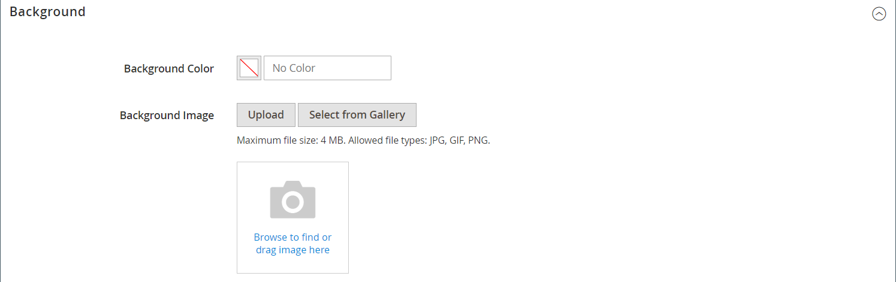
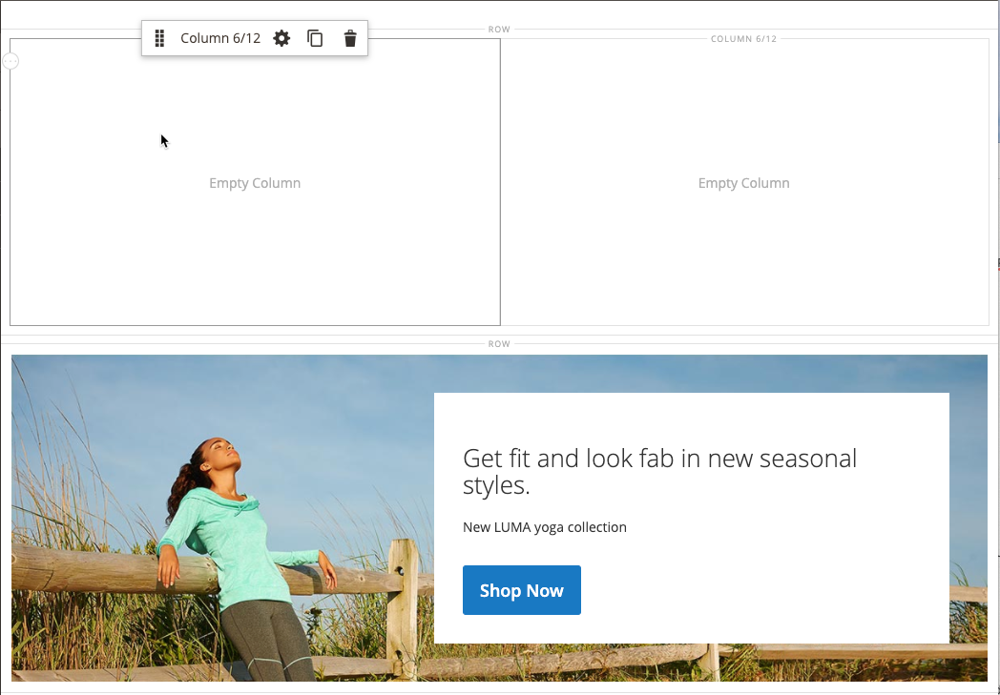
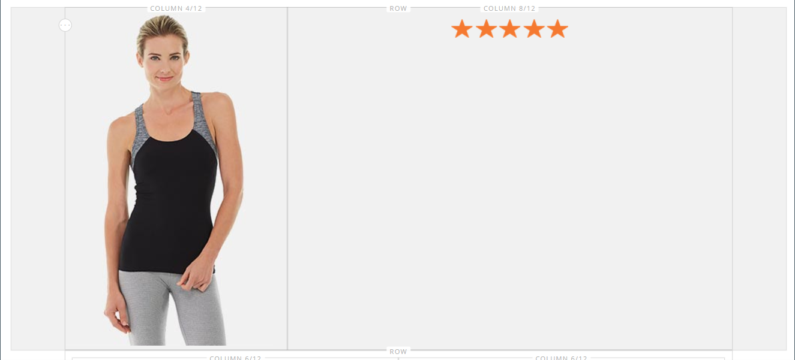

# [!DNL Page Builder] Gå igenom del 1: enkel sida

Följ den här trestegsövningen för att bekanta dig med arbetsytan i [!DNL Page Builder] genom att skapa en enkel sida som visar hur enkelt det är att skapa innehållsrika sidor i din egen design.

{width="700" zoomable="yes"}

>[!NOTE]
>
>Dessa genomgången uppdateras för att återspegla de senaste ändringarna av arbetsytan [!DNL Page Builder] i version 2.4.1.

## Innan du börjar

Innan du startar den här övningen bör du öka [livstiden för administratörssessioner](../systems/security-admin.md) så att inte sessionen kan göra någon timeout medan du arbetar.

Verifiera de nödvändiga konfigurationsinställningarna för innehållshantering:

- WYSIWYG Editor är aktiverat i [WYSIWYG Options](../content-design/editor.md#configure-the-editor) -konfigurationen.

- [!DNL Page Builder] är aktiverat i konfigurationen [Avancerade innehållsverktyg](setup.md).

### Ladda ned genomgången av bildresurser

1. Hämta filen [`simple-page-assets`](./assets/simple-page-assets.zip) och spara filen på din lokala dator.

1. Navigera till den hämtade filen och extrahera de zippade filerna.

   Högerklicka på och välj **[!UICONTROL Extract All]** filer i ett Windows-system. Välj sedan målmappen och klicka på **[!UICONTROL Extract]**.

   I ett Mac-system kan du bara dubbelklicka på zip-filen och flytta de extraherade filerna till målmappen.

   Mappen innehåller följande bildfiler:

   ![[!DNL Page Builder] genomgången av filer - enkla sidelement](./assets/pb-tutorial-simple-page-assets.png){width="500"}

Följ de tre delarna av genomgången i ordning.

## Del 1: Helutfall av rad med banderoll

I den här delen av Simple Page skapar du en sida med en rad och en banderoll med helt utfall. Raden har olika bakgrundsbilder för datorer och mobila enheter.

![[!DNL Page Builder] hel utfallsrad med banner ](./assets/pb-tutorial1-full-bleed-with-banner.png){width="700" zoomable="yes"}

### Steg 1: Skapa en sida

1. Gå till **[!UICONTROL Content]** > _[!UICONTROL Elements]_>**[!UICONTROL Pages]**på sidofältet_ Admin _.

1. Klicka på **[!UICONTROL Add New Page]** i det övre högra hörnet och gör följande:

   - Om du vill förhindra att den här sidan publiceras i din butik anger du **[!UICONTROL Enable Page]** till `No`.

   - Ange `Simple Page` för **[!UICONTROL Page Title]**.

   {width="600" zoomable="yes"}

1. Expandera  i avsnittet **[!UICONTROL Design]**.

   Observera att **[!UICONTROL Layout]** är inställt på `Page -- Full Width` som standard. Utöver de fem standardalternativen för [layout](../content-design/page-layout.md) lägger [!DNL Page Builder] till helbreddslayouter för sidor, kategorier och produkter.

1. Om exempeldata är tillgängliga anger du **[!UICONTROL New Theme]** till `Magento Luma`. Annars kan du välja ett annat tillgängligt tema eller lämna det tomt om du vill använda standardtemat.

   Inställningen _[!UICONTROL New Theme]_kan användas för att åsidosätta standardtemat och tillämpa ett annat tema på sidan.

   >[!NOTE]
   >
   >Layouten för full bredd kan bara användas med ett kompatibelt [tema](../content-design/themes.md).

   {width="600" zoomable="yes"}

1. Klicka på **[!UICONTROL Save]** i det övre högra hörnet.

   När sidan sparas visas namnet _Enkel sida_ i det övre vänstra hörnet på sidan.

### Steg 2: Formatera raden

1. Expandera  i avsnittet **[!UICONTROL Content]**.

   Den här åtgärden visar förhandsvisningen av [!DNL Page Builder] med en tom rad.

   >[!NOTE]
   >
   >Fältet [Innehållsrubrik](workspace.md) är valfritt. Som standard är den formaterad som rubriknivå 1 (H1) enligt temat. _Innehållsrubrik_ är tom för den här övningen.

   {width="600" zoomable="yes"}

1. Klicka på **[!UICONTROL Edit with Page Builder]** eller i förhandsvisningsområdet för innehållet.

   I den utökade [!DNL Page Builder] [arbetsytan](workspace.md) innehåller panelen till vänster de innehållsverktyg som du kan använda för att skapa ditt innehåll på scenen.

1. Håll pekaren över den tomma raden för att visa verktygslådan.

   Varje innehållsbehållare har en verktygslåda med liknande alternativ.

   Verktygslådan för ![[!DNL Page Builder]-raden](./assets/pb-layout-page-add-content-row-tools.png){width="600" zoomable="yes"}

1. Välj ikonen _Inställningar_ ({width="20"}) i verktygslådan Rader.

1. Välj **Fullständigt utfall** under _[!UICONTROL Appearance]_.

   Inställningen för fullständigt utfall utökar den vänstra och högra kanten av innehållsområdet för raden och bakgrunden till hela sidbredden.

   {width="600" zoomable="yes"}

1. Bläddra ned till avsnittet _[!UICONTROL Advanced]_och ange alla **[!UICONTROL Margins and Padding]**-inställningar till `0`.

   Med den här inställningen utökas radens hela bredd.

   {width="600" zoomable="yes"}

1. Om du vill spara inställningarna och återgå till arbetsytan [!DNL Page Builder] rullar du uppåt på sidan och klickar på **[!UICONTROL Save]** i det övre högra hörnet.

### Steg 3: Lägg till en banderoll

>[!NOTE]
>
>[!DNL Page Builder] har en ny innehållstyp som heter _Banner_ och som beskrivs i det här steget. Det som tidigare var alternativet _Banner_ på menyn Innehåll är nu ett _dynamiskt block_.

1. Expandera **[!UICONTROL Media]** på panelen [!DNL Page Builder] och dra en **Banner**-platshållare till scenen.

   {width="600" zoomable="yes"}
1. Håll pekaren över banderollbehållaren för att visa verktygslådan.

   >[!NOTE]
   >
   >Scenen har nu två innehållsbehållare, var och en med en separat verktygslåda. Eftersom banderollen är kapslad i raden måste du se till att du arbetar i rätt verktygslåda.

   Förutom verktygslådan finns knapparna _Överför bild_ och _Välj från galleri_ med så att du snabbt kan ändra banderollen direkt från scenen.

   {width="600" zoomable="yes"}

1. I banderollverktygslådan väljer du ikonen _Inställningar_ ( {width="20"} ).

1. Välj **[!UICONTROL Collage Right]** under _[!UICONTROL Appearance]_.

   Inställningen Collage Right (collage till höger) placerar innehållet på banderollens högra sida.

   {width="600" zoomable="yes"}

1. Bläddra ned till avsnittet _[!UICONTROL Background]_och ange bakgrundsbilden för banderollen:

   - För **[!UICONTROL Background Image]** klickar du på **Överför**.

     {width="600" zoomable="yes"}

     Navigera till katalogen där du sparade de extraherade enkla sidelementen och välj filen `wide-banner-background.jpg`.

     Bilden överförs och en miniatyrbild av den överförda bilden visas. Filnamn, bildstorlek och filstorlek anges nedan.

     {width="600" zoomable="yes"}

   - För **[!UICONTROL Background Mobile Image]** klickar du på **Överför**.

     I samma filkatalog väljer du filen `wide-banner-background-mobile.jpg`.

     Den mobila bakgrundsbilden används för mobila enheter och även när en webbläsarfönsterstorlek ändras till bredden på en mobil enhet.

     {width="600" zoomable="yes"}

   - Bläddra tillbaka till sidans överkant och klicka på **[!UICONTROL Save]** för att spara inställningarna och återgå till arbetsytan i [!DNL Page Builder].

     Bakgrunden visas på scenen och radens hela bredd utökas.

     {width="600" zoomable="yes"}

   Lägg märke till platshållartexten som visas på radens högra sida. Positionen för den här texten återspeglar utseendeinställningen _Höger collage_ .

1. Klicka på platshållartexten och skriv följande meddelande på två rader:

   `Get fit and look fab in new seasonal styles.`

   `New LUMA yoga collection`

   Redigeringsverktygsfältet visas ovanför textrutan. Du kan ange och formatera text antingen direkt från scenen eller genom att välja _Inställningar_ i banderollverktygslådan.

   {width="600" zoomable="yes"}

1. Använd formatering på texten:

   - Markera den första textraden. Gå sedan till redigeringsverktygsfältet under **Format** och välj `Heading 2`.

     {width="600" zoomable="yes"}

   - Markera den andra textraden. Gå sedan till redigeringsverktygsfältet under **Format** och välj `Paragraph`.

   Formatinställningarna använder formaten från formatmallen som är kopplad till det aktuella temat.

   {width="600" zoomable="yes"}
__

1. Hovra för att visa banderollverktygslådan, välj ikonen _Inställningar_ ( {width="20"} ) igen och bläddra sedan till avsnittet _[!UICONTROL Content]_.

   Observera att texten visas i rutan _Meddelandetext_. Text kan anges och redigeras antingen från scenen eller från avsnittet _[!UICONTROL Content]_i banderollinställningarna.

   {width="600" zoomable="yes"}

1. Ange banderolllänken och knappen för att fortsätta i avsnittet _[!UICONTROL Content]_:

   - Ange **Länk** till `Category` och klicka sedan på **[!UICONTROL Select]** för att visa kategoriträdet.

   - Välj `What's New` som den länkade kategorin.

     {width="600" zoomable="yes"}

   - Ange **[!UICONTROL Show Button]** till `Always`.

   - För **[!UICONTROL Button Text]** anger du `Shop Now` som texten som visas på knappen.

   - Acceptera standardvärdet `Primary` för **[!UICONTROL Button Type]**.

     Knappformatet från det aktuella temat avgör knappformatet.

1. Ange banderollövertäckning:

   Du kan använda en övertäckning för att använda en bakgrundsfärg på det aktiva innehållsområdet som definieras av inställningen Utseende. Banderollens bakgrundsbild är fortfarande synlig för banderollens hela bredd.

   - Ange **[!UICONTROL Show Overlay]** till `Always`.

   - Gör något av följande för **[!UICONTROL Overlay Color]**:

      - Klicka på färgrutan och välj den vita färgrutan.
      - Klicka i textrutan _Ingen färg_ och ange `White` eller det hexadecimala värdet `#ffffff`.

     Klicka sedan på **[!UICONTROL Apply]**.

     {width="600" zoomable="yes"}

   - Bläddra tillbaka till sidans överkant och klicka på **[!UICONTROL Save]** för att spara inställningarna och återgå till arbetsytan i [!DNL Page Builder].

     Knappen visas under banderollmeddelandet på scenen.

     {width="600" zoomable="yes"}

1. Klicka på ikonen _Stäng helskärm_ () i scenens övre högra hörn.

   Om du klickar på den här ikonen återgår du till avsnittet _[!UICONTROL Content]_för sidan där förhandsvisningen visas.

   Du kan växla mellan de två arbetsytelägen när du vill.

1. Klicka på pilen **[!UICONTROL Save]** i det övre högra hörnet och välj **[!UICONTROL Save & Close]**.

1. Om du uppmanas till det klickar du på länken [Cachehantering](../systems/cache-management.md) i meddelandet längst upp på sidan och uppdaterar eventuell ogiltig cache.

## Del 2: Innehållen rad med två lika kolumner

I den här delen av övningen lägger du till en rad på sidan och delar upp raden i två lika stora kolumner. Sedan lägger du till en länkad bild i varje kolumn. I instruktionerna läggs varje ny rad till före den första raden så att panelen [!DNL Page Builder] hamnar på scenen. I slutet av övningen ordnar du om raderna så att de matchar exemplet med enkel sida.

{width="600" zoomable="yes"}

### Steg 1: Lägg till en rad

1. Leta reda på den _enkla sidan_ som du skapade i den första delen av den här övningen i sidstödrastret och välj **[!UICONTROL Edit]** i kolumnen _[!UICONTROL Action]_.

1. Expandera  i avsnittet **[!UICONTROL Content]**.

1. Klicka på **[!UICONTROL Edit with Page Builder]** eller i förhandsvisningsområdet för innehållet.

1. Dra en **[!UICONTROL Row]**-platshållare till scenen under [!DNL Page Builder] och placera den ovanför banderollen._[!UICONTROL Layout]_

   Den röda stödlinjen markerar gränsen mellan de två raderna.

   {width="600" zoomable="yes"}

1. Håll pekaren över den nya raden för att visa verktygslådan och välj ikonen _Inställningar_ ( {width="20"} ).

   {width="600" zoomable="yes"}

1. Under _[!UICONTROL Appearance]_godkänner du standardinställningen **Innehållet**.

   Den här inställningen begränsar radens innehållsområde till bredden på sidan enligt temat.

   {width="600" zoomable="yes"}

1. Klicka på **[!UICONTROL Save]** i det övre högra hörnet för att spara inställningarna och återgå till arbetsytan i [!DNL Page Builder].

### Steg 2: Lägg till en kolumn

1. Dra en **[!UICONTROL Column]**-platshållare på panelen [!DNL Page Builder] under _[!UICONTROL Layout]_till den nya raden.

   {width="600" zoomable="yes"}

   Raden är nu uppdelad i två kolumner med samma bredd. Varje kolumn är en separat behållare för innehåll med en egen dedikerad verktygslåda med alternativ.

   {width="600" zoomable="yes"}

1. Klicka på den cirkulära kontrollen _Stödraster_ () i det övre vänstra hörnet i den första kolumnen om du vill visa stödlinjerna för stödrastret.

   Rutnätet ser till att innehållet justeras på ett enhetligt sätt och att det återges korrekt på både stationära och mobila enheter. Information om hur du konfigurerar stödrasterstorleken finns i avsnittet [Konfigurera [!DNL Page Builder]](setup.md#configure-page-builder) i avsnittet [!DNL Page Builder] Konfigurera.

   Siffrorna inom parentes (6/12) i den övre kanten av varje kolumnbehållare anger antalet rutnätsindelningar i varje kolumn och det totala antalet indelningar i raden.

   {width="600" zoomable="yes"}

### Steg 3: Lägg till bilder med länkar

I det här steget får du lära dig hur du överför en bild till banderollen.

1. Expandera avsnittet **[!UICONTROL Media]** på panelen [!DNL Page Builder] och dra en **[!UICONTROL Image]** platshållare till den första kolumnen.

   {width="600" zoomable="yes"}

1. Infoga exempelbilden i platshållaren.

   {width="600" zoomable="yes"}

   För en bild som finns på datorn kan du välja någon av följande metoder:

   - **Överför bildfilen**: Klicka på **[!UICONTROL Upload Image]** i den första kolumnen. Gå sedan till katalogen där du sparade de extraherade enkla sidelementen och välj filen `small-banner-1.jpg`.

     {width="600" zoomable="yes"}

     Upprepa den här åtgärden om du vill lägga till filen `small-banner-2.jpg` i den andra kolumnen.

   - **Dra bildfilen**: På skrivbordet öppnar du den enkla sidresursmappen och placerar den bredvid administratörsfönstret där du arbetar med [!DNL Page Builder] -scenen. Dra sedan filen `small-banner-1.jpg` från den enkla sidresursmappen och släpp den i den första kolumnen.

     {width="600" zoomable="yes"}

     Upprepa den här åtgärden om du vill lägga till filen `small-banner-2.jpg` i den andra kolumnen.

1. Bestäm vilken sida i katalogen som du vill länka till varje bild.

1. Håll pekaren över bilden i den första kolumnen för att visa verktygslådan och välj ikonen _Inställningar_ ( {width="20"} ).

   {width="600" zoomable="yes"}

1. Länka bilden till en kategori:

   - Rulla ned och ange **Länk** till `Category`.

   - Gå till kategoriträdet, gå nedåt och välj kategorin `Men's Hoodies & Sweatshirt`.

   - I det övre högra hörnet **[!UICONTROL Save]** inställningarna och återgår till arbetsytan i [!DNL Page Builder].

1. Upprepa föregående steg om du vill länka bilden i den andra kolumnen till kategorin _Kugghjul_.

1. Klicka på ikonen _Stäng helskärm_ () i scenens övre högra hörn.

   Om du klickar på den här ikonen återgår du till avsnittet _[!UICONTROL Content]_för sidan där förhandsvisningen visas.

1. Klicka på pilen **[!UICONTROL Save]** i det övre högra hörnet och välj **[!UICONTROL Save & Close]**.

1. När du uppmanas till det klickar du på länken [Cachehantering](../systems/cache-management.md) i meddelandet längst upp på sidan och uppdaterar eventuell ogiltig cache.

## Del 3: Rad med full bredd och olika kolumner

Den sista raden på den här sidan innehåller innehåll från en produktgranskning. Du lägger till en rad med full bredd och delar den i två kolumner med olika bredd. En bakgrundsbild läggs till i den första kolumnen med en matchande bakgrundsfärg som används på raden för en enhetlig effekt.

{width="500"}

### Steg 1: Lägg till en rad

1. Leta reda på den _enkla sidan_ som du skapade i den första delen av den här övningen i sidstödrastret och välj **[!UICONTROL Edit]** i kolumnen _[!UICONTROL Action]_.

1. Expandera  i avsnittet **[!UICONTROL Content]**.

1. Klicka på **[!UICONTROL Edit with Page Builder]** eller i förhandsvisningsområdet för innehållet.

1. Dra en **[!UICONTROL Row]**-platshållare till scenen på panelen [!DNL Page Builder] under _[!UICONTROL Layout]_och placera den ovanför raden som skapades i den andra delen av den här övningen.

   En röd stödlinje markerar gränsen mellan de två raderna.

   {width="600" zoomable="yes"}

1. Håll pekaren över den nya raden för att visa verktygslådan och välj ikonen _Inställningar_ ({width="20"} ).

   {width="600" zoomable="yes"}

1. Välj **[!UICONTROL Full Width]** på sidan Redigera rad under _[!UICONTROL Appearance]_.

   Den här inställningen begränsar innehållsområdet till den maximala sidbredd som definieras av temat. Bakgrundsfärgen och/eller bilden är inte begränsad och radens hela bredd utökas.

   {width="600" zoomable="yes"}

1. I avsnittet _[!UICONTROL Background]_anger du `#f1f1f1` som **[!UICONTROL Background Color]**.

   {width="600" zoomable="yes"}

1. Bläddra ned till avsnittet _[!UICONTROL Advanced]_och ange alla **Marginaler och utfyllnad**till `0`.

   {width="600" zoomable="yes"}

1. Bläddra tillbaka till sidans överkant och klicka på **[!UICONTROL Save]** för att spara inställningarna och återgå till arbetsytan i [!DNL Page Builder].

   Radens bakgrundsfärg är nu en blek beige.

   {width="600" zoomable="yes"}

### Steg 2: Lägg till kolumner med olika bredd

1. Dra en **[!UICONTROL Column]**-platshållare till den översta raden på scenen på panelen [!DNL Page Builder] under _[!UICONTROL Layout]_.

   {width="600" zoomable="yes"}

1. Dra den högra kanten på den första kolumnen till den fyra av 12 (`4/12`)-positionen i rutnätet.

   Den andra kolumnens storlek justeras till åtta av 12 (`8/12`).

   {width="600" zoomable="yes"}

1. Håll pekaren över den första kolumnbehållaren för att visa verktygslådan och välj ikonen _Inställningar_ ( {width="20"} ).

1. Bläddra ned till avsnittet _[!UICONTROL Advanced]_och ange alla **Marginaler och utfyllnad**till `0`.

   {width="600" zoomable="yes"}

1. Bläddra tillbaka till sidans överkant och klicka på **[!UICONTROL Save]** för att spara inställningarna och återgå till arbetsytan i [!DNL Page Builder].

### Steg 3: Lägg till en bild i den första kolumnen

1. Expandera **[!UICONTROL Media]** på panelen [!DNL Page Builder] och dra en **[!UICONTROL Image]**-innehållstyp till den första kolumnen.

   {width="600" zoomable="yes"}

1. Klicka på **[!UICONTROL Upload Image]** i bildplatshållaren.

   {width="600" zoomable="yes"}

1. Navigera till katalogen där du sparade de extraherade enkla sidelementen och välj filen `review-image.jpg`.

   Den överförda bilden visas i den första kolumnen och blandas smidigt med radens bakgrundsfärg.

   {width="600" zoomable="yes"}

### Steg 4: Lägg till granskningsinnehåll i den andra kolumnen

Den andra kolumnen på raden ska innehålla innehåll från en kundrecension, inklusive den femstjärniga graderingsbilden och det formaterade textmeddelandet.

1. Expandera avsnittet **[!UICONTROL Elements]** på panelen [!DNL Page Builder] och dra innehållstypen **[!UICONTROL Text]** till den andra kolumnen.

   {width="600" zoomable="yes"}

1. Klicka i textelementet för att visa redigeringsverktygsfältet.

1. Klicka på ikonen _Infoga bild_ () i verktygsfältet och gör följande:

   {width="600" zoomable="yes"}

   - Klicka på ikonen _Sök_ (  ) bredvid fältet _[!UICONTROL Source]_i dialogrutan_[!UICONTROL Insert/edit image]_.

     {width="600" zoomable="yes"}

   - Klicka på **[!UICONTROL Choose Files]** på sidan _[!UICONTROL Select Images]_.

   - Välj `rating.png` i den mapp där du sparade de enkla sidresurserna.

   - På sidan dubbelklickar du på bildpanelen för att markera den och infoga dess URL-adress i fältet Source.

     {width="600" zoomable="yes"}

   - I **[!UICONTROL Image Description]** anger du `5-Star Rating` och klickar på **[!UICONTROL OK]** för att infoga bilden i kolumnen.

   - Klicka på **Centrera** () i redigeringsverktygsfältet om du vill centrera bilden i kolumnen.

     {width="600" zoomable="yes"}

1. Placera insättningspunkten precis efter den femstjärniga bilden, tryck på Enter för att starta en ny rad och ange följande text:

   `Awesome Tank!`

   `I'm a long distance runner and it keeps me pretty comfortable, although these companies always act like their shirts are magical and really it's just pretty basic stuff. Still it's a great shirt, and I would recommend it.`

   `Antonia Racer Tank – Reviewed by Allyson`

   Texten centreras medan du skriver.

   {width="600" zoomable="yes"}

1. Formatera texten:

   - Klicka någonstans på den första textraden och välj `Heading 2` i redigeringsverktygsfältet under **Format**.

   - Markera den återstående texten och välj `Paragraph` i redigeringsverktygsfältet under **Format**.

   Texten formateras enligt den formatmall som är kopplad till temat.

1. Hämta bildens mått så att du kan centrera innehållet lodrätt i kolumnen:

   - Håll pekaren över bilden i den första kolumnen för att visa verktygslådan och välj ikonen _Inställningar_ ({width="20"} ).

   - Observera bildens dimensioner under miniatyrbilden.

     {width="600" zoomable="yes"}

   - Klicka på **Stäng** i det övre högra hörnet.

1. Centrera innehållet lodrätt i den andra kolumnen:

   - Håll markören över den andra kolumnen för att visa verktygslådan och välj ikonen _Inställningar_ ({width="20"} ).

   >[!NOTE]
   >
   >Se till att du väljer kolumnbehållaren i stället för textbehållaren för att visa rätt verktygslåda.

   - I **[!UICONTROL Minimum Height]** anger du `450` som bildens höjd i pixlar i den första kolumnen.

   - Ange **[!UICONTROL Vertical Alignment]** till `Center`.

   {width="600" zoomable="yes"}

1. Rulla ned till avsnittet _[!UICONTROL Advanced]_och ange alla **[!UICONTROL Margins and Padding]**-värden till noll ( `0` ).

   {width="600" zoomable="yes"}

1. Bläddra tillbaka till sidans övre del och klicka på **[!UICONTROL Save]** i det övre högra hörnet för att spara inställningarna och återgå till arbetsytan i [!DNL Page Builder].

   {width="600" zoomable="yes"}

### Steg 5: Infoga en katalogproduktlänk

1. Markera texten `Antonia Racer Tank` och klicka på ikonen _Infoga länk_ () i redigeringsverktygsfältet.

1. I dialogrutan _Infoga länk_ anger du länken till katalogprodukten:

   - Ange produkten **[!UICONTROL URL]**.

     Du kan ange en relativ eller fullständig URL. Följande relativa länk anges för det här exemplet:

     `../antonia-racer-tank.html`

   - (Valfritt) Ange produktnamnet för **Rubrik**.

     Attributet för titellänken används av vissa webbläsare som verktygstips.

     {width="600" zoomable="yes"}

   - När du är klar klickar du på **[!UICONTROL OK]** för att spara länken.

     Den länkade texten markeras nu i banderollen.

     {width="600" zoomable="yes"}

1. Klicka på ikonen _Stäng helskärm_ () i scenens övre högra hörn.

   Om du klickar på den här ikonen återgår du till avsnittet _[!UICONTROL Content]_för sidan där förhandsvisningen visas.

1. Klicka på **[!UICONTROL Save]** i det övre högra hörnet.

### Steg 6: Ändra radordningen

När alla tre raderna är klara är det sista steget att ordna om raderna så att de matchar det ursprungliga _enkla sidexemplet_. Om du vill matcha originalexemplet måste den första raden flyttas längst ned och den sista raden måste flyttas högst upp.

1. Expandera  i avsnittet **[!UICONTROL Content]** om det behövs.

1. Klicka på **[!UICONTROL Edit with Page Builder]** eller i förhandsvisningsområdet för innehållet.

1. Håll markören över den första raden på scenen för att visa verktygslådan och välj ikonen _Flytta_ ( ).

   {width="600" zoomable="yes"}

1. Håll ned musknappen när du kontrollerar att allt innehåll på raden är markerat och dra raden till en position under den röda stödlinjen längst ned på sidan.

   >[!NOTE]
   >
   >Om du av misstag bara flyttar en del av innehållet - till exempel bilden - flyttar du bara tillbaka innehållet där det hör hemma och försöker igen.

   {width="600" zoomable="yes"}

1. Upprepa den här processen om du vill flytta den första raden till den andra positionen.

   Radordningen på sidan matchar nu exemplet med enkel sida.

1. Klicka på ikonen _Stäng helskärm_ () i scenens övre högra hörn.

   Om du klickar på den här ikonen återgår du till avsnittet _[!UICONTROL Content]_för sidan där förhandsvisningen visas.

1. Klicka på pilen **[!UICONTROL Save]** i det övre högra hörnet och välj **[!UICONTROL Save & Close]**.

1. Om du uppmanas till det klickar du på länken [Cachehantering](../systems/cache-management.md) i meddelandet längst upp på sidan och uppdaterar eventuell ogiltig cache.

Du har slutfört Simple Page-övningen. Behåll det du skapat så att du kan hänvisa till det senare.

När du är klar fortsätter du till [del 2: Block](2-blocks.md).
