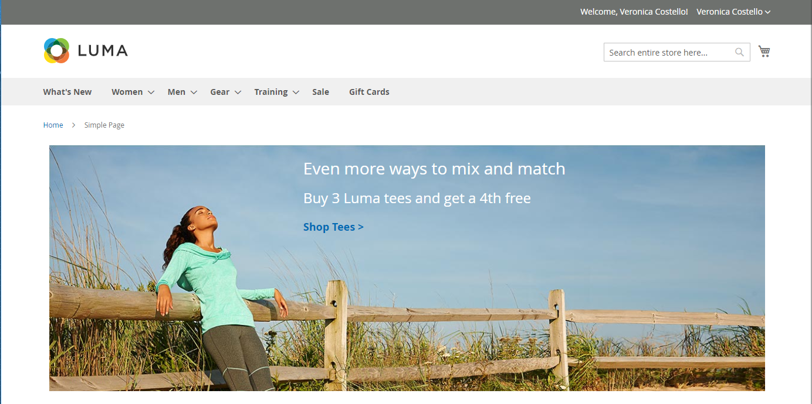
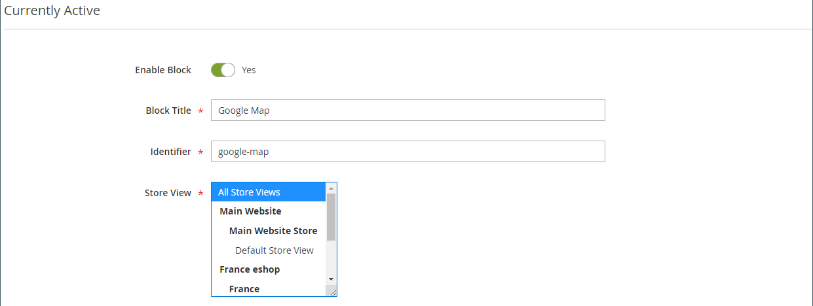
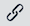

# [!DNL Page Builder] Genomgång del 2: block

I följande övning visas skillnaden mellan [enkla block](../content-design/blocks.md) och [dynamiska block](dynamic-block.md) och hur du använder [!DNL Page Builder] för att skapa varje typ av block.

>[!NOTE]
>
>[!DNL Page Builder] har en ny innehållstyp som kallas _Banner_, som visas i den första genomgången och som inte har med den tidigare bannerfunktionen att göra. Det som tidigare var banderollalternativet på [Innehåll-menyn](../content-design/content-menu.md) är nu _dynamiskt block_.

{width="700" zoomable="yes"}

I den här övningen förutsätts att du har slutfört [Del 1: Enkel sida](1-simple-page.md), inklusive nödvändiga komponenter och [hämtade exempelfiler](./assets/simple-page-assets.zip). Följ stegen i genomgången i ordning.

>[!NOTE]
>
>Dessa genomgången uppdateras för att återspegla de senaste ändringarna av arbetsytan [!DNL Page Builder] i version 2.4.1.

## Del 1: Skapa ett enkelt block

I den här genomgången skapar du ett enkelt block med innehåll från [!DNL Google Maps]. Enkla block kallas ibland _CMS-block_ eller _statiska block_ eftersom innehållet inte ändras. Ett enkelt block är idealiskt för innehåll som du kanske vill återanvända.

### Steg 1: Skapa ett block

1. Gå till **[!UICONTROL Content]** > _[!UICONTROL Elements]_>**[!UICONTROL Blocks]**&#x200B;på sidofältet_ Admin _.

1. Klicka på **[!UICONTROL Add New Block]** i det övre högra hörnet.

1. Ange `Google Map` för **[!UICONTROL Block Title]**.

1. Ange `google-map` för **[!UICONTROL Identifier]**.

1. Välj **[!UICONTROL Store View]** där blocket ska vara tillgängligt.

   {width="600" zoomable="yes"}

1. Klicka på **[!UICONTROL Save]** i det övre högra hörnet.

### Steg 2: Lägg till en [!DNL Google Map]

1. Bläddra ned till förhandsgranskningen av [!DNL Page Builder]-innehållet (för närvarande tom) och klicka på **[!UICONTROL Edit with Page Builder]**.

1. Expandera **[!UICONTROL Media]** på panelen [!DNL Page Builder] och dra en **[!UICONTROL Map]** platshållare till scenen.

   {width="600" zoomable="yes"}

   En karta till din butiksplats visas om [!DNL Google Maps] har konfigurerats för din butik.

   {width="600" zoomable="yes"}

   En platshållarkarta visas om [!DNL Google Maps] inte har konfigurerats för din butik än.

   ![[!DNL Google Maps] platshållare ](./assets/pb-tutorial2-media-map-not-configured.png){width="600" zoomable="yes"}

1. Klicka på ikonen _Stäng helskärm_ () i scenens övre högra hörn.

   Om du klickar på den här ikonen återgår du till avsnittet _[!UICONTROL Content]_&#x200B;för blocket med förhandsvisningen.

1. Klicka på pilen **[!UICONTROL Save]** i det övre högra hörnet och välj **[!UICONTROL Save & Close]**.

### Steg 3: Konfigurera [!DNL Google Maps]

Om [!DNL Google Maps] redan har konfigurerats för din butik kan du hoppa över det här steget och fortsätta till nästa.

1. Gå till [Google Cloud Platform Console](https://console.cloud.google.com/google/maps-apis/overview).

1. Klicka på listrutan för projektet och välj eller skapa det projekt som du vill lägga till en API-nyckel för.

1. Om du vill konfigurera dina API-autentiseringsuppgifter följer du [instruktionerna][1] i [!DNL Google Maps]-dokumentationen.

1. Kopiera API-nyckeln till Urklipp.

1. Gå tillbaka till [!DNL Commerce] Admin och gå till **[!UICONTROL Stores]** > _[!UICONTROL Settings]_>**[!UICONTROL Configuration]**.

1. Välj **[!UICONTROL Content Management]** i den vänstra panelen under _[!UICONTROL General]_.

1. Expandera  **[!UICONTROL Advanced Content Tools]**.

   {width="600" zoomable="yes"}

   Mer information om konfigurationsalternativen för [!UICONTROL Content Management Advanced Tools] finns i [_referenshandboken för konfiguration_](../configuration-reference/general/content-management.md).

1. Klistra in den kopierade nyckeln för **[!UICONTROL Google Maps API Key]**.

1. Klicka på **[!UICONTROL Test Key]**.

   Om det är problem med nyckeln går du tillbaka till [!DNL Google Maps]-plattformen för att lösa problemet. Försök sedan igen.

1. När nyckeln har verifierats klickar du på **[!UICONTROL Save Config]**.

### Steg 4: Lägg till blocket på en sida

1. Gå till **[!UICONTROL Content]** > _[!UICONTROL Elements]_>**[!UICONTROL Pages]**&#x200B;på sidofältet_ Admin _.

1. Leta reda på _[!UICONTROL Simple Page]_&#x200B;som du skapade i den första självstudiekursen i rutnätet och välj **[!UICONTROL Edit]**&#x200B;i kolumnen&#x200B;_[!UICONTROL Action]_.

1. Expandera  i avsnittet **[!UICONTROL Content]** och klicka på **[!UICONTROL Edit with Page Builder]** eller inuti förhandsvisningsområdet för innehållet.

1. Dra en **[!UICONTROL Row]**-platshållare högst upp på scenen på panelen [!DNL Page Builder] under _[!UICONTROL Layout]_.

   {width="600" zoomable="yes"}

1. Expandera **[!UICONTROL Add Content]** på panelen [!DNL Page Builder] och dra en **[!UICONTROL Block]** platshållare till den nya raden.

1. Håll pekaren över den tomma blockbehållaren för att visa verktygslådan och välj ikonen _Inställningar_ ({width="20"} ).

   {width="600" zoomable="yes"}

1. Klicka på **[!UICONTROL Select Block]** på sidan Redigera block.

   {width="600" zoomable="yes"}

1. Ange `map` i sökrutan och tryck på Retur för att hitta det block som du skapade.

   {width="600" zoomable="yes"}

1. Klicka på **[!UICONTROL Select]** i stödrastret för att välja [!DNL Google Maps]-blocket.

1. Klicka på **[!UICONTROL Save]** i det övre högra hörnet för att spara inställningarna och återgå till arbetsytan i [!DNL Page Builder].

1. Klicka på ikonen _Stäng helskärm_ () i scenens övre högra hörn.

   Om du klickar på den här ikonen återgår du till avsnittet _[!UICONTROL Content]_&#x200B;för sidan där förhandsvisningen visas.

1. Klicka på pilen **[!UICONTROL Save]** i det övre högra hörnet och välj **[!UICONTROL Save & Close]**.

**Grattis!** Du har slutfört den första delen av Block-övningen. Se till att du sparar ditt arbete som referens.

## Del 2: Skapa ett dynamiskt block

Ett dynamiskt block innehåller logik som bestämmer var, när och till vem det visas. I den här genomgången skapar du ett dynamiskt block för en kampanj som aktiveras när prisregelvillkoren uppfylls och som bara visas för ett visst kundsegment. Resultatet av det här exemplet liknar den banderoll som skapades i den första övningen, men med logik som styr när den visas i butiken.

{width="600" zoomable="yes"}

### Steg 1: Skapa ett nytt dynamiskt block

1. Gå till **[!UICONTROL Content]** > _[!UICONTROL Elements]_>**[!UICONTROL Dynamic Blocks]**&#x200B;på sidofältet_ Admin _.

   {width="700" zoomable="yes"}

1. Klicka på **[!UICONTROL Add Dynamic Block]** i det övre högra hörnet.

   {width="600" zoomable="yes"}

1. Slutför de grundläggande inställningarna för det nya dynamiska blocket:

   - Ange **[!UICONTROL Enable Dynamic Block]** till `Yes`.

   - Ange `Tee Shirt Promo` för **[!UICONTROL Dynamic Block Name]**.

   - Ange **[!UICONTROL Dynamic Block Type]** till `Content Area` och klicka på **[!UICONTROL Done]**.

     Den dynamiska blocktypen avgör var i [sidlayouten](../content-design/page-layout.md) som blocket placeras. När du konfigurerar ett dynamiskt block för din butik bör du tänka på både sidlayouten och [temat](../content-design/themes.md) så att du kan utnyttja det tillgängliga utrymmet på ett bra sätt. Vissa butiker har ett aktivt innehållsområde som är begränsat till en fast bredd, medan andra utökar skärmens hela bredd.

     {width="600" zoomable="yes"}

   - För **[!UICONTROL Customer Segment]** markerar du kryssrutan för varje segment som du vill tillämpa på det dynamiska blocket och klickar på **Klar** för att spara listan med segment.

     I följande exempel finns det två [kundsegment](../customers/customer-segments.md) som identifierar registrerade kunder per kön. Det här dynamiska blocket visas endast för registrerade kvinnliga kunder som är inloggade på sina konton när de handlar i din butik.

     {width="600" zoomable="yes"}

### Steg 2: Slutför inställningarna

Bläddra ned till avsnittet _[!UICONTROL Content]_, som visar en tom förhandsgranskning av [!DNL Page Builder]-innehåll, och klicka på&#x200B;**[!UICONTROL Edit with Page Builder]**. Utför sedan följande uppgifter:

**Aktivitet 1:** Lägg till en bakgrundsbild

1. Håll pekaren över radbehållaren för att visa verktygslådan och välj ikonen _Inställningar_ ({width="20"} ).

1. Välj **[!UICONTROL Full Bleed]** under _[!UICONTROL Appearance]_.

1. Ange `400px` för **[!UICONTROL Minimum Height]**.

1. Bläddra till avsnittet _[!UICONTROL Background]_&#x200B;och ange **[!UICONTROL Background Image]**&#x200B;genom att klicka på&#x200B;**[!UICONTROL Select from Gallery]**&#x200B;och välja den `wide-banner-background.png`-bild som överfördes i den första självstudiekursen.

1. Klicka på **[!UICONTROL Save]** i det övre högra hörnet för att tillämpa inställningarna och återgå till arbetsytan i [!DNL Page Builder].

   {width="600" zoomable="yes"}

**Aktivitet 2:** Lägg till kolumner

Dra en **[!UICONTROL Column]**-platshållare till raden på panelen [!DNL Page Builder] under _[!UICONTROL Layout]_.

{width="600" zoomable="yes"}

Raden är nu uppdelad i två kolumner med samma bredd.

**Aktivitet 3:** Lägg till text

1. Expandera **[!UICONTROL Elements]** på panelen [!DNL Page Builder] och dra en **Text**-platshållare till den andra kolumnen.

   {width="600" zoomable="yes"}

1. Ange följande tre textrader i redigeraren:

   `Even more ways to mix and match.`

   `Buy 3 Luma tees and get a 4th free.`

   `Shop Tees >`

   {width="600" zoomable="yes"}

1. Markera alla tre textraderna och använd verktygsfältet för att ange **radhöjden** till `40px`.

   {width="600" zoomable="yes"}

1. Ange **[!UICONTROL Font Size]** för varje rad enligt följande:

   | Linje | Teckenstorlek |
   |-----| ---------- |
   | Rad 1: | `28px` |
   | Rad 2: | `24px` |
   | Rad 3: | `18px` |

   Eftersom det här blocket kan placeras var som helst på sidan bör du använda standardstyckeformatet i stället för rubriknivåerna. Du ska inte heller oroa dig för att texten inte radbryts korrekt i kolumnen än.  

   {width="600" zoomable="yes"}

**Aktivitet 4:** Lägg till en länk

I den första övningen lärde du dig att använda innehållstypen [Button](buttons.md) för att skapa en länk. I det här exemplet visas hur du infogar en länk från redigeringsverktygsfältet.

1. Öppna butiken på en annan flik i webbläsaren och navigera till sidan som ska vara länkens måldestination.

   Du kan använda den fullständiga URL:en eller en relativ URL som utelämnar referensen till din lagringsdomän.

   Fullständig URL
: `https://mystore.com/women/tops-women/tees-women.html`

   Relativ URL
: `../women/tops-women/tees-women.html`

1. Gå tillbaka till arbetsytans flik och textredigerare för [!DNL Page Builder], markera texten `Shop Tees >` på den tredje raden och välj **Fet** () i redigeringsverktygsfältet.

1. Med texten `Shop Tees >` på den tredje raden markerad väljer du **Infoga/redigera länk** () i redigerarens verktygsfält.

   {width="600" zoomable="yes"}

1. Ange den relativa länken som du förberedde för **[!UICONTROL URL]**.

1. Ange **[!UICONTROL Target]** till `None`.

   Med den här inställningen öppnas sidan i samma webbläsarfönster, i stället för en ny flik.

1. Ange `Shop Tees` för **[!UICONTROL Title]**.

   Attributet för titellänken används av vissa webbläsare som verktygstips.

1. Klicka på **[!UICONTROL OK]** om du vill spara länken och återgå till arbetsytan [!DNL Page Builder].

   {width="600" zoomable="yes"}

1. Klicka på ikonen _Stäng helskärm_ () i scenens övre högra hörn.

   Om du klickar på den här ikonen återgår du till avsnittet _[!UICONTROL Content]_&#x200B;för det dynamiska blocket med förhandsvisningen.

1. Klicka på **[!UICONTROL Save]** i det övre högra hörnet.

### Steg 3: Lägg till en prisregel

1. Öppna det dynamiska blocket _Shirt Promo_ i redigeringsläget igen.

1. Expandera  i avsnittet **[!UICONTROL Related Promotions]** och klicka på **[!UICONTROL Add Cart Price Rules]**.

   {width="600" zoomable="yes"}

1. På sidan _Lägg till relaterade kundprisregler_ markerar du kryssrutan för _Köp 3-tröjor och få den fjärde kostnadsfria_ prisregeln och klickar på **[!UICONTROL Add Selected]**.

   {width="600" zoomable="yes"}

   Prisregeln visas i avsnittet _Relaterade kampanjer_ under _Relaterad kundprisregel_. Du kan koppla flera prisregler till ett dynamiskt block. I det här enkla exemplet används bara ett exempel.

   {width="600" zoomable="yes"}

1. Klicka på **[!UICONTROL Save]** i det övre högra hörnet.

### Steg 4: Lägg till det dynamiska blocket på en sida

1. Gå till **[!UICONTROL Content]** > _[!UICONTROL Elements]_>**[!UICONTROL Pages]**&#x200B;på sidofältet_ Admin _.

1. Hitta den _enkla sidan_ som du skapade i den [första genomgången](1-simple-page.md) och öppna den i redigeringsläge.

1. Expandera  i avsnittet **[!UICONTROL Content]** och klicka på **[!UICONTROL Edit with Page Builder]**.

1. Hovra över den översta raden med samma bild som det dynamiska blocket för att visa verktygslådan och ikonen _Ta bort_ ( {width="20"} ).

   Bekräfta att raden har tagits bort från sidan genom att klicka på **[!UICONTROL OK]** .

1. Dra en ny **[!UICONTROL Row]**-platshållare högst upp på scenen på panelen [!DNL Page Builder] under _[!UICONTROL Layout]_.

1. Expandera **[!UICONTROL Add Content]** på panelen [!DNL Page Builder] och dra en **[!UICONTROL Dynamic Block]** platshållare till den nya raden.

   {width="600" zoomable="yes"}

1. Håll pekaren över den dynamiska blockbehållaren för att visa verktygslådan och välj ikonen _Inställningar_ ( {width="20"} ).

   {width="600" zoomable="yes"}

1. Klicka på **[!UICONTROL Select Dynamic Block]** på sidan _[!UICONTROL Edit Dynamic Block]_.

   {width="600" zoomable="yes"}

1. Leta reda på det _[!DNL Tee Shirt Promo]_&#x200B;dynamiska blocket som du skapade och klicka på&#x200B;**[!UICONTROL Select]**.

   En sammanfattning av informationen om det dynamiska blocket visas nedan.

   {width="600" zoomable="yes"}

1. Acceptera standardvärdet **[!UICONTROL Template]**, `Dynamic Block Block Template`.

1. När du är klar klickar du på **[!UICONTROL Save]** för att spara inställningarna och återgå till arbetsytan i [!DNL Page Builder].

   {width="600" zoomable="yes"}

1. Klicka på ikonen _Stäng helskärm_ () i scenens övre högra hörn.

   Om du klickar på den här ikonen återgår du till avsnittet _[!UICONTROL Content]_&#x200B;för sidan där förhandsvisningen visas.

1. Klicka på pilen **[!UICONTROL Save]** i det övre högra hörnet och välj **[!UICONTROL Save & Close]**.

Du har avslutat den andra delen av Block-övningen. Se till att du sparar ditt arbete som referens.

## Del 3: Uppdatera det dynamiska blocket

I den sista delen av övningen redigerar du ett dynamiskt block medan sidan finns i din butik. Logga sedan in i butiken som medlem i kundsegmentet för att visa blocket.

{width="600" zoomable="yes"}

### Steg 1: Redigera det dynamiska blocket

1. Gå till **[!UICONTROL Content]** > _[!UICONTROL Elements]_>**[!UICONTROL Dynamic Blocks]**&#x200B;på sidofältet_ Admin _.

1. Hitta det dynamiska _[!DNL Tee Shirt Promo]_-blocket i rutnätet och öppna det i redigeringsläge.

1. Expandera  i avsnittet **[!UICONTROL Content]** och klicka på **[!UICONTROL Edit with Page Builder]**.

1. Ändra kolumnbredden:

   - Hovra över kanten mellan de två kolumnerna.

   - Håll ned musknappen och dra kanten två indelningar åt vänster.

     {width="600" zoomable="yes"}

     Den första kolumnen är nu fyra av 12 (4/12) breda stödrasterindelningar, och den andra kolumnen är åtta av 12 (8/12) breda indelningar.

     {width="600" zoomable="yes"}

1. Ändra textfärgen:

   - Markera de två första textraderna.

   - Välj **[!UICONTROL Text Color]** i redigeringsverktygsfältet och klicka på färgrutan **[!UICONTROL White]**.

   {width="600" zoomable="yes"}

1. Klicka på ikonen _Stäng helskärm_ () i scenens övre högra hörn.

   Om du klickar på den här ikonen återgår du till avsnittet _[!UICONTROL Content]_&#x200B;för det dynamiska blocket med förhandsvisningen.

1. Klicka på **[!UICONTROL Save]** i det övre högra hörnet.

### Steg 2: Visa det dynamiska blocket

Eftersom det här dynamiska blocket bara är synligt för medlemmar i ett visst kundsegment måste du logga in som kund som är medlem i kundsegmentet för att se kampanjen. I det här exemplet visas blocket endast för kvinnliga kunder.

1. Öppna ett webbläsarfönster i butiken.

1. Om du vill visa exempelsidan ändrar du URL-adressen i adressfältet enligt följande:

   mystore.com/sample-page

   Om din butik är konfigurerad att innehålla HTML-suffixet inkluderar du suffixet enligt följande:

   mystore.com/sample-page.html

1. Logga in som en kvinnlig kund:

   - Klicka på **[!UICONTROL Sign In]** i det övre högra hörnet på startsidan.

   - Om exempeldata för luma är installerade på datorn använder du följande autentiseringsuppgifter:

     **[!UICONTROL Email]** - `roni_cost@example.com`

     **[!UICONTROL Password]** - `roni_cost3@example.com`

   - Klicka på **[!UICONTROL Sign In]**.

   - Gå tillbaka till exempelsidan för att se det dynamiska block som du skapade med Tee Shirt Promo.

   {width="700" zoomable="yes"}

Du har avslutat Block-övningen. Se till att du sparar ditt arbete som referens.

När du är klar fortsätter du till [del 3: Kataloginnehåll](3-catalog-content.md)

[1]: https://developers.google.com/maps/documentation/javascript/get-api-key
