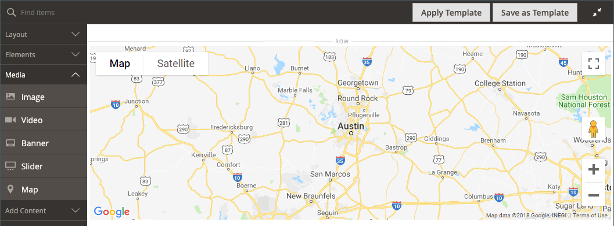
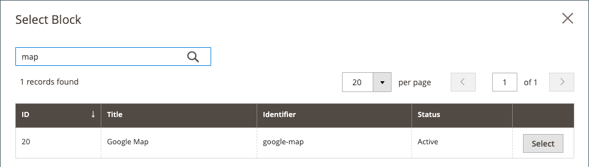

# [!DNL Page Builder] Genomgång del 2: block

I följande exempel visas skillnaden mellan [enkla block](../content-design/blocks.md) och [dynamiska block](dynamic-block.md)och hur du använder [!DNL Page Builder] för att skapa varje typ av block.

>[!NOTE]
>
>[!DNL Page Builder] har en ny innehållstyp som heter _Banderoll_, som visas i den första genomgången och inte har något samband med den tidigare bannerfunktionen. Vad var det tidigare alternativet Banner i [Menyn Innehåll](../content-design/content-menu.md), är nu _Dynamiskt block_.

{width="700" zoomable="yes"}

Den här övningen förutsätter att du har slutfört [Del 1: Enkel sida](1-simple-page.md), inklusive kraven och [hämtade exempelfiler](./assets/simple-page-assets.zip). Följ stegen i genomgången i ordning.

>[!NOTE]
>
>Dessa genomgångar uppdateras för att återspegla de senaste ändringarna av [!DNL Page Builder] i version 2.4.1. Om du använder en tidigare version av Adobe Commerce använder du [!DNL Page Builder] övningar som ingår i [[!DNL Commerce] 2.3 Användarhandbok](https://docs.magento.com/user-guide/v2.3/cms/page-builder-learn.html).

## Del 1: Skapa ett enkelt block

I den här genomgången skapar du ett enkelt block med innehåll från [!DNL Google Maps]. Ibland kallas enkla block _CMS-block_ eller _statiska block_, eftersom innehållet inte ändras. Ett enkelt block är idealiskt för innehåll som du kanske vill återanvända.

### Steg 1: Skapa ett block

1. På _Administratör_ sidebar, gå till **[!UICONTROL Content]** > _[!UICONTROL Elements]_>**[!UICONTROL Blocks]**.

1. Klicka på i det övre högra hörnet **[!UICONTROL Add New Block]**.

1. För **[!UICONTROL Block Title]**, ange `Google Map`.

1. För **[!UICONTROL Identifier]**, ange `google-map`.

1. Välj **[!UICONTROL Store View]** där blocket ska vara tillgängligt.

   {width="600" zoomable="yes"}

1. Klicka på i det övre högra hörnet **[!UICONTROL Save]**.

### Steg 2: Lägg till en [!DNL Google Map]

1. Bläddra nedåt till [!DNL Page Builder] förhandsgranska innehåll (för närvarande tom) och klicka på **[!UICONTROL Edit with Page Builder]**.

1. I [!DNL Page Builder] panel, expandera **[!UICONTROL Media]** och dra en **[!UICONTROL Map]** platshållare till scenen.

   {width="600" zoomable="yes"}

   En karta till din butiksplats visas om [!DNL Google Maps] har konfigurerats för din butik.

   {width="600" zoomable="yes"}

   En platshållarkarta visas om [!DNL Google Maps] ännu inte har konfigurerats för din butik.

   ![[!DNL Google Maps] platshållare](./assets/pb-tutorial2-media-map-not-configured.png){width="600" zoomable="yes"}

1. Klicka på i det övre högra hörnet av scenen _Stäng helskärm_ ().

   Om du klickar på den här ikonen återgår du till _[!UICONTROL Content]_-avsnittet för blocket med förhandsgranskningen visad.

1. Klicka i det övre högra hörnet på **[!UICONTROL Save]** pil och välj **[!UICONTROL Save & Close]**.

### Steg 3: Konfigurera [!DNL Google Maps]

If [!DNL Google Maps] är redan konfigurerat för din butik, du kan hoppa över det här steget och fortsätta till nästa.

1. Gå till [Google Cloud Platform Console](https://console.cloud.google.com/google/maps-apis/overview).

1. Klicka på listrutan för projektet och välj eller skapa det projekt som du vill lägga till en API-nyckel för.

1. Om du vill konfigurera dina API-autentiseringsuppgifter följer du [instruktioner][1] i [!DNL Google Maps] dokumentation.

1. Kopiera API-nyckeln till Urklipp.

1. Återgå till [!DNL Commerce] Administratör och gå till **[!UICONTROL Stores]** > _[!UICONTROL Settings]_>**[!UICONTROL Configuration]**.

1. I den vänstra panelen under _[!UICONTROL General]_, välja **[!UICONTROL Content Management]**.

1. Expandera  **[!UICONTROL Advanced Content Tools]**.

   {width="600" zoomable="yes"}

   Mer information om [!UICONTROL Content Management Advanced Tools] konfigurationsalternativ, se [_Referenshandbok för konfiguration_](../configuration-reference/general/content-management.md).

1. För **[!UICONTROL Google Maps API Key]**, klistrar du in nyckeln som du kopierade.

1. Klicka på **[!UICONTROL Test Key]**.

   Om det är något problem med nyckeln går du tillbaka till [!DNL Google Maps] Plattformswebbplats som löser problemet. Försök sedan igen.

1. När nyckeln har verifierats klickar du på **[!UICONTROL Save Config]**.

### Steg 4: Lägg till blocket på en sida

1. På _Administratör_ sidebar, gå till **[!UICONTROL Content]** > _[!UICONTROL Elements]_>**[!UICONTROL Pages]**.

1. I rutnätet hittar du _[!UICONTROL Simple Page]_som du skapade i den första självstudiekursen och väljer **[!UICONTROL Edit]**i_[!UICONTROL Action]_ kolumn.

1. Expandera  den **[!UICONTROL Content]** och klicka **[!UICONTROL Edit with Page Builder]** eller inuti förhandsvisningsområdet.

1. I [!DNL Page Builder] panel under _[!UICONTROL Layout]_, dra en **[!UICONTROL Row]**platshållare längst upp på scenen.

   {width="600" zoomable="yes"}

1. I [!DNL Page Builder] panel, expandera **[!UICONTROL Add Content]** och dra en **[!UICONTROL Block]** platshållare till den nya raden.

1. Håll pekaren över den tomma blockbehållaren för att visa verktygslådan och välj _Inställningar_ ({width="20"} ).

   {width="600" zoomable="yes"}

1. På sidan Redigera block klickar du på **[!UICONTROL Select Block]**.

   {width="600" zoomable="yes"}

1. Ange i sökrutan `map` och tryck på Retur för att hitta det block som du skapade.

   {width="600" zoomable="yes"}

1. Klicka på i rutnätet **[!UICONTROL Select]** för att välja [!DNL Google Maps] -block.

1. Klicka på i det övre högra hörnet **[!UICONTROL Save]** för att spara inställningarna och gå tillbaka till [!DNL Page Builder] arbetsyta.

1. Klicka på i det övre högra hörnet av scenen _Stäng helskärm_ ().

   Om du klickar på den här ikonen återgår du till _[!UICONTROL Content]_-avsnitt för sidan där förhandsvisningen visas.

1. Klicka i det övre högra hörnet på **[!UICONTROL Save]** pil och välj **[!UICONTROL Save & Close]**.

**Grattis!** Du har avslutat den första delen av Block-övningen. Se till att du sparar ditt arbete som referens.

## Del 2: Skapa ett dynamiskt block

Ett dynamiskt block innehåller logik som bestämmer var, när och till vem det visas. I den här genomgången skapar du ett dynamiskt block för en kampanj som aktiveras när prisregelvillkoren uppfylls och som bara visas för ett visst kundsegment. Resultatet av det här exemplet liknar den banderoll som skapades i den första övningen, men med logik som styr när den visas i butiken.

{width="600" zoomable="yes"}

### Steg 1: Skapa ett nytt dynamiskt block

1. På _Administratör_ sidebar, gå till **[!UICONTROL Content]** > _[!UICONTROL Elements]_>**[!UICONTROL Dynamic Blocks]**.

   {width="700" zoomable="yes"}

1. Klicka på i det övre högra hörnet **[!UICONTROL Add Dynamic Block]**.

   {width="600" zoomable="yes"}

1. Slutför de grundläggande inställningarna för det nya dynamiska blocket:

   - Ange **[!UICONTROL Enable Dynamic Block]** till `Yes`.

   - För **[!UICONTROL Dynamic Block Name]**, ange `Tee Shirt Promo`.

   - Ange **[!UICONTROL Dynamic Block Type]** till `Content Area` och klicka **[!UICONTROL Done]**.

     Den dynamiska blocktypen avgör var i [sidlayout](../content-design/page-layout.md) att blocket placeras. När du skapar ett dynamiskt block för din butik bör du tänka på både sidlayouten och [tema](../content-design/themes.md)så att du kan använda det tillgängliga utrymmet på ett bra sätt. Vissa butiker har ett aktivt innehållsområde som är begränsat till en fast bredd, medan andra utökar skärmens hela bredd.

     {width="600" zoomable="yes"}

   - För **[!UICONTROL Customer Segment]** markerar du kryssrutan för varje segment som du vill tillämpa på det dynamiska blocket och klickar på **Klar** om du vill spara listan med segment.

     I följande exempel finns två [kundsegment](../customers/customer-segments.md) som identifierar registrerade kunder per kön. Det här dynamiska blocket visas endast för registrerade kvinnliga kunder som är inloggade på sina konton när de handlar i din butik.

     {width="600" zoomable="yes"}

### Steg 2: Slutför inställningarna

Bläddra nedåt till _[!UICONTROL Content]_-sektion, som visar en tom [!DNL Page Builder] förhandsgranska och klicka **[!UICONTROL Edit with Page Builder]**. Utför sedan följande uppgifter:

**Aktivitet 1:** Lägga till en bakgrundsbild

1. Håll pekaren över radbehållaren för att visa verktygslådan och välj _Inställningar_ ({width="20"} ).

1. Under _[!UICONTROL Appearance]_, välja **[!UICONTROL Full Bleed]**.

1. För **[!UICONTROL Minimum Height]**, ange `400px`.

1. Bläddra till _[!UICONTROL Background]_-avsnittet och ange **[!UICONTROL Background Image]**genom att klicka **[!UICONTROL Select from Gallery]**och välja `wide-banner-background.png` bilden överfördes i den första självstudiekursen.

1. Klicka på i det övre högra hörnet **[!UICONTROL Save]** för att använda inställningarna och gå tillbaka till [!DNL Page Builder] arbetsyta.

   {width="600" zoomable="yes"}

**Aktivitet 2:** Lägg till kolumner

I [!DNL Page Builder] panel under _[!UICONTROL Layout]_, dra en **[!UICONTROL Column]**platshållare på raden.

{width="600" zoomable="yes"}

Raden är nu uppdelad i två kolumner med samma bredd.

**Aktivitet 3:** Lägg till text

1. I [!DNL Page Builder] panel, expandera **[!UICONTROL Elements]** och dra en **Text** platshållare till den andra kolumnen.

   {width="600" zoomable="yes"}

1. Ange följande tre textrader i redigeraren:

   `Even more ways to mix and match.`

   `Buy 3 Luma tees and get a 4th free.`

   `Shop Tees >`

   {width="600" zoomable="yes"}

1. Markera alla tre textraderna och använd verktygsfältet för att ange **Radhöjd** till `40px`.

   {width="600" zoomable="yes"}

1. Ange **[!UICONTROL Font Size]** för varje rad enligt följande:

   | Linje | Teckenstorlek |
   |-----| ---------- |
   | Rad 1: | `28px` |
   | Rad 2: | `24px` |
   | Rad 3: | `18px` |

   Eftersom det här blocket kan placeras var som helst på sidan bör du använda standardstyckeformatet i stället för rubriknivåerna. Du ska inte heller oroa dig för att texten inte radbryts korrekt i kolumnen än.  

   {width="600" zoomable="yes"}

**Aktivitet 4:** Lägg till en länk

I den första övningen lärde du dig att använda [Knapp](buttons.md) innehållstyp för att skapa en länk. I det här exemplet visas hur du infogar en länk från redigeringsverktygsfältet.

1. Öppna butiken på en annan flik i webbläsaren och navigera till sidan som ska vara länkens måldestination.

   Du kan använda den fullständiga URL:en eller en relativ URL som utelämnar referensen till din lagringsdomän.

   Fullständig URL: `https://mystore.com/women/tops-women/tees-women.html`

   Relativ URL: `../women/tops-women/tees-women.html`

1. Återgå till [!DNL Page Builder] arbetsytans flik och textredigerare, välj `Shop Tees >` text på den tredje raden, och välj **Fet** () i redigeringsverktygsfältet.

1. Med `Shop Tees >` text på den tredje raden fortfarande markerad, välj **Infoga/redigera länk** () i redigeringsverktygsfältet.

   {width="600" zoomable="yes"}

1. För **[!UICONTROL URL]** anger du den relativa länken som du har förberett.

1. Ange **[!UICONTROL Target]** till `None`.

   Med den här inställningen öppnas sidan i samma webbläsarfönster, i stället för en ny flik.

1. För **[!UICONTROL Title]**, ange `Shop Tees`.

   Attributet för titellänken används av vissa webbläsare som verktygstips.

1. Spara länken och gå tillbaka till [!DNL Page Builder] arbetsyta, klicka **[!UICONTROL OK]**.

   {width="600" zoomable="yes"}

1. Klicka på i det övre högra hörnet av scenen _Stäng helskärm_ ().

   Om du klickar på den här ikonen återgår du till _[!UICONTROL Content]_för det dynamiska blocket med förhandsvisning.

1. Klicka på i det övre högra hörnet **[!UICONTROL Save]**.

### Steg 3: Lägg till en prisregel

1. Öppna _Tee Shirt Promo_ dynamiskt block i redigeringsläge igen.

1. Expandera  den **[!UICONTROL Related Promotions]** och klicka **[!UICONTROL Add Cart Price Rules]**.

   {width="600" zoomable="yes"}

1. På _Lägg till relaterade kundprisregler_ markerar du kryssrutan för _Köp 3 T-tröjor och få den fjärde kostnadsfria_ prisregel och klicka på **[!UICONTROL Add Selected]**.

   {width="600" zoomable="yes"}

   Prisregeln visas i dialogrutan _Relaterade kampanjer_ avsnitt, under _Prisregel för relaterad kundvagn_. Du kan koppla flera prisregler till ett dynamiskt block. I det här enkla exemplet används bara ett exempel.

   {width="600" zoomable="yes"}

1. Klicka på i det övre högra hörnet **[!UICONTROL Save]**.

### Steg 4: Lägg till det dynamiska blocket på en sida

1. I _Administratör_ sidebar, gå till **[!UICONTROL Content]** > _[!UICONTROL Elements]_>**[!UICONTROL Pages]**

1. Hitta _Enkel sida_ som du skapade i [första genomgången](1-simple-page.md) och öppna den i redigeringsläge.

1. Expandera  den **[!UICONTROL Content]** och klicka **[!UICONTROL Edit with Page Builder]**.

1. Hovra över den översta raden med samma bild som det dynamiska blocket för att visa verktygslådan och _Ta bort_ ( {width="20"} ).

   Bekräfta att raden har tagits bort från sidan genom att klicka på  **[!UICONTROL OK]** .

1. I [!DNL Page Builder] panel under _[!UICONTROL Layout]_, dra en ny **[!UICONTROL Row]**platshållare längst upp på scenen.

1. I [!DNL Page Builder] panel, expandera **[!UICONTROL Add Content]** och dra en **[!UICONTROL Dynamic Block]** platshållare till den nya raden.

   {width="600" zoomable="yes"}

1. Håll pekaren över den dynamiska blockbehållaren för att visa verktygslådan och välj _Inställningar_ ( {width="20"} ).

   {width="600" zoomable="yes"}

1. På _[!UICONTROL Edit Dynamic Block]_sida, klicka **[!UICONTROL Select Dynamic Block]**.

   {width="600" zoomable="yes"}

1. Hitta _[!DNL Tee Shirt Promo]_dynamiskt block som du skapade och klickar på&#x200B;**[!UICONTROL Select]**.

   En sammanfattning av informationen om det dynamiska blocket visas nedan.

   {width="600" zoomable="yes"}

1. Acceptera standardinställningen **[!UICONTROL Template]**, `Dynamic Block Block Template`.

1. När du är klar klickar du på **[!UICONTROL Save]** för att spara inställningarna och gå tillbaka till [!DNL Page Builder] arbetsyta.

   {width="600" zoomable="yes"}

1. Klicka på i det övre högra hörnet av scenen _Stäng helskärm_ ().

   Om du klickar på den här ikonen återgår du till _[!UICONTROL Content]_-avsnitt för sidan där förhandsvisningen visas.

1. Klicka i det övre högra hörnet på **[!UICONTROL Save]** pil och välj **[!UICONTROL Save & Close]**.

Du har avslutat den andra delen av Block-övningen. Se till att du sparar ditt arbete som referens.

## Del 3: Uppdatera det dynamiska blocket

I den sista delen av övningen redigerar du ett dynamiskt block medan sidan finns i din butik. Logga sedan in i butiken som medlem i kundsegmentet för att visa blocket.

{width="600" zoomable="yes"}

### Steg 1: Redigera det dynamiska blocket

1. I _Administratör_ sidebar, gå till **[!UICONTROL Content]** > _[!UICONTROL Elements]_>**[!UICONTROL Dynamic Blocks]**.

1. Hitta _[!DNL Tee Shirt Promo]_dynamiskt block i rutnätet och öppna det i redigeringsläge.

1. Expandera  den **[!UICONTROL Content]** och klicka **[!UICONTROL Edit with Page Builder]**.

1. Ändra kolumnbredden:

   - Hovra över kanten mellan de två kolumnerna.

   - Håll ned musknappen och dra kanten två indelningar åt vänster.

     {width="600" zoomable="yes"}

     Den första kolumnen är nu fyra av 12 (4/12) breda stödrasterindelningar, och den andra kolumnen är åtta av 12 (8/12) breda indelningar.

     {width="600" zoomable="yes"}

1. Ändra textfärgen:

   - Markera de två första textraderna.

   - Välj **[!UICONTROL Text Color]** och klicka på **[!UICONTROL White]** färgruta.

   {width="600" zoomable="yes"}

1. Klicka på i det övre högra hörnet av scenen _Stäng helskärm_ ().

   Om du klickar på den här ikonen återgår du till _[!UICONTROL Content]_för det dynamiska blocket med förhandsvisning.

1. Klicka på i det övre högra hörnet **[!UICONTROL Save]**.

### Steg 2: Visa det dynamiska blocket

Eftersom det här dynamiska blocket bara är synligt för medlemmar i ett visst kundsegment måste du logga in som kund som är medlem i kundsegmentet för att se kampanjen. I det här exemplet visas blocket endast för kvinnliga kunder.

1. Öppna ett webbläsarfönster i butiken.

1. Om du vill visa exempelsidan ändrar du URL-adressen i adressfältet enligt följande:

   mystore.com/sample-page

   Om din butik är konfigurerad att innehålla HTML-suffixet inkluderar du suffixet enligt följande:

   mystore.com/sample-page.html

1. Logga in som en kvinnlig kund:

   - Klicka på i det övre högra hörnet på startsidan **[!UICONTROL Sign In]**.

   - Om exempeldata för luma är installerade på datorn använder du följande autentiseringsuppgifter:

     **[!UICONTROL Email]** - `roni_cost@example.com`

     **[!UICONTROL Password]** -  `roni_cost3@example.com`

   - Klicka på **[!UICONTROL Sign In]**.

   - Gå tillbaka till exempelsidan för att se det dynamiska block som du skapade med Tee Shirt Promo.

   {width="700" zoomable="yes"}

Du har avslutat Block-övningen. Se till att du sparar ditt arbete som referens.

När du är klar fortsätter du till [Del 3: Kataloginnehåll](3-catalog-content.md)

[1]: https://developers.google.com/maps/documentation/javascript/get-api-key
