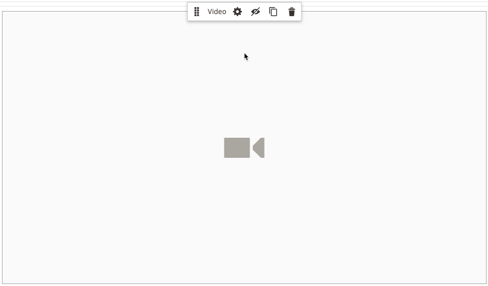
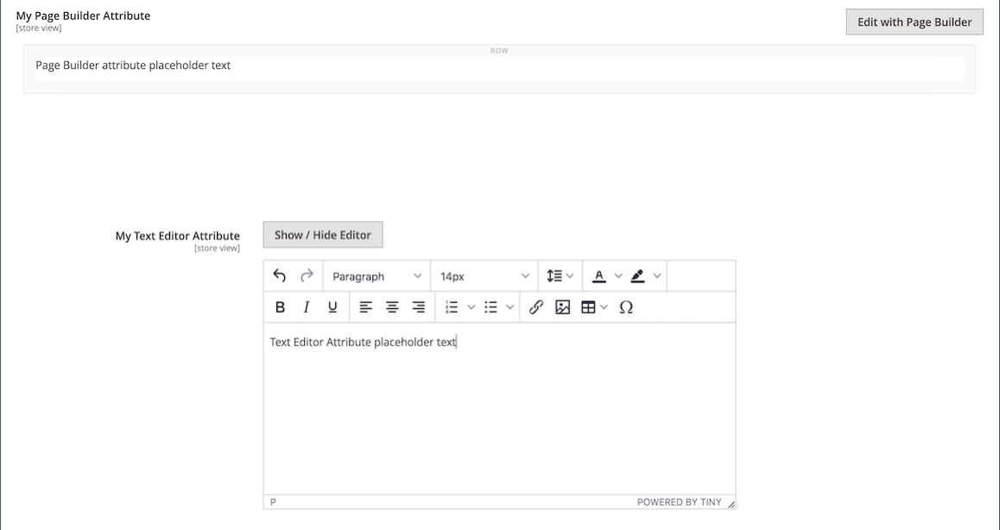

# [!DNL Page Builder] Gå igenom del 3: kataloginnehåll

Den här övningen visar hur enkelt det är att lägga till en produktlista på en sida, anpassa produktsidor och skapa ett anpassat attribut som lägger till arbetsytan [!DNL Page Builder] i en produktattributuppsättning.

{width="600" zoomable="yes"}

I den här övningen förutsätts att du har slutfört [Del 1: Enkel sida](1-simple-page.md) och [Del 2: Block](2-blocks.md), inklusive nödvändiga komponenter och hämtade exempelfiler. Följ de tre delarna av övningen i ordning.

## Del 1: Lägg till en produktlista

[!DNL Page Builder] gör det enkelt att lägga till en produktlista på scenen. I det här exemplet läggs produktlistan till direkt på en sida.

### Steg 1: Lägg till en produktlista på scenen

1. Gå till **[!UICONTROL Content]** > _[!UICONTROL Elements]_>**[!UICONTROL Pages]**&#x200B;på sidofältet_ Admin _.

1. Hitta den _enkla sidan_ som du skapade i den första övningen och ändrade i den andra och välj **[!UICONTROL Edit]** i kolumnen _[!UICONTROL Action]_.

1. Expandera  i avsnittet **[!UICONTROL Content]** och klicka på **[!UICONTROL Edit with Page Builder]** eller inuti förhandsvisningsområdet för innehållet.

1. Dra en **[!UICONTROL Row]** till scenens övre del på panelen [!DNL Page Builder] under _[!UICONTROL Layout]_.

1. Expandera **[!UICONTROL Add Content]** på panelen [!DNL Page Builder] och dra en **[!UICONTROL Products]** platshållare till den nya raden.

   {width="600" zoomable="yes"}

### Steg 2: Skapa villkoret

1. Håll pekaren över den tomma produktbehållaren för att visa verktygslådan och välj ikonen _Inställningar_ ( {width="20"} ).

   {width="600" zoomable="yes"}

1. Välj `Condition` för **[!UICONTROL Select Products By]**.

1. Lägg till ett villkor:

   - Klicka på ikonen _Lägg till_ ().

   - Välj **[!UICONTROL Category]** under _[!UICONTROL Product Attribute]_.

     {width="600" zoomable="yes"}

   - Slutför delen _[!UICONTROL Category is]..._ av villkoret genom att klicka på ikonen Mer (..) och sedan på ikonen _Väljaren_ ().

     {width="600" zoomable="yes"}

   - Gå till kategorin **Kvinnor > Tops** i kategoriträdet och markera kryssrutan **Tes** .

     {width="600" zoomable="yes"}

   - Klicka på bockmarkeringsikonen ().

     Motsvarande kategori-ID visas i fältet för att slutföra villkoret.

### Steg 3: Slutför inställningarna

1. Ange **[!UICONTROL Number of Products to Display]**.

   Som standard visas fem produkter i listan.

1. Slutför de återstående inställningarna efter behov.

   Om det behövs kan du använda fältbeskrivningarna i slutet av sidan [Lägg till innehåll - produkter](products.md) som referens.

1. När du är klar klickar du på **[!UICONTROL Save]** för att spara inställningarna och återgå till arbetsytan i [!DNL Page Builder].

   {width="600" zoomable="yes"}

1. Klicka på ikonen _Stäng helskärm_ ( {width="20"} ) i scenens övre högra hörn.

   Om du klickar på den här ikonen återgår du till avsnittet _[!UICONTROL Content]_&#x200B;för sidan där förhandsvisningen visas.

1. Klicka på pilen **[!UICONTROL Save]** i det övre högra hörnet och välj **[!UICONTROL Save & Close]**.

## Del 2: Anpassa produktsidan

>[!NOTE]
>
>En Admin-användare måste ha [!UICONTROL Content] behörigheter för [rollomfånget](../systems/permissions-user-roles.md) för att kunna se [!UICONTROL Edit with Page Builder]-knappar och kunna använda Page Builder.

I den här delen av övningen får du lära dig hur enkelt det är att anpassa en produktsida genom att placera en video under flikarna på produktsidan. Processen att uppdatera [kategorisidans](../catalog/categories-content-settings.md)-innehåll är i princip densamma.

1. Gå till **[!UICONTROL Catalog]** > **[!UICONTROL Products]** på sidofältet _Admin_.

1. Hitta en enkel produkt som du kan använda i det här exemplet och öppna den i redigeringsläge.

1. Bläddra nedåt och utöka  i avsnittet **[!UICONTROL Content]**.

1. Klicka på **[!UICONTROL Edit with Page Builder]** bredvid _[!UICONTROL Description]_.

   {width="600" zoomable="yes"}

   Om produktbeskrivningen har angetts tidigare utan [!DNL Page Builder] visas den aktuella beskrivningen som HTML i en [HTML Code](html-code.md) -behållare. Med Luma-temat visas produktbeskrivningen på fliken Detaljer.

1. Dra en **[!UICONTROL Row]** till scenen på panelen [!DNL Page Builder] under _[!UICONTROL Layout]_&#x200B;och placera den nedanför kodbehållaren HTML.

   Leta efter den röda stödlinjen som ska visas när raden är i rätt position.

   {width="600" zoomable="yes"}

1. Expandera **[!UICONTROL Media]** på panelen [!DNL Page Builder] och dra en **[!UICONTROL Video]** platshållare till den nya raden.

   {width="600" zoomable="yes"}

1. Håll pekaren över den tomma videobehållaren för att visa verktygslådan och välj ikonen _Inställningar_ ( {width="20"} ).

   {width="500" zoomable="yes"}

1. Ange **[!UICONTROL Video URL]**.

   Videon kan finnas på [YouTube][1] eller [Vimeo][2]. Videon i det här exemplet finns på YouTube på följande URL:

   `https://www.youtube.com/watch?v=ZpFrNyD4100`

   {width="500" zoomable="yes"}

1. Ange **[!UICONTROL Maximum Width]** i pixlar för videovisningen.

   Om du lämnar det här alternativet tomt fyller videon det tillgängliga utrymmet.

1. Klicka på **[!UICONTROL Save]** om du vill spara inställningarna och återgå till arbetsytan i [!DNL Page Builder].

   {width="600" zoomable="yes"}

1. Klicka på ikonen _Stäng helskärm_ ( {width="20"} ) i scenens övre högra hörn.

   Om du klickar på den här ikonen återgår du till avsnittet _[!UICONTROL Content]_&#x200B;för sidan där förhandsvisningen visas.

1. Klicka på pilen **[!UICONTROL Save]** i det övre högra hörnet och välj **[!UICONTROL Save & Close]**.

I butiken visas videon under flikuppsättningen. Om du vill se hur sidan ser ut på en mobil enhet kan du ändra storlek på fönstret.

{width="600" zoomable="yes"}

**Grattis!** Du har slutfört den andra delen av självstudiekursen om kataloginnehåll. Behåll det du skapat så att du kan hänvisa till det senare.

## Del 3: Lägga till anpassade attribut

Använd det anpassade attributet [!DNL Page Builder] för att lägga till en fullt fungerande [!DNL Page Builder]-arbetsyta till en produktsida, som du kan använda för att skapa engagerande innehåll. I den här delen av övningen får du lära dig hur du skapar ett anpassat attribut med indatatypen [!DNL Page Builder] och använder det på produktsidor i katalogen. Mer information om dessa attribut finns i [Produktattribut](../catalog/product-attributes.md).

### Steg 1: Skapa en produkt

Om du vill undvika ändringar i din livebutik skapar du en produkt med de beskrivna egenskaperna.

1. Gå till **[!UICONTROL Catalog]** > **[!UICONTROL Products]** på sidofältet _Admin_.

1. Klicka på **[!UICONTROL Add Product]** i det övre högra hörnet.

1. Skapa produkten med följande egenskaper:

   - &#x200B;

     [!UICONTROL -attributuppsättning]: Default
   - [!UICONTROL Product Name]: Min produkt
   - &#x200B;

     [!UICONTROL SKU]: Tutorial
   - &#x200B;

     [!UICONTROL Price]: 75.00
   - &#x200B;

     [!UICONTROL Quantity]: 100
   - [!UICONTROL Stock Status]: I Stock
   - &#x200B;

     [!UICONTROL Weight]: 1
   - [!UICONTROL Categories]: Kvinnor > Tops > Tees

1. Klicka på pilen **[!UICONTROL Save]** i det övre högra hörnet och välj **[!UICONTROL Save & Close]**.

### Steg 2: Skapa anpassade attribut

I det här steget skapar du två nya anpassade attribut som visar hur indatatyperna [!DNL Page Builder] och textredigeraren kan användas.

1. Gå till **[!UICONTROL Stores]** > _[!UICONTROL Attributes]_>**[!UICONTROL Product]**&#x200B;på sidofältet_ Admin _.

1. Klicka på **[!UICONTROL Add New Attribute]** i det övre högra hörnet.

1. Ange **[!UICONTROL Default Label]** som attribut.

   Använd `My Page Builder Attribute` som etikett i det här exemplet.

1. Ange **[!UICONTROL Catalog Input Type for Store Owner]** till `Page Builder`.

   När du skapar ett anpassat attribut kan du ange den redigerare som är bäst lämpad för programmet som antingen `Page Builder` eller standard, WYSIWYG `Text Editor`.

   ![[!DNL Page Builder] Indatatyp ](./assets/pb-attribute-page-builder.png){width="600" zoomable="yes"}

1. Expandera  i avsnittet **[!UICONTROL Advanced Attribute Properties]** och gör följande inställningar:

   - [!UICONTROL Attribute Code]: Ange en attributkod med gemener, med bindestreck i stället för mellanslag. Använd `my_page_builder_attribute` i det här exemplet.
   - [!UICONTROL Scope]: Acceptera standardvärdet, `Store View`.
   - [!UICONTROL Default Value]: Ange ett standardvärde för attributet.
   - &#x200B;

     [!UICONTROL Unique Value]: `No`
   - &#x200B;

     [!UICONTROL Add to Column Options]: `No`
   - &#x200B;

     [!UICONTROL Use in Filter Options]: `Yes`

1. Välj **[!UICONTROL Storefront Properties]** på panelen _[!UICONTROL Attribute Information]_&#x200B;till vänster och gör följande inställningar:

   - &#x200B;

     [!UICONTROL Use for Promo Rule Conditions]: `Yes`
   - &#x200B;

     [!UICONTROL Visible on Catalog Pages on Storefront]: `Yes`
   - &#x200B;

     [!UICONTROL Used in Product Listing]: `Yes`

1. Klicka på **[!UICONTROL Save Attribute]** när du är klar.

1. Upprepa föregående steg för att skapa ett andra attribut med samma grundläggande egenskaper, men med textredigerarens indatatyp enligt följande:

   - [!UICONTROL Default Label]: Mitt textredigeringsattribut
   - [!UICONTROL Catalog Input Type for Store Owner]: Textredigeraren
   - &#x200B;

     [!UICONTROL -attributkod]: `my_text_editor_attribute`

### Steg 3: Uppdatera produktattributuppsättningen

1. Gå till **[!UICONTROL Stores]** > _[!UICONTROL Attributes]_>**[!UICONTROL Attribute Set]**&#x200B;på sidofältet_ Admin _.

   I det här exemplet lägger du tillfälligt till de nya attributen i attributuppsättningen `default`. När du är klar med övningen tar du bort attributen från attributuppsättningen så att katalogen inte påverkas.

   >[!NOTE]
   >
   >Om du inte vill ändra din live-butik kan du följa med utan att uppdatera attributuppsättningen.

1. Leta reda på attributuppsättningen _[!UICONTROL Default]_&#x200B;i listan och dubbelklicka på den för att öppna den i redigeringsläge.

1. I listan _Ej tilldelade attribut_ letar du reda på de nya attributen som du skapade och drar vart och ett till kolumnen _[!UICONTROL Groups]_, under **[!UICONTROL Content]**.

   Attributets plats i kolumnen [!UICONTROL Groups] avgör var det visas på sidan.

   {width="600" zoomable="yes"}

1. Klicka på **[!UICONTROL Save]** om du vill återgå till listan Attributuppsättningar.

1. När du uppmanas till det klickar du på länken **[!UICONTROL Cache Management]** överst på sidan och uppdaterar eventuell ogiltig cache.

### Steg 4: Uppdatera produkten

1. Gå till **[!UICONTROL Catalog]** > **[!UICONTROL Products]** på sidofältet _Admin_.

1. Leta reda på _Min produkt_ i stödrastret Produkter och öppna den i redigeringsläge.

1. Bläddra nedåt och utöka  i avsnittet **[!UICONTROL Content]**.

   Överst i avsnittet finns det två standardattribut för produktinnehåll:

   - _Short Description_, som använder WYSIWYG [editor](../content-design/editor.md) som standard.
   - _Beskrivning_, som visar [!DNL Page Builder]-förhandsvisningen.

   {width="600" zoomable="yes"}

   När du bläddrar till den nedre halvan av avsnittet finns det två attribut som du har skapat och tilldelat:

   - _Mitt [!DNL Page Builder] attribut_, som visar [!DNL Page Builder]-förhandsvisningen.
   - _Mitt textredigeringsattribut_, som använder WYSIWYG-standardredigeraren.

   {width="600" zoomable="yes"}

1. Ange `Text Editor Attribute placeholder text` i redigeraren **Mitt textredigeringsattribut**.

   - Klicka på pilen **[!UICONTROL Save]** i det övre högra hörnet och välj **[!UICONTROL Save & Close]**.

1. För **My Page Builder-attribut** klickar du på **[!UICONTROL Edit with Page Builder]** och lägger till beskrivningstexten:

   - Expandera **[!UICONTROL Elements]** på panelen [!DNL Page Builder] och dra en **[!UICONTROL Text object]** till scenen.

   - Ange `Page Builder attribute placeholder text`.

   - Klicka på ikonen _Stäng helskärm_ ( {width="20"} ) i scenens övre högra hörn.

     {width="600" zoomable="yes"}

1. Bläddra upp till **[!UICONTROL Description]**, klicka på **[!UICONTROL Edit with Page Builder]** och lägg till text som du gillar med samma metod som i föregående steg.

1. Klicka på pilen **[!UICONTROL Save]** i det övre högra hörnet på produktsidan och välj **[!UICONTROL Save & Close]**.

1. Om du uppmanas till det klickar du på länken **[!UICONTROL Cache Management]** i meddelandet längst upp på sidan och uppdaterar eventuell ogiltig cache.

### Steg 5: Visa resultatet

1. Navigera till exempelproduktsidan i butiken.

   I det här exemplet finns produkten i den övre navigeringen under Kvinnor > Tops > Tees.

1. Bläddra nedåt till _attributinformationen för My Page Builder_ .

   Attributens position på produktsidan bestäms av temat. I Luma-temat finns de nya attributen precis efter produktbeskrivningen.

   ![[!DNL Page Builder]- och textredigeringsattribut i butiken](./assets/pb-storefront-product-attribute.png){width="600" zoomable="yes"}

Du har slutfört [!DNL Page Builder]-kataloginnehållsövningen. Behåll det du skapat så att du kan hänvisa till det senare.

[1]: https://www.youtube.com/
[2]: https://vimeo.com/
