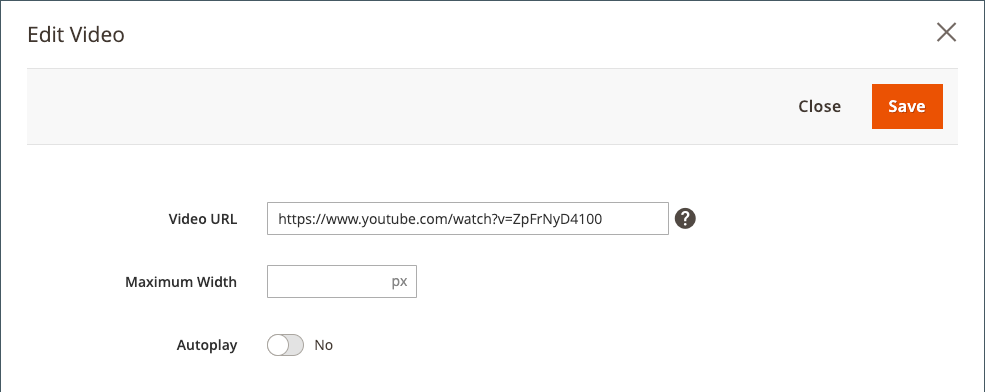
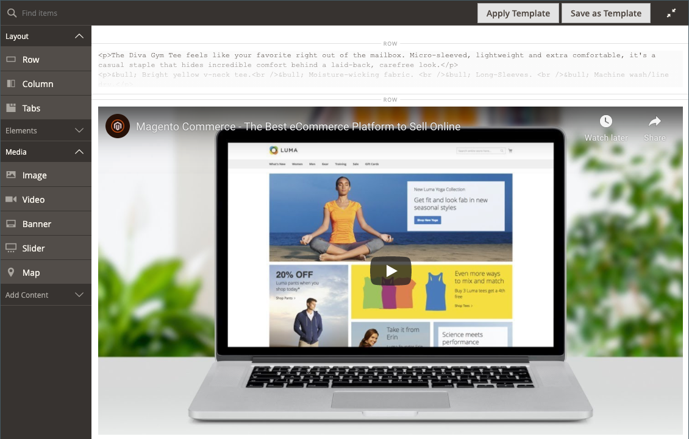

# [!DNL Page Builder] Genomgång del 3: kataloginnehåll

Den här övningen visar hur enkelt det är att lägga till en produktlista på en sida, anpassa produktsidor och skapa ett anpassat attribut som lägger till [!DNL Page Builder] till en produktattributuppsättning.

{width="600" zoomable="yes"}

Den här övningen förutsätter att du har slutfört [Del 1: Enkel sida](1-simple-page.md) och [Del 2: Block](2-blocks.md), inklusive kraven och hämtade exempelfiler. Följ de tre delarna av övningen i ordning.

## Del 1: Lägg till en produktlista

[!DNL Page Builder] gör det enkelt att lägga till en produktlista på scenen. I det här exemplet läggs produktlistan till direkt på en sida.

### Steg 1: Lägg till en produktlista på scenen

1. På _Administratör_ sidebar, gå till **[!UICONTROL Content]** > _[!UICONTROL Elements]_>**[!UICONTROL Pages]**.

1. Hitta _Enkel sida_ som du skapade i den första övningen och ändrade i den andra, och väljer **[!UICONTROL Edit]** i _[!UICONTROL Action]_kolumn.

1. Expandera  den **[!UICONTROL Content]** och klicka **[!UICONTROL Edit with Page Builder]** eller inuti förhandsvisningsområdet.

1. I [!DNL Page Builder] panel under _[!UICONTROL Layout]_, dra en **[!UICONTROL Row]**längst upp på scenen.

1. I [!DNL Page Builder] panel, expandera **[!UICONTROL Add Content]** och dra en **[!UICONTROL Products]** platshållare till den nya raden.

   {width="600" zoomable="yes"}

### Steg 2: Skapa villkoret

1. Håll muspekaren över den tomma produktbehållaren för att visa verktygslådan och välj _Inställningar_ ( {width="20"} ).

   {width="600" zoomable="yes"}

1. För **[!UICONTROL Select Products By]**, välja `Condition`.

1. Lägg till ett villkor:

   - Klicka på _Lägg till_ ().

   - Under _[!UICONTROL Product Attribute]_, välja **[!UICONTROL Category]**.

     {width="600" zoomable="yes"}

   - Slutför _[!UICONTROL Category is]..._ en del av villkoret genom att klicka på ikonen Mer (..) och sedan klicka på _Väljare_ ().

     {width="600" zoomable="yes"}

   - I kategoriträdet, gå ned till **Kvinnor > Tops** och väljer **Tes** kryssrutan.

     {width="600" zoomable="yes"}

   - Klicka på bockmarkeringen ().

     Motsvarande kategori-ID visas i fältet för att slutföra villkoret.

### Steg 3: Slutför inställningarna

1. Ange **[!UICONTROL Number of Products to Display]**.

   Som standard visas fem produkter i listan.

1. Slutför de återstående inställningarna efter behov.

   Använd fältbeskrivningarna i slutet av [Lägg till innehåll - produkter](products.md) sida för referens.

1. När du är klar klickar du på **[!UICONTROL Save]** för att spara inställningarna och gå tillbaka till [!DNL Page Builder] arbetsyta.

   {width="600" zoomable="yes"}

1. Klicka på i det övre högra hörnet av scenen _Stäng helskärm_ ( {width="20"} ).

   Om du klickar på den här ikonen återgår du till _[!UICONTROL Content]_-avsnitt för sidan där förhandsvisningen visas.

1. Klicka i det övre högra hörnet på **[!UICONTROL Save]** pil och välj **[!UICONTROL Save & Close]**.

## Del 2: Anpassa produktsidan

>[!NOTE]
>
>En administratör måste ha [!UICONTROL Content] behörigheter för sina [rollomfång](../systems/permissions-user-roles.md) för att se [!UICONTROL Edit with Page Builder] och kan använda Page Builder.

I den här delen av övningen får du lära dig hur enkelt det är att anpassa en produktsida genom att placera en video under flikarna på produktsidan. Uppdateringsprocessen [kategorisida](../catalog/categories-content-settings.md) innehållet är i stort sett detsamma.

1. På _Administratör_ sidebar, gå till **[!UICONTROL Catalog]** > **[!UICONTROL Products]**.

1. Hitta en enkel produkt som du kan använda i det här exemplet och öppna den i redigeringsläge.

1. Rulla ned och expandera  den **[!UICONTROL Content]** -avsnitt.

1. Nästa till _[!UICONTROL Description]_, klicka **[!UICONTROL Edit with Page Builder]**.

   {width="600" zoomable="yes"}

   Om produktbeskrivningen har angetts tidigare utan [!DNL Page Builder]visas den aktuella beskrivningen som HTML i en [HTML Code](html-code.md) behållare. Med Luma-temat visas produktbeskrivningen på fliken Detaljer.

1. I [!DNL Page Builder] panel under _[!UICONTROL Layout]_, dra en **[!UICONTROL Row]**till scenen och placera den nedanför kodbehållaren HTML.

   Leta efter den röda stödlinjen som ska visas när raden är i rätt position.

   {width="600" zoomable="yes"}

1. I [!DNL Page Builder] panel, expandera **[!UICONTROL Media]** och dra en **[!UICONTROL Video]** platshållare till den nya raden.

   {width="600" zoomable="yes"}

1. Håll pekaren över den tomma videobehållaren för att visa verktygslådan och välj _Inställningar_ ( {width="20"} ).

   {width="500" zoomable="yes"}

1. Ange **[!UICONTROL Video URL]**.

   Videon kan lagras på någon av [YouTube][1] eller [Vimeo][2]. Videon i det här exemplet finns på YouTube på följande URL:

   `https://www.youtube.com/watch?v=ZpFrNyD4100`

   {width="500" zoomable="yes"}

1. Ange **[!UICONTROL Maximum Width]** i pixlar för videovisningen.

   Om du lämnar det här alternativet tomt fyller videon det tillgängliga utrymmet.

1. Klicka **[!UICONTROL Save]** för att spara inställningarna och gå tillbaka till [!DNL Page Builder] arbetsyta.

   {width="600" zoomable="yes"}

1. Klicka på i det övre högra hörnet av scenen _Stäng helskärm_ ( {width="20"} ).

   Om du klickar på den här ikonen återgår du till _[!UICONTROL Content]_-avsnitt för sidan där förhandsvisningen visas.

1. Klicka i det övre högra hörnet på **[!UICONTROL Save]** pil och välj **[!UICONTROL Save & Close]**.

I butiken visas videon under flikuppsättningen. Om du vill se hur sidan ser ut på en mobil enhet kan du ändra storlek på fönstret.

{width="600" zoomable="yes"}

**Grattis!** Du har avslutat den andra delen av självstudiekursen om kataloginnehåll. Behåll det du skapat så att du kan hänvisa till det senare.

## Del 3: Lägga till anpassade attribut

Använd [!DNL Page Builder] anpassat attribut för att lägga till en fullt fungerande [!DNL Page Builder] till en produktsida, som du kan använda för att skapa engagerande innehåll. I den här delen av övningen får du lära dig att skapa ett anpassat attribut med [!DNL Page Builder] indatatyp och använd den på produktsidor i katalogen. Mer information om dessa attribut finns i [Produktattribut](../catalog/product-attributes.md).

### Steg 1: Skapa en produkt

Om du vill undvika ändringar i din livebutik skapar du en produkt med de beskrivna egenskaperna.

1. På _Administratör_ sidebar, gå till **[!UICONTROL Catalog]** > **[!UICONTROL Products]**.

1. Klicka på i det övre högra hörnet **[!UICONTROL Add Product]**.

1. Skapa produkten med följande egenskaper:

   - 
     [!UICONTROL-attributuppsättning]: Default
   - [!UICONTROL Product Name]: Min produkt
   - 
     [!UICONTROL SKU]: Tutorial
   - 
     [!UICONTROL Price]: 75.00
   - 
     [!UICONTROL Quantity]: 100
   - [!UICONTROL Stock Status]: I Stock
   - 
     [!UICONTROL Weight]: 1
   - [!UICONTROL Categories]: Kvinnor > Tops > Tes

1. Klicka i det övre högra hörnet på **[!UICONTROL Save]** pil och välj **[!UICONTROL Save & Close]**.

### Steg 2: Skapa anpassade attribut

I det här steget skapar du två nya anpassade attribut som visar hur [!DNL Page Builder] och textredigerarens indatatyper kan användas.

1. På _Administratör_ sidebar, gå till **[!UICONTROL Stores]** > _[!UICONTROL Attributes]_>**[!UICONTROL Product]**.

1. Klicka på i det övre högra hörnet **[!UICONTROL Add New Attribute]**.

1. Ange en **[!UICONTROL Default Label]** för attributet.

   Använd följande exempel: `My Page Builder Attribute` för etiketten.

1. Ange **[!UICONTROL Catalog Input Type for Store Owner]** till `Page Builder`.

   När du skapar ett anpassat attribut kan du ange vilken redigerare som passar bäst för programmet som antingen `Page Builder` eller standarden WYSIWYG `Text Editor`.

   ![[!DNL Page Builder] Indatatyp](./assets/pb-attribute-page-builder.png){width="600" zoomable="yes"}

1. Expandera  den **[!UICONTROL Advanced Attribute Properties]** och gör följande inställningar:

   - [!UICONTROL Attribute Code]: Ange en attributkod med små bokstäver, med bindestreck i stället för mellanslag. Använd följande exempel: `my_page_builder_attribute`.
   - [!UICONTROL Scope]: Acceptera standardvärdet, `Store View`.
   - [!UICONTROL Default Value]: Ange ett standardvärde för attributet.
   - 
     [!UICONTROL Unique Value]: `No`
   - 
     [!UICONTROL Add to Column Options]: `No`
   - 
     [!UICONTROL Use in Filter Options]: `Yes`

1. I _[!UICONTROL Attribute Information]_till vänster väljer du **[!UICONTROL Storefront Properties]**och gör följande inställningar:

   - 
     [!UICONTROL Use for Promo Rule Conditions]: `Yes`
   - 
     [!UICONTROL Visible on Catalog Pages on Storefront]: `Yes`
   - 
     [!UICONTROL Used in Product Listing]: `Yes`

1. När du är klar klickar du på **[!UICONTROL Save Attribute]**.

1. Upprepa föregående steg för att skapa ett andra attribut med samma grundläggande egenskaper, men med textredigerarens indatatyp enligt följande:

   - [!UICONTROL Default Label]: Mitt textredigeringsattribut
   - [!UICONTROL Catalog Input Type for Store Owner]: Textredigerare
   - 
     [!UICONTROL-attributkod]: `my_text_editor_attribute`

### Steg 3: Uppdatera produktattributuppsättningen

1. På _Administratör_ sidebar, gå till **[!UICONTROL Stores]** > _[!UICONTROL Attributes]_>**[!UICONTROL Attribute Set]**.

   I det här exemplet lägger du tillfälligt till de nya attributen i `default` attributuppsättning. När du är klar med övningen tar du bort attributen från attributuppsättningen så att katalogen inte påverkas.

   >[!NOTE]
   >
   >Om du inte vill ändra din live-butik kan du följa med utan att uppdatera attributuppsättningen.

1. Hitta _[!UICONTROL Default]_attributuppsättningen i listan och dubbelklicka på den för att öppna den i redigeringsläge.

1. I _Ej tilldelade attribut_ söker du efter de nya attributen som du har skapat och drar vart och ett till _[!UICONTROL Groups]_kolumn, under **[!UICONTROL Content]**.

   Attributets plats i [!UICONTROL Groups] -kolumnen avgör var den visas på sidan.

   {width="600" zoomable="yes"}

1. Klicka **[!UICONTROL Save]** för att återgå till listan Attributuppsättningar.

1. När du uppmanas till det klickar du på **[!UICONTROL Cache Management]** överst på sidan och uppdatera eventuell ogiltig cache.

### Steg 4: Uppdatera produkten

1. På _Administratör_ sidebar, gå till **[!UICONTROL Catalog]** > **[!UICONTROL Products]**.

1. I rutnätet Produkter hittar du _Min produkt_ och öppna den i redigeringsläge.

1. Rulla ned och expandera  den **[!UICONTROL Content]** -avsnitt.

   Överst i avsnittet finns det två standardattribut för produktinnehåll:

   - _Kort beskrivning_, som använder WYSIWYG-standarden [redigerare](../content-design/editor.md).
   - _Beskrivning_, som visar [!DNL Page Builder] förhandsgranska.

   {width="600" zoomable="yes"}

   När du bläddrar till den nedre halvan av avsnittet finns det två attribut som du har skapat och tilldelat:

   - _Min [!DNL Page Builder] Attribut_, som visar [!DNL Page Builder] förhandsgranska.
   - _Mitt textredigeringsattribut_, som använder WYSIWYG-standardredigeraren.

   {width="600" zoomable="yes"}

1. I **Mitt textredigeringsattribut** redigerare, ange `Text Editor Attribute placeholder text`.

   - Klicka i det övre högra hörnet på **[!UICONTROL Save]** pil och välj **[!UICONTROL Save & Close]**.

1. För **Mitt Page Builder-attribut**, klicka **[!UICONTROL Edit with Page Builder]** och lägga till beskrivningstexten:

   - I [!DNL Page Builder] panel, expandera **[!UICONTROL Elements]** och dra en **[!UICONTROL Text object]** till scenen.

   - Retur `Page Builder attribute placeholder text`.

   - Klicka på i det övre högra hörnet av scenen _Stäng helskärm_ ( {width="20"} ).

     {width="600" zoomable="yes"}

1. Bläddra upp till **[!UICONTROL Description]**, klicka **[!UICONTROL Edit with Page Builder]** och lägg till text som du gillar med samma metod som i föregående steg.

1. Klicka på i det övre högra hörnet av produktsidan på **[!UICONTROL Save]** pil och välj **[!UICONTROL Save & Close]**.

1. Klicka på knappen **[!UICONTROL Cache Management]** i meddelandet längst upp på sidan och uppdatera eventuell ogiltig cache.

### Steg 5: Visa resultatet

1. Navigera till exempelproduktsidan i butiken.

   I det här exemplet finns produkten i den övre navigeringen under Kvinnor > Tops > Tees.

1. Bläddra nedåt till _Mitt Page Builder-attribut_ information.

   Attributens position på produktsidan bestäms av temat. I Luma-temat finns de nya attributen precis efter produktbeskrivningen.

   ![[!DNL Page Builder] och textredigeringsattribut i butiken](./assets/pb-storefront-product-attribute.png){width="600" zoomable="yes"}

Du har slutfört [!DNL Page Builder] Kataloginnehåll. Behåll det du skapat så att du kan hänvisa till det senare.

[1]: https://www.youtube.com/
[2]: https://vimeo.com/
