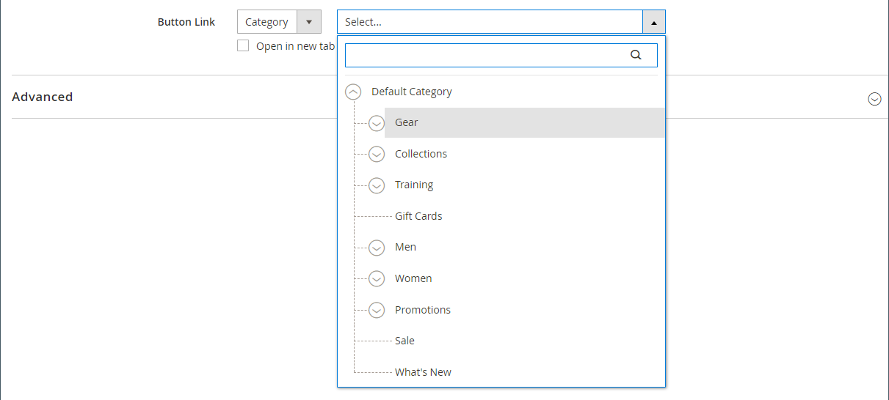

# Element - knappar

Använd innehållstypen _Knappar_ om du vill lägga till en enskild knapp eller en uppsättning knappar i [[!DNL Page Builder] scenen](workspace.md#stage). Du kan ordna knappar vågrätt eller lodrätt och lägga till dem direkt i rader, kolumner, flikar och banners på scenen.

{width="600" zoomable="yes"}

{{$include /help/_includes/page-builder-save-timeout.md}}

## Verktygslådor

När du arbetar med innehållstypen Knappar lägger du till och redigerar enskilda knappar och knappbehållaren som innehåller en eller flera knappar. Var och en har en egen verktygslåda som du använder för att utforma knappar på scenen [!DNL Page Builder].

### Enskild knappverktygslåda

{width="500" zoomable="yes"}

| Verktyg | Ikon | Beskrivning |
| --------- | -------- | -------------- |
| Inställningar | {width="25"} | Öppnar sidan Redigera knapp där du kan ändra knappens egenskaper. |
| Duplicera | {width="25"} | Skapar en kopia av knappen. |
| Ta bort | {width="25"} | Tar bort knappen från scenen. |

{style="table-layout:auto"}

### Verktygslåda för knappbehållaren

{width="500" zoomable="yes"}

| Verktyg | Ikon | Beskrivning |
| --------- | ----------------- | ----------- |
| Flytta | {width="25"} | Flyttar knappbehållaren till en annan giltig plats på sidan. |
| Lägg till | {width="25"} | Lägger till en knapp i behållaren. |
| (etikett) | Knapp | Anger den aktuella behållaren som ett knappelement. |
| Inställningar | {width="25"} | Öppnar sidan Redigera knappar, där du kan ändra egenskaperna för behållaren. |
| Dölj | {width="25"} | Döljer knappbehållaren. |
| Visa | {width="25"} | Visar den dolda knappbehållaren. |
| Duplicera | {width="25"} | Skapar en kopia av knappbehållaren. |
| Ta bort | {width="25"} | Tar bort knappbehållaren och dess innehåll från scenen. |

{style="table-layout:auto"}

{{$include /help/_includes/page-builder-hidden-element-note.md}}

## Lägga till en enskild knapp

1. Expandera **[!UICONTROL Elements]** på panelen [!DNL Page Builder] och dra en **[!UICONTROL Buttons]** platshållare till en rad, kolumn eller tabb på scenen.

   {width="500" zoomable="yes"}

1. Håll pekaren över knappen för att visa verktygslådan och välj ikonen _Inställningar_ ().

1. Ange **[!UICONTROL Button Text]** som ska visas på knappen.

   {width="600" zoomable="yes"}

1. Ange **[!UICONTROL Button Type]** till något av följande:

   | Typ | Beskrivning |
   | ------ | ----------- |
   | `Primary` | Använder det primära knappformatet från den aktuella formatmallen. |
   | `Secondary` | Tillämpar det sekundära knappformatet från den aktuella formatmallen om tillämpligt. |
   | `Link` | Skapar en hyperlänk i stället för en knapp. |

   {style="table-layout:auto"}

   {width="500" zoomable="yes"}

1. Ange **[!UICONTROL Button Link]** med någon av följande typer:

   - **[!UICONTROL URL]** - Ange länkens mål-URL.

     URL:en kan antingen vara en relativ länk till en produkt eller sida i din butik, eller en fullständig URL.

     Exempel på relativ URL - `../luma-analog-watch.html`

     Fullständigt URL-exempel - `http://mystore.com/luma-analog-watch.html`

     Om länken går till en annan webbplats kan du hålla den aktuella sidan öppen för din butik genom att öppna länken på en ny flik i webbläsaren.

     Markera kryssrutan **[!UICONTROL Open in new tab]** om du vill hindra besökaren från att navigera utanför din butik.

   - **[!UICONTROL Product]** - Ange ett produktnamn (delvis eller fullständigt) eller SKU, och välj sedan produktnamnet i listan.

     >[!NOTE]
     >
     >Produkterna visas i listan enligt inställningarna för _Visa i lager_. För flera Source-handlare som använder [Inventory management](../inventory-management/introduction.md) begränsas produktlistan av den källa som är tilldelad standardwebbplatsen.

     {width="600" zoomable="yes"}

   - **[!UICONTROL Category]** - Ange ett kategorinamn (delvis eller fullständigt) eller klicka i det tomma fältet för att visa kategoriträdet. Välj sedan kategorinamnet i trädet.

     {width="600" zoomable="yes"}

   - **[!UICONTROL Page]** - Ange namnet på en CMS-sida (delvis eller fullständig) eller klicka i det tomma fältet för att visa den fullständiga listan. Välj sedan namnet på sidan i sökresultatlistan.

     {width="600" zoomable="yes"}

1. Slutför de [avancerade inställningarna][advanced-settings] efter behov.

1. När du är klar klickar du på **[!UICONTROL Save]** i det övre högra hörnet för att tillämpa inställningarna och återgå till arbetsytan i [!DNL Page Builder].

## Lägga till en uppsättning knappar

I följande avsnitt beskrivs en serie steg som börjar med en enskild knapp och skapar en uppsättning med tre knappar i en knappbehållare. Om du inte redan har en enskild knapp följer du de föregående instruktionerna för att lägga till en enskild knapp på scenen.

### Steg 1: Skapa den andra knappen

1. Håll pekaren över knappbehållaren för att visa verktygslådan och välj ikonen _Lägg till_ ( {width="20"} ).

   {width="500" zoomable="yes"}

1. Ange den text som du vill ska visas på den andra knappen.

1. Klicka på den nya knappen för att visa dess verktygslåda och välj ikonen _Inställningar_ ( {width="20"} ).

   {width="500" zoomable="yes"}

1. Ange **[!UICONTROL Button Type]** till `Secondary`.

1. Konfigurera **[!UICONTROL Button Link]** efter behov.

   I följande exempel är länken en relativ URL som går till sidan [Kontakta oss](../getting-started/store-details.md#contact-us-form).

   {width="600" zoomable="yes"}

1. Slutför de [avancerade inställningarna][advanced-settings] efter behov.

1. När du är klar klickar du på **[!UICONTROL Save]** för att tillämpa inställningarna och återgå till arbetsytan i [!DNL Page Builder].

### Steg 2: Skapa den tredje knappen

1. Klicka på den andra knappen igen på scenen och välj ikonen _Duplicera_ ( {width="20"} ).

   {width="500" zoomable="yes"}

1. Ange den text som du vill ska visas på den tredje knappen.

1. Klicka på den tredje knappen för att visa verktygslådan och välj ikonen _Inställningar_ ( {width="20"} ).

   {width="500" zoomable="yes"}

1. Uppdatera **[!UICONTROL Button Link]** efter behov.

1. Klicka på **[!UICONTROL Save]** i det övre högra hörnet för att tillämpa inställningarna och återgå till arbetsytan i [!DNL Page Builder].

### Steg 3: Uppdatera knappbehållaren

1. Håll pekaren över knappbehållaren för att visa verktygslådan och välj ikonen _Inställningar_ ( {width="20"} ).

   {width="500" zoomable="yes"}

1. Välj **[!UICONTROL Stacked]** under _[!UICONTROL Appearance]_.

1. Ange **[!UICONTROL All Buttons are same size]** till `Yes`.

   {width="300"}

1. Uppdatera de återstående inställningarna efter behov med hjälp av beskrivningarna från [Ändra inställningarna för en knappbehållare][button-container].

1. När du är klar klickar du på **[!UICONTROL Save]** för att tillämpa inställningarna och återgå till arbetsytan i [!DNL Page Builder].

   Den fullständiga staplade knappuppsättningen visas på scenen, med en primär knapp och två sekundära knappar.

   {width="500" zoomable="yes"}

## Flytta en knapp

1. Klicka på den knapp som du vill flytta.

1. Markera och dra ikonen Flytta ( {width="20"} ), som visas precis före knapptexten, till en ny plats för knappen i knappbehållaren.

   {width="500" zoomable="yes"}

## Ändra inställningar för en knapp

1. Klicka på knappen på scenen för att visa verktygslådan och välj ikonen _Inställningar_ ( {width="20"} ).

   {width="500" zoomable="yes"}

1. Uppdatera standardinställningarna efter behov.

   - **[!UICONTROL Button Text]** - Ange texten som ska visas på knappen (kan även uppdateras direkt från scenen).

   - **[!UICONTROL Button Type]** - Anger knappformatet.

     | Typ | Beskrivning |
     | ------ | ----------- |
     | `Primary` | Använder det primära knappformatet från den aktuella formatmallen. |
     | `Secondary` | Använder det sekundära knappformatet från den aktuella formatmallen, om tillämpligt. |
     | `Link` | Skapar en hyperlänk i stället för en knapp. |

     {style="table-layout:auto"}

   - **[!UICONTROL Button Link]** - Bestämmer målsidan som visas när någon klickar på knappen.

     | Alternativ | Beskrivning |
     | ------ | ----------- |
     | `URL` | Använder antingen en relativ eller fullständig URL-adress för att identifiera målsidan. |
     | `Product` | Identifierar målsidan baserat på produktnamnet eller SKU:n. Du kan söka efter produktnamnet baserat på antingen ett partiellt eller fullständigt namn. Produkten väljs sedan i sökresultatlistan. |
     | `Category` | Identifierar målsidan som en specifik kategori eller underkategori i kategoriträdet. |
     | `Page` | Identifierar målsidan som en specifik CMS-sida. |

     {style="table-layout:auto"}

1. Slutför de [avancerade inställningarna][advanced-settings] efter behov.

1. Om du vill spara inställningarna och återgå till arbetsytan [!DNL Page Builder] klickar du på **[!UICONTROL Save]** i det övre högra hörnet.

## Ändra inställningar för en knappbehållare

1. Håll pekaren över knappbehållaren för att visa verktygslådan och välj ikonen _Inställningar_ ( {width="20"} ).

1. Uppdatera inställningarna för **[!UICONTROL Appearance]** efter behov.

   - Använd ordningsalternativen för att visa knapparna antingen vågrätt eller lodrätt i behållaren:

     | Alternativ | Beskrivning |
     | ------ | ----------- |
     | `Inline` | Ordnar knapparna vågrätt. |
     | `Stacked` | Ordnar knapparna lodrätt. |

     {style="table-layout:auto"}

   - Ange alternativet **[!UICONTROL All buttons are same size]** enligt dina önskemål.

     När värdet är `Yes` har alla knappar i behållaren en konsekvent storlek baserat på längden på den längsta knapptexten.

1. Slutför de [avancerade inställningarna][advanced-settings] efter behov.

1. När du är klar klickar du på **[!UICONTROL Save]** för att tillämpa inställningarna och återgå till arbetsytan i [!DNL Page Builder].

## Ändra avancerade inställningar

Du kan ändra _[!UICONTROL Advanced]_-inställningarna för enskilda knappar och för knappbehållaren.

1. Om du vill styra placeringen i den överordnade behållaren väljer du **[!UICONTROL Alignment]**:

   | Alternativ | Beskrivning |
   | ------ | ----------- |
   | `Default` | Använder den standardinställning för justering som anges i formatmallen för det aktuella temat. |
   | `Left` | Justerar innehållet längs den vänstra kanten av den överordnade behållaren, med hänsyn till eventuell utfyllnad som har angetts. |
   | `Center` | Justerar innehållet i mitten av den överordnade behållaren, med hänsyn till eventuell utfyllnad som har angetts. |
   | `Right` | Justerar innehållet längs den högra kanten av den överordnade behållaren, med hänsyn till eventuell utfyllnad som har angetts. |

   {style="table-layout:auto"}

1. Ange det **[!UICONTROL Border]**-format som ska användas på alla fyra sidor av knappbehållaren eller knappbehållaren:

   | Alternativ | Beskrivning |
   | ------ | ----------- |
   | `Default` | Använder det standardkantlinjeformat som anges av den associerade formatmallen. |
   | `None` | Visar inte någon synlig indikation för behållarkanterna. |
   | `Dotted` | Behållarramen visas som en prickad linje. |
   | `Dashed` | Behållarramen visas som en streckad linje. |
   | `Solid` | Behållarramen visas som en heldragen linje. |
   | `Double` | Behållarramen visas som en dubbel linje. |
   | `Groove` | Behållarkanten visas som en utdragen linje. |
   | `Ridge` | Behållarkanten visas som en rak linje. |
   | `Inset` | Behållarramen visas som en indragen linje. |
   | `Outset` | Behållarramen visas som en startrad. |

   {style="table-layout:auto"}

1. Om du anger ett annat kantlinjeformat än `None` fyller du i visningsalternativen för kantlinjen:

   | Alternativ | Beskrivning |
   | ------ |------------ |
   | [!UICONTROL Border Color] | Ange färgen genom att välja en färgruta, klicka på färgväljaren eller genom att ange ett giltigt färgnamn eller motsvarande hexadecimalt värde. |
   | [!UICONTROL Border Width] | Ange antalet pixlar för kantlinjens bredd. |
   | [!UICONTROL Border Radius] | Ange antalet pixlar för att definiera radiens storlek som används för att runda varje hörn av kanten. |

   {style="table-layout:auto"}

1. (Valfritt) Ange namnen på **[!UICONTROL CSS classes]** från den aktuella formatmallen som ska användas för knappbehållaren eller knappbehållaren.

   Avgränsa flera klassnamn med blanksteg.

1. Ange värden, i pixlar, för **[!UICONTROL Margins and Padding]** för att bestämma de yttre marginalerna och den inre utfyllnaden för knappbehållaren eller knappbehållaren.

   Ange motsvarande värden i diagrammet.

   | Behållarområde | Beskrivning |
   | -------------- | ----------- |
   | [!UICONTROL Margins] | Mängden tomt utrymme som används på ytterkanten på behållarens alla sidor. Alternativ: `Top` / `Right` / `Bottom` / `Left` |
   | [!UICONTROL Padding] | Mängden tomt utrymme som används på behållarens inre kant på alla sidor. Alternativ: `Top` / `Right` / `Bottom` / `Left` |

   {style="table-layout:auto"}

[advanced-settings]: #change-advanced-settings
[button-container]: #change-settings-for-a-button-container
