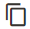
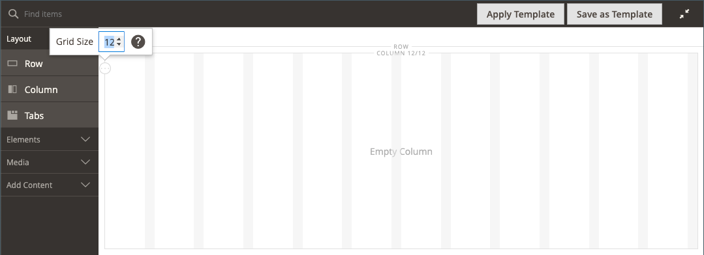
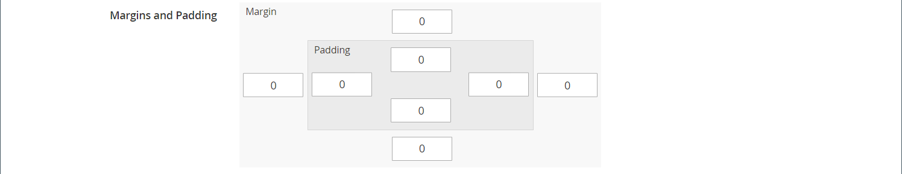

# Layout - kolumn

Använd _Kolumn_ innehållstyp för att dela upp en sida i flera kolumner i [[!DNL Page Builder] stage](workspace.md#stage). När du lägger till en kolumn på en rad eller tabb, eller direkt på scenen, delas kolumngruppen först upp i två kolumner med samma bredd. Du kan lägga till eller ta bort kolumner efter behov. Du kan ändra storlek på en kolumn genom att dra kanten mellan två kolumner. Bredden på nästa kolumn justeras så att den fyller ut det tillgängliga utrymmet på raden, fliken eller scenen. En enda kolumn utökar scenens eller dess behållares fulla bredd.

{width="600" zoomable="yes"}

{{$include /help/_includes/page-builder-save-timeout.md}}

## Uppdateringar i version 2.4.5

Page Builder-funktionerna uppdateras i version 2.4.5 så att användare nu kan använda _[!DNL Columns]_som en överordnad behållare för enskilda kolumner. Den här nya behållaren stöder även egenskaper för bakgrund och eliminerar behovet av att radbryta kolumner. Det minskar onödig markering och ger bättre kontroll över butiksvisningen och upplevelsen.

Du kan ändra layouten för [!DNL Columns] genom att dra en kolumn ovanför eller nedanför andra kolumner i gruppen och stapla dem. Detta öppnar en ny rad olika möjliga layoutkombinationer som kan uppnås utan att utvecklarna behöver anpassa dem.

I den här videon visas hur [!DNL Columns] behållare kan användas för att förfina sidlayouten:

>[!VIDEO](https://video.tv.adobe.com/v/345828?quality=12)

## Kolumnverktygslåda

Varje kolumn har en verktygslåda med alternativ som visas när du hovrar över behållaren.

| Verktyg | Ikon | Beskrivning |
|--- |--- |--- |
| Flytta | {width="25"} | Flyttar kolumnen och dess innehåll till en annan position i förhållande till andra kolumner. |
| (etikett) | Kolumn | Identifierar den aktuella behållaren som en kolumn. Håll pekaren över kolumnbehållaren för att visa verktygslådan. |
| Inställningar | {width="25"} | Öppnar sidan Redigera kolumn, där du kan ändra egenskaperna för behållaren. |
| Duplicera | {width="25"} | Skapar en kopia av den aktuella kolumnen. |
| Ta bort | {width="25"} | Tar bort den aktuella kolumnen och dess innehåll. |

{style="table-layout:auto"}

## Kolumnstödraster

The [rutnät](workspace.md) ser till att innehållet justeras konsekvent i en kolumn och hjälper sidan att återges korrekt på både dator och mobila enheter. Mer information finns i [Avancerade innehållsverktyg](setup.md) i [!DNL Page Builder] konfiguration.

{width="500" zoomable="yes"}

I följande exempel med två kolumner anger siffrorna inom parentes (6/12) i den övre kanten av varje kolumnbehållare antalet rutnätsindelningar i varje kolumn och det totala antalet indelningar. I det här fallet är kolumnen bredden på sex stödrasterenheter av totalt 12.

{width="600" zoomable="yes"}

## Lägga till en kolumn

1. I [!DNL Page Builder] panel under _[!UICONTROL Layout]_, dra en **[!UICONTROL Column]**till scenen.

   {width="600" zoomable="yes"}

   Kolumngruppen är nu uppdelad i två kolumner med samma bredd. Varje kolumn är en separat behållare för innehåll och har en egen uppsättning verktygslådalternativ.

   {width="600" zoomable="yes"}

1. Klicka på i det övre vänstra hörnet i kolumngruppen _Stödraster_ verktyg () och justera stödrasterstorleken efter behov.

   Genom att placera innehåll i rutnätet kan du justera innehållet på ett enhetligt sätt och återge sidan korrekt på både dator och mobila enheter. Mer information finns i [Avancerade innehållsverktyg](../configuration-reference/general/content-management.md) i [!DNL Page Builder] konfiguration.

   {width="600" zoomable="yes"}

## Ändra storlek på en kolumn

1. Hovra över kanten mellan två kolumner.

   Kanten markeras och verktygslådan för den markerade kolumnen visas.

   {width="600" zoomable="yes"}

1. Håll ned musknappen om du vill visa stödrastret och dra ramen till en ny plats i stödrastret.

   Bredden på båda kolumnerna justeras så att ändringen återspeglas. Den nya bredden för varje kolumn visas efter etiketten, till exempel `4/12` (fyra av 12) och `8/12` (åtta av tolv).

   {width="600" zoomable="yes"}

## Ta bort en kolumn

1. Håll pekaren över den kolumn som du vill ta bort för att visa verktygslådan och välj _Ta bort_ ( {width="20"} ).

   {width="600" zoomable="yes"}

1. Om kolumnen innehåller innehåll klickar du på **[!UICONTROL OK]** för att bekräfta.

   Om du vill påskynda processen i framtiden kan du hoppa över bekräftelsesteget genom att välja **[!UICONTROL Do not show this again]** kryssrutan.

   Kolumngruppen har nu en enda kolumn (12/12) och ett stödraster. Eftersom stödrastret bara är tillgängligt för kolumner kan du använda den här tekniken för att visa stödrastret.

   {width="600" zoomable="yes"}

1. Om du vill att kolumngruppen ska utöka den återstående kolumnen till radens eller scenens hela bredd:

   - Håll pekaren över kolumnen för att visa verktygslådan och välj _Inställningar_ ( {width="20"} ).

   - Bläddra nedåt till _[!UICONTROL Advanced]_och ange alla fyra **[!UICONTROL Padding]**värden till `0`.

     {width="600" zoomable="yes"}

   - Klicka på i det övre högra hörnet **[!UICONTROL Save]** för att stänga _[!UICONTROL Edit Column]_sida.

1. Klicka på _Stäng helskärm_ ( {width="20"} ) i det övre högra hörnet av arbetsytan och klicka sedan på **[!UICONTROL Save]** längst upp till höger.

## Ändra kolumninställningar

1. Håll pekaren över kolumnen för att visa verktygslådan och välj _Inställningar_ ( {width="20"} ).

   {width="600" zoomable="yes"}

1. Ändra **[!UICONTROL Appearance]** inställningar efter behov.

   - Välj den justeringsinställning som bestämmer kolumnens placering i förhållande till dess behållare.

     | Alternativ | Beskrivning |
     | ------ | ----------- |
     | `Full Height` | Kolumnen utökar behållarens fulla höjd. |
     | `Top Aligned` | Kolumnen justeras högst upp i behållaren. |
     | `Centered` | Kolumnen centrerad mitt i behållaren. |
     | `Bottom Aligned` | Kolumnen justeras längst ned i behållaren. |

     {style="table-layout:auto"}

   - Ange vid behov **[!UICONTROL Minimum Height]** för kolumnen. Du kan till exempel ange den minsta höjden så att den matchar höjden på en bakgrundsbild.

   - Om du anger den minsta höjden anger du **[!UICONTROL Vertical Alignment]**  för att styra placeringen av innehållsbehållare som läggs till i kolumnen (`Top`, `Center`, eller `Bottom`).

1. Ändra bakgrunden för kolumninnehållet.

   - **[!UICONTROL Background Color]** - Ange färgen genom att välja en färgruta, klicka på färgväljaren eller genom att ange ett giltigt färgnamn eller motsvarande hexadecimalt värde. Den här inställningen bestämmer kolumnens bakgrundsfärg.

   - **[!UICONTROL Background Image]** - Använd vid behov verktygen som finns för att välja en bakgrundsbild som ska användas på kolumnen:

     | Verktyg | Beskrivning |
     | ------ | ----------- |
     | [!UICONTROL Upload] | Överför en bildfil från den lokala datorn till galleriet och använder den sedan som bakgrundsbild för kolumnen. |
     | [!UICONTROL Select from Gallery] | Uppmanar dig att välja en befintlig bild från galleriet som bakgrundsbild för kolumnen. |
     | {width="25"} | Gör att du kan dra bilden till kamerapanelen eller bläddra till bilden i det lokala filsystemet. |

     {style="table-layout:auto"}

   - **[!UICONTROL Background Mobile Image]** - Använd vid behov samma verktyg för att välja en annan bakgrundsbild som ska användas för visning på mobila enheter.

   - **[!UICONTROL Background Size]** - Ändra den här inställningen för att bestämma hur bakgrundsbilden skalas i förhållande till bredden på kolumnen:

     | Alternativ | Beskrivning |
     | ------ | ----------- |
     | `Cover` | Bakgrundsbilden täcker hela kolumnbredden. |
     | `Contain` | Bakgrundsbilden är begränsad till innehållsområdets bredd. |
     | `Auto` | Använder den standardbakgrundsstorlek som anges i formatmallen för det aktuella temat. |

     {style="table-layout:auto"}

   - **[!UICONTROL Background Position]** - Ändra den här inställningen för att ange bildens ankarpunkt i förhållande till kolumnen. Alternativ: `Top Left`, `Top Center`, `Top Right`, `Center Left`, `Center`, `Center Right`, `Bottom Left`, `Bottom Center`, eller `Bottom Right`

   - **[!UICONTROL Background Attachment]** - Ändra den här inställningen för att bestämma hur bakgrundsbilden flyttas i förhållande till rullningssidan:

     | Alternativ | Beskrivning |
     | ------ | ----------- |
     | `Scroll` | Bakgrundsbilden synkroniseras så att den flyttas nedåt när sidan rullas. |
     | `Fixed` | (Inte tillgängligt för mobiler) Bakgrundsbilden flyttas inte när behållaren rullas över bilden och är fast vid den angivna bakgrundspositionen. |

     {style="table-layout:auto"}

   - **[!UICONTROL Background Repeat]** - Om du vill upprepa bakgrundsbilden för att fylla utrymmet ändrar du den här inställningen `Yes`.

1. Uppdatera _[!UICONTROL Advanced]_inställningar efter behov.

   - Om du vill styra den vågräta placeringen av innehållsbehållare som läggs till i kolumnen väljer du en **[!UICONTROL Alignment]**:

     | Alternativ | Beskrivning |
     | ------ | ----------- |
     | `Default` | Använder den standardinställning för justering som anges i formatmallen för det aktuella temat. |
     | `Left` | Justerar innehållsbehållarna längs den vänstra kanten av kolumnbehållaren, med hänsyn till eventuell utfyllnad som har angetts. |
     | `Center` | Justerar innehållsbehållaren i mitten av kolumnbehållaren, med hänsyn till eventuell utfyllnad som har angetts. |
     | `Right` | Justerar innehållsbehållaren längs den högra kanten av kolumnbehållaren, med hänsyn till eventuell utfyllnad som har angetts. |

     {style="table-layout:auto"}

   - Ange **[!UICONTROL Border]** som används på alla fyra sidor i kolumnbehållaren:

     | Alternativ | Beskrivning |
     | ------ | ----------- |
     | `Default` | Använder det standardkantlinjeformat som anges av den associerade formatmallen. |
     | `None` | Visar inte någon synlig indikation för behållarkanterna. |
     | `Dotted` | Behållarramen visas som en prickad linje. |
     | `Dashed` | Behållarramen visas som en streckad linje. |
     | `Solid` | Behållarramen visas som en heldragen linje. |
     | `Double` | Behållarramen visas som en dubbel linje. |
     | `Groove` | Behållarkanten visas som en utdragen linje. |
     | `Ridge` | Behållarkanten visas som en rak linje. |
     | `Inset` | Behållarramen visas som en indragen linje. |
     | `Outset` | Behållarramen visas som en startrad. |

     {style="table-layout:auto"}

   - Om du anger ett annat kantlinjeformat än `None`slutför du visningsalternativen för kantlinjer:

     | Alternativ | Beskrivning |
     | ------ |------------ |
     | [!UICONTROL Border Color] | Ange färgen genom att välja en färgruta, klicka på färgväljaren eller genom att ange ett giltigt färgnamn eller motsvarande hexadecimalt värde. |
     | [!UICONTROL Border Width] | Ange antalet pixlar för kantlinjens bredd. |
     | [!UICONTROL Border Radius] | Ange antalet pixlar för att definiera radiens storlek som används för att runda varje hörn av kanten. |

     {style="table-layout:auto"}

   - (Valfritt) Ange namnen på **[!UICONTROL CSS classes]** från den aktuella formatmallen som ska användas för kolumnbehållaren.

     Avgränsa flera klassnamn med blanksteg.

   - Ange värden i pixlar för **[!UICONTROL Margins and Padding]** om du vill ange kolumnens yttre marginaler och inre utfyllnad.

     Ange varje motsvarande värde i kolumnbehållardiagrammet.

     | Behållarområde | Beskrivning |
     | -------------- | ----------- |
     | [!UICONTROL Margins] | Mängden tomt utrymme som används på ytterkanten på behållarens alla sidor. Alternativ: `Top` / `Right` / `Bottom` / `Left` |
     | [!UICONTROL Padding] | Mängden tomt utrymme som används på behållarens inre kant på alla sidor. Alternativ: `Top` / `Right` / `Bottom` / `Left` |

     {style="table-layout:auto"}

1. När du är klar klickar du på **[!UICONTROL Save]** för att använda inställningarna och gå tillbaka till [!DNL Page Builder] arbetsyta.
