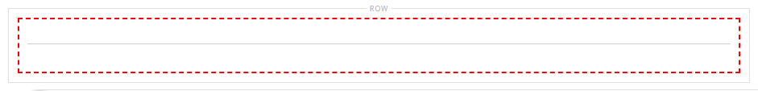

# Elements - avdelare

Använd innehållstypen _Delare_ om du vill lägga till en regel som en visuell brytning mellan innehållsavsnitt i [[!DNL Page Builder] scenen](workspace.md#stage). Du kan ange linjefärg, tjocklek och bredd för avgränsaren. Du kan också styra justeringen, ange marginaler och utfyllnad samt formatet för behållarramen. Avgränsaren är som standard en hårstreck regel som utökar behållarens hela bredd med hänsyn till utfyllnad.

{width="500" zoomable="yes"}

Även om de flesta avgränsarbehållare är osynliga visas behållaren med en röd streckad kant i följande exempel så att du kan se förhållandet mellan avgränsaren, utfyllnaden och behållaren. Du kan justera utfyllnaden längst upp och längst ned i avgränsaren för att styra mellanrummet mellan elementen.

{width="500" zoomable="yes"}

{{$include /help/_includes/page-builder-save-timeout.md}}

## Delare, verktygslåda

| Verktyg | Ikon | Beskrivning |
| ---- | --------------------| ------------|
| Flytta | {width="25"} | Flyttar avgränsarbehållaren till en annan giltig plats på sidan. |
| (etikett) | DIVIDER | Identifierar den aktuella behållaren som ett avdelarelement. |
| Inställningar | {width="25"} | Öppnar sidan Redigera avdelare, där du kan ändra egenskaperna för avgränsaren och dess behållare. |
| Dölj | {width="25"} | Döljer avgränsarbehållaren. |
| Visa | {width="25"} | Visar den dolda delningsbehållaren. |
| Duplicera | {width="25"} | Skapar en kopia av avgränsarbehållaren. |
| Ta bort | {width="25"} | Tar bort avgränsarbehållaren och dess innehåll från scenen. |

{style="table-layout:auto"}

{{$include /help/_includes/page-builder-hidden-element-note.md}}

## Lägga till en avgränsare

1. Expandera [!DNL Page Builder] på panelen **[!UICONTROL Elements]** och dra en **[!UICONTROL Divider]** platshållare till en rad, kolumn eller tabb på scenen.

   Använd den röda stödlinjen som referens när du placerar avgränsaren antingen före eller efter en annan innehållsbehållare på scenen.

   {width="600" zoomable="yes"}

   I följande exempel markerar avgränsaren början av ett nytt textavsnitt.

   {width="500" zoomable="yes"}

1. Följ nästa procedur för att ange inställningar för den nya avgränsaren.

## Ändra delningsinställningar

1. Håll pekaren över avgränsarbehållaren för att visa verktygslådan och välj ikonen _Inställningar_ ( {width="20"} ).

   {width="500" zoomable="yes"}

1. Ändra avgränsaren **[!UICONTROL Line Color]** på något av följande sätt:

   - Ange ett giltigt [HTML-färgnamn](https://en.wikipedia.org/wiki/Web_colors). Exempel: `Teal`.
   - Ange hexadecimalt färgvärde. Exempel: `#008080`.

   Klicka på **[!UICONTROL Apply]** när du är klar.

   {width="600" zoomable="yes"}

1. Ange **[!UICONTROL Line Thickness]** i pixlar.

1. Ange måttenheten genom att ange **[!UICONTROL Line Width]** följt av antingen `px` eller `%`.

   {width="600" zoomable="yes"}

1. Uppdatera inställningarna för _[!UICONTROL Advanced]_efter behov.

   - Om du vill styra placeringen av avgränsaren i den överordnade behållaren väljer du **[!UICONTROL Alignment]**:

     | Alternativ | Beskrivning |
     | ------ | ----------- |
     | `Default` | Använder den standardinställning för justering som anges i formatmallen för det aktuella temat. |
     | `Left` | Justerar listan längs den vänstra kanten på den överordnade behållaren, med hänsyn till eventuell utfyllnad som har angetts. |
     | `Center` | Justerar listan i mitten av den överordnade behållaren, med hänsyn till eventuell utfyllnad som har angetts. |
     | `Right` | Justerar blocket längs den högra kanten på den överordnade behållaren, med hänsyn till eventuell utfyllnad som har angetts. |

     {style="table-layout:auto"}

     I följande exempel är alternativen inställda på att använda en centrering för avgränsaren.

     {width="600" zoomable="yes"}

   - Ange det **[!UICONTROL Border]**-format som ska användas på alla fyra sidor i delningsbehållaren:

     | Alternativ | Beskrivning |
     | ------ | ----------- |
     | `Default` | Använder det standardkantlinjeformat som anges av den associerade formatmallen. |
     | `None` | Visar inte någon synlig indikation för behållarkanterna. |
     | `Dotted` | Behållarramen visas som en prickad linje. |
     | `Dashed` | Behållarramen visas som en streckad linje. |
     | `Solid` | Behållarramen visas som en heldragen linje. |
     | `Double` | Behållarramen visas som en dubbel linje. |
     | `Groove` | Behållarkanten visas som en utdragen linje. |
     | `Ridge` | Behållarkanten visas som en rak linje. |
     | `Inset` | Behållarramen visas som en indragen linje. |
     | `Outset` | Behållarramen visas som en startrad. |

     {style="table-layout:auto"}

   - Om du anger ett annat kantlinjeformat än `None` fyller du i visningsalternativen för kantlinjen:

     | Alternativ | Beskrivning |
     | ------ |------------ |
     | [!UICONTROL Border Color] | Ange färgen genom att välja en färgruta, klicka på färgväljaren eller genom att ange ett giltigt färgnamn eller motsvarande hexadecimalt värde. |
     | [!UICONTROL Border Width] | Ange antalet pixlar för kantlinjens bredd. |
     | [!UICONTROL Border Radius] | Ange antalet pixlar för att definiera radiens storlek som används för att runda varje hörn av kanten. |

     {style="table-layout:auto"}

   - (Valfritt) Ange namnen på **[!UICONTROL CSS classes]** från den aktuella formatmallen som ska användas för behållaren.

     Avgränsa flera klassnamn med blanksteg.

   - Ange värden (i pixlar) för **[!UICONTROL Margins and Padding]** för att bestämma de yttre marginalerna och den inre utfyllnaden för delningsbehållaren.

     Ange motsvarande värden i diagrammet.

     | Behållarområde | Beskrivning |
     | -------------- | ----------- |
     | [!UICONTROL Margins] | Mängden tomt utrymme som används på ytterkanten på behållarens alla sidor. Alternativ: `Top` / `Right` / `Bottom` / `Left` |
     | [!UICONTROL Padding] | Mängden tomt utrymme som används på behållarens inre kant på alla sidor. Alternativ: `Top` / `Right` / `Bottom` / `Left` |

     {style="table-layout:auto"}

1. När du är klar klickar du på **[!UICONTROL Save]** för att tillämpa inställningarna och återgå till arbetsytan i [!DNL Page Builder].

   {width="500" zoomable="yes"}

## Duplicera en delare

För en formaterad avgränsare med specifika inställningar är det effektivare att skapa en dubblett i stället för att börja om med en ny platshållare.

1. Håll pekaren över avgränsarbehållaren för att visa verktygslådan och välj ikonen _Duplicera_ ( {width="20"} ).

   Den duplicerade avgränsarbehållaren visas precis nedanför originalet.

   {width="500" zoomable="yes"}

1. Håll pekaren över den nya delningsbehållaren för att visa verktygslådan och välj ikonen _Flytta_ ( {width="20"} ).

   {width="500" zoomable="yes"}

1. Markera och dra avgränsaren tills den röda stödlinjen markerar den nya positionen.

   De övre och nedre kantlinjerna i varje behållare visas som streckade linjer när avgränsaren flyttas.

   {width="500" zoomable="yes"}

<!-- Last updated from includes: 2023-09-11 14:30:19 -->
