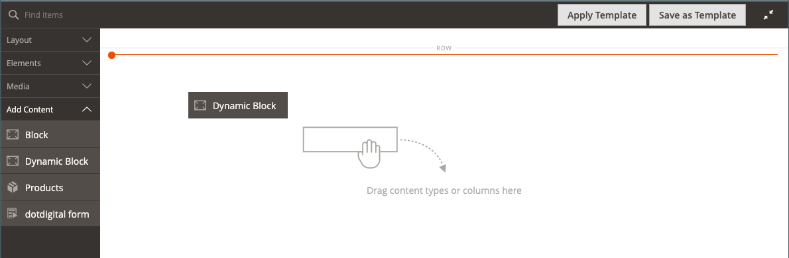
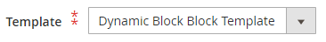

# Lägg till innehåll - dynamiskt block

Använd innehållstypen Dynamiskt block för att lägga till en befintlig [dynamiskt block](../content-design/dynamic-blocks.md) till [[!DNL Page Builder] stage](workspace.md#stage).

{width="700" zoomable="yes"}

{{$include /help/_includes/page-builder-save-timeout.md}}

## Verktygslådan Dynamiskt block

| Verktyg | Ikon | Beskrivning |
| --------- | ------------- | ----------------- |
| Flytta | {width="25"} | Flyttar blockbehållaren och dess innehåll till en annan plats på scenen. |
| Inställningar | {width="25"} | Öppnar _Redigera block_ sidan där du kan välja blocket och ändra egenskaperna för behållaren. |
| Dölj | {width="25"} | Döljer den aktuella blockbehållaren och dess innehåll. |
| Visa | {width="25"} | Visar den dolda blockbehållaren och dess innehåll. |
| Duplicera | {width="25"} | Skapar en kopia av blockbehållaren och dess innehåll. |
| Ta bort | {width="25"} | Tar bort blockbehållaren och dess innehåll från scenen. |

{style="table-layout:auto"}

{{$include /help/_includes/page-builder-hidden-element-note.md}}

## Lägg till ett befintligt dynamiskt block på scenen

1. Navigera till [!DNL Page Builder] på målsidan, blocket, produkten eller kategorin.

1. I [!DNL Page Builder] panel, expandera **[!UICONTROL Add Content]** och dra en **[!UICONTROL Dynamic Block]** platshållare till scenen.

   {width="600" zoomable="yes"}

1. Håll pekaren över den tomma dynamiska blockbehållaren för att visa verktygslådan och välj _Inställningar_ ( {width="20"} ).

   {width="600" zoomable="yes"}

1. På _Redigera dynamiskt block_ sida, klicka **[!UICONTROL Select Dynamic Block]** och använd listan för att markera blocket.

   {width="600" zoomable="yes"}

   Leta reda på det dynamiska block som du vill infoga i listan och klicka på **[!UICONTROL Select]**. Klicka sedan på **[!UICONTROL Add Selected]**.

   {width="600" zoomable="yes"}

   En sammanfattning av informationen om det dynamiska blocket visas nedan.

   {width="600" zoomable="yes"}

1. Ange **[!UICONTROL Template]** till något av följande:

   | Alternativ | Beskrivning |
   | ------ | ----------- |
   | `Dynamic Block Block Template` | Lägger till ett fristående block. |
   | `Dynamic Block Inline Template` | Infogar blockinnehållet i texten. |

   {style="table-layout:auto"}

   {width="200"}

1. Slutför de avancerade inställningarna efter behov.

1. När du är klar klickar du på **[!UICONTROL Save]** för att använda inställningarna och gå tillbaka till [!DNL Page Builder] arbetsyta.

### Avancerade inställningar

1. Om du vill styra det dynamiska blockets placering i den överordnade behållaren väljer du en **[!UICONTROL Alignment]**:

   | Alternativ | Beskrivning |
   | ------ | ----------- |
   | `Default` | Använder den standardinställning för justering som anges i formatmallen för det aktuella temat. |
   | `Left` | Justerar listan längs den vänstra kanten på den överordnade behållaren, med hänsyn till eventuell utfyllnad som har angetts. |
   | `Center` | Justerar listan i mitten av den överordnade behållaren, med hänsyn till eventuell utfyllnad som har angetts. |
   | `Right` | Justerar blocket längs den högra kanten på den överordnade behållaren, med hänsyn till eventuell utfyllnad som har angetts. |

   {style="table-layout:auto"}

1. Ange **[!UICONTROL Border]** format som används på alla fyra sidorna i den dynamiska blockbehållaren:

   | Alternativ | Beskrivning |
   | ------ | ----------- |
   | `Default` | Använder det standardkantlinjeformat som anges av den associerade formatmallen. |
   | `None` | Visar inte någon synlig indikation för behållarkanterna. |
   | `Dotted` | Behållarramen visas som en prickad linje. |
   | `Dashed` | Behållarramen visas som en streckad linje. |
   | `Solid` | Behållarramen visas som en heldragen linje. |
   | `Double` | Behållarramen visas som en dubbel linje. |
   | `Groove` | Behållarkanten visas som en utdragen linje. |
   | `Ridge` | Behållarkanten visas som en rak linje. |
   | `Inset` | Behållarramen visas som en indragen linje. |
   | `Outset` | Behållarramen visas som en startrad. |

   {style="table-layout:auto"}

1. Om du anger ett annat kantlinjeformat än `None`slutför du visningsalternativen för kantlinjer:

   | Alternativ | Beskrivning |
   | ------ |------------ |
   | [!UICONTROL Border Color] | Ange färgen genom att välja en färgruta, klicka på färgväljaren eller genom att ange ett giltigt färgnamn eller motsvarande hexadecimalt värde. |
   | [!UICONTROL Border Width] | Ange antalet pixlar för kantlinjens bredd. |
   | [!UICONTROL Border Radius] | Ange antalet pixlar för att definiera radiens storlek som används för att runda varje hörn av kanten. |

   {style="table-layout:auto"}

1. (Valfritt) Ange namnen på **[!UICONTROL CSS classes]** från den aktuella formatmallen som ska användas för behållaren.

   Avgränsa flera klassnamn med blanksteg.

1. Ange värden i pixlar för **[!UICONTROL Margins and Padding]** för att bestämma de yttre marginalerna och den inre utfyllnaden för den dynamiska blockbehållaren.

   Ange motsvarande värden i diagrammet.

   | Behållarområde | Beskrivning |
   | -------------- | ----------- |
   | [!UICONTROL Margins] | Mängden tomt utrymme som används på ytterkanten på behållarens alla sidor. Alternativ: `Top` / `Right` / `Bottom` / `Left` |
   | [!UICONTROL Padding] | Mängden tomt utrymme som används på behållarens inre kant på alla sidor. Alternativ: `Top` / `Right` / `Bottom` / `Left` |

   {style="table-layout:auto"}

## Redigera inställningar för dynamisk blockbehållare

1. Håll pekaren över den dynamiska blockbehållaren för att visa verktygslådan och välj _Inställningar_ ( {width="20"} ).

   {width="500" zoomable="yes"}

1. Ändra vid behov det dynamiska blocket:

   - Klicka på **[!UICONTROL Select Dynamic Block]**.

     {width="20"}

   - Klicka på i listan över aktiva dynamiska block **[!UICONTROL Select]** för det block som du vill lägga till.

1. Uppdatera de återstående inställningarna efter behov.

1. När du är klar klickar du på **[!UICONTROL Save]** för att använda inställningarna och gå tillbaka till [!DNL Page Builder] arbetsyta.

## Duplicera ett dynamiskt block

1. Håll pekaren över den dynamiska blockbehållaren för att visa verktygslådan och välj _Duplicera_ ( {width="20"} ).

   Dupliceringen visas precis nedanför originalet.

   {width="500" zoomable="yes"}

1. Om du vill flytta det nya dynamiska blocket till en annan plats håller du pekaren över behållaren och väljer _Flytta_ ( {width="20"} ) i verktygslådan

1. Markera och dra det dynamiska blocket tills den röda stödlinjen visas på den nya positionen.

   De övre och nedre kantlinjerna i varje behållare visas som streckade linjer när det dynamiska blocket flyttas.

## Ta bort ett dynamiskt block från scenen

1. Håll pekaren över den dynamiska blockbehållaren för att visa verktygslådan och välj _Ta bort_ ( {width="20"} ).

1. När du uppmanas att bekräfta klickar du på **[!UICONTROL OK]**.
