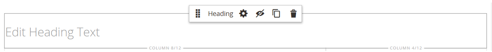

# Element - rubrik

Rubriknivåer skapar en hierarki som organiserar innehåll och hjälper sökmotorer att indexera varje sida. Använd _Rubrik_ innehållstypen i [[!DNL Page Builder] stage](workspace.md#stage) om du vill lägga till en textbehållare med en rubriknivå från H1 till H6 på scenen. Rubriker formateras enligt den formatmall som är kopplad till det aktuella temat.

The [Innehållsrubrik](workspace.md) fältet i _[!UICONTROL Content]_kan användas för att lägga till en H1-rubrik högst upp på sidan. Fältet är emellertid ett äldre fält än tidigare [!DNL Commerce] versioner och tillhandahålls för stöd av äldre innehåll. Det här fältet drar inte nytta av [!DNL Page Builder]Avancerade funktioner. Vi rekommenderar att du lämnar fältet Innehållsrubrik tomt och använder [!DNL Page Builder] Rubrikinnehållstyp om du vill lägga till rubriker på valfri nivå på sidan.

Följande exempel visar hur innehållstypen Innehållsrubrik och Rubrik visas när de formateras med Luma-temat.

{width="700" zoomable="yes"}

Du kan dra en rubrik från _Element_ i [!DNL Page Builder] till en rad, kolumn eller tabbuppsättning på scenen. Du kan styra rubriknivån och justeringen i redigeringsverktygsfältet på scenen, eller med _Inställningar_ ( {width="20"} ).

{{$include /help/_includes/page-builder-save-timeout.md}}

## Rubrikredigerare

{width="500" zoomable="yes"}

## Verktygslåda för rubrikbehållare

Precis som för alla innehållsbehållare visas verktygslådan när du för muspekaren över behållaren.

{width="500" zoomable="yes"}

| Verktyg | Ikon | Beskrivning |
| --------- | ----------------- | ---------------------- |
| Flytta | {width="25"} | Flyttar rubrikbehållaren till en annan giltig plats på sidan. |
| (etikett) | Rubrik | Identifierar den aktuella behållaren som en rubrik. |
| Inställningar | {width="25"} | Öppnar sidan Redigera rubrik, där du kan ändra egenskaperna för behållaren. |
| Dölj | {width="25"} | Döljer rubrikbehållaren. |
| Visa | {width="25"} | Visar den dolda rubrikbehållaren. |
| Duplicera | {width="25"} | Skapar en kopia av rubrikbehållaren. |
| Ta bort | {width="25"} | Tar bort rubrikbehållaren och dess innehåll från scenen. |

{style="table-layout:auto"}

{{$include /help/_includes/page-builder-hidden-element-note.md}}

## Lägg till en rubrik

1. I [!DNL Page Builder] panel, expandera **[!UICONTROL Elements]** och dra en **[!UICONTROL Heading]** platshållare för en rad, kolumn eller tabb som anges på scenen.

   {width="600" zoomable="yes"}

1. I redigeraren anger du rubriktexten över `Edit Heading Text` platshållare.

   Som standard tilldelas rubriktexten en rubriktyp på nivå två (H2).

   {width="500" zoomable="yes"}

1. Välj önskad rubriktyp mellan H1 och H6 i verktygsfältet.

1. Ändra justeringen om det behövs.

## Redigera rubrikinställningar

1. Håll pekaren över rubrikbehållaren för att visa verktygslådan och välj _Inställningar_ ( {width="20"} ).

   {width="500" zoomable="yes"}

1. Uppdatera rubrikinnehållet (**[!UICONTROL Heading Type]** och **[!UICONTROL Heading Text]**) vid behov.

   Du kan även uppdatera innehållet i rubrikredigeraren.

1. Uppdatera _[!UICONTROL Advanced]_inställningar efter behov.

   - Om du vill styra rubrikens placering i den överordnade behållaren väljer du en **[!UICONTROL Alignment]**:

     | Alternativ | Beskrivning |
     | ------ | ----------- |
     | `Default` | Använder den standardinställning för justering som anges i formatmallen för det aktuella temat. |
     | `Left` | Justerar listan längs den vänstra kanten på den överordnade behållaren, med hänsyn till eventuell utfyllnad som har angetts. |
     | `Center` | Justerar listan i mitten av den överordnade behållaren, med hänsyn till eventuell utfyllnad som har angetts. |
     | `Right` | Justerar blocket längs den högra kanten på den överordnade behållaren, med hänsyn till eventuell utfyllnad som har angetts. |

     {style="table-layout:auto"}

   - Ange **[!UICONTROL Border]** format som används på alla fyra sidorna av rubrikbehållaren:

     | Alternativ | Beskrivning |
     | ------ | ----------- |
     | `Default` | Använder det standardkantlinjeformat som anges av den associerade formatmallen. |
     | `None` | Visar inte någon synlig indikation för behållarkanterna. |
     | `Dotted` | Behållarramen visas som en prickad linje. |
     | `Dashed` | Behållarramen visas som en streckad linje. |
     | `Solid` | Behållarramen visas som en heldragen linje. |
     | `Double` | Behållarramen visas som en dubbel linje. |
     | `Groove` | Behållarkanten visas som en utdragen linje. |
     | `Ridge` | Behållarkanten visas som en rak linje. |
     | `Inset` | Behållarramen visas som en indragen linje. |
     | `Outset` | Behållarramen visas som en startrad. |

     {style="table-layout:auto"}

   - Om du anger ett annat kantlinjeformat än `None`slutför du visningsalternativen för kantlinjer:

     | Alternativ | Beskrivning |
     | ------ |------------ |
     | [!UICONTROL Border Color] | Ange färgen genom att välja en färgruta, klicka på färgväljaren eller genom att ange ett giltigt färgnamn eller motsvarande hexadecimalt värde. |
     | [!UICONTROL Border Width] | Ange antalet pixlar för kantlinjens bredd. |
     | [!UICONTROL Border Radius] | Ange antalet pixlar för att definiera radiens storlek som används för att runda varje hörn av kanten. |

     {style="table-layout:auto"}

   - (Valfritt) Ange namnen på **[!UICONTROL CSS classes]** från den aktuella formatmallen som ska användas för behållaren.

     Avgränsa flera klassnamn med blanksteg.

   - Ange värden i pixlar för **[!UICONTROL Margins and Padding]** för att bestämma de yttre marginalerna och den inre utfyllnaden för rubrikbehållaren.

     Ange motsvarande värden i diagrammet.

     | Behållarområde | Beskrivning |
     | -------------- | ----------- |
     | [!UICONTROL Margins] | Mängden tomt utrymme som används på ytterkanten på behållarens alla sidor. Alternativ: `Top` / `Right` / `Bottom` / `Left` |
     | [!UICONTROL Padding] | Mängden tomt utrymme som används på behållarens inre kant på alla sidor. Alternativ: `Top` / `Right` / `Bottom` / `Left` |

     {style="table-layout:auto"}

1. När du är klar klickar du på **[!UICONTROL Save]** för att använda inställningarna och gå tillbaka till [!DNL Page Builder] arbetsyta.

## Duplicera en rubrik

För en formaterad rubrik med specifika inställningar är det effektivare att duplicera rubriken i stället för att börja om med en ny platshållare.

1. Håll pekaren över rubrikbehållaren för att visa verktygslådan och välj _Duplicera_ ( {width="20"} ).

   Dupliceringen visas precis nedanför originalet.

   {width="500" zoomable="yes"}

1. Hovra över den nya rubrikbehållaren för att visa verktygslådan och välja _Flytta_ ( {width="20"} ).

   {width="500" zoomable="yes"}

1. Markera och dra rubriken tills den röda stödlinjen markerar den nya positionen.

   De övre och nedre kantlinjerna i varje behållare visas som streckade linjer när rubriken flyttas.

   {width="500" zoomable="yes"}

1. Om du vill ändra rubriknivån klickar du på rubriktexten och väljer den nya nivån i redigeringsverktygsfältet.

   {width="500" zoomable="yes"}
