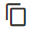

# Elements - HTML Code

Använd innehållstypen _HTML Code_ för att lägga till kodfragment av HTML-, CSS- och JavaScript-kod på [[!DNL Page Builder] scenen](workspace.md#stage). Du kan till exempel lägga till anpassad HTML och deklarera en CSS-klass som kan användas på ett element på sidan. Du kan också lägga till ett kodfragment för en logotyp, knapp eller banderoll som du har fått från en tredjepartsleverantör.

## Verktygslådan HTML Code

{width="500" zoomable="yes"}

| Verktyg | Ikon | Beskrivning |
| --------- | ---------- | ----------------- |
| Flytta | {width="25"} | Flyttar HTML Code-behållaren till en annan giltig plats på sidan. |
| Inställningar | {width="25"} | Öppnar sidan Redigera HTML-kod, där du kan ändra egenskaperna för behållaren. |
| Dölj | {width="25"} | Döljer HTML Code-behållaren. |
| Visa | {width="25"} | Visar den dolda HTML Code-behållaren. |
| Duplicera | {width="25"} | Skapar en kopia av HTML Code-behållaren. |
| Ta bort | {width="25"} | Tar bort HTML Code-behållaren och dess innehåll från scenen. |

{{$include /help/_includes/page-builder-hidden-element-note.md}}

## Lägg till HTML-kod

I följande exempel visas hur du bäddar in [Google Font][1]-kod och deklarerar anpassade rubrikklasser som åsidosätter den aktuella formatmallen.

### Steg 1: Välj ett Google-teckensnitt

1. Gå till webbplatsen [Google Fonts][1] och välj den teckensnittsfamilj som du vill använda.

1. Kopiera den genererade koden som ska bäddas in i avsnittet `<head>` på sidan och klistra in den tillfälligt i en textredigerare.

   - Bädda in teckensnittskod
   - CSS-regel

1. Lägg till regeln font-family för varje rubrikklass, som omger rubrikklasserna i en `<style>`-tagg.

   Den här koden klistras in i [!DNL Page Builder].

   ```html
   <style>
      h1 {color: teal; font-family: 'Khand', sans-serif; }
      h2 {color: teal; font-family: 'Khand', sans-serif; }
      h3 {color: teal; font-family: 'Khand', sans-serif; }
   </style>
   ```

### Steg 2: Lägg till koden på sidan

1. Gå till _>_ > **[!UICONTROL Content]** på sidofältet _[!UICONTROL Elements]_Admin **[!UICONTROL Pages]**i din butik.

1. Hitta sidan där teckensnittet ska vara tillgängligt och öppna den i redigeringsläge.

1. Bläddra nedåt och expandera avsnittet **[!UICONTROL Content]**.

1. Expandera [!DNL Page Builder] på panelen **[!UICONTROL Elements]** och dra en **[!UICONTROL HTML Code]** platshållare till en rad, kolumn eller tabb på scenen.

   Använd den röda stödlinjen för att placera avgränsaren antingen före eller efter en annan innehållsbehållare i rad-, kolumn- eller tabbuppsättningen.

   {width="600" zoomable="yes"}

1. Håll pekaren över HTML-behållaren för att visa verktygslådan och välj ikonen _Inställningar_ ( {width="20"} ).

1. Klistra in den inbäddade Google Fonts-koden och de formatdeklarationer som du har förberett i textrutan.

   Om du vill göra det enklare att läsa kan du ange några mellanslag för indrag av koden.

   {width="500" zoomable="yes"}

1. Uppdatera de återstående inställningarna efter behov (mer information finns i [Ändra kodinställningarna för HTML](#html-settings)).

1. Klicka på **[!UICONTROL Save]** i det övre högra hörnet för att tillämpa inställningarna och återgå till arbetsytan i [!DNL Page Builder].

   Det nya teckensnittet återges när sidan visas via en webbläsare.

### Steg 3: Förhandsgranska sidan

1. I avsnittet _[!UICONTROL Currently Active]_anger du **[!UICONTROL Enable Page]**till `Yes`.

   {width="600" zoomable="yes"}

1. Klicka på pilen **[!UICONTROL Save]** i det övre högra hörnet och välj **[!UICONTROL Save & Close]**.

1. Hitta sidan i rutnätet och välj **[!UICONTROL View]** i kolumnen _[!UICONTROL Actions]_.

   {width="700" zoomable="yes"}

## Ändra kodinställningar för HTML {#html-settings}

1. Håll pekaren över HTML-behållaren för att visa verktygslådan och välj ikonen _Inställningar_ ( {width="20"} ).

1. Redigera koden i textrutan efter behov.

   HTML-, CSS- och JavaScript-kod stöds. Kodfragment som tillhör avsnittet `<head>` på sidan kan anges här.

   Redigeraren innehåller även knappar för att infoga specialelement i koden:

   | Knapp | Beskrivning |
   | ------ | ----------- |
   | Infoga widget... | Klicka för att infoga en widget vid markörens position i textrutan HTML. |
   | Infoga bild... | Klicka för att infoga en överförd bild eller en bild från galleriet vid markörens position i textrutan HTML. |
   | Infoga variabel... | Klicka för att infoga en variabel vid markörens position i textrutan HTML. |

1. Uppdatera inställningarna för _[!UICONTROL Advanced]_efter behov.

   - Om du vill styra placeringen av koden i den överordnade behållaren väljer du en **[!UICONTROL Alignment]**:

     | Alternativ | Beskrivning |
     | ------ | ----------- |
     | `Default` | Använder den standardinställning för justering som anges i formatmallen för det aktuella temat. |
     | `Left` | Justerar listan längs den vänstra kanten på den överordnade behållaren, med hänsyn till eventuell utfyllnad som har angetts. |
     | `Center` | Justerar listan i mitten av den överordnade behållaren, med hänsyn till eventuell utfyllnad som har angetts. |
     | `Right` | Justerar blocket längs den högra kanten på den överordnade behållaren, med hänsyn till eventuell utfyllnad som har angetts. |

     I följande exempel ställs alternativen in på att använda en centrering för det återgivna kodblocket.

     {width="600" zoomable="yes"}

   - Ange det **[!UICONTROL Border]**-format som ska användas på alla fyra sidor i kodbehållaren:

     | Alternativ | Beskrivning |
     | ------ | ----------- |
     | `Default` | Använder det standardkantlinjeformat som anges av den associerade formatmallen. |
     | `None` | Visar inte någon synlig indikation för behållarkanterna. |
     | `Dotted` | Behållarramen visas som en prickad linje. |
     | `Dashed` | Behållarramen visas som en streckad linje. |
     | `Solid` | Behållarramen visas som en heldragen linje. |
     | `Double` | Behållarramen visas som en dubbel linje. |
     | `Groove` | Behållarkanten visas som en utdragen linje. |
     | `Ridge` | Behållarkanten visas som en rak linje. |
     | `Inset` | Behållarramen visas som en indragen linje. |
     | `Outset` | Behållarramen visas som en startrad. |

   - Om du anger ett annat kantlinjeformat än `None` fyller du i visningsalternativen för kantlinjen:

     | Alternativ | Beskrivning |
     | ------ |------------ |
     | [!UICONTROL Border Color] | Ange färgen genom att välja en färgruta, klicka på färgväljaren eller genom att ange ett giltigt färgnamn eller motsvarande hexadecimalt värde. |
     | [!UICONTROL Border Width] | Ange antalet pixlar för kantlinjens bredd. |
     | [!UICONTROL Border Radius] | Ange antalet pixlar för att definiera radiens storlek som används för att runda varje hörn av kanten. |

     {style="table-layout:auto"}

   - (Valfritt) Ange namnen på **[!UICONTROL CSS classes]** från den aktuella formatmallen som ska användas för behållaren.

     Avgränsa flera klassnamn med blanksteg.

   - Ange värden, i pixlar, för **[!UICONTROL Margins and Padding]** för att fastställa den yttre marginalerna och den inre utfyllnaden för kodbehållaren.

     Ange motsvarande värden i diagrammet.

     | Behållarområde | Beskrivning |
     | -------------- | ----------- |
     | [!UICONTROL Margins] | Mängden tomt utrymme som används på ytterkanten på behållarens alla sidor. Alternativ: `Top` / `Right` / `Bottom` / `Left` |
     | [!UICONTROL Padding] | Mängden tomt utrymme som används på behållarens inre kant på alla sidor. Alternativ: `Top` / `Right` / `Bottom` / `Left` |

[1]: https://fonts.google.com/

<!-- Last updated from includes: 2023-09-11 14:30:19 -->
