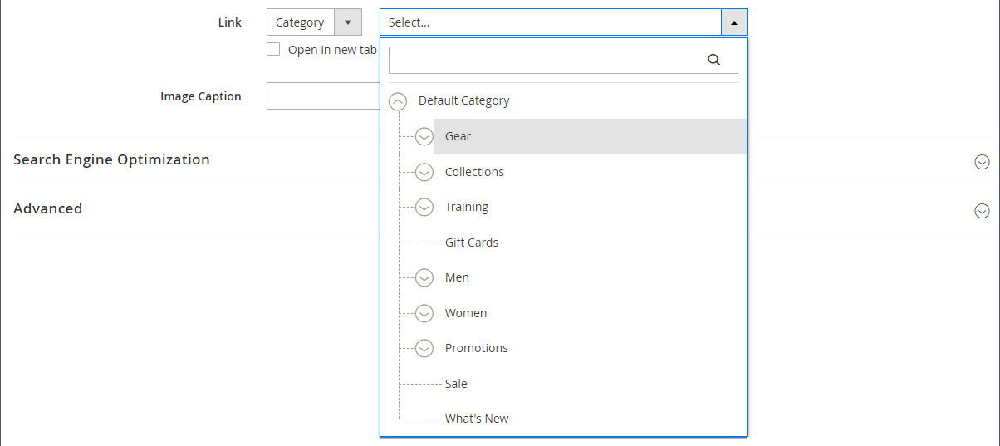

# Media - bild

Använd _Bild_ innehållstyp för att lägga till en JPG, GIF eller PNG-bild i [[!DNL Page Builder] stage](workspace.md#stage). Förutom standardskrivbordsbilden kan du ange en sekundär bild för mobila enheter. Du kan också lägga till en bildtext som visas under bilden och länka bilden till en URL-adress, produkt, kategori eller sida.

>[!TIP]
>
>Du kan använda [Adobe Stock Integration](../content-design/adobe-stock.md) att hitta och spara en lämplig resurs bland de miljontals som [Adobe Stock](https://stock.adobe.com). Se [Använda Adobe Stock-bilder](../content-design/adobe-stock-manage.md) om du vill ha mer information om hur du söker efter, finjusterar och sparar Adobe Stock-resurser i ditt galleri.

{{$include /help/_includes/page-builder-save-timeout.md}}

## Verktygslådan Bild

Verktygslådan för bilden visas när du hovrar över bildbehållaren.

{width="500" zoomable="yes"}

| Verktyg | Ikon | Beskrivning |
|--- |--- |--- |
| Flytta | {width="25"} | Flyttar bilden till en annan plats på scenen. |
| (etikett) | Bild | Identifierar den aktuella innehållsbehållaren som en bild. Håll pekaren över bildbehållaren för att visa verktygslådan. |
| Inställningar | {width="25"} | Öppnar _Redigera bild_ sida där du kan ändra egenskaperna för bilden och behållaren. |
| Dölj | {width="25"} | Döljer den aktuella bilden. |
| Visa | {width="25"} | Visar den dolda bilden. |
| Duplicera | {width="25"} | Skapar en kopia av bilden. |
| Ta bort | {width="25"} | Tar bort bilden från scenen. |
| Överför ny bild |  | Överför en bild från det lokala filsystemet till galleriet. |
| Välj från galleri |  | Väljer en befintlig bild från galleriet. |

{style="table-layout:auto"}

{{$include /help/_includes/page-builder-hidden-element-note.md}}

## Lägga till en bild

1. I [!DNL Page Builder] panel, expandera **[!UICONTROL Media]** och dra **[!UICONTROL Image]** platshållare till målbehållaren.

   Du kan lägga till en bild till en rad, kolumn eller tabb. I följande exempel dras bilden till en tom kolumn.

   {width="600" zoomable="yes"}

1. Använd någon av följande metoder för att lägga till bildresursen:

   {width="500" zoomable="yes"}

   >[!NOTE]
   >
   >Den största filstorleken är 4 MB. Filtyper som stöds är JPG, GIF och PNG.

   - _**Överför en ny bild**_: Använd den här metoden om du vill överföra en ny bildfil från datorn.

      - Klicka på **[!UICONTROL Upload Image]**.

      - Leta upp och välj bilden som du vill lägga till i galleriet och målbehållaren.

     Du kan också dra en bildfil från datorn och släppa den på _Kamera_ ( {width="20"} ).

   - _**Välj en befintlig resurs**_: Använd den här metoden för att välja en befintlig bildresurs från medielagring/galleri.

      - Klicka på **[!UICONTROL Select from Gallery]**.

      - Använd trädet för att navigera till bilden.

      - Klicka på miniatyrbilden och klicka på **[!UICONTROL Add Selected]**.

        {width="600" zoomable="yes"}

   - _**Söka efter och välja en Adobe Stock-bild**_: Använd den här metoden för att hitta en bild från Adobe Stock.

     >[!NOTE]
     >
     >Den här metoden kräver en [Integrering med Adobe Stock](../content-design/adobe-stock.md) konfigurerad för din administratör.

      - Klicka **[!UICONTROL Search Adobe Stock]** och söka efter en bild.

      - Spara förhandsvisningen eller den licensierade bilden i galleriet.

        Se [Använda Adobe Stock-bilder](../content-design/adobe-stock-manage.md) om du vill ha mer information om hur du arbetar med Adobe Stock-resurser.

      - Markera miniatyrbilden av resursen i galleriet och klicka på **[!UICONTROL Add Selected]**.

   Bilden visas i målbehållaren på platshållarplatsen. Till skillnad från en bakgrundsbild kan du flytta bilden till en annan plats i den aktuella behållaren eller till en annan behållare.

   >[!NOTE]
   >
   >The [Banderoll](banner.md) och [Skjutreglage](slider.md) innehållstyperna innehåller även _Överför bild_ och _Välj från galleri_ alternativ för att lägga till bilder.

   {width="500" zoomable="yes"}

## Ändra bildinställningar

1. Håll pekaren över bildbehållaren för att visa verktygslådan och välj _Inställningar_ ({width="20"} ).
Filnamnet, dimensionerna och filstorleken visas under den aktuella bilden.

   {width="600" zoomable="yes"}

1. Ändra aktuell **[!UICONTROL Image]** gör du något av följande:

   - _**Överför en ny bild**_: Använd den här metoden om du vill överföra en ny bildfil från datorn.

      - Klicka på **[!UICONTROL Upload Image]**.

      - Leta upp och välj bilden som du vill lägga till i galleriet och målbehållaren.

   - _**Välj en befintlig resurs**_: Använd den här metoden för att välja en befintlig bildresurs från medielagring/galleri.

      - Klicka på **[!UICONTROL Select from Gallery]**.

      - Använd trädet för att navigera till bilden.

      - Klicka på miniatyrbilden och klicka på **[!UICONTROL Add Selected]**.

        {width="600" zoomable="yes"}

   - **Söka efter och välja en Adobe Stock-bild**: Använd den här metoden för att hitta en bild från Adobe Stock.

     >[!NOTE]
     >
     >Den här metoden kräver en [Integrering med Adobe Stock](../content-design/adobe-stock.md) konfigurerad för din administratör.

      - Klicka **[!UICONTROL Search Adobe Stock]** och söka efter en bild.

      - Spara förhandsvisningen eller den licensierade bilden i galleriet.

        Se [Använda Adobe Stock-bilder](../content-design/adobe-stock-manage.md) om du vill ha mer information om hur du arbetar med Adobe Stock-resurser.

      - Markera miniatyrbilden av resursen i galleriet och klicka på **[!UICONTROL Add Selected]**.

1. Lägga till en **[!UICONTROL Mobile Image]** använder du samma metoder som beskrivs i föregående steg för att välja en bild som ska visas på mobila enheter.

   {width="600" zoomable="yes"}

1. Ange vid behov en **[!UICONTROL Link]** för bilden.

   Länken är den målsida som visas när kunden klickar på bilden. Du kan använda en av tre länktyper:

   - **[!UICONTROL URL]** - Länkar till en relativ eller fullständig URL-adress.

   - **[!UICONTROL Product]** - Identifierar målsidan baserat på produktnamnet eller SKU:n. Sök efter produkten efter namn baserat på antingen ett partiellt eller fullständigt namn. Välj produkten i sökresultatlistan.

     {width="600" zoomable="yes"}

   - **[!UICONTROL Category]** - Identifierar målsidan som en specifik kategori eller underkategori i kategoriträdet. Sök efter kategorin utifrån antingen ett helt eller delvis namn. Välj kategori i det utökade avsnittet i det visade trädet.

     {width="600" zoomable="yes"}

   - **[!UICONTROL Page]** - Identifierar målsidan som en specifik innehållssida. Sök efter sidan baserat på ett helt eller delvis namn. Välj sidan i sökresultatlistan.

     {width="600" zoomable="yes"}

   Om du vill hindra besökaren från att navigera utanför din butik väljer du **[!UICONTROL Open in new tab]** kryssrutan. När kryssrutan är avmarkerad öppnas det länkade målet på samma webbläsarflik, som kan navigera besökaren bort från din butik.

1. Lägga till en **[!UICONTROL Image Caption]** anger du den text som du vill ska visas under bilden.

   Bildtextens format bestäms av den formatmall som är kopplad till det aktuella temat.

   Bildtexten visas vanligtvis under bilden och ger information om bilden för besökare och sökmotorer. Om webbplatsen finns på flera språk kan du använda samma bild, men översätta bildtexten. I HTML `<figcaption>` -taggen är en delmängd av `<figure>` -tagg. `<figcaption>This is the image caption</figcaption>`

1. Uppdatera övriga inställningar efter behov:

   - [Sökmotoroptimering](#search-engine-optimization)
   - [Avancerat](#advanced)

1. När du är klar klickar du på **[!UICONTROL Save]** för att använda inställningarna och gå tillbaka till [!DNL Page Builder] arbetsyta.

## Flytta en bild

1. Håll pekaren över bildbehållaren för att visa verktygslådan och välj _Flytta_ ({width="20"} ).

   {width="500" zoomable="yes"}

1. Markera och dra bilden till den nya positionen, precis nedanför den röda stödlinjen.

   {width="500" zoomable="yes"}

## Ta bort en bild

1. Håll pekaren över bildbehållaren för att visa verktygslådan och välj _Ta bort_ ( {width="20"} ).

1. När du uppmanas att bekräfta klickar du på **[!UICONTROL OK]**.

## Sökmotoroptimering

Texten för de här inställningarna visas för sökmotorer och förbättrar indexeringen av sidan.

- För **[!UICONTROL Alternative Text]**, ange en _alt_ textbeskrivning för de digitala tillgänglighetsverktygen som ska visas.

  Alternativtext är en god hjälpmedelspraxis och krävs enligt lag i vissa språkområden. I HTML `alt` är en delmängd av `image` tagg: `<image title="tooltip" alt="description" src="image.jpg">`.

- För **[!UICONTROL Title Attribute]** anger du den text som ska visas som ett verktygstips när du för musen över.

  Det bästa sättet är att välja en beskrivande, nyckelordsrik titel som förbättrar hur bilden indexeras av sökmotorer. I HTML `title` är en delmängd av `image` tagg: `<image title="tooltip" alt="description" src="image.jpg">`.

## [!UICONTROL Advanced]

- Om du vill styra den vågräta placeringen av bilderna som läggs till i behållaren väljer du en **[!UICONTROL Alignment]**.

  | Alternativ | Beskrivning |
  | ------ | ----------- |
  | `Default` | Använder den standardinställning för justering som anges i formatmallen för det aktuella temat. |
  | `Left` | Justerar bildinnehållet längs den vänstra kanten av bildbehållaren, med hänsyn till eventuell utfyllnad som har angetts. |
  | `Center` | Justerar bildinnehållet i mitten av bildbehållaren, med hänsyn till eventuell utfyllnad som har angetts. |
  | `Right` | Justerar bildinnehållet längs den högra kanten av bildbehållaren, med hänsyn till eventuell utfyllnad som har angetts. |

  {style="table-layout:auto"}

- Ange **[!UICONTROL Border]** format som används på alla fyra sidorna i bildbehållaren:

  | Alternativ | Beskrivning |
  | ------ | ----------- |
  | `Default` | Använder det standardkantlinjeformat som anges av den associerade formatmallen. |
  | `None` | Visar inte någon synlig indikation för behållarkanterna. |
  | `Dotted` | Behållarramen visas som en prickad linje. |
  | `Dashed` | Behållarramen visas som en streckad linje. |
  | `Solid` | Behållarramen visas som en heldragen linje. |
  | `Double` | Behållarramen visas som en dubbel linje. |
  | `Groove` | Behållarkanten visas som en utdragen linje. |
  | `Ridge` | Behållarkanten visas som en rak linje. |
  | `Inset` | Behållarramen visas som en indragen linje. |
  | `Outset` | Behållarramen visas som en startrad. |

  {style="table-layout:auto"}

- Om du anger ett annat kantlinjeformat än `None`slutför du visningsalternativen för kantlinjer:

  {width="600" zoomable="yes"}

  | Alternativ | Beskrivning |
  | ------ |------------ |
  | [!UICONTROL Border Color] | Ange färgen genom att välja en färgruta, klicka på färgväljaren eller genom att ange ett giltigt färgnamn eller motsvarande hexadecimalt värde. |
  | [!UICONTROL Border Width] | Ange antalet pixlar för kantlinjens bredd. |
  | [!UICONTROL Border Radius] | Ange antalet pixlar för att definiera radiens storlek som används för att runda varje hörn av kanten. |

  {style="table-layout:auto"}

- (Valfritt) Ange namnen på **[!UICONTROL CSS classes]** från den aktuella formatmallen som ska användas i bildbehållaren.

  Avgränsa flera klassnamn med blanksteg.

- Ange värden i pixlar för **[!UICONTROL Margins and Padding]** om du vill ange de yttre marginalerna och den inre utfyllnaden för bildbehållaren.

  Ange varje motsvarande värde i bildbehållardiagrammet.

  | Behållarområde | Beskrivning |
  | -------------- | ----------- |
  | [!UICONTROL Margins] | Mängden tomt utrymme som används på ytterkanten på behållarens alla sidor. |
  | [!UICONTROL Padding] | Mängden tomt utrymme som används på behållarens inre kant på alla sidor. |

  {style="table-layout:auto"}
