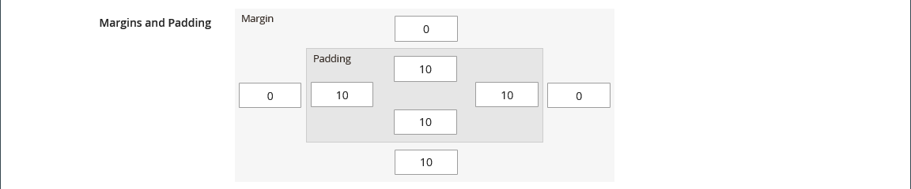

# Layout - rad

Använd innehållstypen _Rad_ för att lägga till en rad i [[!DNL Page Builder] scenen](workspace.md#stage).

{{$include /help/_includes/page-builder-save-timeout.md}}

## Verktygslådan Rad

Verktygslådan för raden visas när du hovrar över radbehållaren. Verktygslådan innehåller alternativ för att flytta, dölja, duplicera, redigera eller ta bort raden. Valet av inställningar avgör radens utseende, bakgrund och layout. Ytterligare innehållselement kan dras till raden från panelen [!DNL Page Builder] till vänster.

{width="600" zoomable="yes"}

| Verktyg | Ikon | Beskrivning |
| --------- | ---------- | ----------- |
| Flytta | {width="25"} | Flyttar raden till en annan position i förhållande till andra rader på scenen. |
| (etikett) | [!UICONTROL Row] | Identifierar den aktuella innehållsbehållaren som en rad. Håll pekaren över behållaren för att visa verktygslådan. |
| Inställningar | {width="25"} | Öppnar sidan Redigera rad, där du kan ändra egenskaperna för behållaren. |
| Dölj | {width="25"} | Döljer den aktuella raden. |
| Visa | {width="25"} | Visar den dolda raden. |
| Duplicera | {width="25"} | Skapar en kopia av raden. |
| Ta bort | {width="25"} | Tar bort radbehållaren och dess innehåll från scenen. |

{style="table-layout:auto"}

{{$include /help/_includes/page-builder-hidden-element-note.md}}

## Lägga till en rad

1. Dra en ny [!DNL Page Builder] till scenen på panelen _[!UICONTROL Layout]_under **[!UICONTROL Row]**, precis nedanför den första raden.

1. Om du vill formatera raden för du muspekaren över radbehållaren för att visa verktygslådan och väljer ikonen _Inställningar_ ( {width="20"} ).

   I följande avsnitt finns detaljerad information om hur du fyller i de tillgängliga inställningarna.

   {width="600" zoomable="yes"}

## Ändra radinställningar

1. Håll pekaren över radbehållaren för att visa verktygslådan och välj ikonen _Inställningar_ ( {width="20"} ).

   {width="600" zoomable="yes"}

1. Använd följande avsnitt för detaljerad information om hur du uppdaterar de tillgängliga inställningarna.

1. När du är klar klickar du på **[!UICONTROL Save]** för att tillämpa inställningarna och återgå till arbetsytan i [!DNL Page Builder].

## Utseende

Använd inställningarna för _Utseende_ för att bestämma hur innehåll visas på raden.

{width="600" zoomable="yes"}

- Om du vill bestämma hur bakgrundsfärgen och/eller bakgrundsbilden ska visas i förhållande till behållaren och bredden för innehållsområdet väljer du justeringen:

  | Alternativ | Beskrivning |
  | ------ | ----------- |
  | [!UICONTROL Contained] | Bakgrundsfärgen eller bilden är begränsad till den maximala sidbredd som definieras av temat. |
  | [!UICONTROL Full Width] | Begränsar innehållet till den maximala sidbredd som definieras av temat. Bakgrundsfärgen och/eller bilden är inte begränsad och utökar radens hela bredd. |
  | [!UICONTROL Full Bleed] | Innehållet och bakgrundsbilden och/eller färgen är inte begränsade och radens fulla bredd utökas. Fullt utfall kan bara användas med [teman](../content-design/themes.md) som stöder layouten. |

  {style="table-layout:auto"}

- Ange **[!UICONTROL Minimum Height]** för raden. Det här värdet kan vara ett tal med en giltig CSS-enhet (till exempel `100px`, `50%`, `50em`, `100vh`) eller en beräkning (till exempel `100vh - 237px`).

  Du kan till exempel ange den minsta radhöjden för att sträcka ut hela sidhöjden, vilket ger dig övertygande alternativ för helsidesbakgrundsbilder och -videor.

- Välj en **[!UICONTROL Vertical Alignment]**-inställning om du vill justera alla innehållsbehållare som läggs till på raden (Överkant, Mitten eller Nederkant).

## Bakgrund

Det finns många alternativ för att definiera hur en rad visas i bakgrunden. Du kan använda en enkel färg- eller bakgrundsbild och hantera mer avancerade effekter.

### Bakgrundsfärg

Ange bakgrundsfärgen genom att välja en färgruta, klicka på färgväljaren eller genom att ange ett giltigt färgnamn eller motsvarande hexadecimalt värde. Den här inställningen bestämmer radens bakgrundsfärg. Du kan också justera färgens opacitet.

{width="200"}

Du kan ange värdet på ett av tre sätt:

- Ett fördefinierat färgnamn, till exempel `White`
- Det hexadecimala färgvärdet för färgen, till exempel `#ffffff`
- RGB-värdet för färgen, med opacitetsprocent, till exempel `rgba(255, 255, 255, 0.75)`

Om du vill välja en färg klickar du på färgrutan till vänster om rutan _Ingen färg_ .

{width="600" zoomable="yes"}

Om du klickar på färgrutan för att öppna färgväljaren igen visar rutan under reglaget de aktuella värdena för rött, grönt, blått och alfa (rgba). Det sista talet anger den aktuella opaciteten i procent som decimal. Du kan justera opaciteten med hjälp av skjutreglaget eller ange ett decimalvärde.

{width="600" zoomable="yes"}

>[!NOTE]
>
>[!DNL Page Builder] har också stöd för ett genomskinlighetslager, eller _alfakanal_, i bakgrundsbilder som kan användas för att skapa bakgrunder med olika grad av opacitet.

### [!UICONTROL Background Type]

En bakgrundstyp kan vara en bild eller en video. [!DNL Page Builder] är som standard `Image` och visar olika bildinställningar. Om du väljer `Video` byter [!DNL Page Builder] bildinställningarna mot videoinställningarna. Båda bakgrundstyperna beskrivs nedan.

{width="200"}

### Inställningar för bildtyp

Om du ställer in _[!UICONTROL Background Type]_på `Image` använder du följande inställningar för att definiera hur bakgrundsbilden ska visas.

{width="600" zoomable="yes"}

- **[!UICONTROL Background Image]** - Om det behövs använder du de angivna verktygen för att välja en bakgrundsbild som ska användas på raden:

  | Alternativ | Beskrivning |
  | ------ | ----------- |
  | [!UICONTROL Upload] | Överför en bildfil från den lokala datorn till galleriet och använder den sedan som bakgrundsbild för raden. |
  | [!UICONTROL Select from Gallery] | Uppmanar dig att välja en befintlig bild från galleriet som bakgrundsbild för raden. |
  | {width="25"} | Gör att du kan dra bilden till kamerapanelen eller bläddra till bilden i det lokala filsystemet. |

  {style="table-layout:auto"}

- **[!UICONTROL Background Mobile Image]** - Använd vid behov samma verktyg för att välja en annan bakgrundsbild som ska användas för visning på mobila enheter.

- **[!UICONTROL Background Size]** - Ange det här alternativet för att bestämma hur bakgrundsbilden ska skalas i relation till radens bredd:

  | Alternativ | Beskrivning |
  | ------ | ----------- |
  | `Cover` | Bakgrundsbilden täcker radens hela bredd. |
  | `Contain` | Bakgrundsbilden är begränsad till innehållsområdets bredd. |
  | `Auto` | Använder storleken från den aktuella formatmallen. |

  {style="table-layout:auto"}

  {width="250"}

- **[!UICONTROL Background Position]** - Ange det här alternativet för att bestämma hur bakgrundsbilden är förankrad i förhållande till raden:

  | Ankarpunkt | Position |
  | ------ | ----------- |
  | `Top` | Vänster / Mitten / Höger |
  | `Center` | Vänster / Mitten / Höger |
  | `Bottom` | Vänster / Mitten / Höger |

  {style="table-layout:auto"}

  Fästpunkten är som ett push-stift som fäster bilden vid raden vid den angivna bakgrundspositionen.

- **[!UICONTROL Background Attachment]** - Ange bilagetypen för att bestämma hur bakgrundsbilden flyttas i relation till rullningssidan:

  | Alternativ | Beskrivning |
  | ------ | ----------- |
  | `Scroll` | Den bifogade bakgrundsbilden synkroniseras så att den flyttas nedåt när sidan rullas. Använd Parallax-bakgrund för att styra rullningshastigheten. |
  | `Fixed` | (Inte tillgängligt för mobiler) Bakgrundsbilden flyttas inte när behållaren rullas över bilden och är fast vid den angivna bakgrundspositionen. |

  {style="table-layout:auto"}

- **[!UICONTROL Background Repeat]** - Ange som `Yes` om du vill upprepa bakgrundsbilden för att fylla det tillgängliga utrymmet på raden.

### Inställningar för videotyp

Om du anger _bakgrundstypen_ till `Video` använder du följande inställningar för att definiera hur bakgrundsbilden ska visas.

- **[!UICONTROL Video URL]** - Ange en giltig video-URL. Giltiga video-URL:er kan vara länkar till:

   - YouTube-videofilmer: `https://youtu.be/CoDhMRUUjeI`
   - Vimeo-videofilmer: `https://vimeo.com/190156113`
   - Giltiga videofiler (`.mp4` rekommenderas): `https://myvideos.com/spiral.mp4`

  {width="300"}

- **[!UICONTROL Overlay Color]** - Välj en färg för att använda en genomskinlig färgton på videon.

- **[!UICONTROL Infinite Loop]** - Ange till `No` om du vill att videon ska spelas upp en gång och stoppas. När det här alternativet är inställt på `Yes` (standard) upprepas videon i en oändlig slinga.

- **[!UICONTROL Lazy Load]** - Ange som `No` om du vill att videon ska läsas in med sidan, även när den inte är synlig. När det här alternativet är inställt på `Yes` (standard) läses videon in från källan endast när den är synlig på skärmen.

- **[!UICONTROL Play Only When Visible]** - Ange till `No` om du vill att videon ska börja spelas upp omedelbart efter att den har lästs in, oavsett om den är synlig eller inte. När det här alternativet är inställt på `Yes` (standard) börjar videon spelas upp endast när den är synlig.

- **[!UICONTROL Fallback Image]** - Om det behövs anger du en bild som ska visas på skärmen innan videon läses in och om videon inte läses in av någon anledning.

## Parallaxbakgrund

Använd de här alternativen om du vill styra hastigheten för en rullad bakgrundsbild eller -video i förhållande till sidans rullning. Bakgrunden kan ställas in så att den rullas långsammare för att skapa en känsla av nedsänkning.

- Ange **Aktivera parallaxbakgrund** till `Yes`.
- Ange **Parallaxhastigheten** som ett decimalvärde mellan `-1.0` och `2.0`.

{width="600" zoomable="yes"}

## Avancerat

- Om du vill styra den vågräta placeringen av innehållsbehållare som läggs till på raden väljer du en **[!UICONTROL Alignment]**:

  | Alternativ | Beskrivning |
  | ------ | ----------- |
  | `Default` | Använder den standardinställning för justering som anges i formatmallen för det aktuella temat. |
  | `Left` | Justerar innehållsbehållarna längs radens vänstra kant, med hänsyn till eventuell utfyllnad som har angetts. |
  | `Center` | Justerar innehållsbehållaren i mitten av radbehållaren, med hänsyn till eventuell utfyllnad som har angetts. |
  | `Right` | Justerar innehållsbehållaren längs radens högra kant, med hänsyn till eventuell utfyllnad som har angetts. |

  {style="table-layout:auto"}

- Ange det **[!UICONTROL Border]**-format som ska användas på alla fyra sidor i radbehållaren:

  | Alternativ | Beskrivning |
  | ------ | ----------- |
  | `Default` | Använder det standardkantlinjeformat som anges av den associerade formatmallen. |
  | `None` | Visar inte någon synlig indikation för behållarkanterna. |
  | `Dotted` | Behållarramen visas som en prickad linje. |
  | `Dashed` | Behållarramen visas som en streckad linje. |
  | `Solid` | Behållarramen visas som en heldragen linje. |
  | `Double` | Behållarramen visas som en dubbel linje. |
  | `Groove` | Behållarkanten visas som en utdragen linje. |
  | `Ridge` | Behållarkanten visas som en rak linje. |
  | `Inset` | Behållarramen visas som en indragen linje. |
  | `Outset` | Behållarramen visas som en startrad. |

  {style="table-layout:auto"}

- Om du anger ett annat kantlinjeformat än `None` fyller du i visningsalternativen för kantlinjen:

  {width="600" zoomable="yes"}

  | Alternativ | Beskrivning |
  | ------ |------------ |
  | [!UICONTROL Border Color] | Ange färgen genom att välja en färgruta, klicka på färgväljaren eller genom att ange ett giltigt färgnamn eller motsvarande hexadecimalt värde. |
  | [!UICONTROL Border Width] | Ange antalet pixlar för kantlinjens bredd. |
  | [!UICONTROL Border Radius] | Ange antalet pixlar för att definiera radiens storlek som används för att runda varje hörn av kanten. |

  {style="table-layout:auto"}

  Raden i följande exempel har en kantradie på 15.

  {width="500"}

- (Valfritt) Ange namnen på **[!UICONTROL CSS classes]** från den aktuella formatmallen som ska användas för radbehållaren.

  Avgränsa flera klassnamn med blanksteg.

- Ange värden (i pixlar) för **[!UICONTROL Margins and Padding]** för att ange radens yttre marginaler och inre utfyllnad.

  Ange varje motsvarande värde i radbehållardiagrammet.

  | Behållarområde | Beskrivning |
  | -------------- | ----------- |
  | [!UICONTROL Margins] | Mängden tomt utrymme som används på ytterkanten på behållarens alla sidor. Alternativ: `Top` / `Right` / `Bottom` / `Left` |
  | [!UICONTROL Padding] | Mängden tomt utrymme som används på behållarens inre kant på alla sidor. Alternativ: `Top` / `Right` / `Bottom` / `Left` |

  {style="table-layout:auto"}

  {width="600" zoomable="yes"}

<!-- Last updated from includes: 2023-09-11 14:30:19 -->
