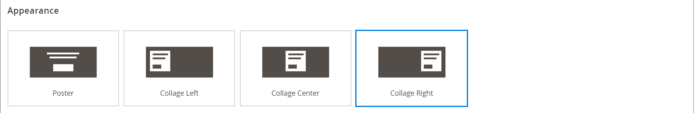

# Media - Skjutreglage

Använd innehållstypen _Slider_ för att lägga till ett bildspel med bilder på [[!DNL Page Builder] scenen](workspace.md#stage). Du kan överföra nya bilder eller välja befintliga bilder från galleriet eller produktkatalogen. Ett reglage kan ställas in så att det spelas upp automatiskt eller styras manuellt med navigeringsknappar. Mer information om hur du associerar skjutreglaget med en viss befordran finns i [Dynamiskt block](dynamic-block.md).

{width="700" zoomable="yes"}

{{$include /help/_includes/page-builder-save-timeout.md}}

## Verktygslådor

När du arbetar med Slider-innehållstypen lägger du till och redigerar enskilda bildrutor och den skjutreglagebehållare som innehåller en eller flera bildrutor. Varje bild har en egen verktygslåda som du använder för att utforma bilder på scenen [!DNL Page Builder].

## Verktygslåda för enskilda bilder

{width="500" zoomable="yes"}

| Verktyg | Ikon | Beskrivning |
|--- |--- |--- |
| Flytta | {width="25"} | Flyttar bildrutan till en annan plats på skjutreglaget. |
| (etikett) | Bild # | Identifierar numret på den aktuella bilden. |
| Inställningar | {width="25"} | Öppnar sidan _[!UICONTROL Edit Slide]_, där du kan ändra den aktuella bildrutans egenskaper. |
| Duplicera | {width="25"} | Skapar en kopia av den aktuella bildrutan. |
| Ta bort | {width="25"} | Tar bort den aktuella bildrutan från skjutreglaget. |

{style="table-layout:auto"}

## Verktygslådan Skjutreglage

| Verktyg | Ikon | Beskrivning |
|--- |--- |--- |
| Flytta | {width="25"} | Flyttar reglaget till en annan plats på scenen. |
| (etikett) | [!UICONTROL Slider] | Anger skjutreglagebehållaren. |
| Inställningar | {width="25"} | Öppnar sidan _[!UICONTROL Edit Slider]_, där du kan ändra egenskaperna för videon och behållaren. |
| Dölj | {width="25"} | Döljer det aktuella skjutreglaget. |
| Visa | {width="25"} | Visar det dolda skjutreglaget. |
| Duplicera | {width="25"} | Skapar en kopia av skjutreglaget. |
| Ta bort | {width="25"} | Tar bort skjutreglaget från scenen. |

{style="table-layout:auto"}

{{$include /help/_includes/page-builder-hidden-element-note.md}}

## Lägga till en enskild bildruta

1. Öppna sidan, blocket eller det dynamiska blocket där du vill placera skjutreglaget och expandera avsnittet **[!UICONTROL Content]**.

1. Expandera **[!UICONTROL Media]** på panelen [!DNL Page Builder] och dra en **[!UICONTROL Slider]** platshållare till en rad, kolumn eller tabb på scenen.

   I följande exempel är radens bakgrundsfärg gul (`#fffd16`).

   {width="600" zoomable="yes"}

   Skjutreglagebehållaren visas på scenen med en enda tom bildruta.

1. Klicka i skjutreglagebehållaren för att visa [textredigeraren](../content-design/editor.md) och ange innehåll för den första bildrutan.

   Du kan även inkludera mer komplext banderollinnehåll med inställningarna för [Innehåll](#content) .

1. Klicka på navigeringspunkten längst ned i skjutreglaget för att visa verktygslådan för den enskilda bildrutan och välj ikonen _Inställningar_ ( {width="20"} ).

   Skjutreglage har två verktygslådor. Se till att du använder bildverktygslådan längst ned.

1. Slutför inställningarna efter behov enligt följande avsnitt:

   - [[!UICONTROL Appearance]](#appearance)
   - [[!UICONTROL Background]](#background)
   - [[!UICONTROL Content]](#content)
   - [[!UICONTROL Search Engine Optimization]](#seo)
   - [[!UICONTROL Advanced]](#advanced)

1. När du är klar klickar du på **[!UICONTROL Save]** för att tillämpa inställningarna och återgå till arbetsytan i [!DNL Page Builder].

## Lägg till fler bilder

I följande avsnitt beskrivs en serie steg som du kan använda för att börja med en enskild bildruta och skapa ett responsivt reglage med funktioner och länkar till specifika produkter. Om du inte redan har en enskild bildruta följer du instruktionerna ovan för att lägga till en enskild bildruta på scenen.

Om du vill lägga till bildrutor använder du en eller flera av följande metoder:

### Metod 1: Duplicera en befintlig bildruta

Du kan spara tid genom att duplicera en bildruta som redan har konfigurerats med de nödvändiga inställningarna.

1. Klicka på navigeringspunkten under bildrutan för att visa verktygslådan och välj ikonen _Duplicera_ ( {width="20"} ).

   {width="500" zoomable="yes"}

1. Klicka på navigeringspunkten för den nya bildrutan och visa verktygslådan och välj ikonen _Inställningar_ ( {width="20"} ).

1. Ändra inställningarna efter behov enligt följande avsnitt:

   - [[!UICONTROL Appearance]](#appearance)
   - [[!UICONTROL Background]](#background)
   - [[!UICONTROL Content]](#content)
   - [[!UICONTROL Advanced]](#advanced)

1. När du är klar klickar du på **[!UICONTROL Save]** för att tillämpa inställningarna och återgå till arbetsytan i [!DNL Page Builder].

### Metod 2: Lägg till en ny tom bildruta

1. Håll pekaren över skjutreglagebehållaren längst upp för att visa verktygslådan och välj ikonen _Lägg till_ ( {width="20"} ).

   {width="500" zoomable="yes"}

   En ny tom bildruta med en egen navigeringspunkt och verktygslåda läggs till i skjutreglaget och visas på scenen.

   {width="500" zoomable="yes"}

1. Klicka på navigeringspunkten för den nya bildrutan och visa verktygslådan och välj ikonen _Inställningar_ ( {width="20"} ).

1. Ändra inställningarna efter behov enligt följande avsnitt:

   - [[!UICONTROL Appearance]](#appearance)
   - [[!UICONTROL Background]](#background)
   - [[!UICONTROL Content]](#content)
   - [[!UICONTROL Advanced]](#advanced)

1. När du är klar klickar du på **[!UICONTROL Save]** i det övre högra hörnet för att stänga sidan _[!UICONTROL Edit Slide]_.

### Lägga till widget i en bildruta

Du kan lägga till alla [widgettyper](../content-design/widgets.md#widget-types) i bildrutan på en [!DNL Page Builder]-scen genom att följa följande steg:

1. [Skapa den widget](../content-design/widget-create.md) som du vill se på en bildruta.

1. Öppna sidan, blocket eller det dynamiska blocket där du vill placera skjutreglaget och expandera avsnittet **[!UICONTROL Content]**.

1. Expandera **[!UICONTROL Media]** på panelen [!DNL Page Builder] och dra en **[!UICONTROL Slider]** platshållare till en rad, kolumn eller tabb på scenen.

1. Klicka i skjutreglagebehållaren för att visa verktygsfältet [textredigerare](../content-design/editor.md) och klicka på ikonen _Infoga widget_ ( {width="20"} ).

1. Välj den **[!UICONTROL Widget Type]** du behöver.

1. Ange inställningarna, som är olika beroende på typen av widget

   {width="600" zoomable="yes"}

1. När du är klar klickar du på **[!UICONTROL Insert Widget]** i det övre högra hörnet.

1. Ändra övriga inställningar efter behov.

1. När du är klar klickar du på **[!UICONTROL Save]** i det övre högra hörnet.

   {width="600" zoomable="yes"}

### Visa varje bild

Om du vill visa varje bildruta på scenen klickar du på nästa punkt under den bildruta som visas.

{width="500" zoomable="yes"}

Bilden i föregående exempel har en bakgrundsbild, en genomskinlig mobilbild och en textbunden bild som har lagts till från textredigeraren. Den här tekniken fungerar bra på mobila enheter genom att stänga av bakgrundsbilden och bara visa den mindre textbundna bilden. Produktbilden i det här exemplet har följande ytterligare inställningar:

| Alternativ | Exempelinställning |
|--- |--- |
| [!UICONTROL Appearance] | `Collage Right` |
| [!UICONTROL Background Color] | `#ffffff` (vit) |
| [!UICONTROL Background Image] | Bilden på den här bilden sparades från produktsidan och överfördes till galleriet. |
| [!UICONTROL Mobile Background Image] | Den mobila bakgrundsbilden är en genomskinlig bild som är 10 pixlar fyrkantig. Om du använder en tom bild för mobilen ersätts standardbakgrundsbilden med en osynlig bild. |
| [!UICONTROL Background Size] | `Auto` |
| [!UICONTROL Message Text] | `Minerva LumaTech&trade; V-Tee` (centrera justering) med infogad bild skalad till 40 % (centrera justering) |
| [!UICONTROL Link] | `Product` |
| [!UICONTROL Show Button] | `Always` |
| [!UICONTROL Button Text] | `Buy Now` |
| [!UICONTROL Show Overlay] | `Never Show` |
| [!UICONTROL Alignment] | `Center` (för att justera knappen) |
| [!UICONTROL Border] | `Solid` |
| [!UICONTROL Border Color] | `#000000` (svart) |
| [!UICONTROL Border Width] | `1 px` |

{style="table-layout:auto"}

## Ändra inställningar för enskilda bildrutor

1. Ändra skjutreglaget på scenen och visa den bildruta som du vill ändra.

1. I verktygslådan för enskilda bildrutor väljer du ikonen _Inställningar_ ( {width="20"} ) och slutför inställningarna efter behov enligt följande avsnitt.

1. Klicka på **[!UICONTROL Save]** i det övre högra hörnet för att tillämpa inställningarna och återgå till arbetsytan i [!DNL Page Builder].

### [!UICONTROL Appearance]

1. Välj någon av följande bildplaceringstyper:

   | Typ | Beskrivning |
   | ---- | ----------- |
   | `Poster` | Centrerar bildruteinnehållet i skjutreglagebehållaren. Om övertäckningen används utökas reglagets hela bredd. |
   | `Collage Left` | Placerar bildinnehållet i ett definierat område på vänster sida av skjutreglagebehållaren. Om övertäckningen används, täcker den bara det definierade området. |
   | `Collage Center` | Placerar bildinnehållet i ett definierat område centrerat i skjutreglagebehållaren. Om övertäckningen används, täcker den bara det definierade området. |
   | `Collage Right` | Placerar bildinnehållet i ett definierat område på den högra sidan av skjutreglagebehållaren. Om övertäckningen används, täcker den bara det definierade området. |

   {style="table-layout:auto"}

   {width="600" zoomable="yes"}

1. Ange **[!UICONTROL Slide Name]**.

   När du arbetar i redigeringsläge visas bildrutenamnet som ett verktygstips ovanför navigeringspunkten. Bildrutenamnet visas inte från butiken.

   {width="500" zoomable="yes"}

1. Ange **[!UICONTROL Minimum Height]** för bildrutan.

   Den minsta höjden kan vara ett tal med en giltig CSS-enhet (till exempel `100px`, `50%`, `50em`, `100vh`) eller en beräkning (till exempel `100vh - 237px`).

   Du kan till exempel ställa in bildspelets minsta höjd så att den täcker hela sidans höjd och sedan använda bakgrundsbilder och -videor för att skapa snygga designalternativ.

   >[!NOTE]
   >
   >När bildrutan är inställd på hela sidhöjden (100vh) sträcks även reglaget som innehåller bildrutan ut hela sidhöjden så att den passar bildrutans höjd.

## [!UICONTROL Background]

Det finns många alternativ för att definiera bakgrundsvisningen för en bildruta. Du kan använda en enkel färg- eller bakgrundsbild och hantera mer avancerade effekter.

### [!UICONTROL Background Color]

Ange bakgrundsfärgen genom att välja en färgruta, klicka på färgväljaren eller genom att ange ett giltigt färgnamn eller motsvarande hexadecimalt värde. Den här inställningen bestämmer radens bakgrundsfärg. Du kan också justera färgens opacitet.

{width="200"}

Du kan ange värdet på ett av tre sätt:

- Ett fördefinierat färgnamn, till exempel `White`
- Det hexadecimala färgvärdet för färgen, till exempel `#ffffff`
- RGB-värdet för färgen, med opacitetsprocent, till exempel `rgba(255, 255, 255, 0.75)`

Om du vill välja en färg klickar du på färgrutan till vänster om rutan _Ingen färg_ .

{width="600" zoomable="yes"}

Om du klickar på färgrutan för att öppna färgväljaren igen visar rutan under reglaget de aktuella värdena för rött, grönt, blått och alfa (rgba). Det sista talet anger den aktuella opaciteten i procent som decimal. Du kan justera opaciteten med hjälp av skjutreglaget eller ange ett decimalvärde.

{width="600" zoomable="yes"}

>[!NOTE]
>
>[!DNL Page Builder] har också stöd för ett genomskinlighetslager, eller _alfakanal_, i bakgrundsbilder som kan användas för att skapa bakgrunder med olika grad av opacitet.

### [!UICONTROL Background Type]

En bakgrundstyp kan vara en bild eller en video. [!DNL Page Builder] är som standard `Image` och visar olika bildinställningar. Om du väljer `Video` byter [!DNL Page Builder] bildinställningarna mot videoinställningarna. Båda bakgrundstypsinställningarna beskrivs i följande avsnitt.

{width="400"}

### Inställningar för bildtyp

Om du ställer in _[!UICONTROL Background Type]_&#x200B;på `Image` använder du följande inställningar för att definiera hur bakgrundsbilden ska visas.

{width="600" zoomable="yes"}

- **[!UICONTROL Background Image]** - Om det behövs kan du använda de angivna verktygen för att välja en bakgrundsbild som ska användas på banderollen:

  | Verktyg | Beskrivning |
  | ---- | ----------- |
  | [!UICONTROL Upload] | Överför en bildfil från den lokala datorn till galleriet och använder den sedan som bakgrundsbild för banderollen. |
  | [!UICONTROL Select from Gallery] | Uppmanar dig att välja en befintlig bild från galleriet som bakgrundsbild för banderollen. |
  | {width="25"} | Gör att du kan dra bilden till kamerapanelen eller bläddra till bilden i det lokala filsystemet. |

  {style="table-layout:auto"}

- **[!UICONTROL Background Mobile Image]** - Använd vid behov samma verktyg för att välja en annan bakgrundsbild som ska användas för visning på mobila enheter.

- **[!UICONTROL Background Size]** - Välj hur bakgrundsbilden ska skalas i förhållande till banderollens bredd:

  | Alternativ | Beskrivning |
  | ------ | ----------- |
  | `Cover` | Bakgrundsbilden täcker banderollens hela bredd. |
  | `Contain` | Bakgrundsbilden är begränsad till innehållsområdets bredd. |
  | `Auto` | Använder storleken från den aktuella formatmallen. |

  {style="table-layout:auto"}

  {width="400"}

- **[!UICONTROL Background Position]** - Välj hur bakgrundsbilden ska förankras i förhållande till banderollen:

  | Ankarpunkt | Position |
  | ------------ | -------- |
  | `Top` | Vänster / Mitten / Höger |
  | `Center` | Vänster / Mitten / Höger |
  | `Bottom` | Vänster / Mitten / Höger |

  {style="table-layout:auto"}

  Fästpunkten är som ett push-stift som fäster bilden vid banderollen vid den angivna bakgrundspositionen.

- **[!UICONTROL Background Repeat]** - Om du vill upprepa bakgrundsbilden för att fylla utrymmet ändrar du den här inställningen `Yes`.

### Inställningar för videotyp

Om du anger _bakgrundstypen_ till `Video` använder du följande inställningar för att definiera hur bakgrundsbilden ska visas.

- **[!UICONTROL Video URL]** - Ange en giltig video-URL. Giltiga video-URL:er kan vara länkar till:

   - YouTube-videofilmer: `https://youtu.be/CoDhMRUUjeI`
   - Vimeo-videofilmer: `https://vimeo.com/190156113`
   - Giltiga videofiler (`.mp4` rekommenderas): `https://myvideos.com/spiral.mp4`

  {width="500"}

- **[!UICONTROL Overlay Color]** - Välj en färg för att använda en genomskinlig färgton på videon.

- **[!UICONTROL Infinite Loop]** - Ange till `No` om du vill att videon ska spelas upp en gång och stoppas. När det här alternativet är inställt på `Yes` (standard) upprepas videon i en oändlig slinga.

- **[!UICONTROL Lazy Load]** - Ange som `No` om du vill att videon ska läsas in med sidan, även när den inte är synlig. När det här alternativet är inställt på `Yes` (standard) läses videon in från källan endast när den är synlig på skärmen.

- **[!UICONTROL Play Only When Visible]** - Ange till `No` om du vill att videon ska börja spelas upp omedelbart efter att den har lästs in, oavsett om den är synlig eller inte. När det här alternativet är inställt på `Yes` (standard) börjar videon spelas upp endast när den är synlig.

- **[!UICONTROL Fallback Image]** - Om det behövs anger du en bild som ska visas på skärmen innan videon läses in och om videon inte läses in av någon anledning.

## [!UICONTROL Content]

Du kan ändra bildinnehållet direkt på scenen eller när du ändrar inställningarna. Inställningarna innehåller mer komplexa innehållsfunktioner, som bildlänkar, knappar och övertäckningar. Innehållets position återspeglar placeringsinställningen [Utseende](#appearance).

### Enkelt innehåll på scenen

1. Klicka på platshållaren eller den befintliga texten och ange den nya texten som du vill ska visas på bildrutan.

   Redigeringsverktygsfältet visas ovanför textrutan.

1. Använd redigerarens verktygsfält för att ange och formatera text samt infoga element som länkar, bilder och widgetar.

   {width="500" zoomable="yes"}

### Komplext innehåll i inställningarna

1. Klicka på navigeringspunkten längst ned i skjutreglaget för att visa verktygslådan för den enskilda bildrutan och välj ikonen _Inställningar_ ( {width="20"} ).

1. I avsnittet _[!UICONTROL Content]_&#x200B;anger du den **[!UICONTROL Message Text]**&#x200B;som du vill ska visas med bildrutan.

1. Bläddra ned till avsnittet _[!UICONTROL Content]_&#x200B;och använd **[!UICONTROL Message Text]**-redigeraren för att ange och formatera banderolltext.

   Du kan också infoga element, till exempel textlänkar, bilder och widgetar.

1. Formatera texten efter behov med redigeringsverktygsfältet.

   Den första bilden i det här exemplet har en bakgrundsbild, men ingen meddelandetext. Texten `Buy 3 Get 1 Free` ovanför skjutreglaget finns i en textbehållare (läggs till senare).

1. Ange vid behov en **[!UICONTROL Link]** för bildrutan.

   Länken är den målsida som visas när kunden klickar på bildruteområdet. Du kan använda en av tre länktyper:

   - **[!UICONTROL URL]** - Länkar till en relativ eller fullständig URL.

   - **[!UICONTROL Product]** - Identifierar målsidan baserat på produktnamnet eller SKU:n. Sök efter produkten efter namn baserat på antingen ett partiellt eller fullständigt namn. Välj produkten i sökresultatlistan.

     {width="600" zoomable="yes"}

   - **[!UICONTROL Category]** - Identifierar målsidan som en specifik kategori eller underkategori i kategoriträdet. Sök efter kategorin utifrån antingen ett helt eller delvis namn. Välj kategori i det utökade avsnittet i det visade trädet.

     {width="600" zoomable="yes"}

   - **[!UICONTROL Page]** - Identifierar målsidan som en specifik innehållssida. Sök efter sidan baserat på ett helt eller delvis namn. Välj sidan i sökresultatlistan.

     {width="600" zoomable="yes"}

   

   Från och med version 2.4.1 stöder [!DNL Page Builder] inte längre länkning av bildrutan och länkar i den kapslade texten på grund av problem med visningen i butiken. Om du använder en länk i _[!UICONTROL Message Text]_ kan du inte konfigurera alternativet _[!UICONTROL Link]_. Om du föredrar att använda en enda länk för hela bilden kan du ta bort alla länkar från texten.

   {width="300"}
   

   Markera kryssrutan **[!UICONTROL Open in new tab]** om du inte vill att besökaren ska kunna navigera bort från din butik. När kryssrutan är avmarkerad öppnas det länkade målet på samma webbläsarflik, som kan navigera besökaren bort från din butik.

1. Om det behövs lägger du till en knapp som uppmanar kunderna att följa länken.

   Placeringen för bilden _Utseende_ placerar en enda länk eller knapp under texten. Fyll i egenskaperna för länken eller knappen som du vill lägga till.

   {width="600" zoomable="yes"}

   >[!NOTE]
   >
   >Du kan också använda flera knappar eller länkar genom att lägga till ett [block](block.md) i banderollen. För att undvika konflikter ska du behålla alla länkar eller knappar i det separata blocket och inte lägga till en länk eller knapp direkt i banderollen.

   - Ange **[!UICONTROL Show Button]** till något av följande:

     | Alternativ | Beskrivning |
     | ------ | ----------- |
     | `Always` | En knapp visas alltid på bildrutan. |
     | `On Hover` | En knapp visas bara på bildrutan när du hovrar. |
     | `Never Show` | En knapp visas aldrig på bilden. |

     {style="table-layout:auto"}

   - Ange **[!UICONTROL Button Text]** som ska visas på knappen.

   - Ange **[!UICONTROL Button Type]** till något av följande:

     | Alternativ | Beskrivning |
     | ------ | ----------- |
     | `Primary` | Använder det primära knappformatet från den aktuella formatmallen. |
     | `Secondary` | Använder det sekundära knappformatet från den aktuella formatmallen, om tillämpligt. |
     | `Link` | Skapar en hyperlänk i stället för en knapp. |

     {style="table-layout:auto"}

     Knappformatet från det aktuella temat avgör knappformatet. Vanligtvis har en primärknapp en mer framträdande bakgrundsfärg än en sekundär knapp.

1. Ange **[!UICONTROL Show Overlay]** till något av följande:

   | Alternativ | Beskrivning |
   | ------ | ----------- |
   | `Always` | Övertäckningen är alltid synlig. |
   | `On Hover` | Övertäckningen visas bara vid hovring. |
   | `Never Show` | Övertäckningen är inte synlig. |

   {style="table-layout:auto"}

   Du kan använda en övertäckning för att använda en bakgrundsfärg på det aktiva innehållsområdet som definieras av inställningen Utseende. Bakgrundsbilden för bildrutan förblir synlig för bildrutans hela bredd.

   {width="600" zoomable="yes"}

   Om du väljer att visa en övertäckning anger du **[!UICONTROL Overlay Color]**:

   - Klicka på färgrutan _Ingen färg_ och välj en färgruta.
   - Ange ett giltigt färgnamn eller ett hexadecimalt värde i fältet **[!UICONTROL Color]**.

   {width="600" zoomable="yes"}

## [!UICONTROL Search Engine Optimization] {#seo}

Texten för de här inställningarna visas för sökmotorer och förbättrar indexeringen av sidan.

- För **[!UICONTROL Alternative Text]** anger du en _alt_-textbeskrivning för de digitala tillgänglighetsverktygen som ska visas.

  Alternativtext är en god hjälpmedelspraxis och krävs enligt lag i vissa språkområden. I HTML är attributet `alt` en delmängd av taggen `image`: `<image title="tooltip" alt="description" src="image.jpg">`.

- För **[!UICONTROL Title Attribute]** anger du den text som ska visas som ett verktygstips vid muspekaren.

  Det bästa sättet är att välja en beskrivande, nyckelordsrik titel som förbättrar hur bilden indexeras av sökmotorer. I HTML är attributet `title` en delmängd av taggen `image`: `<image title="tooltip" alt="description" src="image.jpg">`.

## [!UICONTROL Advanced]

1. Om du vill styra den vågräta placeringen av innehåll som läggs till i bildrutan väljer du **[!UICONTROL Alignment]**:

   | Alternativ | Beskrivning |
   | ------ | ----------- |
   | `Default` | Använder den standardinställning för justering som anges i formatmallen för det aktuella temat. |
   | `Left` | Justerar innehållet längs bildens vänstra kant, med hänsyn tagen till eventuell utfyllnad som har angetts. |
   | `Center` | Justerar innehållet i bildens mitt, med hänsyn till eventuell utfyllnad som har angetts. |
   | `Right` | Justerar innehållet längs bildrutans högra kant, med hänsyn tagen till eventuell utfyllnad. |

   {style="table-layout:auto"}

1. Ange det **[!UICONTROL Border]**-format som ska användas på alla fyra sidorna av bildrutan:

   | Alternativ | Beskrivning |
   | ------ | ----------- |
   | `Default` | Använder det standardkantlinjeformat som anges av den associerade formatmallen. |
   | `None` | Visar ingen synlig indikation på bildrutekanten. |
   | `Dotted` | Behållarramen visas som en prickad linje. |
   | `Dashed` | Behållarramen visas som en streckad linje. |
   | `Solid` | Behållarramen visas som en heldragen linje. |
   | `Double` | Behållarramen visas som en dubbel linje. |
   | `Groove` | Behållarkanten visas som en utdragen linje. |
   | `Ridge` | Behållarkanten visas som en rak linje. |
   | `Inset` | Behållarramen visas som en indragen linje. |
   | `Outset` | Behållarramen visas som en startrad. |

   {style="table-layout:auto"}

1. Om du anger ett annat kantlinjeformat än `None` fyller du i visningsalternativen för kantlinjen:

   {width="600" zoomable="yes"}

   | Alternativ | Beskrivning |
   | ------ |------------ |
   | [!UICONTROL Border Color] | Ange färgen genom att välja en färgruta, klicka på färgväljaren eller genom att ange ett giltigt färgnamn eller motsvarande hexadecimalt värde. |
   | [!UICONTROL Border Width] | Ange antalet pixlar för kantlinjens bredd. |
   | [!UICONTROL Border Radius] | Ange antalet pixlar för att definiera radiens storlek som används för att runda varje hörn av kanten. |

   {style="table-layout:auto"}

1. (Valfritt) Ange namnen på **[!UICONTROL CSS classes]** i den aktuella formatmallen som ska användas för bildrutan.

   Avgränsa flera klassnamn med blanksteg.

1. Ange värden (i pixlar) för **[!UICONTROL Margins and Padding]** för att ange bildrutans yttre marginaler och inre utfyllnad.

   Ange varje motsvarande värde i bildspelet.

   | Behållarområde | Beskrivning |
   | -------------- | ----------- |
   | [!UICONTROL Margins] | Mängden tomt utrymme som används på utsidan av alla sidor av bildrutan. |
   | [!UICONTROL Padding] | Mängden tomt utrymme som används på insidan av alla sidor av bildrutan. |

   {style="table-layout:auto"}

## Lägga till en skjutreglagetitel

Om du vill ha en rubrik ovanför skjutreglaget lägger du bara till en [textinnehållstyp] ovanför skjutreglaget. Formatera sedan texten efter behov.

1. Expandera **[!UICONTROL Elements]** på panelen [!DNL Page Builder] och dra en **Text** -platshållare till en rad, kolumn eller tabb som angetts på scenen.

   När du drar markerar en röd stödlinje insättningspunkten ovanför skjutreglaget.

   {width="600" zoomable="yes"}

1. Använd redigeraren för att formatera texten efter behov.

   {width="500" zoomable="yes"}

## Ändra skjutreglageinställningar

1. Håll pekaren över skjutreglagebehållaren för att visa huvudverktygslådan och välj ikonen _Inställningar_ ( {width="20"} ).

   {width="500" zoomable="yes"}

1. Ange **[!UICONTROL Minimum Height]** för bildrutan.

   Den minsta höjden kan vara ett tal med en giltig CSS-enhet (till exempel `100px`, `50%`, `50em`, `100vh`) eller en beräkning (till exempel `100vh - 237px`).

   Du kan till exempel ange den minsta höjden för ett reglage så att hela sidhöjden sträcks ut, vilket ger dig tilltalande alternativ för helsidesbakgrundsbilder och -videor.

   {width="400"}

1. Om du vill att skjutreglaget ska börja när sidan läses in anger du **[!UICONTROL Autoplay]** till `Yes` och anger **[!UICONTROL Autoplay Speed]** till antalet millisekunder i fördröjningen mellan bildrutorna.

   Som standard är hastigheten inställd på 4 000 ms, vilket är fyra sekunder. Om du ställer in automatisk uppspelning på `No` visas den första bilden som standard och kunden måste klicka på bildnavigeringen (punkter eller pilar) för att visa nästa bild i sekvens.

   {width="600" zoomable="yes"}

1. Om du vill jämna ut övergången från en bildruta till nästa anger du **[!UICONTROL Fade]** till `Yes`.

   När du tonar verkar bilderna vara på plats, men innehållet ändras jämnt från en till nästa. Utan att tona visas den vågräta rörelsen från en bildruta till nästa.

   {width="600" zoomable="yes"}

1. Om du vill att bildspelet ska upprepas oändligt medan sidan är öppen anger du **[!UICONTROL Infinite Loop]** till `Yes`.

1. Så här väljer du typ av navigeringskontroller för skjutreglaget:

   - Om du vill inkludera _Nästa_ och _Föregående_ pilar till vänster och höger om varje bild anger du **[!UICONTROL Show Arrows]** till `Yes`.

   - Om du vill inkludera en uppsättning navigeringspunkter under skjutreglaget anger du **[!UICONTROL Show Dots]** till `Yes`.

   {width="600" zoomable="yes"}

1. Slutför inställningarna för skjutreglaget [Avancerat](#slider-advanced) efter behov.

1. När du är klar klickar du på **[!UICONTROL Save]** för att tillämpa inställningarna och återgå till arbetsytan i [!DNL Page Builder].

### Avancerat - reglage {#slider-advanced}

1. Om du vill styra placeringen av bildrutorna i den överordnade skjutreglagebehållaren väljer du **[!UICONTROL Alignment]**:

   | Alternativ | Beskrivning |
   | ------ | ----------- |
   | `Default` | Använder den standardinställning för justering som anges i formatmallen för det aktuella temat. |
   | `Left` | Justerar bildrutorna längs skjutreglagebehållarens vänstra kant, med hänsyn tagen till eventuell utfyllnad. |
   | `Center` | Justerar bildrutorna i mitten av skjutreglagebehållaren, med hänsyn till eventuell utfyllnad som har angetts. |
   | `Right` | Justerar bildrutorna längs skjutreglagebehållarens högra kant, med hänsyn tagen till eventuell utfyllnad. |

   {style="table-layout:auto"}

1. Ange det **[!UICONTROL Border]**-format som ska användas på alla fyra sidor i skjutreglagebehållaren:

   | Alternativ | Beskrivning |
   | ------ | ----------- |
   | `Default` | Använder det standardkantlinjeformat som anges av den associerade formatmallen. |
   | `None` | Visar inte någon synlig indikation för behållarkanterna. |
   | `Dotted` | Behållarramen visas som en prickad linje. |
   | `Dashed` | Behållarramen visas som en streckad linje. |
   | `Solid` | Behållarramen visas som en heldragen linje. |
   | `Double` | Behållarramen visas som en dubbel linje. |
   | `Groove` | Behållarkanten visas som en utdragen linje. |
   | `Ridge` | Behållarkanten visas som en rak linje. |
   | `Inset` | Behållarramen visas som en indragen linje. |
   | `Outset` | Behållarramen visas som en startrad. |

   {style="table-layout:auto"}

1. Om du anger ett annat kantlinjeformat än `None` fyller du i visningsalternativen för kantlinjen:

   | Alternativ | Beskrivning |
   | ------ |------------ |
   | [!UICONTROL Border Color] | Ange färgen genom att välja en färgruta, klicka på färgväljaren eller genom att ange ett giltigt färgnamn eller motsvarande hexadecimalt värde. |
   | [!UICONTROL Border Width] | Ange antalet pixlar för kantlinjens bredd. |
   | [!UICONTROL Border Radius] | Ange antalet pixlar för att definiera radiens storlek som används för att runda varje hörn av kanten. |

   {style="table-layout:auto"}

1. (Valfritt) Ange namnen på **[!UICONTROL CSS classes]** från den aktuella formatmallen som ska användas för skjutreglagebehållaren.

   Avgränsa flera klassnamn med blanksteg.

1. Ange värden, i pixlar, för **[!UICONTROL Margins and Padding]** för att bestämma de yttre marginalerna och den inre utfyllnaden för skjutreglagebehållaren.

   Ange motsvarande värden i diagrammet.

   | Behållarområde | Beskrivning |
   | -------------- | ----------- |
   | [!UICONTROL Margins] | Mängden tomt utrymme som används på ytterkanten på behållarens alla sidor. |
   | [!UICONTROL Padding] | Mängden tomt utrymme som används på behållarens inre kant på alla sidor. |

   {style="table-layout:auto"}

## Testa skjutreglaget

1. Öppna sidan där du har inkluderat skjutreglaget och ange **[!UICONTROL Enable Page]** till `Yes`.

1. Klicka på pilen **[!UICONTROL Save]** i det övre högra hörnet och välj **[!UICONTROL Save & Close]**.

1. Hitta sidan i rutnätet _Sidor_ och välj **[!UICONTROL View]** i kolumnen _[!UICONTROL Action]_.

   {width="600" zoomable="yes"}

   När du förhandsgranskar skjutreglaget ändrar du storlek på fönstret så att du kan se hur det ser ut på en mobil enhet.

   {width="400" zoomable="yes"}
