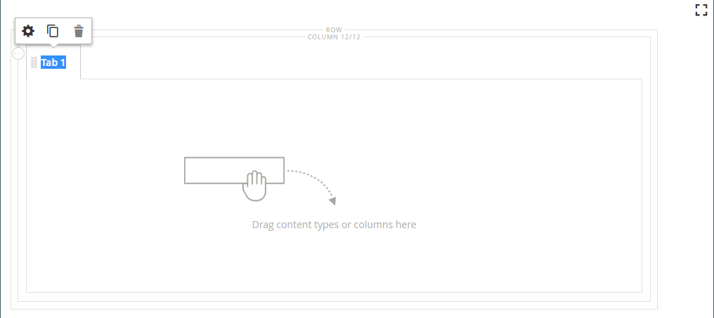
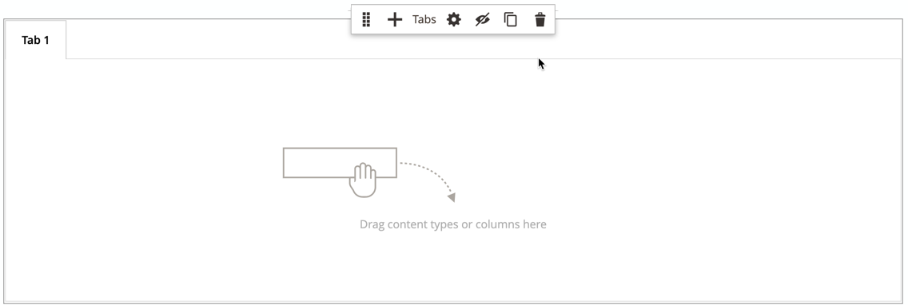
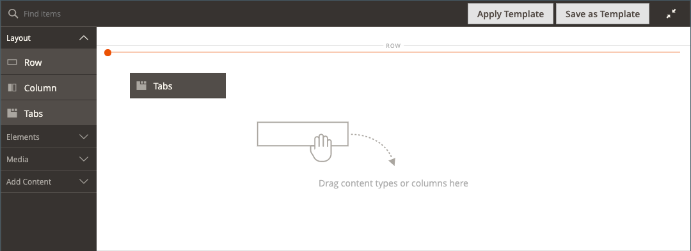
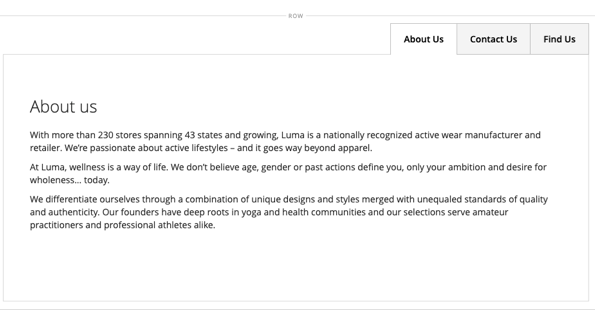

# Layout - Tabbar

Använd _Tabbar_ innehållstyp för att lägga till en uppsättning flikar i [[!DNL Page Builder] stage](workspace.md#stage). När du drar platshållaren för flikar från panelen till scenen visas en enda standardflik. Du kan lägga till fler flikar för att skapa en fullständig uppsättning. Bredden på tabbuppsättningen bestäms av bredden på dess överordnade behållar- och utfyllnadsinställningar.

{width="500" zoomable="yes"}

{{$include /help/_includes/page-builder-save-timeout.md}}

## Verktygslådor

När du arbetar med _Tabbar_ kan du lägga till och redigera enskilda flikar och flikbehållaren som innehåller en eller flera flikar. Varje flik har en egen verktygslåda som du använder för att utforma flikar på [!DNL Page Builder] stage.

### Verktygslåda för enskilda flikar

{width="500" zoomable="yes"}

| Verktyg | Ikon | Beskrivning |
|--- |--- |--- |
| Flytta | {width="25"} | Den här kontrollen bredvid tabbetiketten används för att flytta den enskilda fliken till en annan plats i tabbuppsättningen. |
| Inställningar | {width="25"} | Öppnar sidan Redigera flikar där du kan ändra egenskaperna för den enskilda fliken. |
| Duplicera | {width="25"} | Skapar en kopia av fliken. |
| Ta bort | {width="25"} | Tar bort fliken från flikuppsättningen. |

{style="table-layout:auto"}

### Verktygslåda för flikbehållare

{width="500" zoomable="yes"}

| Verktyg | Ikon | Beskrivning |
|--- |--- |--- |
| Flytta | {width="25"} | Flyttar uppsättningen med flikar till en annan plats i rutnätet i den överordnade behållaren. |
| Lägg till | {width="25"} | Lägger till en tabb i tabbuppsättningen. |
| (etikett) | [!UICONTROL Tabs] | Identifierar den aktuella behållaren som en flikuppsättning. Håll pekaren över behållarens övre kant för att visa verktygslådan. |
| Inställningar | {width="25"} | Öppnar sidan Redigera flik där du kan ändra egenskaperna för behållaren. |
| Dölj | {width="25"} | Döljer flikbehållaren. |
| Visa | {width="25"} | Visar den dolda flikbehållaren. |
| Duplicera | {width="25"} | Skapar en kopia av den aktuella fliken. |
| Ta bort | {width="25"} | Tar bort den aktuella tabbuppsättningen från scenen. |

{style="table-layout:auto"}

{{$include /help/_includes/page-builder-hidden-element-note.md}}

## Lägga till en enskild flik

1. I [!DNL Page Builder] panel under _[!UICONTROL Layout]_, dra **[!UICONTROL Tabs]**platshållare direkt till scenen eller till en rad eller kolumn på scenen.

   {width="600" zoomable="yes"}

1. Klicka på **[!UICONTROL Tab 1]** etikett för att visa den enskilda flikens verktygslåda och välja _Inställningar_ ( {width="20"} ).

1. Ange **[!UICONTROL Tab Name]** som du vill använda som etikett.

   {width="600" zoomable="yes"}

1. Ange vid behov **[!UICONTROL Minimum Height]** för fliken.

   Det här värdet kan vara ett tal med valfri giltig CSS-enhet (t.ex. `100px`, `50%`, `50em`, `100vh`) eller en beräkning (som `100vh - 237px`).

1. Välj en **[!UICONTROL Vertical Alignment]** om du vill justera alla innehållsbehållare som läggs till på fliken (Överkant, Mitten eller Nederkant).

1. Om det behövs anger du de andra alternativen med följande avsnitt som vägledning:

   - [[!UICONTROL Background]][background]
   - [[!UICONTROL Advanced]][advanced]

1. Klicka på i det övre högra hörnet **[!UICONTROL Save]** för att använda inställningarna och gå tillbaka till [!DNL Page Builder] arbetsyta.

## Lägga till en uppsättning flikar

Följande steg börjar med en enskild flik och skapar en uppsättning med tre flikar i en flikbehållare. Om du inte redan har en enskild flik följer du de föregående instruktionerna för att lägga till en enskild flik på scenen.

1. Håll pekaren över flikbehållaren för att visa verktygslådan och välj _Lägg till_ ( {width="20"} ).

1. Klicka på **[!UICONTROL Tab 2]** för att visa markören och ange en egen etikett för fliken.

1. Klicka på den andra fliken igen på scenen och välj _Duplicera_ ( {width="20"} ).

1. Klicka på ditt namn **[!UICONTROL Copy]** för att visa markören och ange en egen etikett för den tredje fliken.

{width="600" zoomable="yes"}

## Flytta en flik i uppsättningen

1. Klicka på fliken som du vill flytta.

1. Markera och dra _Flytta_ ( {width="20"} ), som visas precis före tabbetikettexten, till en ny plats i tabbuppsättningen.

## Lägga till innehåll på en flik

Du kan lägga till valfri innehållstyp på en flik precis som du kan på en rad. Följ de här stegen för att lägga till en textinnehållstyp som exempel.

1. Klicka på fliken där du vill lägga till innehållet.

1. I [!DNL Page Builder] panel, expandera **[!UICONTROL Elements]** och dra en **Text** platshållare till fliken.

1. Ange eller klistra in text i redigeraren och använd redigeringsverktygsfältet för att formatera den efter behov.

   Se [Element - text](text.md) om du vill ha mer information om hur du arbetar med innehållstypen för text.

   {width="500" zoomable="yes"}

1. Klicka på i det övre högra hörnet **[!UICONTROL Save]**.

## Ändra enskilda flikinställningar

1. Håll pekaren över en enskild flik för att visa verktygslådan och välja _Inställningar_ ( {width="20"} ).

1. Om det behövs ändrar du någon av de grundläggande inställningarna för fliken:

   - **[!UICONTROL Tab Name]** - Ange ändrad text för tabbetiketten. Du kan också ändra etiketten direkt på scenen.

   - **[!UICONTROL Minimum Height]** - Ange som pixlar om du vill åsidosätta den automatiska höjden. Du kan till exempel ange den minsta höjden så att den matchar höjden på en bakgrundsbild för att se till att hela bilden är synlig.

   - **[!UICONTROL Vertical Alignment]** - Välj den lodräta positionen för innehållsbehållare som läggs till på fliken.

1. Ändra övriga inställningar efter behov med hjälp av följande avsnitt för mer information.

1. När du är klar klickar du på **[!UICONTROL Save]** för att använda inställningarna och gå tillbaka till [!DNL Page Builder] arbetsyta.

### Bakgrund

- **[!UICONTROL Background Color]** - Ange bakgrundsfärgen genom att välja en färgruta, klicka på färgväljaren eller genom att ange ett giltigt färgnamn eller motsvarande hexadecimalt värde. Den här inställningen bestämmer radens bakgrundsfärg. Du kan också justera färgens opacitet.

  {width="200"}

  Du kan ange ett värde på tre sätt:

   - Ett fördefinierat färgnamn, till exempel `White`

   - Det hexadecimala färgvärdet för färgen, till exempel `#ffffff`

   - rgba-värdet för färgen, med opacitetsprocent, till exempel `rgba(255, 255, 255, 0.75)`

  Om du vill välja en färg klickar du på färgrutan till vänster om _Ingen färg_ box.

  {width="600" zoomable="yes"}

  Om du klickar på färgrutan för att öppna färgväljaren igen visar rutan under reglaget de aktuella värdena för rött, grönt, blått och alfa (rgba). Det sista talet anger den aktuella opaciteten i procent som decimal. Du kan justera opaciteten med hjälp av skjutreglaget eller ange ett decimalvärde.

  {width="600" zoomable="yes"}

  >[!NOTE]
  >
  >[!DNL Page Builder] har även stöd för genomskinliga lager, eller _alfakanal_, i bakgrundsbilder som kan användas för att skapa bakgrunder med varierande grad av opacitet.

- **[!UICONTROL Background Image]** - Använd vid behov de medföljande verktygen för att välja en bakgrundsbild som ska användas på fliken:

  | Verktyg | Beskrivning |
  |--- |--- |
  | [!UICONTROL Upload] | Överför en bildfil från den lokala datorn till galleriet och använder den sedan som bakgrundsbild för fliken. |
  | [!UICONTROL Select from Gallery] | Uppmanar dig att välja en befintlig bild från galleriet som bakgrundsbild för fliken. |
  | {width="25"} | Gör att du kan dra bilden till kamerapanelen eller bläddra till bilden i det lokala filsystemet. |

  {style="table-layout:auto"}

- **[!UICONTROL Background Mobile Image]** - Använd vid behov samma verktyg för att välja en annan bakgrundsbild som ska användas för visning på mobila enheter.

- **[!UICONTROL Background Size]** - Välj hur bakgrundsbilden ska skalförändras i förhållande till flikens bredd:

  | Alternativ | Beskrivning |
  |--- |--- |
  | `Cover` | Bakgrundsbilden täcker tabbens hela bredd. |
  | `Contain` | Bakgrundsbilden är begränsad till bredden på tabbområdet. |
  | `Auto` | Använder storleken från den aktuella formatmallen. |

  {style="table-layout:auto"}

- **[!UICONTROL Background Position]** - Välj hur bakgrundsbilden ska förankras i relation till fliken: `Top Left` / `Top Center` / `Top Right` / `Center Left` / `Center` / `Center Right` / `Bottom Left` / `Bottom Center` / `Bottom Right`

- **[!UICONTROL Background Attachment]** - Välj bilagetyp för att bestämma hur bakgrundsbilden flyttas i relation till rullningssidan:

  | Alternativ | Beskrivning |
  | --- | --- |
  | `Scroll` | Den bifogade bakgrundsbilden synkroniseras så att den flyttas nedåt när sidan rullas. |
  | `Fixed` | (Inte tillgängligt för mobiler) Bakgrundsbilden flyttas inte när behållaren rullas över bilden och är fast vid den angivna bakgrundspositionen. |

  {style="table-layout:auto"}

- **[!UICONTROL Background Repeat]** - Ange som `Yes` om du vill upprepa bakgrundsbilden för att fylla det tillgängliga utrymmet på fliken.

### Avancerat

- Om du vill styra den vågräta justeringen för innehållsbehållare som läggs till på fliken väljer du en **[!UICONTROL Alignment]** .

  | Alternativ | Beskrivning |
  | --- | --- |
  | `Default` | Använder den standardinställning för justering som anges i formatmallen för det aktuella temat. |
  | `Left` | Justerar innehållsbehållarna längs flikens vänstra kant, med hänsyn till eventuell utfyllnad som har angetts. |
  | `Center` | Justerar innehållsbehållaren i mitten av fliken, med hänsyn till eventuell utfyllnad som har angetts. |
  | `Right` | Justerar innehållsbehållaren längs flikens högra kant, med hänsyn till eventuell utfyllnad som har angetts. |

  {style="table-layout:auto"}

- Ange **[!UICONTROL Border]** format som används på alla fyra sidor i tabbbehållaren:

  | Alternativ | Beskrivning |
  | --- | --- |
  | `Default` | Använder det standardkantlinjeformat som anges av den associerade formatmallen. |
  | `None` | Visar inte någon synlig indikation för behållarkanterna. |
  | `Dotted` | Behållarramen visas som en prickad linje. |
  | `Dashed` | Behållarramen visas som en streckad linje. |
  | `Solid` | Behållarramen visas som en heldragen linje. |
  | `Double` | Behållarramen visas som en dubbel linje. |
  | `Groove` | Behållarkanten visas som en utdragen linje. |
  | `Ridge` | Behållarkanten visas som en rak linje. |
  | `Inset` | Behållarramen visas som en indragen linje. |
  | `Outset` | Behållarramen visas som en startrad. |

  {style="table-layout:auto"}

- Om du anger ett annat kantlinjeformat än `None`slutför du visningsalternativen för kantlinjer:

  {width="600" zoomable="yes"}

  | Alternativ | Beskrivning |
  | ------ |------------ |
  | [!UICONTROL Border Color] | Ange färgen genom att välja en färgruta, klicka på färgväljaren eller genom att ange ett giltigt färgnamn eller motsvarande hexadecimalt värde. |
  | [!UICONTROL Border Width] | Ange antalet pixlar för kantlinjens bredd. |
  | [!UICONTROL Border Radius] | Ange antalet pixlar för att definiera radiens storlek som används för att runda varje hörn av kanten. |

  {style="table-layout:auto"}

  Raden i följande exempel har en kantradie på 15.

  {width="500"}

- (Valfritt) Ange namnen på **[!UICONTROL CSS classes]** från den aktuella formatmallen som ska användas för kolumnbehållaren.

  Avgränsa flera klassnamn med blanksteg.

- Ange värden i pixlar för **[!UICONTROL Margins and Padding]** om du vill ange kolumnens yttre marginaler och inre utfyllnad.

  Ange varje motsvarande värde i flikbehållardiagrammet.

  | Behållarområde | Beskrivning |
  | -------------- | ---------- |
  | [!UICONTROL Margins] | Mängden tomt utrymme som används på ytterkanten på behållarens alla sidor. Alternativ: `Top` / `Right` / `Bottom` / `Left` |
  | [!UICONTROL Padding] | Mängden tomt utrymme som används på behållarens inre kant på alla sidor. Alternativ: `Top` / `Right` / `Bottom` / `Left` |

  {style="table-layout:auto"}

## Ändra tabbinställningar

1. Hovra över den övre kanten på flikuppsättningsbehållaren för att visa verktygslådan och välj _Inställningar_ ( {width="20"} ).

1. Ändra **[!UICONTROL Default Active Tab]**.

   Välj fliken i uppsättningen som du vill ska vara aktiv när sidan läses in.

1. Ange **[!UICONTROL Minimum Height]** i pixlar om du vill åsidosätta den automatiska höjden för tabbuppsättningen.

1. Om du vill placera navigeringsflikarna längs flikuppsättningens överkant väljer du **[!UICONTROL Tab Navigation Alignment]** (`Left`, `Center`, eller `Right`).

   {width="500" zoomable="yes"}

1. Ange avancerade alternativ för flikuppsättningen:

   - Om du vill styra placeringen av tabbuppsättningen i den överordnade behållaren väljer du en **[!UICONTROL Alignment]**:

     | Alternativ | Beskrivning |
     | ------ | ---------- |
     | `Default` | Använder den standardinställning för justering som anges i formatmallen för det aktuella temat. |
     | `Left` | Justerar tabbuppsättningen längs den vänstra kanten på den överordnade behållaren, med hänsyn till eventuell utfyllnad som har angetts. |
     | `Center` | Justerar tabbuppsättningen i mitten av den överordnade behållaren, med hänsyn till eventuell utfyllnad som har angetts. |
     | `Right` | Justerar tabbuppsättningen längs den högra kanten på den överordnade behållaren, med hänsyn till eventuell utfyllnad som har angetts. |

     {style="table-layout:auto"}

   - Ange **[!UICONTROL Border]** format som används på alla fyra sidor av flikbehållaren:

     | Alternativ | Beskrivning |
     | ------ | ---------- |
     | `Default` | Använder det standardkantlinjeformat som anges av den associerade formatmallen. |
     | `None` | Visar inte någon synlig indikation för behållarkanterna. |
     | `Dotted` | Behållarramen visas som en prickad linje. |
     | `Dashed` | Behållarramen visas som en streckad linje. |
     | `Solid` | Behållarramen visas som en heldragen linje. |
     | `Double` | Behållarramen visas som en dubbel linje. |
     | `Groove` | Behållarkanten visas som en utdragen linje. |
     | `Ridge` | Behållarkanten visas som en rak linje. |
     | `Inset` | Behållarramen visas som en indragen linje. |
     | `Outset` | Behållarramen visas som en startrad. |

     {style="table-layout:auto"}

   - Om du anger ett annat kantlinjeformat än `None`slutför du visningsalternativen för kantlinjer:

     | Alternativ | Beskrivning |
     | ------ |------------ |
     | [!UICONTROL Border Color] | Ange färgen genom att välja en färgruta, klicka på färgväljaren eller genom att ange ett giltigt färgnamn eller motsvarande hexadecimalt värde. |
     | [!UICONTROL Border Width] | Ange antalet pixlar för kantlinjens bredd. |
     | [!UICONTROL Border Radius] | Ange antalet pixlar för att definiera radiens storlek som används för att runda varje hörn av kanten. |

     {style="table-layout:auto"}

   - (Valfritt) Ange namnen på **[!UICONTROL CSS classes]** från den aktuella formatmallen som ska användas på flikbehållaren.

     Avgränsa flera klassnamn med blanksteg.

   - Ange värden i pixlar för **[!UICONTROL Margins and Padding]** för att bestämma de yttre marginalerna och den inre utfyllnaden för flikbehållaren.

     Ange motsvarande värden i flikens behållardiagram.

     | Behållarområde | Beskrivning |
     | -------------- | ---------- |
     | [!UICONTROL Margins] | Mängden tomt utrymme som används på ytterkanten på behållarens alla sidor. Alternativ: `Top` / `Right` / `Bottom` / `Left` |
     | [!UICONTROL Padding] | Mängden tomt utrymme som används på behållarens inre kant på alla sidor. Alternativ: `Top` / `Right` / `Bottom` / `Left` |

     {style="table-layout:auto"}

1. När du är klar klickar du på **[!UICONTROL Save]** för att använda inställningarna och gå tillbaka till [!DNL Page Builder] arbetsyta.

[background]: #background
[advanced]: #advanced
