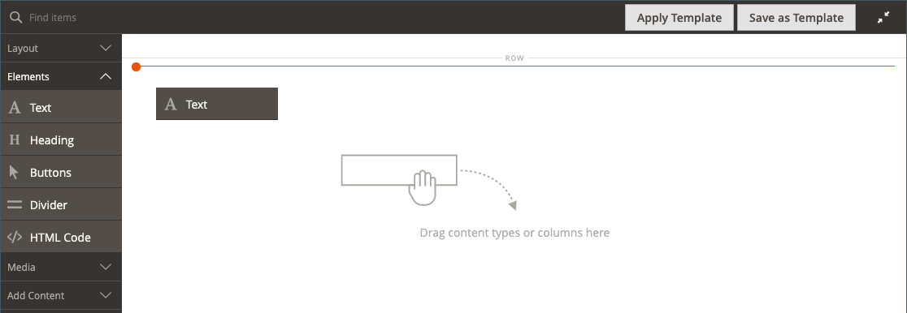

# Element - text

Använd innehållstypen _Text_ för att lägga till en textbehållare med en WYSIWYG-redigerare (&quot;What You See Is What You Get&quot;) i [[!DNL Page Builder] scenen](workspace.md#stage). Du kan dessutom lägga till länkar, bilder, [variabler](../systems/variables-predefined.md) och widgetar i texten från redigeringsverktygsfältet.

{width="700"}

{{$include /help/_includes/page-builder-save-timeout.md}}

## Textredigeringsverktyg

Du kommer åt textredigeraren direkt från scenen eller från en inställningssida. Ändringar som görs direkt på scenen sparas automatiskt. Mer information finns i [Använda redigeraren](../content-design/editor.md).

{width="600"}

## Verktygslåda för textbehållare

{width="600"}

| Verktyg | Ikon | Beskrivning |
| --------- | --------------------- | -------------- |
| Flytta | {width="25"} | Flyttar textbehållaren till en annan giltig plats på sidan. |
| (etikett) | TEXT | Identifierar den aktuella behållaren som ett textelement. |
| Inställningar | {width="25"} | Öppnar egenskaperna för textbehållaren i redigeringsläge. |
| Dölj | {width="25"} | Döljer textbehållaren. |
| Visa | {width="25"} | Visar den dolda textbehållaren. |
| Duplicera | {width="25"} | Skapar en kopia av textbehållaren. |
| Ta bort | {width="25"} | Tar bort textbehållaren och dess innehåll från scenen. |

{style="table-layout:auto"}

{{$include /help/_includes/page-builder-hidden-element-note.md}}

## Lägg till text

1. Expandera **[!UICONTROL Elements]** på panelen [!DNL Page Builder] och dra en **[!UICONTROL Text]** platshållare till en rad, kolumn eller tabb på scenen.

   {width="600" zoomable="yes"}

1. Använd redigeraren för att ange och formatera text efter behov.

   Mer information finns i [Använda redigeraren](../content-design/editor.md).

   {width="600"}

## Skapa en länk

Med knappen Infoga länk i redigeraren är det enkelt att lägga till en hyperlänk till en bild i galleriet. Men den kan också användas för att skapa en textbunden länk om du har URL-adressen i förväg. Till skillnad från widgetknappen är länkknappen Infoga/redigera inte integrerad med sidor, produkter eller kategorier i butiken.

Mer information om hur du skapar en länk för ett telefonnummer eller ett e-postmeddelande finns i [Lägga till anpassade variabler](../systems/variables-custom.md).

1. I butiken navigerar du till sidan som ska vara länkens målmål och kopierar länkinformationen.

   Du kan antingen använda den fullständiga URL:en eller en relativ URL som utelämnar referensen till din lagringsdomän.

   Fullständig URL - `https://mystore.com/women/tops-women/tees-women.html`

   Relativ URL - `../women/tops-women/tees-women.html`

1. Markera texten i redigerarområdet och klicka på _Infoga/redigera länk_ ( {width="20"} ) i redigerarens verktygsfält.

   {width="500" zoomable="yes"}

1. Ange den relativa länken som du förberedde för **[!UICONTROL URL]**.

1. Ange **[!UICONTROL Target]** till `None`.

   Med den här inställningen öppnas sidan i samma webbläsarfönster, i stället för en ny flik.

1. Ange `Shop Tees` för **[!UICONTROL Title]**.

   Länkattributet `Title` används av vissa webbläsare som verktygstips.

1. Klicka på **[!UICONTROL OK]** om du vill spara länken och återgå till arbetsytan [!DNL Page Builder].

   {width="500" zoomable="yes"}

## Infoga en bild

1. Placera markören i texten där du vill infoga bilden.

1. Klicka på _Infoga/redigera bild_ ( {width="20"} ) i redigerarens verktygsfält.

1. För **[!UICONTROL Source]** klickar du på sökikonen för att använda medielagringen för att hitta och välja en bild.

1. Ange beskrivande text för bilden för **[!UICONTROL Image Description]**.

   Den här texten fyller i länkattributet `alt` för bilden och används av vissa webbläsare för tillgänglighet.

1. Ange bredden och höjden **[!UICONTROL Dimensions]** i pixlar för återgivning av bilden på sidan.

   Behåll kryssrutan **[!UICONTROL Constrain proportions]** markerad för att automatiskt behålla bildens proportioner.

1. Om du vill infoga bilden och sedan gå tillbaka till arbetsytan [!DNL Page Builder] klickar du på **[!UICONTROL OK]**.

## Ändra textinställningar

1. Håll pekaren över textbehållaren för att visa verktygslådan och välj ikonen _Inställningar_ ( {width="20"} ).

   >[!NOTE]
   >
   >Eftersom textbehållaren är tätt inkapslad i en annan behållare måste du ha rätt verktygslåda.

1. Uppdatera innehållet efter behov.

1. Uppdatera inställningarna för _[!UICONTROL Advanced]_efter behov.

   - Om du vill styra placeringen av texten i den överordnade behållaren väljer du en **[!UICONTROL Alignment]**:

     | Alternativ | Beskrivning |
     | ------ |------------ |
     | `Default` | Använder den standardinställning för justering som anges i formatmallen för det aktuella temat. |
     | `Left` | Justerar listan längs den vänstra kanten på den överordnade behållaren, med hänsyn till eventuell utfyllnad som har angetts. |
     | `Center` | Justerar listan i mitten av den överordnade behållaren, med hänsyn till eventuell utfyllnad som har angetts. |
     | `Right` | Justerar blocket längs den högra kanten på den överordnade behållaren, med hänsyn till eventuell utfyllnad som har angetts. |

     {style="table-layout:auto"}

   - Ange det **[!UICONTROL Border]**-format som ska användas på alla fyra sidor i textbehållaren:

     | Alternativ | Beskrivning |
     | ------ |------------ |
     | `Default` | Använder det standardkantlinjeformat som anges av den associerade formatmallen. |
     | `None` | Visar inte någon synlig indikation för behållarkanterna. |
     | `Dotted` | Behållarramen visas som en prickad linje. |
     | `Dashed` | Behållarramen visas som en streckad linje. |
     | `Solid` | Behållarramen visas som en heldragen linje. |
     | `Double` | Behållarramen visas som en dubbel linje. |
     | `Groove` | Behållarkanten visas som en utdragen linje. |
     | `Ridge` | Behållarkanten visas som en rak linje. |
     | `Inset` | Behållarramen visas som en indragen linje. |
     | `Outset` | Behållarramen visas som en startrad. |

     {style="table-layout:auto"}

   - Om du anger ett annat kantlinjeformat än `None` fyller du i visningsalternativen för kantlinjen:

     | Alternativ | Beskrivning |
     | ------ |------------ |
     | [!UICONTROL Border Color] | Ange färgen genom att välja en färgruta, klicka på färgväljaren eller genom att ange ett giltigt färgnamn eller motsvarande hexadecimalt värde. |
     | [!UICONTROL Border Width] | Ange antalet pixlar för kantlinjens bredd. |
     | [!UICONTROL Border Radius] | Ange antalet pixlar för att definiera radiens storlek som används för att runda varje hörn av kanten. |

     {style="table-layout:auto"}

   - (Valfritt) Ange namnen på **[!UICONTROL CSS classes]** från den aktuella formatmallen som ska användas för behållaren.

     Avgränsa flera klassnamn med blanksteg.

   - Ange värden (i pixlar) för **[!UICONTROL Margins and Padding]** för att fastställa textbehållarens yttre marginaler och inre utfyllnad.

     Ange motsvarande värden i diagrammet.

     | Behållarområde | Beskrivning |
     | -------------- |------------ |
     | [!UICONTROL Margins] | Mängden tomt utrymme som används på ytterkanten på behållarens alla sidor. Alternativ: `Top` / `Right` / `Bottom` / `Left` |
     | [!UICONTROL Padding] | Mängden tomt utrymme som används på behållarens inre kant på alla sidor. Alternativ: `Top` / `Right` / `Bottom` / `Left` |

     {style="table-layout:auto"}

1. När du är klar klickar du på **[!UICONTROL Save]** för att tillämpa inställningarna och återgå till arbetsytan i [!DNL Page Builder].
