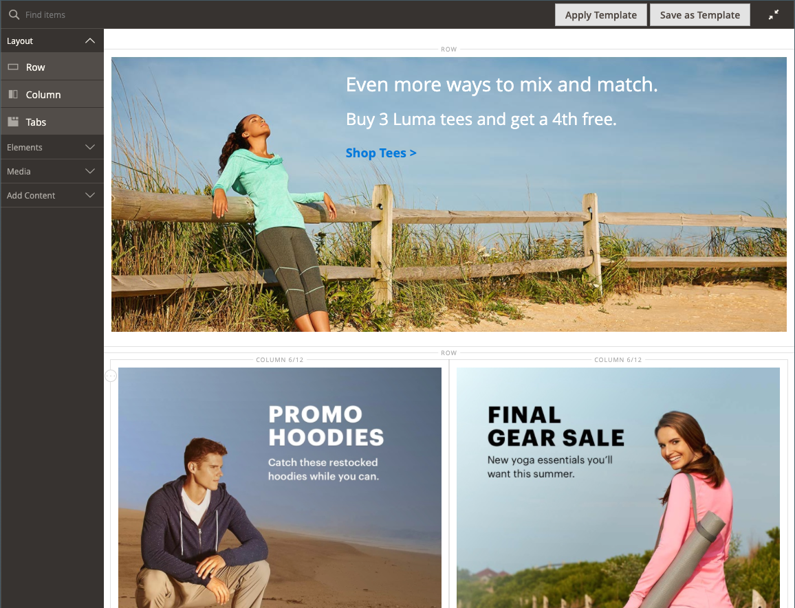

# [!DNL Page Builder] Workspace

När [[!DNL Page Builder]  är aktiverat](setup.md) ändras avsnittet _[!UICONTROL Content]_&#x200B;och processen för att skapa innehåll så att du kan utnyttja de avancerade [!DNL Page Builder] verktygen för CMS [sidor](../content-design/page-add.md), [product](../catalog/product-content.md) och [category](../catalog/categories-content-settings.md) -sidor, [block](../content-design/block-add.md) och [dynamiska block](../content-design/dynamic-blocks.md). Det här avsnittet innehåller ett_ fält för innehållsrubrik _, en förhandsgranskning av innehållet och enkel åtkomst till arbetsytan för helskärmsläge [!DNL Page Builder].

![Innehållsavsnitt med [!DNL Page Builder] förhandsgranskning &#x200B;](./assets/pb-content-preview.png){width="700" zoomable="yes"}

## Innehållsrubrik

Eftersom sökmotorer söker efter rubriker på nivå ett (H1) är det enkelt att lägga till en rubrik på nivå ett för att säkerställa att sidan indexeras korrekt.

>[!NOTE]
>
>Fältet _[!UICONTROL Content Heading]_&#x200B;som visas högst upp på sidan är ett äldre fält som stöder innehåll som har skapats med tidigare [!DNL Commerce]-versioner. Den ingår dock inte i [!DNL Page Builder]. [!UICONTROL Content Heading] är formaterad som en H1-rubrik enligt formatmallen som är associerad med det aktuella temat. Den placeras precis ovanför det aktiva innehållsområdet som definieras av scenen [!DNL Page Builder].

Du bör lämna fältet _[!UICONTROL Content Heading]_&#x200B;tomt och använda innehållstypen [!DNL Page Builder] [Rubrik](heading.md) för att få bästa kontroll över placering och format för rubriker på alla nivåer.

{width="700" zoomable="yes"}

## Förhandsgranska

När du expanderar avsnittet _[!UICONTROL Content]_&#x200B;och det finns befintligt innehåll som skapats med [!DNL Page Builder] visas en förhandsgranskning av innehållet så som det skulle visas på en sida. Klicka på&#x200B;**[!UICONTROL Edit with Page Builder]**&#x200B;eller i förhandsvisningsområdet för innehåll för att öppna arbetsytan i [!DNL Page Builder], där du kan göra nödvändiga uppdateringar.

{width="500" zoomable="yes"}

>[!NOTE]
>
>För produkt- och kategoriformulären är den här förhandsvisningen aktiverad som standard, men kan inaktiveras. Om prestandan försämras på grund av att förhandsgranskningen har lästs in kan du inaktivera förhandsgranskningen i inställningarna för [konfigurationen för innehållshantering](../configuration-reference/general/content-management.md#advanced-content-tools).

## Scen

När du öppnar arbetsytan [!DNL Page Builder] från förhandsgranskningen är scenen den primära arbetsytan där du kan skapa och formatera innehåll, och till och med göra snabba redigeringar av direktinnehåll. Inledningsvis är scenen tom, vilket ger den designyta där du kan dra rader, kolumner och tabbar från den vänstra panelen.

>[!NOTE]
>
>Från och med version 2.4.1 är nu redigering av innehåll i helskärmsläge endast för alla områden som styrs av [!DNL Page Builder] - CMS-sidor, produkt- och kategorisidor, block och dynamiska block. Vid helskärmsredigering fokuseras ditt innehåll och ger en vy som bättre matchar användarupplevelsen i butiken.

{width="600" zoomable="yes"}

{{$include /help/_includes/page-builder-save-timeout.md}}

## Vieports

En _visningsruta_ är det synliga området på en webbsida som en användare ser. I helskärmsläge visas vyportsknapparna ovanför scenen [!DNL Page Builder] för att visa innehållet när webbplatsanvändaren ser det i butiken.

{width="500" zoomable="yes"}

[!DNL Page Builder] definierar också brytpunkter för visningsrutor. Brytpunkter definierar den minsta och största bredden som vissa format används i. [!DNL Page Builder]-vyportarna innehåller följande innehållsbrytpunkter:

- **Skrivbordsbrytpunkt**—`min-width: 1024px`. Den här brytpunkten tillämpar format som har definierats för visningsrutebredder som mäter 1 024 pixlar och bredare.
- **Mobile breakpoints**—`max-width: 768px, min-width: 640px`. Dessa brytpunkter tillämpar format som är definierade för visningsrutans bredd mellan 768 pixlar och 640 pixlar.

[!DNL Page Builder]-visningsrutor har två funktioner: **_förhandsvisning av innehåll_** och **_brytpunktsinställningar_**.

### Förhandsgranskning av innehåll

Som standard har [!DNL Page Builder] två visningsrutor:

- **Skrivbord** - Visar innehållsförhandsvisningen utan en fördefinierad bredd. Skrivbordsdefinierade format (med en minsta brytpunktsbredd på 1 024 pixlar) används fortfarande på sidan. Bredden på skrivbordsvyn definieras av inställningarna för behållarinnehållstyper, som rader. När du väljer skrivbordsvyn visas hur innehållet är formaterat på butiken när webbläsarens sidbredd är 1 024 pixlar och bredare.

  {width="500" zoomable="yes"}

- **Mobil** - Visar förhandsvisningen av innehållet med en fördefinierad bredd på 768 pixlar. Till skillnad från skrivbordsvyn visar visningsrutan Mobilt sidinnehåll vid en bredd på 768 pixlar, tillsammans med de format som är definierade för brytpunktsbredderna 768 pixlar (maximalt) och 640 pixlar (minst).

  {width="500" zoomable="yes"}

### Brytpunktsinställningar

Visningsknapparna har också möjlighet att tillämpa olika brytpunktsformat på innehållstyper baserat på den valda visningsrutan. Som standard innehåller [!DNL Page Builder] brytpunktsinställningar för fälten _[!UICONTROL Minimum Height]_&#x200B;för rader, kolumner, flikar, flikobjekt, banderoller, reglage och bildrutor. När du väljer visningsrutan för mobila enheter och sedan öppnar du redigeraren för någon av dessa innehållstyper kan du ange fältvärden som är specifika för brytpunkterna för visningsrutan för mobila enheter. I innehållstypfält som tillåter särskilda brytpunktsinställningar visas en ikon till höger om fältet, som i följande exempel för en rad:

{width="400"}

## Panel

Panelen [!DNL Page Builder] finns till vänster om scenen och innehåller innehållstyper som kan dras till scenen. En behållare som är specifik för innehållstypen visas sedan med en verktygslåda med alternativ. Innehållstyperna är ordnade på panelen enligt följande:

### Layout

Avsnittet _[!UICONTROL Layout]_&#x200B;på panelen [!DNL Page Builder] används för att lägga till rader, kolumner eller flikar på scenen. När du drar en innehållstyp från panelen till scenen visas en behållare med en verktygslåda med alternativ som är specifika för innehållstypen.

Som standard är scenen [!DNL Page Builder] tom. När du drar layoutinnehållstyper från panelen till scenen kan du placera dem ovanför, under eller inuti andra layoutbehållare på sidan. Rader kan bara läggas till direkt på scenen.

Panelen ![[!DNL Page Builder] med innehållstyper för layout och scenen &#x200B;](./assets/pb-stage-toolbox.png){width="600" zoomable="yes"}

| Innehållstyp för layout | Beskrivning |
| ------------------- |------------ |
| [Rad](row.md) | En ny rad kan bara dras från panelen till scenen och placeras antingen ovanför eller under en annan rad, flik eller kolumngrupp. Du kan också använda alternativet Duplicera för att skapa en kopia av en befintlig rad. |
| [Kolumn](column.md) | En kolumn kan dras från panelen till scenen eller till rader och flikar. Det maximala antalet kolumner som kan läggas till bestäms av antalet rutnätsindelningar som anges i [konfigurationen](setup.md). |
| [Tabbar](tabs.md) | En enskild tabb kan dras från panelen till scenen eller till rader och kolumner. Du kan lägga till fler flikar från verktygslådan. |

{style="table-layout:auto"}

### Element

Använd avsnittet _[!UICONTROL Elements]_&#x200B;på panelen [!DNL Page Builder] för att lägga till text, rubriker, knappar, avgränsare och HTML-kod i en layoutbehållare på [[!DNL Page Builder] scenen](workspace.md#stage). När du drar en innehållstyp från panelen till en rad eller kolumn, eller till en tabbuppsättning på scenen, visas en behållare. Använd verktygslådan för innehållstyp för att komma åt inställningar som är specifika för typen.

Panelen ![[!DNL Page Builder] med elementinnehållstyper &#x200B;](./assets/pb-elements.png){width="600" zoomable="yes"}

| Elementinnehållstyp | Beskrivning |
| -------------------- | ----------- |
| [Text](text.md) | Lägger till en textbehållare och redigerare på scenen. |
| [Rubrik](heading.md) | Lägger till en rubrikbehållare på scenen. |
| [Knappar](buttons.md) | Lägger till en behållare för antingen en enskild knapp eller en uppsättning knappar på scenen. |
| [Delare](divider.md) | Lägger till en behållare för en avgränsare på scenen. |
| [HTML Code](html-code.md) | Lägger till en behållare för HTML-kod på scenen. |

{style="table-layout:auto"}

### Media

Använd avsnittet _[!UICONTROL Media]_&#x200B;på panelen [!DNL Page Builder] för att lägga till bilder, video, banners, skjutreglage och [!DNL Google Maps] i en layoutbehållare på [[!DNL Page Builder] scenen](workspace.md#stage). När en mediainnehållstyp dras från panelen till scenen, visas en behållare med en verktygslåda med alternativ som är specifika för innehållstypen.

![[!DNL Page Builder]-panel med mediainnehållstyper](./assets/pb-media-content-types.png){width="600" zoomable="yes"}

| Medieinnehållstyp | Beskrivning |
| ------------------- | ------------------------------------------ |
| [Bild](image.md) | Lägger till en bildbehållare på scenen. |
| [Video](video.md) | Lägger till en videobehållare på scenen. |
| [Banderoll](banner.md) | Lägger till en banderollbehållare på scenen. |
| [Skjutreglage](slider.md) | Lägger till en skjutreglagebehållare på scenen. |
| [Karta](map.md) | Lägger till en [!DNL Google Maps]-behållare på scenen. |

{style="table-layout:auto"}

### Lägg till innehåll

Använd avsnittet _[!UICONTROL Add Content]_&#x200B;på panelen [!DNL Page Builder] för att lägga till befintligt innehåll på [[!DNL Page Builder] scenen](workspace.md#stage). När du drar en mediainnehållstyp från panelen till scenen visas en behållare. Använd verktygslådan för innehållstyp för att komma åt de_ inställningar _som är specifika för typen.

Panelen ![[!DNL Page Builder] med Lägg till innehållstyper](./assets/pb-add-content.png){width="600" zoomable="yes"}

| Innehållstyp | Beskrivning |
| ---------------------------------------------------------------- | -------------------------------------------- |
| [Blockera](block.md) | Lägger till ett befintligt block på scenen. |
| [Dynamiskt block](dynamic-block.md) | Lägger till ett befintligt dynamiskt block på scenen. |
| [Produkter](products.md) | Lägger till en lista med produkter på scenen. |
|  [Produktrekommendationer](recommendations.md) | Lägger till en rekommendationsenhet på scenen. |

{style="table-layout:auto"}

## Toolbox

Varje innehållsbehållare på scenen har en verktygslåda med alternativ. Alternativen varierar beroende på innehållstyp, men omfattar vanligtvis Flytta, Inställningar, Dölj/Visa, Duplicera och Ta bort.

### Visa verktygslådan

Håll pekaren över behållaren för att visa verktygslådan och välja ett alternativ.

{width="600" zoomable="yes"}

### Alternativ för verktygslådan

| Alternativ | Ikon | Beskrivning |
| --------- | ---------------------------------------- | ------------ |
| Flytta | {width="25"} | Flyttar den aktuella innehållsbehållaren till en annan plats på scenen. |
| Lägg till | {width="25"} | Lägger till underordnade element som en knapp, bildruta eller tabb. |
| (etikett) |           | Identifierar behållarinnehållstypen. |
| Inställningar | {width="25"} | Öppnar egenskaperna för innehållsbehållaren i redigeringsläge. |
| Dölj | {width="25"} | Döljer den aktuella innehållsbehållaren. |
| Visa | {width="25"} | Visar aktuell innehållsbehållare. |
| Duplicera | {width="25"} | Skapar en kopia av den aktuella innehållsbehållaren. |
| Ta bort | {width="25"} | Tar bort aktuell innehållsbehållare från scenen. |

{style="table-layout:auto"}

{{$include /help/_includes/page-builder-hidden-element-note.md}}

<!-- Last updated from includes: 2023-09-11 14:30:19 -->
