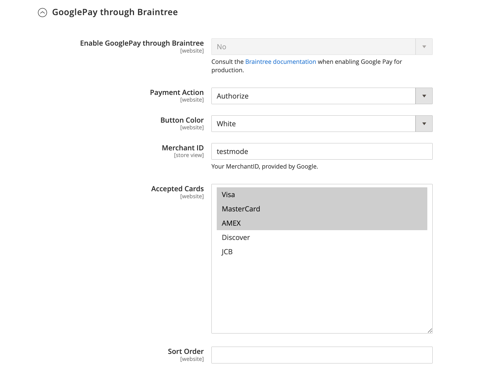
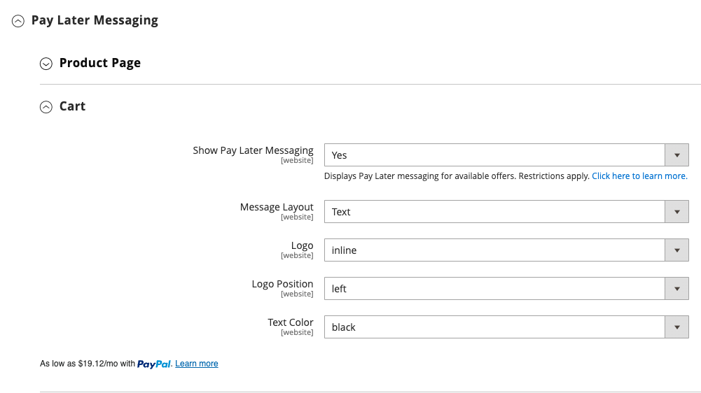
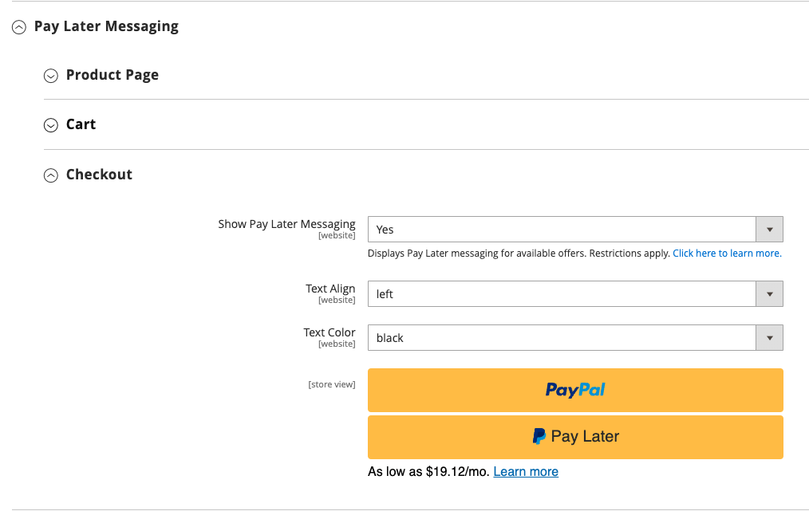

# Braintree

>[!IMPORTANT]
>
>Om du behöver hjälp med oväntade kostnader på kortet kan du få hjälp på sidan [Avbryt prenumeration](https://helpx.adobe.com/se/manage-account/using/cancel-subscription.html).

Braintree erbjuder en helt anpassningsbar utcheckningsupplevelse med bedrägeriidentifiering och PayPal-integrering. Den stöder [!DNL Apple Pay], [!DNL Google Pay], ACH, Venmo och lokala betalningsmetoder. Braintree minskar PCI-kompatibilitetsbördan för handlare eftersom transaktionen äger rum i Braintree-systemet. Integreringen av Braintree Payments har utvecklats av [GENE Commerce](https://www.gene.co.uk/gene-braintree-payments/).

>[!NOTE]
>
>Om du uppgraderar till 2.4.x från en tidigare version av Adobe Commerce eller Magento Open Source med Braintree-tillägget från Commerce Marketplace installerat läser du [2.4-uppgraderingsinformationen](#24-upgrade-notes) i slutet av den här sidan.

## Steg 1: Hämta dina Braintree-uppgifter

Gå till [Braintree Payments][1] och registrera dig för ett konto.

## Steg 2: Slutför de grundläggande inställningarna

1. Gå till **[!UICONTROL Stores]** > _[!UICONTROL Settings]_>**[!UICONTROL Configuration]**&#x200B;på sidofältet_ Admin _.

1. Expandera **[!UICONTROL Sales]** i den vänstra panelen och välj **[!UICONTROL Payment Methods]**.

   - Om din Commerce-installation har flera webbplatser, butiker eller vyer väljer du **[!UICONTROL Store View]** där konfigurationen gäller i det övre vänstra hörnet.

   - I avsnittet _[!UICONTROL Merchant Location]_&#x200B;kontrollerar du att **[!UICONTROL Merchant Country]**&#x200B;är inställd på platsen för ditt företag.

1. Under _[!UICONTROL Recommended Solutions]_, i avsnittet_[!UICONTROL Braintree Payments] (av [GENE Commerce](https://www.gene.co.uk/gene-braintree-payments/) v4.7.0 - [Versionsinformation](https://support.gene.co.uk/support/solutions/articles/35000278668)_, klickar du på&#x200B;**[!UICONTROL Configure]**.

   {width="600" zoomable="yes"}

1. För **[!UICONTROL Title]** anger du en titel som identifierar Braintree som ett betalningsalternativ under utcheckningen.

1. Ange den aktuella **[!UICONTROL Environment]**-operationen för Braintree-transaktioner som `Sandbox` eller `Production`

   När du testar konfigurationen i en sandlåda ska du bara använda [kreditkortsnummer][2] som rekommenderas av Braintree. När du är redo att börja producera med Braintree anger du **[!UICONTROL Environment]** till `Production`.

   {width="600" zoomable="yes"}

1. Ange **[!UICONTROL Payment Action]** till något av följande:

   - `Authorize Only` - Godkänner köpet och spärrar pengarna. Beloppet dras inte tillbaka från kundens bankkonto förrän försäljningen är _hämtad_ av handlaren.|
   - `Intent Sale` - Köpbeloppet är auktoriserat och dras omedelbart tillbaka från kundens konto. **_Obs!_** Det här värdet var _Auktorisera och hämta_ i 2.3.x och tidigare versioner.|

1. Ange **[!UICONTROL Sandbox Merchant ID / Merchant ID]** från ditt Braintree-konto.

1. Ange följande inloggningsuppgifter från ditt Braintree-konto:

   - **[!UICONTROL Sandbox Public Key / Public Key]**
   - **[!UICONTROL Sandbox Private Key / Private Key]**

   >[!NOTE]
   >
   >Det finns separata fält för både **(sandlåda och produktion)**-miljöer, och de andra fälten återges baserat på vilken miljö som valts.

1. Innan du sparar konfigurationen klickar du på **[!UICONTROL Validate Credentials]** för att verifiera dina autentiseringsuppgifter.

1. Ange **[!UICONTROL Enable Card Payments]** till `Yes`.

1. Om du vill kunna lagra kundinformation på ett säkert sätt, så att kunderna inte behöver ange den igen varje gång de gör ett köp, anger du **[!UICONTROL Enable Vault for Card Payments]** till `Yes`.

1. Om du vill att en kund ska verifiera CVV-numret för sitt visitkort vid varje köp anger du **[!UICONTROL Enable Vault CVV Re-verification]** till `Yes`.

## Steg 3: Slutför de avancerade inställningarna

1. Expandera  i avsnittet **[!UICONTROL Advanced Braintree Settings]**.

   {width="550" zoomable="yes"}

1. För **[!UICONTROL Vault Title]** anger du en beskrivande rubrik för din referens som identifierar valvet där kundkortsinformationen lagras.

1. Ange **[!UICONTROL Merchant Account ID]** från ditt Braintree-konto.

   Om du inte anger vilket handlarkonto som ska användas bearbetar Braintree transaktionen med ditt standardhandlarkonto.

1. Om du vill få en snabbare utcheckning med Express Payment-alternativ i början av utcheckningsprocessen, inklusive PayPal, PayLater, Apple Pay och Google Pay, anger du **[!UICONTROL Enable Checkout Express Payments]** till `Yes`.

1. Om du vill förhindra att transaktionen skickas för utvärdering som en del av kontrollerna av avancerade bedrägeriverktyg anger du **[!UICONTROL Skip Fraud Checks on Admin Orders]** till `Yes` för order som gjorts via administratören.

1. Ange **[!UICONTROL Bypass Fraud Protection Threshold]** så att `Advanced Fraud Protection`-kontrollerna kringgås när tröskelvärdet uppnås eller överskrids.

   Om du lämnar fältet tomt inaktiveras det här alternativet.

1. Om du vill att systemet ska spara en loggfil med interaktioner mellan din butik och Braintree anger du **[!UICONTROL Debug]** till `Yes`.

1. Om du vill att kunderna ska ange den tresiffriga säkerhetskoden från baksidan av ett kreditkort anger du **[!UICONTROL CVV Verification]** till `Yes`.

   Om du använder CVV-verifiering måste du aktivera AVS och/eller CVV i avsnittet _Inställningar/Bearbetning_ i ditt Braintree-konto.

1. Ange **[!UICONTROL Send Card Line Items]** till `Yes` om du vill skicka vagnsradsobjekten för alla betalningsmetoder.

1. För **[!UICONTROL Credit Card Types]** väljer du varje kreditkort som du godkänner som betalning via Braintree.

   Om du vill välja flera korttyper håller du ned Ctrl (PC) eller Kommando (Mac) och klickar på varje alternativ.

1. För **[!UICONTROL Sort Order]** anger du ett nummer som avgör i vilken ordning Braintree visas när det visas med andra betalningsmetoder vid utcheckning.

## Steg 4: Slutför inställningarna för Braintree webkrok

{width="600" zoomable="yes"}

1. Ange **[!UICONTROL Enable Webhook]** till `Yes` för att aktivera webkrockfunktionen för bedrägeriskydd, ACH-betalningar och lokala betalningsmetoder.

1. Kopiera URL-adressen i fältet **[!UICONTROL Fraud Protection URL]** och lägg till den i ditt Braintree-konto som _[!UICONTROL Webhook Destination URL]_.

   >[!IMPORTANT]
   >
   >Denna URL måste vara säker och allmänt tillgänglig.

1. Ange fältet **[!UICONTROL Fraud Protection Approve Order Status]** för att avgöra när bedrägeriskyddet har godkänts av Braintree.

   Den valda orderstatusen tilldelas Commerce-ordern.

1. Ställ in fältet **[!UICONTROL Fraud Protection Reject Order Status]** för att avgöra när bedrägeriskyddet har avvisats av Braintree.

   Den valda orderstatusen tilldelas Commerce-ordern.

## Steg 5: Slutför de landsspecifika inställningarna

1. Ange **[!UICONTROL Payment from Applicable Countries]** till något av följande:

   - `All Allowed Countries` - Kunder från alla [länder](../getting-started/store-details.md#country-options) som anges i din butikskonfiguration kan använda den här betalningsmetoden.
   - `Specific Countries` - När du har valt det här alternativet visas listan _[!UICONTROL Payment from Specific Countries]_. Håll ned Ctrl-tangenten (PC) eller Kommando-tangenten (Mac) och markera varje land i listan där kunderna kan göra inköp från din butik.

   {width="600" zoomable="yes"}

1. Så här konfigurerar du **[!UICONTROL Country Specific Credit Card Types]**:

   - Klicka på **[!UICONTROL Add]**.

   - Ange **[!UICONTROL Country]** och välj varje **[!UICONTROL Allowed Credit Card Type]**.

   - Upprepa för att identifiera kreditkort som accepteras från varje land.

## Steg 6: Slutför inställningarna för VARJE via Braintree

{width="600" zoomable="yes"}

1. Om du vill inkludera ACH som ett betalningsalternativ med Braintree anger du **[!UICONTROL Enable ACH Direct Debit]** till `Yes`.

1. Kunderna kan validera sin engångsbetalning med ACH Direct Debit och lagra den för framtida bruk. När du väl har vunnit kan kunderna återanvända VARJE autogiro utan att behöva ange eller autentisera sin betalningsinformation på nytt om **[!UICONTROL Enable Vault for ACH Direct Debit]** har angetts till `Yes`.

1. För **[!UICONTROL Sort Order]** anger du ett nummer som avgör i vilken ordning betalningsalternativet Braintree ACH visas när det visas tillsammans med andra betalningsalternativ under utcheckningen.

## Steg 7: Slutför [!UICONTROL Apple Pay] med Braintree-inställningarna

{width="600" zoomable="yes"}

1. Om du vill inkludera [!DNL Apple Pay] som ett betalningsalternativ med Braintree anger du **[!UICONTROL Enable ApplePay through Braintree]** till `Yes`.

   Kontrollera att [du har verifierat ditt domännamn](https://developer.paypal.com/braintree/docs/guides/apple-pay/configuration/javascript/v3) i ditt Braintree-konto först.

1. Om du vill kunna lagra kundinformation på ett säkert sätt, så att kunderna inte behöver ange den igen varje gång de gör ett köp med Apple Pay, anger du **[!UICONTROL Enable Vault for ApplePay]** till `Yes`.

1. Ange **[!UICONTROL Payment Action]** till något av följande:

   - `Authorize Only` - Godkänner köpet och spärrar pengarna. Beloppet dras inte tillbaka från kundens bankkonto förrän försäljningen är _hämtad_ av handlaren.
   - `Intent Sale` - Köpbeloppet är auktoriserat och dras omedelbart tillbaka från kundens konto.

1. För **[!UICONTROL Merchant Name]** anger du den text som anger den etikett som visas för kunderna i dialogrutan Apple Pay.

1. För **[!UICONTROL Sort Order]** anger du ett nummer för att bestämma i vilken ordning [!DNL Apple Pay] betalningsalternativ ska visas när det visas tillsammans med andra betalningsalternativ under utcheckningen.

## Steg 8: Slutför inställningarna för lokala betalningsmetoder

1. Om du vill inkludera lokala betalningsmetoder som ett betalningsalternativ med Braintree anger du **[!UICONTROL Enable Local Payment Methods]** till `Yes`.

1. För **[!UICONTROL Title]** anger du den text som ska användas för etiketten som visas i avsnittet betalningsmetod för utcheckning (standardvärde: `Local Payments`).

1. I **[!UICONTROL Fallback Button Text]** anger du den text som ska användas för knappen som visas på Braintree grundsida för att ta kunden tillbaka till webbplatsen (till exempel `Complete Checkout`).

1. För **[!UICONTROL Redirect on Fail]** anger du den URL där kunderna ska omdirigeras när lokala betalningsmetodtransaktioner avbryts, misslyckas eller stöter på fel. Det ska vara betalningssidan för utcheckning (till exempel `https://www.domain.com/checkout#payment`).

1. För **[!UICONTROL Allowed Payment Methods]** väljer du den lokala betalningsmetod som ska aktiveras.

   Alternativ: `Bancontact` / `EPS` / `giropay` / `iDeal` / `Klarna Pay Now` / `SOFORT` / `MyBank` / `P24` / `SEPA/ELV Direct Debit` (stöds inte ännu)

   {width="600" zoomable="yes"}

   >[!NOTE]
   >
   >Det paketerade Braintree-tillägget stöder inte alla lokala betalningsmetoder som anges i [Braintree utvecklardokumentation](https://developer.paypal.com/braintree/docs/guides/local-payment-methods/overview). Andra lokala betalningsmetoder håller på att utvecklas och kommer att stödjas i framtida versioner.

1. För **[!UICONTROL Sort Order]** anger du ett nummer som avgör i vilken ordning den lokala betalningsmetoden visas när den visas tillsammans med andra betalningsalternativ under utcheckningen.

## Steg 9: Slutför [!DNL Google Pay] med Braintree-inställningarna

{width="600" zoomable="yes"}

1. Om du vill inkludera [!DNL Google Pay] som ett betalningsalternativ med Braintree anger du **[!UICONTROL Enable GooglePay Through Braintree]** till `Yes`.

1. Om du vill kunna lagra kundinformation på ett säkert sätt, så att kunderna inte behöver ange den igen varje gång de gör ett köp med Google Pay, anger du **[!UICONTROL Enable Vault for GooglePay]** till `Yes`.

1. Ange **[!UICONTROL Payment Action]** till något av följande:

   - `Authorize Only` - Godkänner köpet och spärrar pengarna. Beloppet dras inte tillbaka från kundens bankkonto förrän försäljningen är _hämtad_ av handlaren.
   - `Intent Sale` - Köpbeloppet är auktoriserat och dras omedelbart tillbaka från kundens konto.

1. Ange **[!UICONTROL Button Color]** för att bestämma färgen på knappen [!DNL Google Pay]: `White` eller `Black`

1. För **[!UICONTROL Merchant ID]** anger du ditt MerchantID (tillhandahålls av Google).

1. För **[!UICONTROL Accepted Cards]** väljer du den typ av kort som en kund kan använda för att göra en beställning med [!DNL Google Pay].

   Alternativ: `Visa` / `MasterCard` / `AMEX` / `Discover` / `JCB`

1. För **[!UICONTROL Sort Order]** anger du ett nummer för att bestämma i vilken ordning [!DNL Google Pay] ska visas när den visas tillsammans med andra betalningsalternativ under utcheckningen.

## Steg 10: Slutför Venmo med Braintree-inställningarna

1. Om du vill inkludera Venmo som ett betalningsalternativ med Braintree anger du **[!UICONTROL Enable Venmo through Braintree]** till `Yes`.

1. Ange **[!UICONTROL Enable Vault for Venmo]** till `Yes` för att aktivera användning av ett säkert valv för att lagra kundernas Venmo-konto så att kunden inte behöver logga in på sitt Venmo-konto igen för framtida transaktioner.

   {width="600" zoomable="yes"}

1. Ange **[!UICONTROL Payment Action]** till något av följande:

   - `Authorize Only` - Godkänner köpet och spärrar pengarna. Beloppet dras inte tillbaka från kundens bankkonto förrän försäljningen är _hämtad_ av handlaren.
   - `Intent Sale` - Köpbeloppet är auktoriserat och dras omedelbart tillbaka från kundens konto.

1. För **[!UICONTROL Sort Order]** anger du ett nummer som avgör i vilken ordning Venmo visas när det visas med andra betalningsalternativ under utcheckningen.

## Steg 11: Slutför PayPal med Braintree-inställningarna

{width="550" zoomable="yes"}

1. Om du vill inkludera PayPal som ett betalningsalternativ med Braintree anger du **[!UICONTROL Enable PayPal through Braintree]** till `Yes`.

1. Ange din PayPal via Braintree betalningsmetod:

   >[!NOTE]
   >
   >Antingen **[!DNL PayPal Credit]** eller **[!DNL PayPal PayLater]** kan aktiveras. Båda metoderna kan inte aktiveras samtidigt.

   - Om du vill inkludera [!DNL PayPal Credit] som ett betalningsalternativ med Braintree anger du **[!UICONTROL Enable PayPal Credit through Braintree]** till `Yes`.

     När **Aktivera PayPal via Braintree** är inställt på `Yes` visas endast det här fältet.

     >[!NOTE]
     >
     >PayPal Credit är endast tillgängligt i USA och Storbritannien. PayPal-kredit är inaktiverad om det valda värdet för fältet _[!UICONTROL Merchant Country]_&#x200B;inte är `US` eller `UK`.

   - Om du vill inkludera [!DNL PayPal PayLater] som ett betalningsalternativ med Braintree anger du **[!UICONTROL Enable PayPal PayLater through Braintree]** till `Yes`.

     När **[!UICONTROL Enable PayPal PayLater through Braintree]** är inställt på `Yes` visas bara det här fältet.

     Du kan visa PayLater-meddelanden på din webbplats för erbjudanden, som _Betala 3_, som gör att kunderna kan betala med tre räntefria månadsbetalningar. Braintree-integreringen kan visa meddelanden på din webbplats för att marknadsföra den här funktionen. Du kan inte marknadsföra PayLater-erbjudanden med annat innehåll, marknadsföring eller material.

1. För **[!UICONTROL Title]** anger du en titel som identifierar alternativet Braintree-betalning med PayPal vid utcheckning.

1. Ange **[!UICONTROL Vault Enabled]** till `Yes` för att aktivera användning av ett säkert valv för att lagra kundernas PayPal-konto. Vaulterat PayPal-konto kan användas för framtida transaktioner, vilket minskar antalet steg för kunderna.

1. Ange **[!UICONTROL Send Cart Line Items for PayPal]** till `Yes` om du vill skicka radartiklar (orderartiklar) till PayPal tillsammans med presentkort, presentomslutning för artiklar, presentomslutning för order, butikskrediter, leveranser och skatt som radartiklar.

1. För **[!UICONTROL Sort Order]** anger du ett nummer som avgör i vilken ordning betalningsalternativet Braintree PayPal visas när det visas tillsammans med andra betalningsalternativ under utcheckningen.

1. Om du vill visa ditt handlarnamn på ett annat sätt än det som definieras i [butikskonfigurationen](../getting-started/store-details.md#store-information) anger du namnet i fältet **[!UICONTROL Override Merchant Name]** så som du vill att det ska visas.

1. Ange **[!UICONTROL Payment Action]** till något av följande:

   - `Authorize Only` - Godkänner köpet och spärrar pengarna. Beloppet dras inte tillbaka från kundens bankkonto förrän försäljningen är _hämtad_ av handlaren.
   - `Authorize and Capture` - Köpbeloppet är auktoriserat och dras omedelbart tillbaka från kundens konto.

1. Ange **[!UICONTROL Payment from Applicable Countries]** till något av följande för Braintree-transaktioner som bearbetas av PayPal:

   - `All Allowed Countries` - Kunder från alla [länder](../getting-started/store-details.md#country-options) som anges i din butikskonfiguration kan använda den här betalningsmetoden.
   - `Specific Countries` - När du har valt det här alternativet visas listan _[!UICONTROL Payment from Specific Countries]_. Håll ned Ctrl-tangenten (PC) eller Kommando-tangenten (Mac) och markera varje land i listan där kunderna kan göra inköp från din butik.

   {width="550" zoomable="yes"}

1. Om du vill att kunderna ska ange en faktureringsadress anger du **[!UICONTROL Require Customer's Billing Address]** till `Yes`.

   >[!NOTE]
   >
   >Den här funktionen måste aktiveras för ditt konto av PayPals tekniska support.

1. Om du vill hoppa över ordergranskningssidan för PayPal Express anger du **[!UICONTROL Skip Order Review Step]** till `Yes`.

   För kunder som betalar med PayPal Express: Om du vill att kunderna ska omdirigeras till en granskningssida innan du slutför betalningen anger du det här till `No`. Om du vill att kunderna ska hoppa över granskningssidan anger du `Yes` för den.

1. Om du vill spara en loggfil med interaktioner mellan din butik och PayPal via Braintree anger du **[!UICONTROL Debug]** till `Yes`.

1. Om du vill visa PayPal-knappen på både mini-kundvagnen och kundvagnssidan anger du **[!UICONTROL Display on Shopping Cart]** till `Yes`.

1. Om du vill skicka paketspårningsinformation till PayPal anger du **[!UICONTROL Send Package Tracking]** till `Yes`.

   Paketspårningsinformation skickas endast till PayPal för PayPal-transaktioner/order. Du måste aktivera konfigurationsfältet [!UICONTROL Send Cart Line Items for PayPal] för att funktionen [!UICONTROL Package Tracking] ska fungera korrekt.

1. Om du vill meddela en köpare eller betalare via PayPal om uppdateringarna för paketspårning anger du **[!UICONTROL Use PayPal's "Notify Payer" functionality]** till `Yes`.

## Steg 12: Ange formatinställningar

1. För **[!UICONTROL Location]** väljer du var PayPal-knappar och meddelanden ska återges: `Mini-Cart and Cart Page`, `Checkout Page` eller `Product Page`

   {width="600" zoomable="yes"}

### [!UICONTROL Mini-Cart and Cart Page]

Alternativen och inställningarna i det här avsnittet varierar beroende på inställningen i fältet _[!UICONTROL Location]_.

1. Ange **[!UICONTROL PayPal Button Type]** som en av tre typer av knappar: `PayPal Button` / `PayPal Pay Later Button` / `PayPal Credit Button`

**[!UICONTROL PayPal Button]**

Alternativen och inställningarna i det här avsnittet varierar beroende på vilken knapptyp som har valts i fältet _[!UICONTROL PayPal Button Type]_.

1. Om du vill visa PayPal-knappen på butiken på den valda platsen anger du **[!UICONTROL Show PayPal Button]** till `Yes`.

1. För **[!UICONTROL Button Label]** väljer du PayPal-knappetiketten: `Paypal`, `Checkout`, `Buynow` eller `Pay`

1. För **[!UICONTROL Color]** väljer du PayPal-knappfärgen: `Blue`, `Black`, `Gold` eller `Silver`

1. För **[!UICONTROL Shape]** väljer du PayPal-knappformen: `Pill` eller `Rectangle`

1. För **[!UICONTROL Size (Deprecated)]** väljer du PayPal-knappens storlek: `Medium`, `Large` eller `Responsive`

>[!NOTE]
>
>Konfigurationsfältet **[!DNL Size(Deprecated)]** är föråldrat och används inte för att formatera PayPal-knapparna.

När de här alternativen är angivna kan du se förhandsvisningen av PayPal-knapparna. Det finns kontroller som du kan använda för att tillämpa inställningarna eller återställa värdena:

- Om du vill lagra de valda formatinställningarna för knappar och PayLater-meddelanden och använda dem på den aktuella platsen och den aktuella knapptypen klickar du på **[!UICONTROL Apply]**.

- Om du vill lagra de valda formatinställningarna för knappar och PaySenare-meddelandevärden och använda dem för alla knapptyper och platser klickar du på **[!UICONTROL Apply to All Buttons]**.

- Om du vill återställa formateringsinställningarna till de rekommenderade standardvärdena för knappar och PaySenare-meddelanden och använda dem på alla knapptyper och platser klickar du på **[!UICONTROL Reset to Recommended Defaults]**.

## Steg 13: Betala senare meddelanden

**[!UICONTROL Product Page]**

{width="600" zoomable="yes"}

1. Om du vill visa [!DNL Pay Later]-meddelanden på butiken på produktsidan anger du **[!UICONTROL Show PayLater Messaging]** till `Yes`.

   Visar meddelanden om att betala senare för tillgängliga erbjudanden. Begränsningar gäller. Se [PayPals dokumentation](https://developer.paypal.com/studio/checkout/pay-later/us).

1. För **[!UICONTROL Message Layout]** väljer du [!DNL Pay Later] meddelandelayout: `Text` eller `Flex`

1. För **[!UICONTROL Logo]** väljer du PayPal-logotypen: `Inline`, `Primary`, `Alternative` eller `None`

1. För **[!UICONTROL Logo Position]** väljer du PayPals logotypposition: `Left`, `Right` eller `Top`

1. För **[!UICONTROL Text Color]** väljer du textfärgen [!DNL PayLater] message: `Black`, `White`, `Monochrome` eller `Grayscale`

**[!UICONTROL Cart]**

{width="600" zoomable="yes"}

1. Om du vill visa [!DNL Pay Later]-meddelanden på butiken vid mini-cart- eller kundvagnssidan anger du **[!UICONTROL Show PayLater Messaging]** till `Yes`.

   Visar meddelanden om att betala senare för tillgängliga erbjudanden. Begränsningar gäller. Se [PayPals dokumentation](https://developer.paypal.com/studio/checkout/pay-later/us).

1. För **[!UICONTROL Message Layout]** väljer du [!DNL Pay Later] meddelandelayout: `Text` eller `Flex`

1. För **[!UICONTROL Logo]** väljer du PayPal-logotypen: `Inline`, `Primary`, `Alternative` eller `None`

1. För **[!UICONTROL Logo Position]** väljer du PayPals logotypposition: `Left`, `Right` eller `Top`

1. För **[!UICONTROL Text Color]** väljer du textfärgen [!DNL PayLater] message: `Black`, `White`, `Monochrome` eller `Grayscale`

**[!UICONTROL Checkout]**

{width="600" zoomable="yes"}

1. Om du vill visa [!DNL Pay Later]-meddelanden på butiken vid utcheckning anger du **[!UICONTROL Show PayLater Messaging]** till `Yes`.

   Visar meddelanden om att betala senare för tillgängliga erbjudanden. Begränsningar gäller. Se [PayPals dokumentation](https://developer.paypal.com/studio/checkout/pay-later/us).

1. För **[!UICONTROL Text Align]** väljer du textjustering för [!DNL Pay Later] message: `Text` eller `Center` eller `Right`

1. För **[!UICONTROL Text Color]** väljer du textfärgen [!DNL Pay Later] message: `Black`, `White`

## Steg 14: Slutför inställningarna för 3D-verifiering

1. Om du vill lägga till ett verifieringssteg för kunder som använder kreditkort som är registrerade i ett verifieringsprogram (till exempel _Verifierat av VISA_) anger du **[!UICONTROL 3D Secure Verification]** till `Yes`.

   Under processen kontrolleras transaktionsbeloppet som skickas för verifiering mot det belopp som skickas för auktorisering.

2. Ställ in **[!UICONTROL Always request 3DS]** på `Yes` för att alltid anropa 3D-säkerhetsbegäran för alla transaktioner.

3. För **[!UICONTROL Threshold Amount]** anger du det minsta orderbelopp som krävs för att aktivera 3D-verifiering.

4. Ange **[!UICONTROL Verify for Applicable Countries]** till något av följande:

   - `All Allowed Countries` - Kunder från alla [länder](../getting-started/store-details.md#country-options) som anges i din butikskonfiguration kan använda den här betalningsmetoden.
   - `Specific Countries` - När du har valt det här alternativet visas listan _[!UICONTROL Verify for Specific Countries]_. Håll ned Ctrl-tangenten (PC) eller Kommando-tangenten (Mac) och markera varje land i listan där kunderna kan göra inköp från din butik.

   {width="600" zoomable="yes"}

## Steg 15: Konfigurera Braintree dynamiska beskrivningar

Följande beskrivningar används för att identifiera inköp på kundkreditkortskontoutdrag. Du kan minska antalet återbetalningar genom att tydligt identifiera det företag som är kopplat till varje köp. Kontakta Braintree support om dynamiska beskrivningar inte är aktiverade för ditt konto.

{width="600" zoomable="yes"}

1. Ange den dynamiska beskrivningen för **[!UICONTROL Name]**, **[!UICONTROL Phone]** och **[!UICONTROL URL]** enligt följande riktlinjer:

   - **[!UICONTROL Name]** - Namnbeskrivningen består av två delar, som avgränsas med en asterisk (*). Exempel:

     `company*myproduct`

     Den första delen av beskrivningen identifierar företaget eller DBA och den andra delen identifierar produkten. Längden på `company`- och `product`-delarna av beskrivningen kan allokeras på följande sätt, för en kombinerad längd på upp till 22 tecken.

     **_Tecken i namnbeskrivningen_**

     _Alternativ 1:_ `Company` måste bestå av tre tecken, `Product` kan innehålla upp till 18 tecken

     _Alternativ 2:_ `Company` måste bestå av sju tecken, `Product` kan innehålla upp till 14 tecken

     _Alternativ 3_: `Company` måste innehålla 12 tecken, `Product` kan innehålla upp till nio tecken

   - **[!UICONTROL Phone]** - Telefonbeskrivningen måste vara 10-14 tecken lång och får endast innehålla siffror, bindestreck, parenteser och punkter. Exempel:

     `9999999999`

     `(999) 999-9999`

     `999.999.9999`

   - **[!UICONTROL URL]** - URL-beskrivningen representerar ditt domännamn och kan innehålla upp till 13 tecken. Exempel:

     `company.com`

1. När din Braintree-konfiguration är klar klickar du på **[!UICONTROL Save Config]**.

## 2.4 Upgrade notes

Från och med Adobe Commerce och Magento Open Source 2.4.0 ingår Braintree-tillägget i den här versionen. Om du migrerar till Commerce 2.4.x från en version före 2.4.0 som har tillägget Marketplace Braintree installerat måste du avinstallera tillägget (`paypal/module-braintree` eller `gene/module-braintree`) och uppdatera alla kodanpassningar så att namnutrymmet `PayPal_Braintree` används i stället för `Magento_Braintree`. Konfigurationsinställningarna från huvudtillägget för Commerce Braintree Payments och det tillägg som distribueras på Commerce Marketplace kvarstår, och betalningar som görs med dessa tidigare versioner kan fortfarande hämtas, annulleras eller återbetalas som vanligt.

[1]: https://www.braintreepayments.com/
[2]: https://developers.braintreepayments.com/reference/general/testing/php
