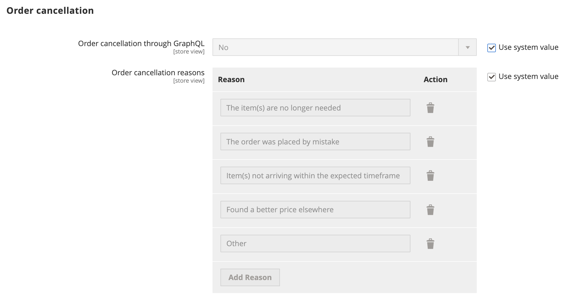
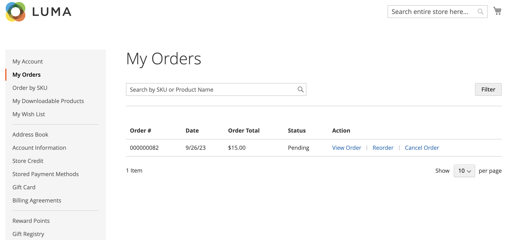

# Tillåt annulleringsorder

När det här alternativet är aktiverat kan du avbryta en beställning direkt från kundens konto. Avbryt är inaktiverat som standard.

## Kriterier för annullering som ska aktiveras för en order

- Konfigurationsalternativet _Tillåt avbryt beställning_ måste vara aktiverat.

- Om ordningen har statusen `Hold`, `Canceled`, `Complete` eller `Closed` är alternativet för att avbryta inaktiverat i butiken.

- Om någon av artiklarna i ordern har levererats är alternativet Avbryt inaktiverat i butiken.

- Om någon artikel har betalats är alternativet för att avbryta aktiverat och återbetalningen skapas för den artikeln.

- Om ordern har statusen `Pending` eller `Processing` aktiveras alternativet för att avbryta i butiken.

## Konfigurera för att tillåta kundannullering och anpassa orsaker till annullering

1. Gå till **[!UICONTROL Stores]** > _[!UICONTROL Settings]_>**[!UICONTROL Configuration]**på sidofältet_ Admin _.

1. Expandera **[!UICONTROL Sales]** i den vänstra panelen och välj **[!UICONTROL Sales]**.

1. Expandera  i avsnittet **[!UICONTROL Order cancellation]**.

   {width="600" zoomable="yes"}

1. Ange **[!UICONTROL Order cancellation through GraphQL]** till `Yes`.

   Den här inställningen aktiverar funktionen för att avbryta från kundkontot i butiken.

1. I **[!UICONTROL Order Order cancellation reasons]** kan du lägga till, ta bort eller ändra en orsak till annullering.

   Med den här inställningen visas annulleringsorsaker i butiken för kunden när de annullerar en order.
Se till att du har angett minst en orsak.

1. Klicka på **[!UICONTROL Save Config]**.

## Avbryt från butiken

Kunden kan initiera avbeställningsfunktionen för en viss order från tre sidor:

- _Sidan Mina beställningar_

- _Ordervy_ sida

- Sidan _Mitt konto_

### Mina beställningar

Knappen _Avbryt beställning_ visas på sidan Mina beställningar om beställningen kan avbrytas.

{width="700" zoomable="yes"}

### Sidan Ordervy

Knappen _Avbryt beställning_ visas på sidan Visa beställning om beställningen kan avbrytas.

{width="700" zoomable="yes"}

### Mitt konto

Knappen _Avbryt beställning_ visas i avsnittet Senaste beställningar på sidan Mitt konto, om beställningen kan avbrytas.

{width="700" zoomable="yes"}
