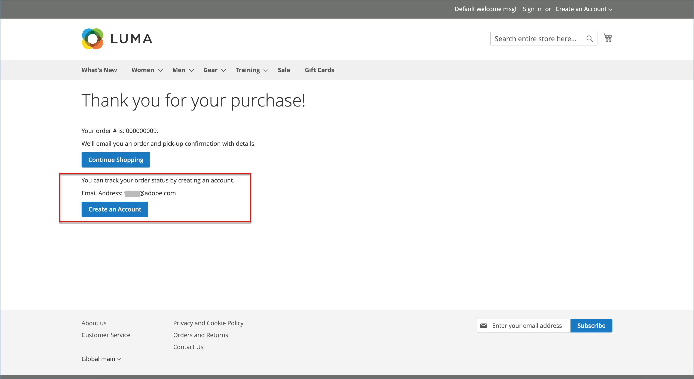

# Kassa på gäst

Din butik kan konfigureras så att kunderna måste öppna ett konto innan de kan göra ett köp. Med standardinställningen kan gäster göra inköp, med möjlighet att registrera sig för ett konto efter att de har slutfört utcheckningsprocessen.

{width="600" zoomable="yes"}

**_Inaktivera gästutcheckning:_**

1. Gå till _>_ > **[!UICONTROL Stores]** på sidofältet _[!UICONTROL Settings]_&#x200B;Admin **[!UICONTROL Configuration]**.

1. Expandera **[!UICONTROL Sales]** på den vänstra panelen och välj **[!UICONTROL Checkout]**.

1. Expandera  i avsnittet **[!UICONTROL Checkout Options]**.

   {width="700" zoomable="yes"}

En detaljerad beskrivning av de här konfigurationsinställningarna finns i [Utcheckningsalternativ](../configuration-reference/sales/checkout.md#checkout-options) i _referenshandboken för konfiguration_.

1. Om inställningen gäller för en viss butiksvy [väljer du den butiksvy](../configuration-reference/scope-change.md#set-the-scope) där konfigurationen gäller.

   Klicka på **[!UICONTROL OK]** när du uppmanas att fortsätta.

1. Ange **[!UICONTROL Allow Guest Checkout]** till `No`.

   Om det behövs avmarkerar du kryssrutan **[!UICONTROL Use system value]** för att aktivera ändringar av den här inställningen.

1. Klicka på **[!UICONTROL Save Config]**.

## Tillåt gästorderåtkomst för registrerade e-postmeddelanden

[!BADGE Endast SaaS]{type=Positive url="https://experienceleague.adobe.com/en/docs/commerce/user-guides/product-solutions" tooltip="Gäller endast Adobe Commerce as a Cloud Service-projekt (SaaS-infrastruktur som hanteras av Adobe)."}

Med en konfiguration på butiksnivå som är inaktiverad som standard kan gästshoppare spåra sina beställningar via en e-postadress som matchar ett registrerat kundkonto.

När det här alternativet är aktiverat är beställningar av gäster som gjorts med ett registrerat e-postmeddelande fortfarande tillgängliga, samtidigt som de visas i kundens orderhistorik.

Om du vill aktivera den här funktionen går du till **Butiker** > Inställningar > **Konfiguration** > Försäljning > **Försäljning** > **Gästutcheckning** och anger inställningen **Tillåt gästorderåtkomst för registrerade e-postmeddelanden** till `Yes`.
