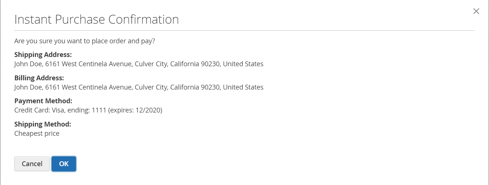

# Omedelbart köp

_Omedelbart köp_ gör det möjligt för kunderna att gå igenom checkout-processen med hjälp av information som har sparats på deras konto. När det är aktiverat visas _Omedelbart köp_ visas under _Lägg i kundvagnen_ på produktsidan för kunder som uppfyller kraven.

{width="700" zoomable="yes"}

## Kundkrav

- Kunden är [inloggad](../customers/customer-sign-in.md) till deras konto.

- Kundkontot har en [standardadress för fakturering och leverans](../customers/account-dashboard-address-book.md).

- Minst en [leveranssätt](delivery.md) är tillgängligt för det land som anges i standardleveransadressen.

- Kundkontot har en [lagrad betalning](../stores-purchase/stored-payment-methods.md) -metod med valv aktiverat.

  Följande betalningsmetoder kan användas för att ge säker åtkomst till sparad kreditkortsinformation:

   - [Braintree kreditkort](braintree.md) (Direktköp kan inte användas med Braintree-kreditkort om 3D-säkerhet är aktiverat.)
   - [Braintree med PayPal aktiverat](braintree.md)
   - [PayPal Payflow Pro](paypal-payflow-pro.md)

## Direktköp i butiken

1. I butiken går kunden till produktsidan för artikeln som ska köpas.

1. Markerar önskade alternativ och klickningar **[!UICONTROL Instant Purchase]**.

   {width="500" zoomable="yes"}

1. Granska **[!UICONTROL Instant Purchase Confirmation]** information och klickningar **[!UICONTROL OK]** för att slutföra transaktionen.

   Ett bekräftelsemeddelande och ordernummer visas högst upp på produktsidan.

## Konfigurera direktköp

### Steg 1: Öppna konfigurationssidan

1. På _Administratör_ sidebar, gå till **[!UICONTROL Stores]** > _[!UICONTROL Settings]_>**[!UICONTROL Configuration]**.

### Steg 2: Konfigurera betalningsmetodvalvet

Du kan använda Direktköp med Braintree eller Betalningstjänster för Adobe Commerce och Magento Open Source. Vaulting måste vara aktiverat innan en kund kan använda funktionen Direktköp.

Lär dig hur du konfigurerar betalningsmetoden och aktiverar säkringar för Braintree eller betaltjänster:

- [Braintree](braintree.md)
- [Betalningstjänster - dokumentation](https://experienceleague.adobe.com/docs/commerce-merchant-services/payment-services/guide-overview.html)

### Steg 3: Aktivera direktköp

1. I den vänstra panelen under _[!UICONTROL Sales]_avsnitt, välja **[!UICONTROL Sales]**.

1. Expandera  den **[!UICONTROL Instant Purchase]** -avsnitt.

1. Om den här ändringen avser en viss butiksvy, [välj butiksvyn](../configuration-reference/scope-change.md#set-the-scope) där konfigurationen gäller.

   Klicka på **[!UICONTROL OK]** för att fortsätta.

1. Ange **[!UICONTROL Enabled]** till `Yes`.

1. Ange **[!UICONTROL Button Text]** som du vill ska visas på knappen.

   Knapptexten kan ändras för varje butiksvy eller språk. Knapptexten är som standard `Instant Purchase`.

   {width="600" zoomable="yes"}

   En detaljerad beskrivning av de här konfigurationsinställningarna finns i [Omedelbart köp](../configuration-reference/sales/sales.md#instant-purchase) i _Referenshandbok för konfiguration_.

1. Klicka på **[!UICONTROL Save Config]**.

1. När du uppmanas att uppdatera cachen klickar du på **[!UICONTROL Cache Management]** i systemmeddelandet och följ instruktionerna för att tömma cachen.
