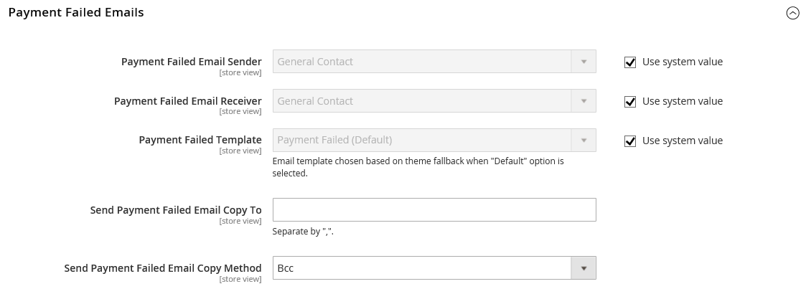

# Meddelande om misslyckade betalningar

Ett meddelande skickas till butikskontakten eller en utsedd administratörsanvändare om betalningsmetoden som valts under utcheckningen inte kan slutföra transaktionen.

## Steg 1: Uppdatera e-postmallen

Se till att du har uppdaterat den e-postmall som behövs för att återspegla ert varumärke. En fullständig lista över mallar finns i [Lista över e-postmallar](../systems/email-templates.md#email-template-list).

## Steg 2: Konfigurera e-postmeddelanden om misslyckade betalningar

1. Gå till **[!UICONTROL Stores]** > _[!UICONTROL Settings]_>**[!UICONTROL Configuration]**på sidofältet_ Admin _.

1. Expandera **[!UICONTROL Sales]** på den vänstra panelen och välj **[!UICONTROL Checkout]**.

1. Expandera  i avsnittet **[!UICONTROL Payment Failed Emails]**.

   {width="600" zoomable="yes"}

1. Ange alternativ för att betala misslyckade e-postmeddelanden:

   - Ange **[!UICONTROL Payment Failed Email Sender]** till den butikskontakt som visas som meddelandets avsändare.
   - Ange **[!UICONTROL Payment Failed Email Receiver]** till den butikskontakt som ska ta emot meddelanden om misslyckade e-postöverföringar.
   - Ange **[!UICONTROL Payment Failed Template]** till mallen som används för e-postmeddelandet som skickas när betalningsmetoden misslyckas under utcheckningen.

1. För **[!UICONTROL Send Payment Failed Email Copy To]** anger du e-postadressen till alla som ska få en kopia av det misslyckade betalningsmeddelandet.

   Om du skickar en kopia till flera mottagare avgränsar du varje adress med ett kommatecken.

1. Ange **[!UICONTROL Payment Failed Copy Method]** till något av följande:

   - `Bcc` - Skickar en _kopia med blindhet_ genom att inkludera mottagaren i huvudet i samma e-postmeddelande som skickas till kunden. Mottagaren av hemlig kopia är inte synlig för kunden.
   - `Separate Email` - Skickar kopian som ett separat e-postmeddelande.

1. Klicka på **[!UICONTROL Save Config]**.
