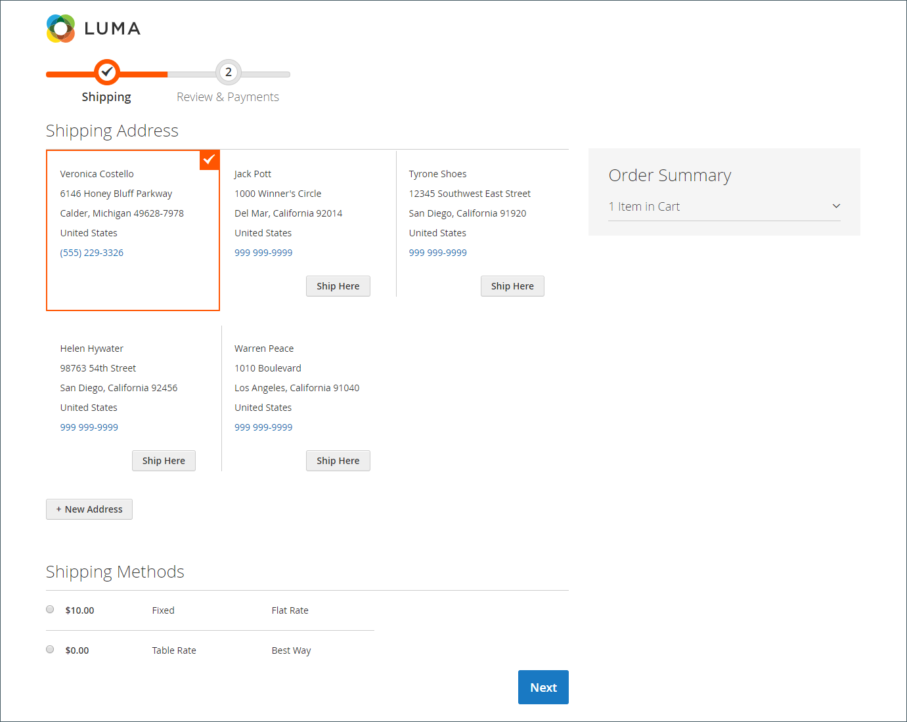
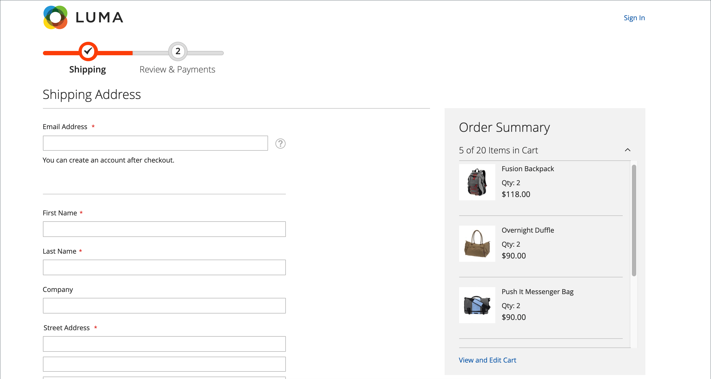

# Utcheckningsprocess och alternativ

När utcheckningsprocessen börjar ändras transaktionen till en säker, krypterad kanal. En hänglåssymbol visas i webbläsarens adressfält och URL:en ändras från `http` till `https`.

## Process

Målet för utcheckningsprocessen är att samla in den information som krävs för att slutföra transaktionen. The _Utcheckning_ sidan leder kunden genom varje steg i processen. Kunder som är inloggade på sina konton kan slutföra utcheckningen snabbt eftersom mycket av informationen redan finns på deras konton. Kunder som är kopplade till ett företagskonto som använder inköpsorder har ett något annorlunda arbetsflöde.

### Leverans

Det första steget i utcheckningsprocessen är att kunden fyller i leveransadressuppgifterna och väljer leveranssätt. Om kunden har ett konto anges leveransadressen automatiskt, men kan ändras vid behov.

 (Endast Adobe Commerce) Formatet på gatuadressen för mottagaren och avsändaren bestäms av egenskaperna för [kundadressattribut](../customers/address-attributes.md). Indatavalideringsinställningen avgör vilka tecken som kan användas i en leveransadress.

Förloppsindikatorn överst på sidan följer varje steg i utcheckningsprocessen och beställningssammanfattningen visar att den information som har angetts hittills har angetts.

{width="600" zoomable="yes"}

#### Leverera till en annan adress

1. Om det finns ytterligare poster i adressboken hittar kunden adressen dit ordern ska skickas.

1. Klicka för att välja adress **[!UICONTROL Ship Here]**.

#### Lägg till en adress

1. Längst ned på _[!UICONTROL Shipping Address]_-avsnittet, kunden klickar **[!UICONTROL + New Address]**.

1. Slutför _[!UICONTROL Shipping Address]_formulär.

   Som standard visas kundens för- och efternamn först i formuläret.

   {width="600" zoomable="yes"}

1. Kunden markerar kryssrutan längst ned i formuläret för att spara den nya adressen i adressboken.

1. Klickningar **[!UICONTROL Save Address]**.

   Den nya adressen har nu valts som leveransadress.

   {width="600" zoomable="yes"}

#### Välj leveranssätt

1. I listan med [frakt](delivery.md) -metoder väljer kunden det alternativ som de vill använda.

   {width="600" zoomable="yes"}

1. Klickningar **[!UICONTROL Next]** för att fortsätta.

### Granskning och betalningar - Regelbunden beställning

Under det andra steget i processen väljer kunden [betalningsmetod](payments.md)och lägger på kuponger med kampanjkoder på köpet. All information kan granskas och redigeras vid behov. Om det är aktiverat måste kunden godkänna försäljningsvillkoren innan beställningen görs.

>[!NOTE]
>
>Även om det går att konfigurera flera kupongkoder i Commerce kan kunden bara använda en kupongkod i kundvagnen. (Se [Kupongkoder](../merchandising-promotions/price-rules-cart-coupon.md) för mer information.)

{width="700" zoomable="yes"}

### Granskning och betalningar - inköpsorder

 (endast tillgängligt med B2B för Adobe Commerce)

När en kund är associerad med ett företag som har aktiverat [inköpsorder](../b2b/purchase-order-flow.md)bearbetas alla order som inköpsorder. Tillgängliga betalningsmetoder bestäms av företagskontoinställningarna.

1. Kunden väljer en betalningsmetod.

   När du använder _Betalning à conto_ -metoden, [!UICONTROL Custom Reference Number] kan användas för att referera till ett fakturanummer.

1. Kunden klickar **[!UICONTROL Place Purchase Order]**.

   Inköpsordern placeras.

Om företaget har ställt in [regler för godkännande](../b2b/account-dashboard-approval-rules.md), går inköpsordern igenom godkännandeprocessen. Annars bearbetas den omedelbart.

{width="700" zoomable="yes"}

### Antal objekt som visas i ordersammanfattningen

Administratörsanvändare kan ändra det maximala antalet objekt som visas i ordersammanfattningen vid utcheckning för att effektivisera visningen med färre produkter. Som standard är värdet 10.

{width="700" zoomable="yes"}

1. På _Administratör_ sidebar, gå till **[!UICONTROL Stores]** > _[!UICONTROL Settings]_>**[!UICONTROL Configuration]**.

1. Expandera på den vänstra panelen **[!UICONTROL Sales]** och välja **[!UICONTROL Checkout]**.

1. Expandera  den **[!UICONTROL Checkout Options]** -avsnitt.

1. För **[!UICONTROL Maximum Number of Items to Display in Order Summary]** anger du det maximala antalet objekt som ska visas.

1. Klicka på **[!UICONTROL Save Config]**.

   Med den här uppdateringen begränsas den ordersammanfattning som visas vid utcheckning till det angivna antalet artiklar.

### Orderbekräftelse

Orderbekräftelsen visas när ordern har placerats ut. För registrerade kunder innehåller sidan ordernumret med en länk till kundens konto och en länk för att generera ett kvitto. Registrerade kunder uppmanas att förvänta sig orderbekräftelse och spårningsinformation via e-post. Gäster uppmuntras att skapa ett konto för att spåra ordern. Registrerade kunder kan generera ett kvitto genom att klicka på en länk.

Orderbekräftelsesidan kallas också för _Lyckades_ och används av analysprogram för att spåra konverteringar.

{width="700" zoomable="yes"}

## Utcheckningsalternativ

Utcheckningsalternativen styr olika attribut för utcheckningssidan, inklusive layouten. Det finns alternativ som du kan konfigurera för att placera begränsningar i utcheckningen, inklusive att tillåta gästutcheckning och verkställa ett villkorsavtal. Det finns även alternativ för att styra visningen av information under utcheckningsprocessen.

{width="700" zoomable="yes"}

En detaljerad beskrivning av de här konfigurationsinställningarna finns i [Utcheckningsalternativ](../configuration-reference/sales/checkout.md#checkout-options) i _Referenshandbok för konfiguration_.

### Ändra alternativ för utcheckning

1. På _Administratör_ sidebar, gå till **[!UICONTROL Stores]** > _[!UICONTROL Settings]_>**[!UICONTROL Configuration]**.
1. Expandera på den vänstra panelen **[!UICONTROL Sales]** och välja **[!UICONTROL Checkout]**.
1. Ange något av följande alternativ som du behöver.
1. Klicka på **[!UICONTROL Save Config]**.

1. Expandera  den **[!UICONTROL Checkout Options]** -avsnitt.

1. Om inställningarna gäller en viss butiksvy, [välj butiksvyn](../configuration-reference/scope-change.md#set-the-scope) där konfigurationen gäller.

   Klicka på **[!UICONTROL OK]** för att fortsätta.

1. Ange utcheckningsalternativen.

1. Klicka på **[!UICONTROL Save Config]**.

### Tillgängliga alternativ för utcheckning

| Fält | [Omfång](../getting-started/websites-stores-views.md#scope-settings) | Beskrivning |
|--- |--- |--- |
| [!UICONTROL Enable Onepage Checkout] | Butiksvy | Bestämmer om [enkelsidig utcheckning](checkout-one-page.md) är standardformat för utcheckning. Alternativ: Ja/Nej |
| [!UICONTROL Allow Guest Checkout] | Butiksvy | Anger om gästerna kan gå igenom [utcheckning utan registrering](checkout-guest.md) för ett konto hos din butik. Alternativ: `Yes` / `No` |
| [!UICONTROL Enable Terms and Conditions] | Butiksvy | Bestämmer om kunderna måste godkänna [Villkor](terms-and-conditions.md) av försäljningen innan du gör ett köp. Alternativ: `Yes` / `No` |
| [!UICONTROL Display Billing Address On] | Butiksvy | Bestämmer platsen för faktureringsadressen under utcheckningen. Alternativ: `Payment Method` / `Payment Page` |
| [!UICONTROL Maximum Number of Items to Display in Order Summary] | Butiksvy | Anger det maximala antalet objekt som kan visas i ordersammanfattningen under utcheckningen. Standardvärdet är `10`. |
| [!UICONTROL Enable Address Search] | Webbplats |  (Endast Adobe Commerce) Anger om kunderna kan använda [adresssökning](checkout-address-search.md) funktionalitet för _Leverans_ och _Granska och betala_ steg. När den här funktionen är aktiverad använder du _[!UICONTROL Number of Customer Addresses Limit]_för att ange antalet sparade adresser som krävs för att aktivera den här funktionen under utcheckningen. Alternativ: `Yes` / `No` |
| [!UICONTROL Number of Customer Addresses Limit] | Webbplats |  (Endast Adobe Commerce) När adresssökning är **[!UICONTROL Enabled]**, avgör hur många sparade adresser som krävs för att aktivera den här funktionen vid utcheckning. När kundens antal sparade adresser uppfyller eller överstiger det här antalet återges endast standardadressen på _Leverans_ och _Granska och betala_ steg. Kunden kan använda en sökfunktion för att ändra den valda adressen. Standardvärdet är 10. |

{style="table-layout:auto"}
