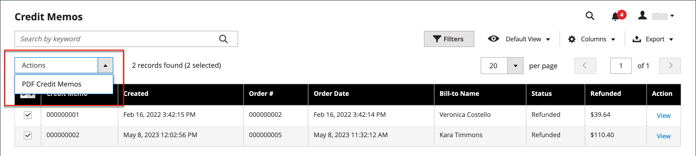

# Utfärda en kreditnota

Innan en kreditnota kan skrivas ut måste den skapas för en [fakturerad order](invoices.md#create-an-invoice). Du kan utfärda både online- och offlineåterbetalningar (helt eller delvis) från en öppen kreditnota, beroende på betalningsmetod.

-  (Endast Adobe Commerce) Återbetalningar kan användas för att lagra krediter.
-  (Tillgängligt med Adobe Commerce B2B) Återbetalningar kan tillämpas på företagskrediter.
- Inköp som görs med kreditkort kan återbetalas antingen online eller offline.
- Inköp som görs med check eller penningorder måste återbetalas offline.

Alla kreditnotor med [status öppen](order-status.md) har en utestående återbetalning.

Med kreditnotor kan du

- Återbetala hela beloppet för en faktura.
- Återbetala en del av en faktura.
- Återbetala flera delbelopp av en faktura.
- Återbetala flera fakturor per order, inte överskrida det totala orderbeloppet.
- Återbetala en del av kvantiteten för en radartikel, t.ex. tre av de fem skjortorna i en beställning.

Se [Skapa en faktura](invoices.md#create-an-invoice) för mer information.

## Inställning för betalningsåtgärd

Återbetalningsarbetsflödet för order som betalas med kreditkort bestäms av [Inställning för betalningsåtgärd](../configuration-reference/sales/payment-methods.md#payment-actions) i konfigurationen för varje tillgänglig betalningsmetod. Återbetalningar kan inte ges förrän transaktionen har avvecklats.

{width="600" zoomable="yes"}

- Om betalningsåtgärden för den konfigurerade betalningsmetoden är inställd på `Authorize`måste du först generera fakturan från administratören innan du kan skapa en kreditnota.
- Om betalningsåtgärden för den konfigurerade betalningsmetoden är inställd på `Authorize and Capture`, fakturan redan har genererats av betalningsprocessorn, men medlen är inte tillgängliga förrän transaktionen har kvittats. Denna korta vänteperiod rekommenderas av många betalningsprocessorer som en säkerhetsåtgärd och kan vanligtvis hanteras automatiskt. Transaktioner kan också kvittas manuellt från ditt handlarkonto hos betalningsprocessorn.
-  (Endast Adobe Commerce) Om du skapar en kreditnota för en beställning som innehåller presentalternativ visas återbetalningen för presentomslaget och/eller det utskrivna kortet under Återbetalningssummor på kreditnotan. Om du vill utesluta dessa kostnader från det belopp som ska återbetalas anger du beloppet som en justeringsavgift. Om flera kreditnotor utfärdas för samma order visas endast återbetalning för presentalternativ på den första kreditnotan.

## Skapa en kreditnota

Bestäm vilken typ av återbetalning du vill utfärda - för en [kreditköp](#issue-a-refund-for-a-credit-purchase) eller för [check eller penningorder](#issue-an-offline-refund-for-check-or-money-order)—och generera kreditnotan och återbetala den.

### Återbetala ett kreditköp

1. På _Administratör_ sidebar, gå till **[!UICONTROL Sales]** > **[!UICONTROL Orders]**.

   {width="700" zoomable="yes"}

1. Hitta ordningen i rutnätet och klicka på **[!UICONTROL View]**.

1. Om _[!UICONTROL Credit Memo]_knappen visas i knappfältet, gör något av följande:

   - Så här utfärdar du `offline` återbetala, gå till steg 6.
   - Så här utfärdar du `online` återbetalning, fortsätt med steg 4.

   Se [Kreditnotor](credit-memos.md) för mer information om online- och offlineåterbetalningar.

1. Klicka **[!UICONTROL Invoices]** till vänster.

1. Sök efter fakturan i rutnätet och klicka på **[!UICONTROL View]**.

   {width="700" zoomable="yes"}

1. Bläddra nedåt till **[!UICONTROL Invoice Totals]** kontrollerar du att fakturan är inställd på `Capture Online`och klicka **[!UICONTROL Submit Invoice]**.

   {width="600" zoomable="yes"}

   Om det alternativet inte är tillgängligt skapas redan fakturan. Gå vidare till nästa steg.

1. Klicka på i knappfältet högst upp på fakturan **[!UICONTROL Credit Memo]**.

1. Verifiera informationen i **[!UICONTROL Items to Refund]** och gör följande, om tillämpligt:

   - Om du vill returnera produkten till lagret väljer du **[!UICONTROL Return to Stock]** kryssrutan.

     Produkten återgår till lager automatiskt om _ProduktStock-alternativ_ är inställd på `Automatically Return Credit Memo Item to Stock`. Med [Inventory management aktiverat](../inventory-management/enable.md)returnerar artikeln till källan som skickade leveransen.

   - Uppdatera **[!UICONTROL Qty to Refund]** och klicka **[!UICONTROL Update Qty's]**.

     {width="600" zoomable="yes"}

1. Uppdatera **[!UICONTROL Refunds Totals]** enligt följande:

   - För **[!UICONTROL Refund Shipping]** Ange det belopp som ska återbetalas från fraktkostnaden.

     I det här fältet visas inledningsvis det totala fraktbeloppet från ordern som är tillgänglig för återbetalning. Det är lika med hela fraktbeloppet från ordern, minus alla fraktbelopp som redan har återbetalats. Liksom kvantiteten kan beloppet minskas, men inte ökas.

   - För **[!UICONTROL Adjustment Refund]** Ange ett värde som ska läggas till det totala belopp som återbetalas som en extra återbetalning som inte gäller för någon viss del av ordern (frakt, artiklar eller skatt). Den kan också användas för delvis återbetalning med virtuella pengar, t.ex. ett presentkort, när en administratör vill återbetala en icke-virtuell betalningsmetod först.

     Det angivna beloppet kan inte höja det totala återbetalningsbeloppet över det betalda beloppet.

   - För **[!UICONTROL Adjustment Fee]** anger du ett värde som ska subtraheras från det totala återbetalningsbeloppet.

     Detta belopp subtraheras inte från ett visst avsnitt i ordern, till exempel frakt, artiklar eller moms.

1. Skriv texten i **[!UICONTROL Credit Memo Comments]** box.

   - Om du vill skicka ett e-postmeddelande till kunden väljer du **[!UICONTROL Email Copy of Credit Memo]** kryssrutan.

1. Klicka på **[!UICONTROL Update Totals]**.

1. Gör följande, beroende på vad som är tillämpligt:

   -  (Endast Adobe Commerce) Om du vill återbetala beloppet till kundens butikskredit väljer du **[!UICONTROL Refund to Store Credit]** kryssrutan.

   -  (Tillgängligt för Adobe Commerce B2B) Om du vill återbetala beloppet till kundens företagskrediter väljer du **[!UICONTROL Refund to Company Credit]** kryssrutan.

   - Om du vill återbetala offline klickar du **[!UICONTROL Refund Offline]**.

   - Om du vill återbetala online klickar du **[!UICONTROL Refund]**.

   -  (Tillgängligt för Adobe Commerce B2B) Om köpet gjordes med företagskrediter klickar du på **[!UICONTROL Refund to Company Credit]**.

   Se [Kreditnotor](credit-memos.md) för mer information om online- och offlineåterbetalningar.

   {width="600" zoomable="yes"}

### Utfärda en offlineåterbetalning för check- eller penningorder

1. På _Administratör_ sidebar, gå till **[!UICONTROL Sales]** > **[!UICONTROL Orders]**.

1. Hitta den färdiga ordningen i rutnätet och öppna den genom att klicka på **[!UICONTROL View]** länk.

1. Klicka på i knappfältet överst på sidan **[!UICONTROL Invoice]**.

1. Bläddra nedåt till sidans nederkant och klicka **[!UICONTROL Submit Invoice]**.

1. Klicka på i knappfältet högst upp på fakturan **[!UICONTROL Credit Memo]**.

   {width="600" zoomable="yes"}

1. Verifiera informationen i **[!UICONTROL Items to Refund]** och gör följande, om tillämpligt:

   {width="600" zoomable="yes"}

   - Välj **[!UICONTROL Return to Stock]** om du vill returnera den returnerade produkten till lagret.

     När Inventory management är aktiverat återgår lagerkvantiteten till källan som skickade leveransen. Produkten återgår till lager automatiskt om [ProduktStock-alternativ](../inventory-management/enable.md) är inställd på `Automatically Return Credit Memo Item to Stock`.

   - Uppdatera **[!UICONTROL Qty to Refund]** och klicka **[!UICONTROL Update Qty's]**.

     Det belopp som ska krediteras får inte överstiga det högsta belopp som är tillgängligt för återbetalning.

1. Uppdatera **[!UICONTROL Refunds Totals]** om tillämpligt:

   - För **[!UICONTROL Refund Shipping]** Ange det belopp som ska återbetalas från fraktkostnaden.

     I det här fältet visas inledningsvis det totala fraktbeloppet från ordern som är tillgänglig för återbetalning. Det är lika med hela fraktbeloppet från ordern, minus alla fraktbelopp som redan har återbetalats. Liksom kvantiteten kan beloppet minskas, men inte ökas.

   - För **[!UICONTROL Adjustment Refund]** Ange ett värde som ska läggas till det totala belopp som återbetalas som en extra återbetalning som inte gäller för någon viss del av ordern (frakt, artiklar eller skatt). Den kan också användas för delvis återbetalning med virtuella pengar, t.ex. ett presentkort, när en administratör vill återbetala en icke-virtuell betalningsmetod först.

     Det angivna beloppet kan inte höja det totala återbetalningsbeloppet över det betalda beloppet.

   - För **[!UICONTROL Adjustment Fee]** anger du ett värde som ska subtraheras från det totala återbetalningsbeloppet.

     Detta belopp subtraheras inte från ett visst avsnitt i ordern, till exempel frakt, artiklar eller moms.

   - Om köpet betalades med butikskrediter väljer du **[!UICONTROL Refund to Store Credit]** för att kreditera beloppet till kundkontosaldot.

1. Skriv texten i **[!UICONTROL Credit Memo Comments]** och gör följande:

   - Om du vill skicka ett e-postmeddelande till kunden väljer du **[!UICONTROL Email Copy of Credit Memo]** kryssrutan.

   - Om du vill inkludera de kommentarer som du har angett i e-postmeddelandet väljer du **[!UICONTROL Append Comments]** kryssrutan.

     Statusen för en kreditnotsavisering visas i den ifyllda kreditnotan bredvid kreditnotanumret.

     {width="600" zoomable="yes"}

1. Slutför processen och utfärda återbetalningen genom att klicka **[!UICONTROL Refund Offline]**.

## Fältbeskrivningar

### [!UICONTROL Order & Account Information]

| Fält | Beskrivning |
|--- |--- |
| [!UICONTROL Order Number] | Ordernumret visas i dialogrutan _Beställnings- och kontoinformation_, följt av en anteckning som anger om bekräftelsemeddelandet skickades. |
| [!UICONTROL Order Date] | Datum och tid då ordern lades. |
| [!UICONTROL Order Status] | Anger orderstatus som `Complete`. |
| [!UICONTROL Purchased From] | Anger webbplatsen, butiken och butiksvyn där beställningen placerades. |
| [!UICONTROL Placed from IP] | Anger IP-adressen till datorn som beställningen gjordes från. |

{style="table-layout:auto"}

### [!UICONTROL Account Information]

| Fält | Beskrivning |
|--- |--- |
| [!UICONTROL Customer Name] | Namnet på den kund eller köpare som lade ordern. Kundens namn är länkat till kundprofilen. |
| [!UICONTROL Email] | Kundens eller köparens e-postadress. E-postadressen är länkad för att öppna ett nytt e-postmeddelande. |
| [!UICONTROL Customer Group] | Namnet på den kundgrupp eller delade katalog som kunden är tilldelad till. |
| [!UICONTROL Company Name] |  (Tillgängligt för Adobe Commerce B2B) Namnet på det företag som är associerat med köparen och för vars räkning beställningen görs. Företagsnamnet är kopplat till företagsprofilen. |

{style="table-layout:auto"}

### [!UICONTROL Address Information]

| Fält | Beskrivning |
|--- |--- |
| [!UICONTROL Billing Address] | Namnet på den kund eller köpare som lade ordern, följt av faktureringsadressen, telefonnumret och [moms](vat.md), om tillämpligt. Telefonnumret är kopplat till automatisk uppringning på en mobil enhet. |
| [!UICONTROL Shipping Address] | Namnet på den person som ordern ska skickas till, följt av leveransadress och telefonnummer. Telefonnumret är kopplat till automatisk uppringning på en mobil enhet. |

{style="table-layout:auto"}

### [!UICONTROL Payment & Shipping Method]

| Fält | Beskrivning |
|--- |--- |
| [!UICONTROL Payment Information] | Betalningsmetoden som ska användas för ordern och inköpsordernumret, om tillämpligt, följt av valutan som användes för att placera ordern. Om ordern debiteras företagskrediter med [Betalning à conto](../b2b/enable-basic-features.md#configure-payment-on-account), det belopp som debiteras kontot anges. |
| [!UICONTROL Shipping & Handling Information] | Den leveransmetod som ska användas och eventuella hanteringsavgifter som är tillämpliga. |

{style="table-layout:auto"}

### [!UICONTROL Items to Refund]

| Fält | Beskrivning |
|--- |--- |
| [!UICONTROL Product] | Produktnamn, SKU och alternativ (om tillämpligt). |
| [!UICONTROL Price] | Artikelns inköpspris. För Adobe Commerce B2B återspeglar detta värde eventuell rabatt som tillämpas på objektet från den delade katalogen, om tillämpligt. |
| [!UICONTROL Qty] | Beställd kvantitet. |
| [!UICONTROL Return to Stock] | Kryssruta som anger om den returnerade artikeln ska returneras till lagret. |
| [!UICONTROL Qty to Refund] | Anger antalet enheter som returneras av produkten. |
| [!UICONTROL Subtotal] | Delsumman är inköpspriset multiplicerat med kvantiteten returnerade produktenheter. |
| [!UICONTROL Tax Amount] | Momsbeloppet som gäller för den returnerade artikeln som ett decimalvärde. |
| [!UICONTROL Tax Percent] | Procentandelen moms som används för den returnerade artikeln som en procentandel. |
| [!UICONTROL Discount Amount] | Alla rabatter som gäller för den returnerade artikeln. |
| [!UICONTROL Row Total] | Radartikelsumman, inklusive tillämpliga skatter som ska betalas för den returnerade produktnivån, minus rabatter. |
| _ordersumma_ |  |

{style="table-layout:auto"}

### [!UICONTROL Credit Memo Comments]

| Fält | Beskrivning |
|--- |--- |
| [!UICONTROL Comment Text] | En textruta som används för att ange en kommentar till kunden om kreditnotan. |

{style="table-layout:auto"}

### [!UICONTROL Refund Totals]

| Fält | Beskrivning |
|--- |--- |
| [!UICONTROL Refund Shipping] | Leveransbeloppet som ska återbetalas. |
| [!UICONTROL Adjustment Refund] | Ett belopp som läggs till det totala belopp som återbetalas som en extra återbetalning som inte gäller för någon viss del av ordern, t.ex. frakt, artiklar eller skatt. Det angivna beloppet kan inte höja det totala återbetalningsbeloppet över det betalda beloppet. |
| [!UICONTROL Adjustment Fee] | Ett belopp som subtraheras från det totala återfinansierade beloppet, t.ex. en återköpsavgift, eller ett belopp som är relaterat till presentomslag eller presentalternativ. |
| [!UICONTROL Grand Total] | Det totala belopp som ska återbetalas |
| [!UICONTROL Append Comments] | Kryssruta som anger om kommentarer är inkluderade i kreditnotan. |
| [!UICONTROL Email Copy of Credit Memo] | Kryssruta som avgör om en kopia av kreditnotan skickas med e-post. |
| [!UICONTROL Refund to Store Credit] |  (Endast Adobe Commerce) Kryssruta som anger om summan ska återbetalas till [butikskredit](../customers/store-credit-using.md). |
| [!UICONTROL Subtotal] |  (Tillgängligt för Adobe Commerce B2B) Summan av alla poster som ska återbetalas. |

{style="table-layout:auto"}

### Återbetalningsknappar

Betalningsmetoden som används för ordern avgör vilka återbetalningsknappar som är tillgängliga för en kreditnota.

| Knapp | Beskrivning |
|--- |--- |
| **[!UICONTROL Refund]** | Om det ursprungliga köpet betalades med kreditkort via en betalningsgateway hanteras återbetalningsbeloppet av betalningsprocessorn. Information om hur du hanterar återbetalningar finns i dokumentationen från din betalningsleverantör. |
| **[!UICONTROL Refund Offline]** | Om det ursprungliga köpet betalades med check eller penningorder, betalas pengarna tillbaka direkt till kunden genom att en check, ett presentkort eller kontanter utfärdas om du har en tegelsten och en fast butik. Kreditnotan fungerar som en post för offlinetransaktionen. |
| **[!UICONTROL Refund to Company Credit]** |  (Tillgängligt för Adobe Commerce B2B) Om köpet debiterades företagskrediten återbetalas återbetalningen till [Företagskonto](../b2b/credit-company.md). |

{style="table-layout:auto"}

## Skriv ut en kreditnota

Om du vill skriva ut eller visa den ifyllda kreditnotan måste du ha en läsare för PDF installerad. Du kan ladda ned [Adobe Reader][1] utan kostnad.

1. På _Administratör_ sidebar, gå till **[!UICONTROL Sales]** > _[!UICONTROL Operations]_>**[!UICONTROL Credit Memos]**.

1. Skriv ut kreditnotan på något av följande sätt:

### Metod 1: Skriv ut aktuell kreditnota

1. Öppna kreditnotan i rutnätet.

1. Klicka på **[!UICONTROL Print]**.

   {width="600" zoomable="yes"}

### Metod 2: Skriv ut flera kreditnotor

1. Markera kryssrutan för varje kreditnota som du vill skriva ut i listan.

1. Ange **[!UICONTROL Actions]** styra till `PDF Credit Memos` och klicka **[!UICONTROL Submit]**.

   {width="600" zoomable="yes"}

1. Gör något av följande när du uppmanas till det:

   - Spara dokumentet genom att klicka **[!UICONTROL Save]** och följ anvisningarna för att spara filen på datorn. När nedladdningen är klar öppnar du PDF i Adobe Reader och skriver ut dokumentet.

   - Om du vill visa dokumentet klickar du **[!UICONTROL Open]**. Den tryckta kreditnotan för PDF öppnas i Adobe Reader. Härifrån kan du antingen skriva ut kreditnotan eller spara den på datorn.

[1]: https://www.adobe.com/acrobat/pdf-reader.html "Skaffa Adobe Reader"
