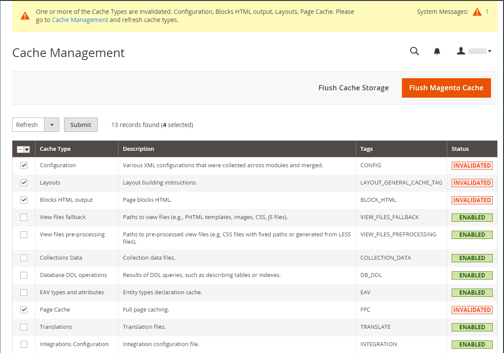

# Uppdatera valutakurser

Valutakurser kan ställas in manuellt eller importeras till butiken. För att vara säker på att din butik har de senaste kurserna kan du konfigurera valutakurserna så att de uppdateras automatiskt enligt schema.

Innan du importerar valutakurser slutför du inställningarna för [valutakurser](currency-configuration.md) för att ange vilka valutor du godkänner och för att upprätta importanslutningen och schemat.

{width="600" zoomable="yes"}

## Uppdatera en valutakurs manuellt

1. Gå till **[!UICONTROL Stores]** > _[!UICONTROL Currency]_>**[!UICONTROL Currency Rates]**&#x200B;på sidofältet_ Admin _.

1. Klicka på den kurs som du vill ändra och ange det nya värdet för varje valuta som stöds.

1. Klicka på **[!UICONTROL Save Currency Rates]** när du är klar.

## Importera valutakurser

1. Gå till **[!UICONTROL Stores]** > _[!UICONTROL Currency]_>**[!UICONTROL Currency Rates]**&#x200B;på sidofältet_ Admin _.

1. Ange **[!UICONTROL Import Service]** till valutakursprovidern.

   Standardprovidern är `fixer.io (legacy)`.

   >[!IMPORTANT]
   >
   >Från och med version 2.4.6 är tjänsten [[!DNL Fixer.io]](https://fixer.io/) inaktuell och ersatt med tjänsten [[!DNL Fixer API] (APILayer)](https://apilayer.com/marketplace/fixer-api). Vi rekommenderar att du använder ett APILayer-konto i stället för ett inaktuellt [!DNL Fixer.io]-konto.

1. Klicka på **[!UICONTROL Import]**.

   De uppdaterade hastigheterna visas i listan _[!UICONTROL Currency Rates]_. Om priserna har ändrats sedan den senaste uppdateringen visas den gamla tariffen nedan som referens.

1. Klicka på **[!UICONTROL Save Currency Rates]** när du är klar.

1. När du uppmanas att uppdatera cachen klickar du på länken **[!UICONTROL Cache Management]** och uppdaterar det ogiltiga cacheminnet.

   {width="600" zoomable="yes"}

## Importera valutakurser enligt schema

1. Kontrollera att [Cron](../systems/cron.md) är aktiverat för din butik.

1. Om du vill ange vilka valutor du godkänner och upprätta importanslutningen och schemat, slutför du [Inställningar för valutakurs](currency-configuration.md).

1. Kontrollera listan _[!UICONTROL Currency Rates]_&#x200B;om du vill verifiera att tarifferna har importerats enligt schemat.

1. Vänta på tidsperioden för den frekvensinställning som har fastställts för schemat och kontrollera hastigheterna igen.
