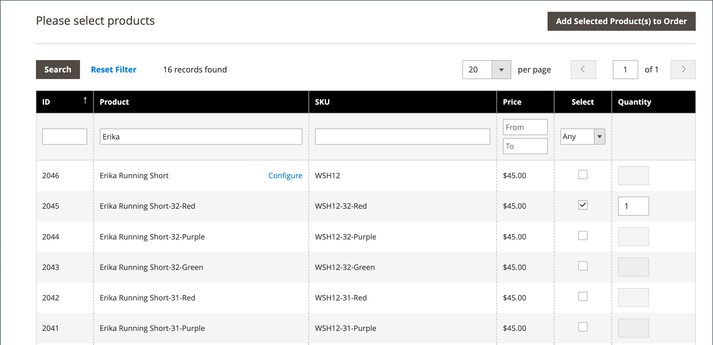

# Skapa en order

För registrerade kunder som behöver hjälp kan du skapa en hel order direkt från administratören. Formuläret _[!UICONTROL Create New Order]_&#x200B;innehåller all information som behövs för den normala utcheckningsprocessen, med aktivitetssammanfattningar från kundens kontouppsättning.

{width="700" zoomable="yes"}

## Steg 1: Skapa en order

1. Klicka på **[!UICONTROL Customers]** på sidofältet _Admin_.

1. Hitta kunden i rutnätet.

1. Klicka på **[!UICONTROL Edit]** i kolumnen _Åtgärd_.

1. Klicka på **[!UICONTROL Create Order]** i arbetsytehuvudet.

   {width="700" zoomable="yes"}

   Du kan också skapa en ordning på [arbetsytan Ordning](orders.md#orders-workspace) genom att klicka på **[!UICONTROL Create New Order]**.

## Steg 2: Lägg till produkter

Om din butik innehåller flera vyer väljer du den butiksvy där beställningen ska placeras.

### Lägg till produkter från sidofältet [!UICONTROL Customer's Activities]

Du kan överföra artiklar till kundvagnen från kundens önskelista eller från nyligen visade, jämförda eller beställda artiklar.

1. Expandera  i något av följande avsnitt:

   - **[!UICONTROL Wish List]**
   - **[!UICONTROL Last Ordered Items]**
   - **[!UICONTROL Products in Comparison List]**
   - **[!UICONTROL Recently Compared Products]**
   - **[!UICONTROL Recently Viewed Products]**

1. Markera kryssrutan för varje produkt i den vänstra panelen.

1. Rulla ned och klicka på **[!UICONTROL Update Changes]**.

   Objektet visas i orderformuläret.

   {width="600" zoomable="yes"}

### Lägg till produkter från katalogen

1. Klicka på **[!UICONTROL Add Products]**.

   {width="600" zoomable="yes"}

1. I rutnätet markerar du kryssrutan för varje produkt som ska läggas till i kundvagnen och anger **[!UICONTROL Qty]** som ska köpas.

   {width="600" zoomable="yes"}

   >[!NOTE]
   >
   >I rutnätet för produktval visas alltid vanliga baspriser för produkter, utan rabatter och eventuella regler för kundvagn eller grupppris. Slutproduktspriset beräknas endast när produkten läggs till i en order/kundvagn.

1. Konfigurera tillgängliga produktalternativ:

   - Klicka på **[!UICONTROL Configure]**.

   - Fyll i alternativen efter behov.

   - Klicka på **[!UICONTROL OK]**.

   - Klicka på **[!UICONTROL Add Selected Product(s) to Order]** för att uppdatera vagnen.

1. Om en produkt har konfigurerats för [presentalternativ](../catalog/product-gift-options.md) anger du alternativen efter behov.

1. Åsidosätt priset på ett objekt om det behövs:

   - Markera kryssrutan **[!UICONTROL Custom Price]** och ange det nya priset i rutan nedan.

   - Om du vill uppdatera kundvagnssummorna klickar du på **[!UICONTROL Update Items and Quantities]**.

   {width="600" zoomable="yes"}

1. Fyll i följande avsnitt efter behov för ordern:

   - [!UICONTROL Order Currency]
   - [!UICONTROL Apply Coupon Codes / Gift Card Code]
   - [!UICONTROL Payment Method]
   - [!UICONTROL Shipping Method]
   - [!UICONTROL Order Comments]

>[!NOTE]
>
>Mer information om betalningsmetoder som stöder den här funktionen finns i [Betalningstjänster](https://experienceleague.adobe.com/sv/docs/commerce/payment-services/guide-overview) när tillägget Betalningstjänster installeras och konfigureras.

## Steg 3: Skicka beställningen

Klicka på **[!UICONTROL Submit Order]**.

En bekräftelse skickas till kunden och kunden kan se orderinformationen från sitt konto.
