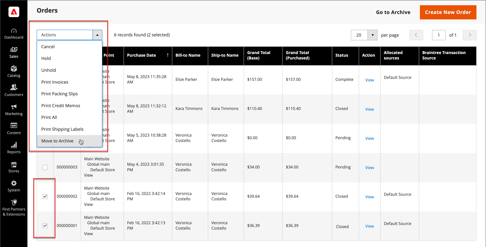

# Arkivera order

{{ee-feature}}

Att arkivera beställningar regelbundet förbättrar prestanda och håller arbetsytan fri från onödig information så att du kan fokusera på den aktuella verksamheten. Fakturor, leveranser och kreditnotor kan arkiveras automatiskt eller manuellt och kan visas när som helst.

>[!NOTE]
>
>The _[!UICONTROL Archive]_finns i [[!UICONTROL Sales] meny](sales-menu.md) endast när arkiveringen [aktiverad](../configuration-reference/sales/sales.md).

## Konfigurera orderarkivet

Din butik kan konfigureras för att arkivera order, fakturor, leveranser och kreditnotor efter ett visst antal dagar. Du kan flytta beställningar och tillhörande dokument till arkivet eller återställa dem till deras tidigare status. Arkiverade order tas inte bort och är fortfarande tillgängliga från administratören. Arkiverade data kan exporteras till en CSV-fil och öppnas i ett kalkylblad. När det är aktiverat visas _Arkiv_ visas längst upp på arbetsytan.

1. På _Administratör_ sidebar, gå till **[!UICONTROL Stores]** > _[!UICONTROL Settings]_>**[!UICONTROL Configuration]**.

1. Expandera **[!UICONTROL Sales]** och välja **[!UICONTROL Sales]** under.

1. Expandera  den **[!UICONTROL Orders, Invoices, Shipments, Credit Memos Archiving]** -avsnitt.

   {width="600" zoomable="yes"}

1. Ange **[!UICONTROL Enable Archiving]** till `Yes`.

   >[!NOTE]
   >
   >Om du senare bestämmer dig för att stänga av arkiveringen återställs alla arkiverade order till det tidigare tillståndet.

1. Ange **[!UICONTROL Archive Orders Purchased]** till antalet dagar innan slutförda order arkiveras.

   Som standard arkiveras beställningar 30 dagar efter köpet.

1. I **[!UICONTROL Order Statuses to be Archived]** väljer du varje orderstatus som ska användas för att identifiera order som ska arkiveras.

   Om du vill markera flera objekt håller du ned Ctrl (Windows) eller Kommando (Mac) samtidigt som du klickar på varje objekt.

1. Klicka på **[!UICONTROL Save Config]**.

1. Uppdatera eventuell ogiltig cache när du uppmanas till detta.

## Visa arkiverade dokument

1. I _[!UICONTROL Sales]_meny under_[!UICONTROL Archive]_ väljer du något av följande:

   - **[!UICONTROL Orders]**
   - **[!UICONTROL Invoices]**
   - **[!UICONTROL Shipments]**
   - **[!UICONTROL Credit Memos]**

1. Om du vill visa information klickar du på ett arkiverat dokument i listan.

## Tillämpa en åtgärd på ett arkiverat dokument

Markera varje dokument som ska bli åtgärdens mål och välj något av följande **[!UICONTROL Actions]**:

- `Cancel`
- `Hold`
- `Unhold`
- `Print`
- `Move to Orders Management`

## Arkivera dokument manuellt

1. Välj den typ av dokument som ska arkiveras från följande:

   - **[!UICONTROL Orders]**
   - **[!UICONTROL Invoices]**
   - **[!UICONTROL Shipments]**
   - **[!UICONTROL Credit Memos]**

1. Markera kryssrutan för varje objekt som du vill arkivera.

1. I det övre högra hörnet anger du **[!UICONTROL Actions]** till `Move to Archive`.

1. Klicka **[!UICONTROL Submit]** för att arkivera de markerade dokumenten.

## Återställ arkiverade dokument

1. Välj den typ av dokument som du vill återställa.

1. Välj dokument med något av följande alternativ:

   - Om du vill markera alla synliga dokument klickar du i det övre vänstra hörnet på **[!UICONTROL Select Visible]**.

   - Markera manuellt kryssrutan för varje dokument som du vill återställa.

1. I det övre högra hörnet anger du **[!UICONTROL Action]** till `Move to Orders Management`.

1. Klicka **[!UICONTROL Submit]** för att återställa dokumenten.

## Exportera arkiverade dokument

1. Välj den typ av dokument som du vill exportera.

1. Ange **[!UICONTROL Export to:]** till något av följande värden:

   - `CSV`
   - `Excel`

1. Klicka på **[!UICONTROL Export]**.

Din butik kan konfigureras för att arkivera order, fakturor, leveranser och kreditnotor efter ett visst antal dagar. Du kan flytta beställningar och tillhörande dokument till arkivet eller återställa dem till deras tidigare status. Arkiverade order tas inte bort och är fortfarande tillgängliga från administratören. Arkiverade data kan exporteras till en CSV-fil och öppnas i ett kalkylblad. När det är aktiverat visas _[!UICONTROL Archive]_-kommandot visas längst upp på arbetsytan.

## Arkivera order manuellt

1. På _Administratör_ sidebar, gå till **[!UICONTROL Sales]** > _[!UICONTROL Operations]_>**[!UICONTROL Orders]**.

1. Markera kryssrutan i den första kolumnen om du vill välja ordningen i rutnätet.

1. Ange **[!UICONTROL Actions]** styra till `Move to Archive` och se efter meddelandet att beställningen har arkiverats.

   {width="700" zoomable="yes"}

>[!TIP]
>
>Om du vill ange en lista över orderstatusar som kan arkiveras läser du [Konfigurera orderarkivet](#configure-the-order-archive).

## Visa en arkiverad order

1. Öppna arkivvyn på något av följande sätt:

   - I knappfältet ovanför _[!UICONTROL Orders]_stödraster, klicka **[!UICONTROL Go to Archive]**.

   - På _Administratör_ sidebar, gå till **[!UICONTROL Sales]** > _[!UICONTROL Archive]_>**[!UICONTROL Orders]**.

   >[!NOTE]
   >
   >Precis som på sidan Beställningar är rubriken på den arkiverade beställningssidan _[!UICONTROL Orders]_. Den enda märkbara skillnaden är alternativet i knappfältet för att_[!UICONTROL Return to Orders Management]_. Sidans URL anger också att du är i orderarkivet.

1. I _Åtgärd_ kolumn, klicka **[!UICONTROL View]**.

   {width="600" zoomable="yes"}

## Återställa en arkiverad order

>[!NOTE]
>
>En order som återställs från en arkiverad order arkiveras igen enligt antalet dagar som konfigurerats i [!UICONTROL Archive Orders Purchased] inställning (se [Konfigurera orderarkivet](#configure-the-order-archive)). Antalet dagar beräknas mot [!UICONTROL Updated At] datum för ordern, som ändras när ordern flyttas från arkivet.

1. På _Administratör_ sidebar, gå till **[!UICONTROL Sales]** > _[!UICONTROL Operations]_>**[!UICONTROL Orders]**.

1. Klicka på i knappfältet **[!UICONTROL Go to Archive]**.

1. Leta reda på den post som ska återställas och markera den genom att klicka i kryssrutan.

   {width="600" zoomable="yes"}

1. Ange **[!UICONTROL Actions]** kontrollvärde till `Move to Order Management`.

Leta efter meddelandet att den arkiverade ordern har tagits bort från arkivet.

## Exportera arkiverad order

1. På _Administratör_ sidebar, gå till **[!UICONTROL Sales]** > _[!UICONTROL Operations]_>**[!UICONTROL Orders]**.

1. Klicka på **[!UICONTROL Export]** och välj önskat format.
