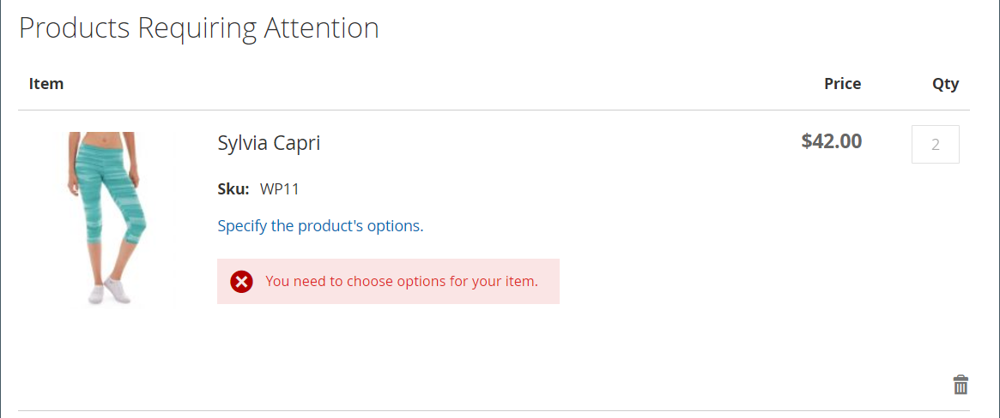

# Beställa efter SKU

{{ee-feature}}

En SKU är en Stock Keeping Unit. SKU:er hjälper i allmänhet onlineförsäljare att identifiera de viktigaste produktegenskaperna, till exempel storlek, färg, pris och material. Produkt-ID:n skiljer sig från SKU:er:

- `Product ID` är en sekventiell serie med nummer som används internt för att identifiera produkter och som inte är tillgängliga för kunder.
- `SKU` genereras av säljaren, vanligtvis baserat på produktnamn och attribut för marknadsföring eller intern spårning. Exempel: En blå, bomull T-shirt, storleksmedelstor: T-COT-MED-BL. SKU:n kan vid behov ändras av säljaren.

I vanliga fall innehåller en SKU en uppsättning förkortningar som anger produktens särskiljande egenskaper. Den maximala SKU-längden är 64 tecken. SKU:er är viktiga för att effektivt spåra och hantera lager, så att det är viktigt att konfigurera dem på rätt sätt för e-handel.

_Order by SKU_ är en [widget](../content-design/widgets.md) som kan visas i butiken som en bekvämlighet för alla kunder, eller som endast är tillgänglig för shoppare i specifika kundgrupper. Köpare kan antingen ange SKU- och kvantitetsinformation direkt i Order by SKU-blocket eller överföra en csv-fil från sitt kundkonto. Oberoende av konfiguration är beställning via SKU alltid tillgängligt för lagringsadministratörer.

{width="700" zoomable="yes"}

## Konfigurera order efter SKU

1. Gå till **[!UICONTROL Stores]** > _[!UICONTROL Settings]_>**[!UICONTROL Configuration]**&#x200B;på sidofältet_ Admin _.

1. Expandera avsnittet **[!UICONTROL Sales]** i den vänstra panelen och välj **[!UICONTROL Sales]** under.

1. Expandera  i avsnittet **[!UICONTROL Order by SKU Settings]**.

1. Ange **[!UICONTROL Enable Order by SKU on my Account in Storefront]** till något av följande:

   - `Yes, for Everyone` - Blocket Order by SKU är tillgängligt i butiken för alla kunder.
   - `Yes, for Specified Customer Groups` - Order by SKU är bara tillgängligt för medlemmar i en viss kundgrupp, till exempel `Wholesale`.
   - `No` - Blocket Order by SKU visas inte i butiken och sidan Order by SKU är inte tillgänglig i kundkontot.

   {width="600" zoomable="yes"}

1. Klicka på **[!UICONTROL Save Config]**.

 (endast Adobe Commerce B2B) _&#x200B;**Om du vill aktivera funktionen Ordna efter SKU inaktiverar du snabbordningsfunktionen:**&#x200B;_

1. Gå till **[!UICONTROL Stores]** > _[!UICONTROL Settings]_>**[!UICONTROL Configuration]**.

1. Välj **[!UICONTROL B2B Features]** på den vänstra panelen under _[!UICONTROL General]_

1. Expandera  i avsnittet **[!UICONTROL B2B Features]**.

1. Ange **[!UICONTROL Enable Quick Order]** till `No`.

   Med funktionen [Snabbbeställning](../b2b/quick-order.md) kan kunder och gäster snabbt göra beställningar baserat på SKU eller produktnamn.

## StoreFront

När funktionen är konfigurerad för butiken kan kunderna beställa på SKU från vilken sida som helst som innehåller widgeten _Beställ på SKU_ eller från deras kontrollpanel.

### Sortera efter SKU från sidblocket

1. I _Order by SKU_ -blocket anger kunden **[!UICONTROL SKU]** och **[!UICONTROL Qty]** för det objekt som ska beställas.

1. Om du vill lägga till ytterligare ett objekt klickar du på **[!UICONTROL Add Row]** och upprepar processen.

1. Klicka på **[!UICONTROL Add to Cart]**.

### Beställ av SKU från ett kundkonto

1. Från butiken loggar kunden in på sitt konto.

1. Välj **[!UICONTROL Order by SKU]** i panelen till vänster.

1. Lägger till enskilda objekt efter inställning:

   _&#x200B;**Lägger till varje objekt efter SKU:**&#x200B;_

   - Anger **[!UICONTROL SKU]** och **[!UICONTROL Qty]** för objektet som ska ordnas.

   - Om du vill lägga till fler objekt efter behov klickar du på _Lägg till rad_  och upprepas för så många objekt som behövs.

   - Klicka på **[!UICONTROL Add to Cart]**.

   _&#x200B;**Överför en CSV-fil med flera objekt:**&#x200B;_

   - Förbereder en [import data-CSV](../systems/data-csv.md)-fil (kommaseparerat värde) som innehåller kolumner för `SKU` och `Qty`.

   {width="500" zoomable="yes"}

   - Om du vill överföra CSV-filen klickar du på **[!UICONTROL Choose File]** och väljer filen som ska överföras.

   - Klicka på **[!UICONTROL Add to Cart]**.

   Om någon av produkterna har ytterligare alternativ får kunden ett meddelande i kundvagnen om att produkten behöver åtgärdas.

   {width="600" zoomable="yes"}

   >[!NOTE]
   >
   >Om det finns dubbla SKU:er kombineras kvantiteterna till en radartikel i kundvagnen. Kunden kan ändra kvantiteten för en artikel och klicka på **[!UICONTROL Update Shopping Cart]** för att beräkna om summorna.

